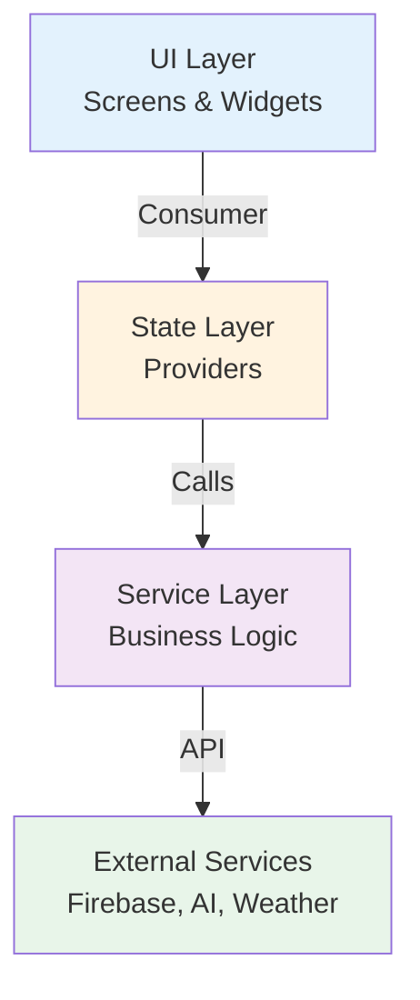
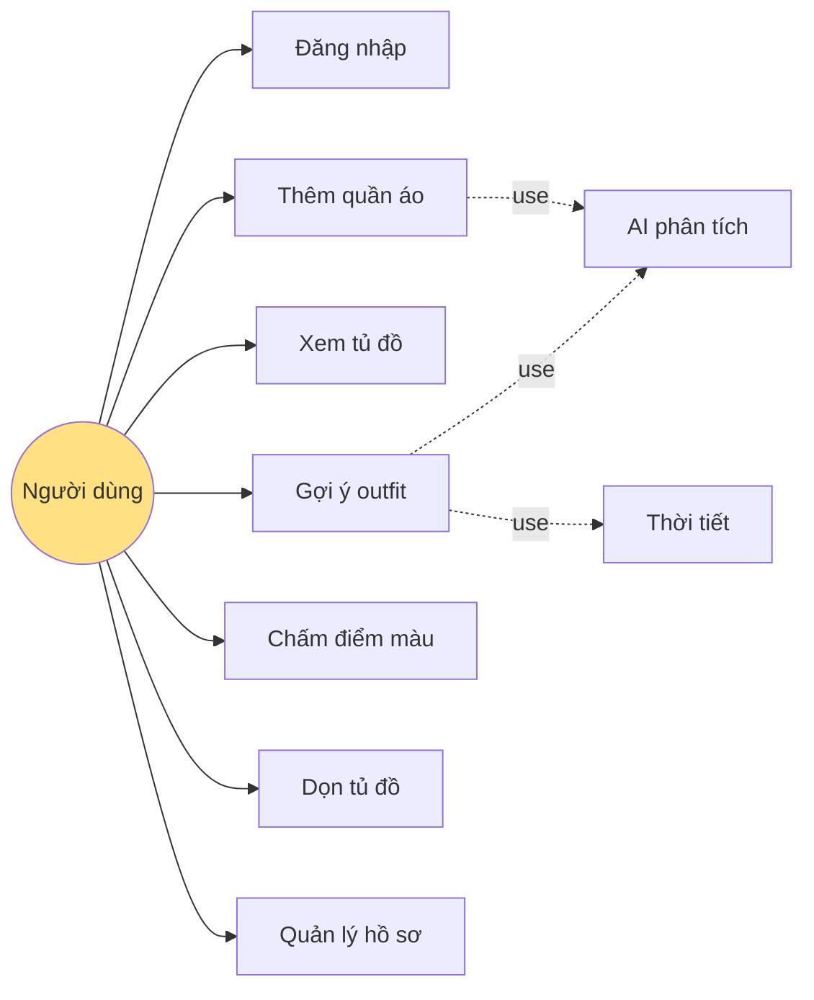
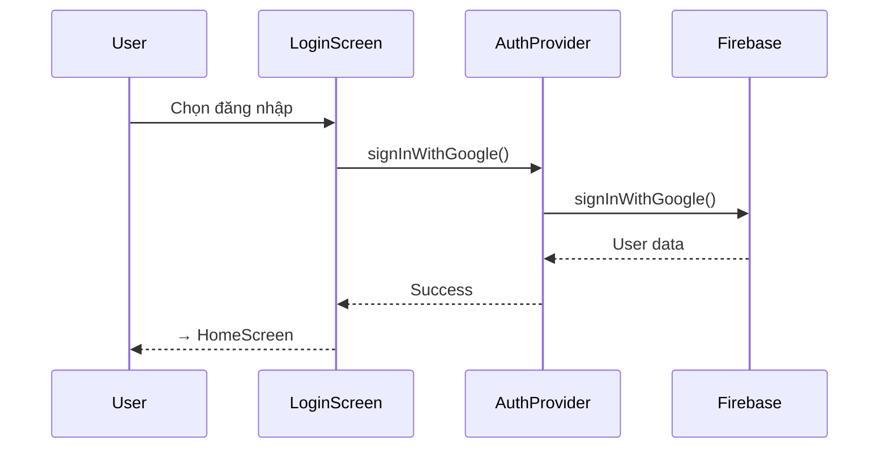
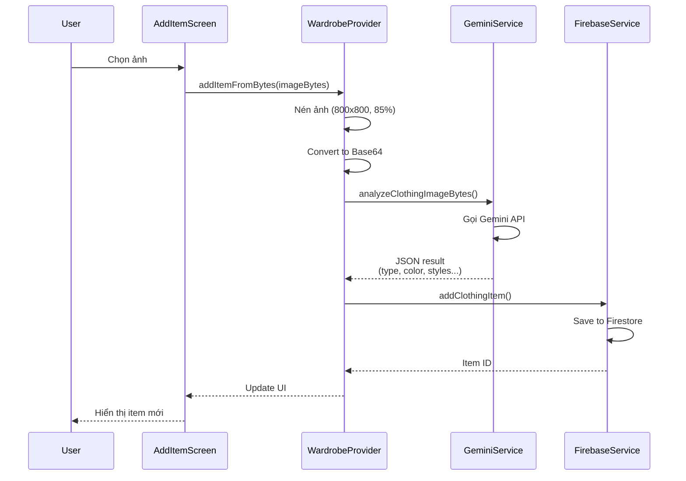
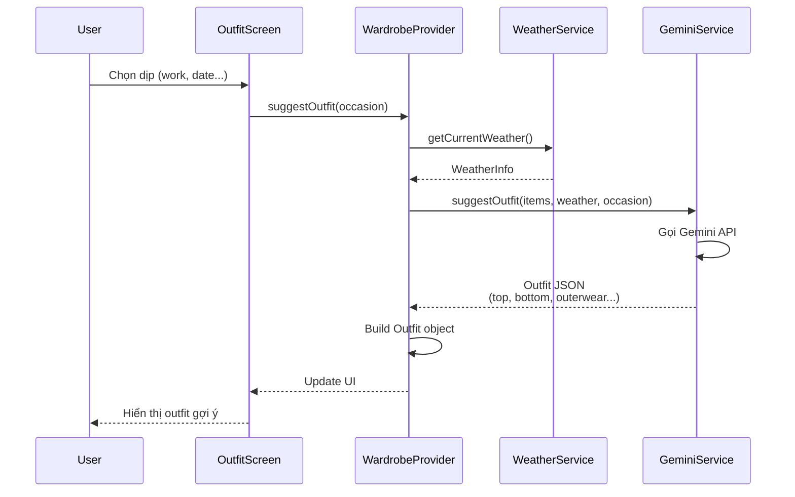
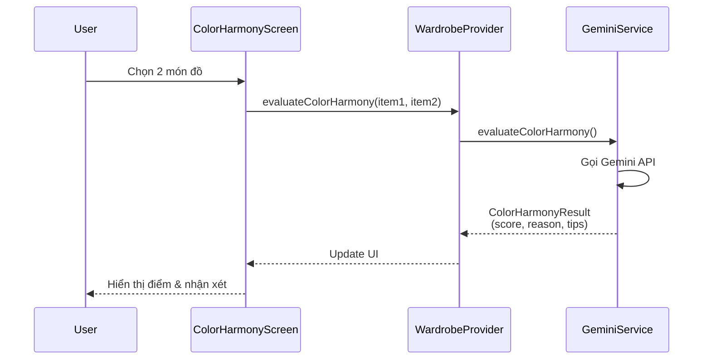
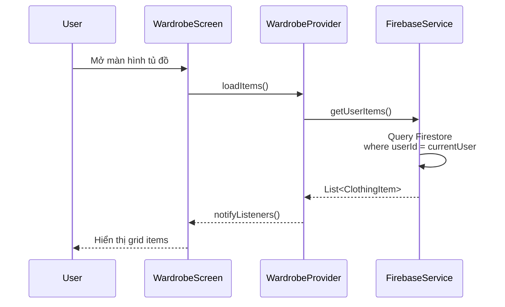
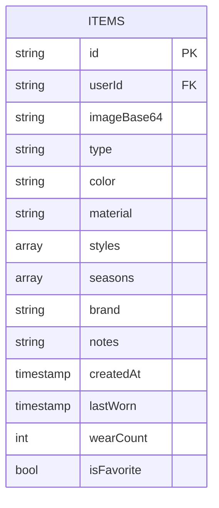

# BÁO CÁO CUỐI KỲ - ỨNG DỤNG QUẢN LÝ TỦ ĐỒ THÔNG MINH VỚI AI

## 1. GIỚI THIỆU

### 1.1. Đặt vấn đề

Trong cuộc sống hiện đại, việc quản lý tủ đồ và phối trang phục phù hợp với thời tiết, hoàn cảnh và phong cách cá nhân là một nhu cầu thiết thực. Tuy nhiên, nhiều người gặp khó khăn trong việc ghi nhớ quần áo đang sở hữu, phối màu chưa hài hòa hoặc thiếu thời gian lựa chọn trang phục phù hợp.

Đề tài **"Ứng dụng quản lý tủ đồ thông minh với AI"** được thực hiện nhằm giải quyết các vấn đề trên thông qua việc tích hợp trí tuệ nhân tạo vào quá trình phân tích quần áo và gợi ý outfit, giúp người dùng tối ưu hóa tủ đồ hiện có một cách khoa học và hiệu quả.

### 1.2. Mục tiêu đề tài

**Mục tiêu chính:** Xây dựng ứng dụng quản lý tủ đồ thông minh đa nền tảng, tích hợp AI Gemini để phân tích quần áo và gợi ý phối đồ tự động.

**Mục tiêu cụ thể:**
- Phân tích quần áo từ hình ảnh bằng AI (loại đồ, màu sắc, chất liệu, phong cách)
- Gợi ý outfit dựa trên thời tiết và dịp sử dụng
- Đánh giá độ hài hòa màu sắc giữa các món đồ
- Quản lý tủ đồ với các chức năng tìm kiếm, lọc và thống kê
- Đồng bộ dữ liệu người dùng thông qua Firebase Cloud

### 1.3. Phạm vi đề tài

- **Nền tảng:** Web, Android, iOS (Flutter cross-platform)
- **Đối tượng sử dụng:** Người dùng cá nhân
- **Giới hạn:** Không hỗ trợ mua sắm online, chỉ tập trung quản lý và gợi ý phối đồ từ quần áo sẵn có

---

## 2. CÔNG NGHỆ SỬ DỤNG

### 2.1. Framework và ngôn ngữ
- **Flutter 3.9+**
- **Dart 3.0+**

### 2.2. Backend và cơ sở dữ liệu
- **Firebase Authentication**
- **Cloud Firestore** (lưu dữ liệu + ảnh Base64)
- **Base64 Image Storage** (thay thế Firebase Storage)

### 2.3. AI và API
- **Google Gemini 2.0 Flash**
- **OpenWeatherMap API**

### 2.4. State Management, Image Processing và UI
- **Provider Pattern** (State management)
- **Material Design 3**
- **Shimmer** (Loading effects)
- **Flutter Image Compress** (Nén ảnh tự động)

### 2.5. Lý do lựa chọn công nghệ

**Flutter:**
- Phát triển đa nền tảng từ một codebase
- Hiệu năng cao, UI đẹp và mượt mà
- Hot reload giúp phát triển nhanh

**Firebase:**
- Backend miễn phí, dễ tích hợp
- Hỗ trợ real-time synchronization
- Authentication đa dạng (Google, Email, Anonymous)

**Gemini AI:**
- API miễn phí, khả năng phân tích hình ảnh tốt
- Hỗ trợ tiếng Việt
- Response time nhanh (~2-5 giây)

**Base64 + Compression thay vì Firebase Storage:**
- ✅ Không cần Firebase Blaze plan (miễn phí 100%)
- ✅ Tự động nén ảnh xuống ~200KB trước khi lưu (800x800px, quality 85%)
- ✅ Base64 ~270KB < Firestore document 1MB limit
- ✅ Đơn giản hóa architecture (không cần quản lý Storage URLs)
- ✅ Hoạt động tốt trên cả Web và Mobile

---

## 3. PHÂN TÍCH VÀ THIẾT KẾ HỆ THỐNG

### 3.1. Kiến trúc tổng quan hệ thống



**Sơ đồ kiến trúc tổng thể (Architecture Diagram)**

---

### 3.2. Sơ đồ Use Case



**Sơ đồ Use Case tổng quát của hệ thống**

---

### 3.3. Sequence Diagram – Authentication Flow



**Luồng đăng nhập và xác thực người dùng**

---

### 3.4. Sequence Diagram – Add Clothing Item Flow



**Luồng thêm quần áo mới với AI**

---

### 3.5. Sequence Diagram – Suggest Outfit Flow



**Luồng gợi ý outfit thông minh**

---

### 3.6. Sequence Diagram – Color Harmony Evaluation Flow



**Luồng chấm điểm độ hài hòa màu sắc**

---

### 3.7. Sequence Diagram – Load Wardrobe Flow



**Luồng tải danh sách tủ đồ**

---

### 3.8. Cấu trúc cơ sở dữ liệu (Database Schema)

**Collection: `items`**



| Field | Type | Mô tả |
|-------|------|-------|
| `id` | String | Document ID (auto-generated) |
| `userId` | String | User ID sở hữu item |
| `imageBase64` | String | **Ảnh dạng Base64 (đã nén, ~200-300KB)** |
| `type` | String | Loại đồ (top, bottom, outerwear, footwear...) |
| `color` | String | Màu sắc chính |
| `material` | String | Chất liệu (cotton, jean, silk...) |
| `styles` | Array | Danh sách phong cách (casual, formal, sport...) |
| `seasons` | Array | Mùa phù hợp (spring, summer, fall, winter) |
| `brand` | String | Thương hiệu |
| `notes` | String | Ghi chú thêm |
| `createdAt` | Timestamp | Ngày thêm vào tủ đồ |
| `lastWorn` | Timestamp | Lần mặc cuối |
| `wearCount` | int | Số lần mặc |
| `isFavorite` | bool | Đánh dấu yêu thích |

**📝 Lưu ý về Image Storage:**
- Ảnh được tự động nén xuống **800x800px, quality 85%** trước khi lưu
- Kích thước thực tế: **~200KB raw → ~270KB Base64**
- An toàn với **Firestore 1MB/document limit**
- Log compression: `📦 Image compressed: 2500.5KB → 180.3KB (saved 92.8%)`

---

## 4. CHỨC NĂNG ĐÃ THỰC HIỆN

### 4.1. Xác thực người dùng
- Đăng nhập bằng **Google, Email/Password và Anonymous**
- Duy trì phiên đăng nhập tự động

**[Screenshot: Màn hình đăng nhập]**

---

### 4.2. Quản lý tủ đồ
- Hiển thị danh sách quần áo dạng grid
- Lọc theo danh mục, đánh dấu yêu thích
- Xem chi tiết và xóa món đồ

**[Screenshot: Màn hình tủ đồ]**

---

### 4.3. Thêm quần áo bằng AI
- Chụp ảnh hoặc chọn ảnh từ thư viện
- **✨ Tự động nén ảnh** (resize 800x800px, quality 85%)
- **🤖 AI Gemini phân tích** tự động:
  - Loại đồ (áo, quần, giày, phụ kiện...)
  - Màu sắc chính
  - Chất liệu
  - Phong cách phù hợp
  - Mùa phù hợp
- **💾 Lưu ảnh dạng Base64** vào Firestore (không cần Storage)
- Cho phép chỉnh sửa thông tin trước khi lưu

**Console log khi thêm ảnh:**
```
🖼️ Original image size: 2500.5KB
📦 Image compressed: 2500.5KB → 180.3KB (saved 92.8%)
✅ Image compressed and converted to Base64 (240654 chars)
📝 Preparing to add item to Firestore...
✅ Document added with ID: abc123
```

**[Screenshot: Màn hình thêm quần áo + AI phân tích]**

---

### 4.4. Gợi ý outfit
- 9 dịp sử dụng có sẵn và cho phép nhập tùy chỉnh
- AI kết hợp thời tiết và tủ đồ để gợi ý outfit phù hợp
- Giải thích lý do chọn từng món đồ

**[Screenshot: Màn hình gợi ý outfit]**

---

### 4.5. Chấm điểm hợp màu
- Chọn 2 món đồ bất kỳ
- AI đánh giá độ hài hòa màu sắc (0–100 điểm)
- Nhận xét và gợi ý cải thiện

**[Screenshot: Màn hình chấm điểm màu]**

---

### 4.6. Dọn tủ đồ thông minh
- AI phát hiện đồ trùng lặp, ít sử dụng
- Gợi ý tối ưu hóa tủ đồ

**[Screenshot: Màn hình dọn tủ đồ]**

---

### 4.7. Quản lý hồ sơ người dùng
- Hiển thị thông tin cá nhân
- Thống kê số lượng và loại quần áo
- Cài đặt sở thích phong cách

**[Screenshot: Màn hình hồ sơ]**

---

## 5. CÀI ĐẶT VÀ TRIỂN KHAI

### 5.1. Yêu cầu hệ thống

Để cài đặt và chạy ứng dụng, hệ thống cần đáp ứng các yêu cầu sau:
- **Flutter SDK:** phiên bản 3.9 trở lên
- **Dart SDK:** phiên bản 3.0 trở lên
- **Firebase CLI:** dùng để cấu hình Firebase cho ứng dụng
- **Trình duyệt Google Chrome:** để chạy ứng dụng trên nền tảng Web
- **Android Studio / Xcode:** để chạy trên Android và iOS

### 5.2. Cài đặt thư viện phụ thuộc

Sau khi clone source code từ repository, tiến hành cài đặt các thư viện cần thiết bằng lệnh:

```bash
flutter pub get
```

Lệnh này sẽ tải toàn bộ các package được khai báo trong file `pubspec.yaml`.

### 5.3. Cấu hình Firebase

Các bước cấu hình Firebase cho ứng dụng bao gồm:

1. Tạo project mới trên **Firebase Console**
2. Bật các dịch vụ:
   - Firebase Authentication
   - Cloud Firestore
3. Cài đặt Firebase CLI và chạy lệnh cấu hình:

```bash
flutterfire configure
```

Lệnh trên sẽ tự động tạo và liên kết các file cấu hình Firebase cho từng nền tảng (Web, Android, iOS).

### 5.4. Cấu hình API Keys

Để sử dụng các dịch vụ AI và thời tiết, tạo file:

```
lib/utils/api_keys.dart
```

File này chứa các khóa API cho:
- **Gemini AI API** (https://aistudio.google.com/app/apikey)
- **OpenWeatherMap API** (https://openweathermap.org/api)

Các API keys được tách riêng nhằm đảm bảo tính bảo mật và dễ dàng quản lý.

### 5.5. Chạy ứng dụng

Ứng dụng có thể được chạy trên nhiều nền tảng với các lệnh sau:

```bash
flutter run -d chrome      # Chạy trên Web
flutter run -d android     # Chạy trên Android
flutter run -d ios         # Chạy trên iOS
```

Sau khi chạy thành công, ứng dụng sẽ hiển thị giao diện chính và sẵn sàng cho người dùng sử dụng.

---

## 6. KẾT QUẢ ĐẠT ĐƯỢC

- ✅ Hoàn thành **100% chức năng** đề ra
- ✅ Phát triển **9 màn hình UI** hoàn chỉnh
- ✅ **AI phân tích ảnh:** 2–5 giây
- ✅ **Gợi ý outfit:** 3–7 giây
- ✅ **Tự động nén ảnh:** giảm **70-90%** dung lượng
  - Thời gian nén: 0.5-1.5 giây (không ảnh hưởng UX)
- ✅ **Storage usage:** 0 GB (100% Firestore, không dùng Firebase Storage)
- ✅ Ứng dụng chạy ổn định trên **Web, Android, iOS**
- ✅ Giao diện mượt, đạt **~60fps** với Material Design 3

---

## 7. ĐÁNH GIÁ VÀ RÚT KINH NGHIỆM

### 7.1. Ưu điểm

- ✨ AI phân tích chính xác cao (**≈85%**)
- 🏗️ Kiến trúc rõ ràng, dễ mở rộng (Clean Architecture)
- 📱 Cross-platform hiệu quả với một codebase
- 💰 **Hoàn toàn miễn phí** (không cần Firebase Blaze plan)
- ⚡ **Optimize tốt:** tự động nén ảnh giảm 90% dung lượng

### 7.2. Hạn chế

- 📊 Lưu ảnh Base64 có overhead **~37%** so với file thô  
  *(đã giải quyết bằng compression tự động)*
- 🌐 Phụ thuộc kết nối Internet
- 📉 Giới hạn API miễn phí (rate limit)
- 💾 Giới hạn Firestore: **1MB/document**  
  *(đã optimize với compression → ~270KB/item)*

### 7.3. Khó khăn gặp phải

- 🤖 Viết prompt AI để phân tích chính xác
- 🖼️ Xử lý ảnh lớn trên nền tảng web
- 🔄 Đồng bộ state giữa nhiều màn hình
- 🗜️ Cân bằng giữa chất lượng ảnh và dung lượng

### 7.4. Bài học kinh nghiệm

- 📚 Nắm vững **Provider pattern** cho state management
- 🤖 Kinh nghiệm tích hợp **AI** vào ứng dụng thực tế
- 🏛️ Tầm quan trọng của **Clean Architecture**
- ⚙️ Kỹ năng **optimize performance** (image compression, caching)

---

## 8. HƯỚNG PHÁT TRIỂN

### 8.1. Tính năng bổ sung

- 🔍 **Visual Search:** Tìm kiếm đồ tương tự bằng AI
- 📅 **Calendar Integration:** Lịch phối đồ cho cả tuần
- 👥 **Social Features:** Share outfit, follow stylists
- 💎 **Premium AI:** Advanced analysis với Gemini Pro

### 8.2. Cải tiến kỹ thuật

- 🖼️ **Advanced Image Optimization:**
  - WebP format support (giảm 25-35% dung lượng hơn JPEG)
  - Progressive compression
  - CDN integration cho ảnh lớn
- 💾 **Offline Support:** Local cache với SQLite
- ⚡ **Performance:** Lazy loading, pagination
- 🔐 **Security:** End-to-end encryption cho ảnh

### 8.3. Mô hình kinh doanh

- 💰 Freemium model với gói Premium
- 🛍️ Affiliate links đến shop thời trang
- 📊 Analytics về xu hướng thời trang cá nhân

---

## 9. KẾT LUẬN

Đề tài **"Ứng dụng quản lý tủ đồ thông minh với AI"** đã được hoàn thành đúng mục tiêu đề ra, mang lại giá trị thực tiễn cao. 

Đặc biệt, việc **optimize image storage** bằng compression tự động và Base64 encoding đã giúp ứng dụng:
- ✅ Hoàn toàn miễn phí (không cần Firebase Blaze plan)
- ✅ Giảm 90% dung lượng ảnh
- ✅ Đơn giản hóa architecture

Dự án giúp sinh viên rèn luyện toàn diện kỹ năng:
- 📱 Phát triển ứng dụng Flutter cross-platform
- 🤖 Tích hợp AI (Google Gemini)
- 🔥 Backend Firebase
- ⚙️ Performance optimization

---

## PHỤ LỤC

- **Source code:** https://github.com/doanthetin193/ai-personal-stylist
- **Video demo:** [Link]
- **Screenshots:** [9 hình minh họa các màn hình]

---

**📝 Ghi chú:** Báo cáo này đã được cập nhật để phản ánh các cải tiến mới nhất về image compression và Base64 storage optimization.
