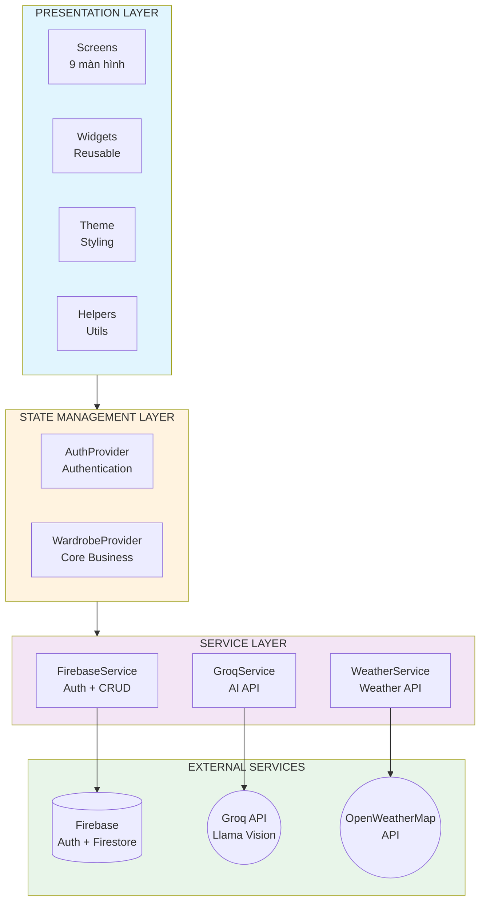
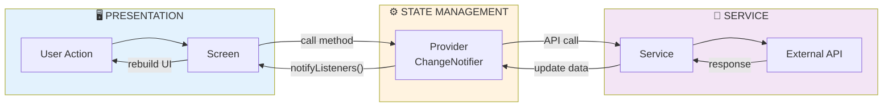
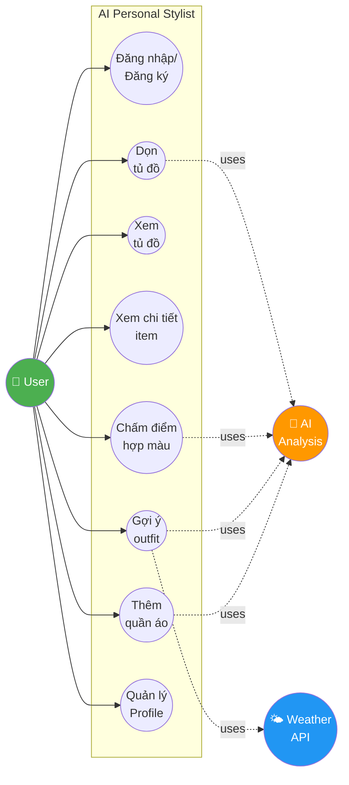
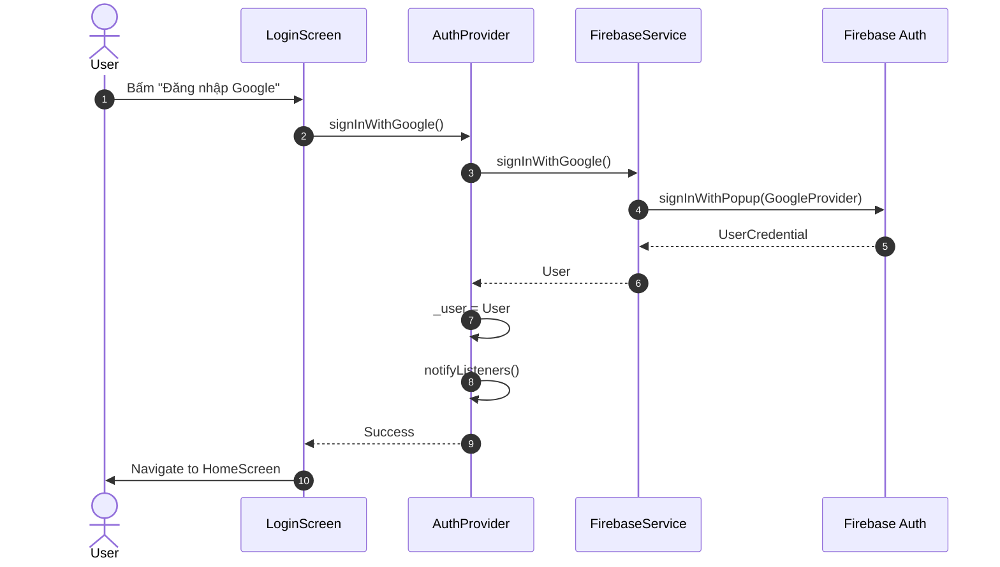
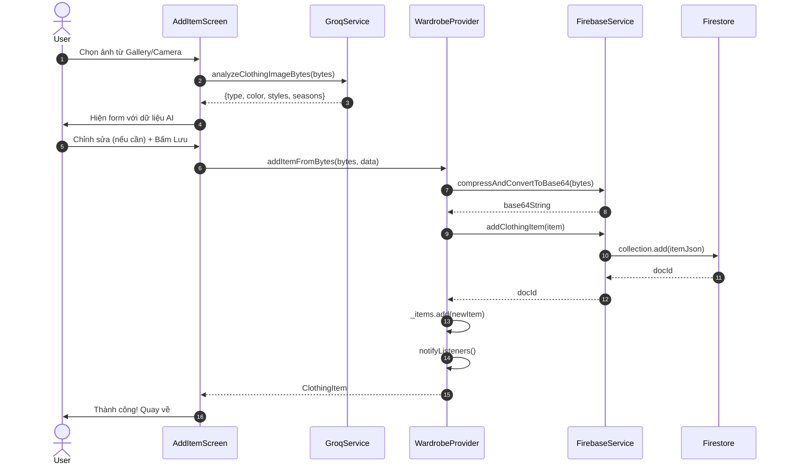
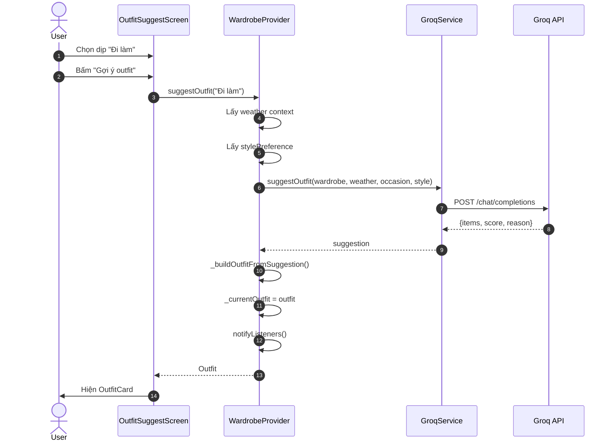
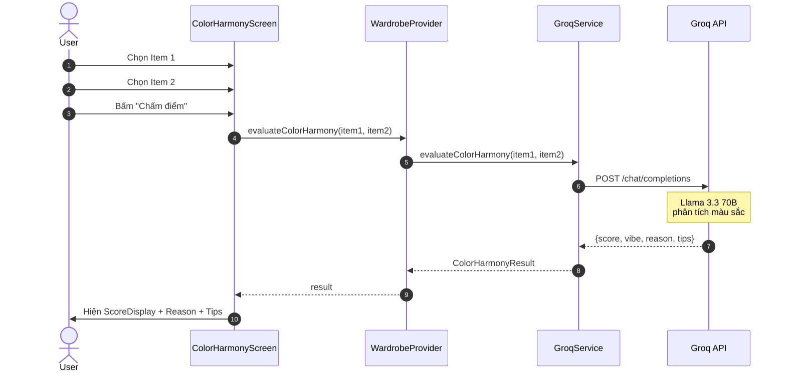

# BÁO CÁO ĐỒ ÁN
## ỨNG DỤNG QUẢN LÝ TỦ ĐỒ THÔNG MINH VỚI AI
### AI Personal Stylist

---

## MỤC LỤC

1. [Giới thiệu](#1-giới-thiệu)
2. [Công nghệ sử dụng](#2-công-nghệ-sử-dụng)
3. [Kiến trúc hệ thống](#3-kiến-trúc-hệ-thống)
4. [Phân tích và thiết kế](#4-phân-tích-và-thiết-kế)
5. [Chi tiết chức năng](#5-chi-tiết-chức-năng)
6. [Cài đặt và triển khai](#6-cài-đặt-và-triển-khai)
7. [Kết quả đạt được](#7-kết-quả-đạt-được)
8. [Đánh giá và rút kinh nghiệm](#8-đánh-giá-và-rút-kinh-nghiệm)
9. [Hướng phát triển](#9-hướng-phát-triển)
10. [Kết luận](#10-kết-luận)
11. [Phụ lục](#phụ-lục)
12. [Tài liệu tham khảo](#tài-liệu-tham-khảo)

---

## 1. GIỚI THIỆU

### 1.1. Đặt vấn đề

Trong cuộc sống hiện đại, việc quản lý tủ đồ và phối trang phục phù hợp với thời tiết, hoàn cảnh và phong cách cá nhân là một nhu cầu thiết thực. Tuy nhiên, nhiều người gặp khó khăn trong việc:

- **Ghi nhớ quần áo đang sở hữu**: Không biết mình có gì trong tủ, dẫn đến mua trùng lặp
- **Phối màu chưa hài hòa**: Thiếu kiến thức về phối màu và phong cách
- **Thiếu thời gian**: Mỗi sáng mất nhiều thời gian lựa chọn trang phục phù hợp
- **Lãng phí quần áo**: Nhiều món đồ mua về nhưng hiếm khi sử dụng

Đề tài **"Ứng dụng quản lý tủ đồ thông minh với AI"** được thực hiện nhằm giải quyết các vấn đề trên thông qua việc tích hợp **Trí tuệ nhân tạo (AI)** vào quá trình phân tích quần áo, gợi ý outfit và tối ưu hóa tủ đồ, giúp người dùng tiết kiệm thời gian và nâng cao phong cách thời trang cá nhân.

### 1.2. Mục tiêu đề tài

**Mục tiêu chính:**
Xây dựng ứng dụng quản lý tủ đồ thông minh đa nền tảng, tích hợp AI để phân tích quần áo và gợi ý phối đồ tự động.

**Mục tiêu cụ thể:**

| STT | Mục tiêu | Mô tả |
|-----|----------|-------|
| 1 | Phân tích quần áo bằng AI | Nhận diện loại đồ, màu sắc, chất liệu, phong cách từ hình ảnh |
| 2 | Gợi ý outfit thông minh | Dựa trên thời tiết, dịp sử dụng và sở thích phong cách |
| 3 | Đánh giá hài hòa màu sắc | Chấm điểm độ phù hợp giữa các món đồ |
| 4 | Gợi ý dọn tủ đồ | Phát hiện đồ trùng lặp, không phù hợp, ít sử dụng |
| 5 | Quản lý tủ đồ đầy đủ | Tìm kiếm, lọc, thống kê, yêu thích |
| 6 | Đồng bộ đám mây | Dữ liệu được lưu trữ an toàn trên Firebase |

### 1.3. Phạm vi đề tài

- **Nền tảng hỗ trợ**: Web, Android, iOS (Flutter cross-platform)
- **Đối tượng sử dụng**: Người dùng cá nhân có nhu cầu quản lý tủ đồ
- **Giới hạn**: Tập trung vào quản lý và gợi ý phối đồ từ quần áo sẵn có, không hỗ trợ mua sắm online

---

## 2. CÔNG NGHỆ SỬ DỤNG

### 2.1. Framework và ngôn ngữ lập trình

| Công nghệ | Phiên bản | Vai trò |
|-----------|-----------|---------|
| **Flutter** | 3.9+ | Framework phát triển ứng dụng đa nền tảng |
| **Dart** | 3.0+ | Ngôn ngữ lập trình chính |

### 2.2. Backend và cơ sở dữ liệu

| Dịch vụ | Mục đích |
|---------|----------|
| **Firebase Authentication** | Xác thực người dùng (Google, Email, Anonymous) |
| **Cloud Firestore** | Lưu trữ dữ liệu quần áo và thông tin người dùng |
| **Base64 Encoding** | Lưu ảnh trực tiếp trong Firestore (thay thế Firebase Storage) |

### 2.3. AI và API bên ngoài

| API | Model/Service | Chức năng |
|-----|---------------|-----------|
| **Groq API** | `llama-4-scout-17b-16e-instruct` | Phân tích hình ảnh quần áo (Vision AI) |
| **Groq API** | `llama-3.3-70b-versatile` | Gợi ý outfit, chấm điểm màu, dọn tủ (Text AI) |
| **OpenWeatherMap API** | Weather Data | Lấy thông tin thời tiết theo vị trí |

### 2.4. State Management và UI

| Công nghệ | Mục đích |
|-----------|----------|
| **Provider Pattern** | Quản lý trạng thái ứng dụng |
| **Material Design 3** | Ngôn ngữ thiết kế UI/UX |
| **Shimmer Effect** | Hiệu ứng loading skeleton |
| **Flutter Image Compress** | Nén ảnh tự động trước khi lưu |

### 2.5. Lý do lựa chọn công nghệ

#### Flutter Framework
- Phát triển đa nền tảng từ **một codebase duy nhất**
- Hiệu năng cao với engine rendering Skia
- Widget system linh hoạt, UI đẹp và nhất quán
- Hot reload giúp tăng tốc phát triển

#### Firebase Backend
- **Miễn phí** cho ứng dụng quy mô nhỏ và vừa
- Tích hợp dễ dàng với Flutter
- Real-time synchronization tự động
- Authentication đa dạng (Google, Email, Anonymous)

#### Groq API thay vì Gemini
- **Tốc độ cực nhanh**: Groq sử dụng LPU (Language Processing Unit) chuyên dụng
- Response time trung bình **1-3 giây** (so với 5-10 giây của các API khác)
- Hỗ trợ **Vision AI** với model Llama 4 Scout
- API miễn phí với rate limit hợp lý
- Hỗ trợ tiếng Việt tốt

#### Base64 + Compression thay vì Firebase Storage
| Tiêu chí | Firebase Storage | Base64 + Compression |
|----------|------------------|----------------------|
| Chi phí | Cần Blaze Plan | **100% miễn phí** |
| Quy trình | Upload → Get URL → Save | Compress → Encode → Save |
| Độ phức tạp | Cao | **Đơn giản** |
| Dung lượng ảnh | 2-5MB/ảnh | **~200KB/ảnh** |
| Hoạt động offline | Không | Có thể cache |

---

## 3. KIẾN TRÚC HỆ THỐNG

### 3.1. Kiến trúc tổng quan

Hệ thống được thiết kế theo mô hình **Layered Architecture (3 tầng) kết hợp Provider Pattern**:

> **Lưu ý:** Đây KHÔNG phải MVVM (Model-View-ViewModel). Project sử dụng **Provider Pattern** - một state management solution phổ biến trong Flutter, kết hợp với kiến trúc phân tầng rõ ràng.

| Layer | Thành phần | Vai trò |
|-------|------------|---------|
| **Presentation** | Screens, Widgets | Hiển thị UI, nhận input từ người dùng |
| **State Management** | Providers (ChangeNotifier) | Quản lý state, xử lý business logic |
| **Service** | Firebase, Groq, Weather Services | Giao tiếp với external APIs |

**Tại sao chọn Provider Pattern thay vì MVVM?**

| Tiêu chí | MVVM truyền thống | Provider Pattern |
|----------|-------------------|------------------|
| Binding | Two-way data binding | Declarative UI (Flutter rebuild widget) |
| Boilerplate | Nhiều (ViewModel, Repository...) | **Ít hơn** |
| Learning curve | Phức tạp | **Đơn giản** |
| Flutter support | Cần thêm thư viện | **Được recommend chính thức** |
| Phù hợp | App enterprise lớn | **App nhỏ-vừa** |

Provider thực chất là **MVVM được đơn giản hóa** cho Flutter. `ChangeNotifier` đóng vai trò tương tự ViewModel, nhưng tích hợp tự nhiên với reactive UI của Flutter.

```
┌─────────────────────────────────────────────────────────────────────────┐
│                         PRESENTATION LAYER                              │
│  ┌─────────────┐ ┌─────────────┐ ┌─────────────┐ ┌─────────────┐       │
│  │   Screens   │ │   Widgets   │ │    Theme    │ │   Helpers   │       │
│  │  (9 màn)    │ │  (Reusable) │ │  (Styling)  │ │  (Utils)    │       │
│  └──────┬──────┘ └──────┬──────┘ └─────────────┘ └─────────────┘       │
│         │               │                                               │
│         └───────────────┼───────────────────────────────────────────────┤
│                         │                                               │
│                         ▼                                               │
│  ┌──────────────────────────────────────────────────────────────────┐  │
│  │                    STATE MANAGEMENT LAYER                         │  │
│  │    ┌─────────────────────┐    ┌─────────────────────┐            │  │
│  │    │    AuthProvider     │    │  WardrobeProvider   │            │  │
│  │    │  (Authentication)   │    │   (Core Business)   │            │  │
│  │    └─────────────────────┘    └─────────────────────┘            │  │
│  └──────────────────────────────────────────────────────────────────┘  │
│                         │                                               │
│                         ▼                                               │
│  ┌──────────────────────────────────────────────────────────────────┐  │
│  │                       SERVICE LAYER                               │  │
│  │  ┌───────────────┐ ┌───────────────┐ ┌───────────────┐           │  │
│  │  │ FirebaseService│ │  GroqService  │ │WeatherService │           │  │
│  │  │ (Auth + CRUD)  │ │   (AI API)    │ │ (Weather API) │           │  │
│  │  └───────┬───────┘ └───────┬───────┘ └───────┬───────┘           │  │
│  └──────────┼─────────────────┼─────────────────┼───────────────────┘  │
└─────────────┼─────────────────┼─────────────────┼───────────────────────┘
              │                 │                 │
              ▼                 ▼                 ▼
┌─────────────────────────────────────────────────────────────────────────┐
│                        EXTERNAL SERVICES                                │
│  ┌─────────────────┐ ┌─────────────────┐ ┌─────────────────┐           │
│  │ Firebase Cloud  │ │    Groq API     │ │ OpenWeatherMap  │           │
│  │ (Auth + Store)  │ │ (Llama Vision)  │ │    API          │           │
│  └─────────────────┘ └─────────────────┘ └─────────────────┘           │
└─────────────────────────────────────────────────────────────────────────┘
```

**Mermaid Code - Architecture Diagram:**



### 3.2. Cấu trúc thư mục dự án

```
lib/
├── main.dart                      # Entry point + Provider setup
├── firebase_options.dart          # Firebase configuration
│
├── models/                        # Data Models
│   ├── clothing_item.dart         # ClothingItem + Enums (Type, Style, Season)
│   ├── outfit.dart                # Outfit + ColorHarmonyResult
│   └── weather.dart               # WeatherInfo
│
├── providers/                     # State Management
│   ├── auth_provider.dart         # AuthProvider (Firebase Auth state)
│   └── wardrobe_provider.dart     # WardrobeProvider (Core business logic)
│
├── services/                      # External API Services
│   ├── firebase_service.dart      # Firebase Auth + Firestore CRUD
│   ├── groq_service.dart          # Groq AI API (Vision + Text)
│   ├── gemini_service.dart        # Google Gemini (backup)
│   └── weather_service.dart       # OpenWeatherMap API
│
├── screens/                       # UI Screens (9 screens)
│   ├── login_screen.dart          # Authentication screen
│   ├── home_screen.dart           # Main hub + Bottom navigation
│   ├── wardrobe_screen.dart       # Tab: Wardrobe management
│   ├── outfit_suggest_screen.dart # Tab: AI outfit suggestion
│   ├── color_harmony_screen.dart  # Tab: Color harmony evaluation
│   ├── profile_screen.dart        # Tab: Profile + Settings
│   ├── add_item_screen.dart       # Add new clothing item
│   ├── item_detail_screen.dart    # Item detail view
│   └── wardrobe_cleanup_screen.dart # AI cleanup suggestions
│
├── widgets/                       # Reusable UI Components
│   ├── clothing_card.dart         # ClothingCard, ClothingImage
│   ├── outfit_card.dart           # OutfitCard
│   ├── loading_widgets.dart       # Shimmer loading effects
│   └── common_widgets.dart        # ScoreDisplay, WeatherWidget, OccasionChip
│
└── utils/                         # Utilities & Constants
    ├── theme.dart                 # AppTheme, colors, text styles
    ├── constants.dart             # AI Prompts, API URLs, App constants
    ├── helpers.dart               # Vietnamese formatting, JSON parser
    └── api_keys.dart              # API keys (gitignored)
```

### 3.3. Data Flow Pattern

Ứng dụng tuân theo pattern **Unidirectional Data Flow**:

```
┌─────────────────────────────────────────────────────────────────┐
│                                                                 │
│   User Action ──▶ Screen ──▶ Provider ──▶ Service ──▶ API      │
│                                 │                               │
│                                 ▼                               │
│               Screen ◀── notifyListeners() ◀── Update State    │
│                                                                 │
└─────────────────────────────────────────────────────────────────┘
```

**Mermaid Code - Data Flow Diagram:**



**Giải thích:**
1. **User Action**: Người dùng tương tác với UI (bấm nút, chọn item...)
2. **Screen**: Màn hình gọi method của Provider
3. **Provider**: Xử lý logic nghiệp vụ, gọi Service nếu cần
4. **Service**: Thực hiện API call đến external services
5. **Update State**: Provider cập nhật state và gọi `notifyListeners()`
6. **UI Rebuild**: Các widget đang lắng nghe sẽ tự động rebuild

---

## 4. PHÂN TÍCH VÀ THIẾT KẾ

### 4.1. Sơ đồ Use Case

**Mermaid Code - Use Case Diagram:**



**Các Use Case chính:**

| Actor | Use Case | Mô tả |
|-------|----------|-------|
| User | Đăng nhập/Đăng ký | Xác thực qua Google, Email hoặc Anonymous |
| User | Thêm quần áo | Chụp ảnh, AI phân tích, lưu vào tủ đồ |
| User | Xem tủ đồ | Hiển thị danh sách, lọc theo danh mục |
| User | Xem chi tiết item | Thông tin đầy đủ, đánh dấu đã mặc, yêu thích |
| User | Gợi ý outfit | Chọn dịp, AI gợi ý outfit phù hợp |
| User | Chấm điểm màu | Chọn 2 item, AI đánh giá độ hài hòa |
| User | Dọn tủ đồ | AI phân tích và gợi ý đồ nên bỏ |
| User | Quản lý profile | Xem thống kê, cài đặt sở thích |
| System | Lấy thời tiết | Tự động lấy thông tin thời tiết |

### 4.2. Sequence Diagram - Luồng xác thực

**Mermaid Code - Authentication Flow:**



```
User          LoginScreen      AuthProvider     FirebaseService     Firebase
 │                │                 │                  │                │
 │  Bấm Login     │                 │                  │                │
 │───────────────▶│                 │                  │                │
 │                │  signInWithGoogle()                │                │
 │                │────────────────▶│                  │                │
 │                │                 │ signInWithGoogle()                │
 │                │                 │─────────────────▶│                │
 │                │                 │                  │  signInWithPopup()
 │                │                 │                  │───────────────▶│
 │                │                 │                  │  UserCredential │
 │                │                 │                  │◀───────────────│
 │                │                 │    User          │                │
 │                │                 │◀─────────────────│                │
 │                │   _user = User  │                  │                │
 │                │   notifyListeners()                │                │
 │                │◀────────────────│                  │                │
 │  Navigate to   │                 │                  │                │
 │  HomeScreen    │                 │                  │                │
 │◀───────────────│                 │                  │                │
```

### 4.3. Sequence Diagram - Thêm quần áo mới

**Mermaid Code - Add Item Flow:**



```
User        AddItemScreen    WardrobeProvider    GroqService       Firebase
 │               │                 │                  │                │
 │  Chọn ảnh     │                 │                  │                │
 │──────────────▶│                 │                  │                │
 │               │ analyzeClothingImageBytes()        │                │
 │               │─────────────────────────────────▶  │                │
 │               │                 │                  │  Llama Vision  │
 │               │                 │                  │───────────────▶│
 │               │  {type, color, styles, seasons}    │                │
 │               │◀─────────────────────────────────  │                │
 │  Hiện form    │                 │                  │                │
 │◀──────────────│                 │                  │                │
 │  Chỉnh sửa,   │                 │                  │                │
 │  Bấm Lưu      │                 │                  │                │
 │──────────────▶│                 │                  │                │
 │               │ addItemFromBytes()                 │                │
 │               │────────────────▶│                  │                │
 │               │                 │ compressAndConvertToBase64()      │
 │               │                 │─────────────────────────────────▶ │
 │               │                 │           base64String            │
 │               │                 │◀─────────────────────────────────│
 │               │                 │ addClothingItem()                 │
 │               │                 │─────────────────────────────────▶ │
 │               │                 │           docId                   │
 │               │                 │◀─────────────────────────────────│
 │               │  ClothingItem   │                  │                │
 │               │◀────────────────│                  │                │
 │  Thành công   │                 │                  │                │
 │◀──────────────│                 │                  │                │
```

### 4.4. Sequence Diagram - Gợi ý Outfit

**Mermaid Code - Suggest Outfit Flow:**



```
User      OutfitSuggestScreen   WardrobeProvider    GroqService     WeatherAPI
 │               │                    │                  │              │
 │  Chọn dịp     │                    │                  │              │
 │──────────────▶│                    │                  │              │
 │  Bấm Gợi ý    │                    │                  │              │
 │──────────────▶│                    │                  │              │
 │               │  suggestOutfit(occasion)              │              │
 │               │───────────────────▶│                  │              │
 │               │                    │ weather context  │              │
 │               │                    │◀─────────────────────────────  │
 │               │                    │ suggestOutfit()  │              │
 │               │                    │─────────────────▶│              │
 │               │                    │  {items, score, reason}         │
 │               │                    │◀─────────────────│              │
 │               │                    │ _buildOutfitFromSuggestion()   │
 │               │  _currentOutfit    │                  │              │
 │               │◀───────────────────│                  │              │
 │  Hiện outfit  │                    │                  │              │
 │◀──────────────│                    │                  │              │
```

### 4.5. Sequence Diagram - Chấm điểm hợp màu

**Mermaid Code - Color Harmony Flow:**



```
User      ColorHarmonyScreen   WardrobeProvider    GroqService
 │               │                    │                  │
 │  Chọn item 1  │                    │                  │
 │──────────────▶│                    │                  │
 │  Chọn item 2  │                    │                  │
 │──────────────▶│                    │                  │
 │  Bấm Chấm điểm│                    │                  │
 │──────────────▶│                    │                  │
 │               │ evaluateColorHarmony()               │
 │               │───────────────────▶│                  │
 │               │                    │ evaluateColorHarmony()
 │               │                    │─────────────────▶│
 │               │                    │ ColorHarmonyResult
 │               │                    │◀─────────────────│
 │               │  {score, vibe, reason, tips}         │
 │               │◀───────────────────│                  │
 │  Hiện kết quả │                    │                  │
 │◀──────────────│                    │                  │
```

### 4.6. Database Schema

**Collection: `items`**

| Field | Type | Mô tả |
|-------|------|-------|
| `userId` | String | ID người dùng Firebase |
| `imageBase64` | String | Ảnh nén và encode Base64 (~200KB) |
| `type` | String | Loại đồ: shirt, tshirt, pants, jeans, shorts, jacket, hoodie, dress, skirt, shoes, sneakers, accessory, bag, hat, other |
| `color` | String | Màu sắc: white, black, blue... |
| `material` | String? | Chất liệu (optional) |
| `styles` | Array<String> | Phong cách: casual, formal, streetwear, vintage, sporty, elegant, bohemian, minimalist |
| `seasons` | Array<String> | Mùa phù hợp: spring, summer, fall, winter |
| `createdAt` | Timestamp | Ngày thêm |
| `lastWorn` | Timestamp? | Lần mặc gần nhất |
| `wearCount` | Number | Số lần đã mặc |
| `isFavorite` | Boolean | Đánh dấu yêu thích |

**Lưu ý về lưu trữ ảnh:**
- Ảnh được tự động nén xuống **800x800px**, quality **85%**
- Dung lượng sau nén: **~200KB**
- Sau khi encode Base64: **~270KB** (overhead ~37%)
- Đảm bảo **< 1MB** giới hạn của Firestore document

---

## 5. CHI TIẾT CHỨC NĂNG

### 5.1. Xác thực người dùng

**Vị trí:** `LoginScreen`

**Các phương thức đăng nhập:**

| Phương thức | Mô tả | Use case |
|-------------|-------|----------|
| **Google Sign-In** | Đăng nhập bằng tài khoản Google | Người dùng thường |
| **Email/Password** | Đăng nhập/Đăng ký bằng email | Người dùng không có Google |
| **Anonymous** | Dùng thử không cần tài khoản | Testing, khách |

**Tính năng:**
- Tự động duy trì phiên đăng nhập (persistence)
- Hiện thông báo lỗi chi tiết
- Chuyển đổi giữa đăng nhập và đăng ký
- UI gradient đẹp với animation

*[Chỗ này chèn screenshot màn hình Login]*

### 5.2. Quản lý tủ đồ

**Vị trí:** `WardrobeScreen`

**Chức năng:**
- Hiển thị danh sách quần áo dạng **Grid 2 cột**
- Lọc theo **danh mục**: Tất cả, Áo, Quần, Giày, Phụ kiện
- Đánh dấu **yêu thích** trực tiếp trên card
- Hiển thị **số lần mặc** trên badge
- Shimmer loading khi đang tải
- Empty state khi tủ đồ trống

**Filter Logic:**
```dart
// Lọc theo category dựa trên ClothingType.category getter
List<ClothingItem> get filteredItems {
  if (_filterCategory == null) return _items;
  return _items.where((item) => item.type.category == _filterCategory).toList();
}
```

*[Chỗ này chèn screenshot màn hình Wardrobe]*

### 5.3. Thêm quần áo bằng AI

**Vị trí:** `AddItemScreen`

**Luồng xử lý:**

```
1. Chọn nguồn ảnh (Camera / Gallery)
        │
        ▼
2. ImagePicker lấy ảnh (resize 1024x1024, quality 85%)
        │
        ▼
3. Hiện preview ảnh
        │
        ▼
4. Tự động gọi AI phân tích (Groq Llama Vision)
        │
        ▼
5. Điền kết quả vào form (type, color, styles, seasons)
        │
        ▼
6. User chỉnh sửa nếu cần
        │
        ▼
7. Bấm "Lưu vào tủ đồ"
        │
        ▼
8. Compress ảnh (800x800, quality 85%)
        │
        ▼
9. Encode Base64 + Lưu Firestore
```

**AI Analysis Response:**
```json
{
  "type": "tshirt",
  "color": "white",
  "material": "cotton",
  "styles": ["casual", "minimalist"],
  "seasons": ["spring", "summer"]
}
```

*[Chỗ này chèn screenshot màn hình Add Item]*

### 5.4. Chi tiết quần áo

**Vị trí:** `ItemDetailScreen`

**Chức năng:**
- Hiển thị ảnh fullscreen với Hero animation
- Thông tin chi tiết: loại, màu, chất liệu, phong cách, mùa
- Số lần mặc và lần mặc gần nhất
- Nút **yêu thích** trên AppBar
- Nút **"Đánh dấu đã mặc"**: tăng wearCount, cập nhật lastWorn
- Menu options: Xóa item

**Real-time Update:**
```dart
// Sử dụng Consumer để cập nhật UI realtime
Consumer<WardrobeProvider>(
  builder: (context, wardrobe, _) {
    final currentItem = wardrobe.allItems.firstWhere((i) => i.id == item.id);
    return Text('${currentItem.wearCount} lần');
  },
)
```

*[Chỗ này chèn screenshot màn hình Item Detail]*

### 5.5. Gợi ý Outfit thông minh

**Vị trí:** `OutfitSuggestScreen`

**Input:**
- **Thời tiết**: Tự động lấy từ OpenWeatherMap API
- **Dịp sử dụng**: 9 dịp có sẵn + tùy chỉnh
- **Sở thích phong cách**: Đồ rộng thoải mái / Vừa vặn / Ôm body

**9 dịp có sẵn:**
| Icon | Dịp | Code |
|------|-----|------|
| ☀️ | Hàng ngày | daily |
| 💼 | Đi làm | work |
| 💕 | Hẹn hò | date |
| 🎉 | Tiệc tùng | party |
| 🏃 | Thể thao | sport |
| ✈️ | Du lịch | travel |
| 🎩 | Sự kiện trang trọng | formal |
| 🏖️ | Đi biển | beach |
| ☕ | Cafe/Đi chơi | casual |

*Ngoài ra còn có tùy chọn "Tự nhập" để người dùng mô tả dịp riêng.*

**AI Output:**
```json
{
  "style": "Business Casual",
  "items": {
    "top": "item_id_1",
    "bottom": "item_id_2",
    "footwear": "item_id_3"
  },
  "score": 85,
  "reason": "Sự kết hợp này phù hợp với thời tiết nắng nóng và không khí công sở..."
}
```

**OutfitCard hiển thị:**
- Ảnh các item được chọn
- Điểm phối đồ (0-100)
- Lý do AI chọn outfit này
- Nút "Mặc outfit này" (mark all items as worn)

*[Chỗ này chèn screenshot màn hình Outfit Suggest]*

### 5.6. Chấm điểm hợp màu

**Vị trí:** `ColorHarmonyScreen`

**Luồng:**
1. Chọn **item 1** từ bottom sheet
2. Chọn **item 2** từ bottom sheet
3. Bấm **"Chấm điểm"**
4. AI đánh giá và trả về kết quả

**AI Output:**
```json
{
  "score": 80,
  "vibe": "Trẻ trung & Thoải mái",
  "reason": "Màu trắng và xanh dương tạo sự cân bằng tốt, phù hợp cho các dịp casual...",
  "tips": [
    "Có thể thêm phụ kiện màu nâu để tạo điểm nhấn",
    "Phù hợp cho đi chơi, cafe, dạo phố"
  ]
}
```

**Hiển thị:**
- **ScoreDisplay**: Vòng tròn với số điểm (màu theo điểm)
- **Vibe tag**: Chip gradient hiển thị phong cách
- **Reason**: Lý do AI đánh giá
- **Tips**: Danh sách gợi ý cải thiện

*[Chỗ này chèn screenshot màn hình Color Harmony]*

### 5.7. Dọn tủ đồ thông minh

**Vị trí:** `WardrobeCleanupScreen`

**Chức năng AI phân tích:**
- **Đồ trùng lặp**: Các item giống nhau về màu sắc, loại
- **Đồ không phù hợp**: Màu/style không match với tổng thể tủ đồ
- **Gợi ý tối ưu**: Tips dọn dẹp và cải thiện tủ đồ

**AI Output:**
```json
{
  "duplicates": [
    {
      "ids": ["item_1", "item_2"],
      "reason": "Hai áo thun trắng rất giống nhau"
    }
  ],
  "mismatched": [
    {
      "id": "item_3",
      "reason": "Màu neon không phù hợp với phong cách minimalist của bạn"
    }
  ],
  "suggestions": [
    "Hãy donate những món đồ không mặc trong 6 tháng",
    "Giữ tủ đồ gọn với những item đa năng"
  ]
}
```

**Chức năng thủ công:**
- Grid hiển thị tất cả items theo loại
- Tap để chọn/bỏ chọn item (highlight đỏ)
- Nút **"Xóa (n)"** trên AppBar khi có chọn
- Nút **"Xóa tất cả"** cho reset hoàn toàn

*[Chỗ này chèn screenshot màn hình Wardrobe Cleanup]*

### 5.8. Quản lý Profile

**Vị trí:** `ProfileScreen`

**Sections:**

#### Header
- Avatar + Tên + Email
- Thống kê nhanh: Tổng đồ | Loại đồ | Yêu thích

#### Cài đặt
| Menu Item | Chức năng |
|-----------|-----------|
| Thông tin cá nhân | Chỉnh sửa tên hiển thị |
| Thống kê tủ đồ | Bottom sheet chi tiết: theo loại, đồ mặc nhiều nhất |
| Dọn tủ đồ | Navigate đến WardrobeCleanupScreen |
| Sở thích phong cách | Chọn: Đồ rộng thoải mái / Vừa vặn / Ôm body |

#### Khác
| Menu Item | Chức năng |
|-----------|-----------|
| Về ứng dụng | Dialog thông tin app |
| Đăng xuất | Xác nhận + signOut + navigate to Login |

**StylePreference được sử dụng:**
```dart
// Khi gợi ý outfit, stylePreference được gửi cho AI
await _groqService.suggestOutfit(
  wardrobe: items,
  weatherContext: weather.toContext(),
  occasion: occasion,
  stylePreference: _stylePreference.aiDescription,
);
```

*[Chỗ này chèn screenshot màn hình Profile]*

---

## 6. CÀI ĐẶT VÀ TRIỂN KHAI

### 6.1. Yêu cầu hệ thống

| Thành phần | Yêu cầu |
|------------|---------|
| **Flutter SDK** | 3.9+ |
| **Dart SDK** | 3.0+ |
| **Firebase CLI** | Latest |
| **Node.js** | 16+ (cho Firebase CLI) |
| **Chrome** | Latest (cho Web) |
| **Android Studio** | Latest (cho Android) |
| **Xcode** | Latest (cho iOS, macOS only) |

### 6.2. Các bước cài đặt

#### Bước 1: Clone repository
```bash
git clone https://github.com/doanthetin193/ai-personal-stylist.git
cd ai-personal-stylist
```

#### Bước 2: Cài đặt dependencies
```bash
flutter pub get
```

#### Bước 3: Cấu hình Firebase
```bash
# Cài đặt Firebase CLI
npm install -g firebase-tools

# Đăng nhập Firebase
firebase login

# Cấu hình FlutterFire
dart pub global activate flutterfire_cli
flutterfire configure
```

**Bật các dịch vụ trên Firebase Console:**
- ✅ Firebase Authentication (Google, Email/Password, Anonymous)
- ✅ Cloud Firestore (Start in test mode)

#### Bước 4: Cấu hình API Keys

Tạo file `lib/utils/api_keys.dart`:
```dart
class ApiKeys {
  static const String groqApiKey = 'YOUR_GROQ_API_KEY';
  static const String weatherApiKey = 'YOUR_OPENWEATHERMAP_API_KEY';
}
```

**Lấy API Keys:**
- **Groq API**: https://console.groq.com/keys (miễn phí)
- **OpenWeatherMap**: https://openweathermap.org/api (miễn phí)

#### Bước 5: Chạy ứng dụng
```bash
# Web
flutter run -d chrome

# Android
flutter run -d android

# iOS (macOS only)
flutter run -d ios
```

### 6.3. Cấu hình Firestore Rules

```javascript
rules_version = '2';
service cloud.firestore {
  match /databases/{database}/documents {
    match /items/{itemId} {
      allow read, write: if request.auth != null
                         && request.auth.uid == resource.data.userId;
      allow create: if request.auth != null
                    && request.auth.uid == request.resource.data.userId;
    }
  }
}
```

---

## 7. KẾT QUẢ ĐẠT ĐƯỢC

### 7.1. Hoàn thành chức năng

| Chức năng | Trạng thái | Ghi chú |
|-----------|------------|---------|
| Xác thực người dùng | ✅ 100% | Google, Email, Anonymous |
| Quản lý tủ đồ | ✅ 100% | CRUD, filter, favorite |
| AI phân tích ảnh | ✅ 100% | Groq Llama Vision |
| Gợi ý outfit | ✅ 100% | Weather + Occasion + Style |
| Chấm điểm hợp màu | ✅ 100% | Score + Vibe + Tips |
| Dọn tủ đồ | ✅ 100% | AI + Manual cleanup |
| Profile & Settings | ✅ 100% | Stats, Preferences |

### 7.2. Thống kê kỹ thuật

| Metric | Giá trị |
|--------|---------|
| **Số màn hình** | 9 screens |
| **Số widgets** | 12 reusable widgets |
| **Số services** | 4 services |
| **Số models** | 4 models + 4 enums |
| **Lines of Code** | ~8,000+ lines |

### 7.3. Hiệu năng

| Operation | Thời gian |
|-----------|-----------|
| AI phân tích ảnh | 2-4 giây |
| Gợi ý outfit | 2-5 giây |
| Chấm điểm màu | 2-4 giây |
| Dọn tủ đồ | 3-6 giây |
| Nén ảnh | 0.5-1.5 giây |
| Load wardrobe | 1-2 giây |

### 7.4. Tối ưu lưu trữ

| Metric | Trước tối ưu | Sau tối ưu |
|--------|--------------|------------|
| Dung lượng ảnh | 2-5 MB | **~200 KB** |
| Giảm | - | **90-95%** |
| Firebase Storage | Cần Blaze Plan | **Không cần** |
| Chi phí | Có thể phát sinh | **100% miễn phí** |

### 7.5. Cross-platform

| Platform | Status | Ghi chú |
|----------|--------|---------|
| **Web (Chrome)** | ✅ Tested | Đầy đủ chức năng |
| **Android** | ✅ Tested | Đầy đủ chức năng |
| **iOS** | ✅ Compatible | Chưa test thực tế |

---

## 8. ĐÁNH GIÁ VÀ RÚT KINH NGHIỆM

### 8.1. Ưu điểm

| Ưu điểm | Mô tả |
|---------|-------|
| **AI chính xác** | Groq Llama Vision phân tích ảnh chính xác ~85% |
| **Tốc độ AI nhanh** | Groq LPU cho response 2-5 giây |
| **Kiến trúc rõ ràng** | Provider pattern, code clean, dễ maintain |
| **Cross-platform** | Một codebase chạy Web, Android, iOS |
| **100% miễn phí** | Không phát sinh chi phí hosting/storage |
| **UI/UX đẹp** | Material Design 3, animations mượt |

### 8.2. Hạn chế

| Hạn chế | Giải pháp |
|---------|-----------|
| Base64 overhead ~37% | Đã giảm thiểu bằng compression |
| Phụ thuộc Internet | Cần online để dùng AI |
| API rate limit | Fallback demo data |
| Firestore 1MB/doc | Compression đảm bảo < 300KB |

### 8.3. Khó khăn gặp phải

| Khó khăn | Cách giải quyết |
|----------|-----------------|
| Chọn AI service | So sánh Gemini vs Groq → Chọn Groq (nhanh hơn) |
| Prompt engineering | Thử nghiệm nhiều lần, format JSON rõ ràng |
| Xử lý ảnh lớn | Compression + resize trước khi lưu |
| State sync | Consumer + notifyListeners pattern |
| CORS trên Web | Firebase hosting, HTTPS |

### 8.4. Bài học kinh nghiệm

1. **Provider Pattern**: Hiểu sâu về state management trong Flutter
2. **AI Integration**: Kinh nghiệm tích hợp LLM vào ứng dụng thực tế
3. **Prompt Engineering**: Viết prompt hiệu quả để AI trả đúng format
4. **Clean Architecture**: Tách biệt UI, Business Logic, Data layer
5. **Cost Optimization**: Base64 + Compression thay vì paid Storage

---

## 9. HƯỚNG PHÁT TRIỂN

### 9.1. Tính năng bổ sung

| Tính năng | Mô tả | Độ ưu tiên |
|-----------|-------|------------|
| **Visual Search** | Tìm đồ tương tự bằng AI | Cao |
| **Calendar Integration** | Lịch phối đồ cho cả tuần | Cao |
| **Outfit History** | Lịch sử outfit đã mặc | Trung bình |
| **Social Features** | Share outfit, follow stylists | Thấp |
| **Shopping Suggestions** | Gợi ý mua đồ còn thiếu | Thấp |

### 9.2. Cải tiến kỹ thuật

| Cải tiến | Mô tả |
|----------|-------|
| **Offline Support** | Cache với SQLite/Hive |
| **Lazy Loading** | Pagination cho danh sách lớn |
| **WebP Format** | Giảm thêm 25-35% dung lượng |
| **Background Sync** | Đồng bộ khi có mạng |
| **Push Notifications** | Nhắc outfit theo thời tiết |

### 9.3. Mô hình kinh doanh

| Model | Mô tả |
|-------|-------|
| **Freemium** | Cơ bản miễn phí, Premium có thêm tính năng |
| **Premium Features** | Unlimited AI calls, Advanced analysis |
| **Affiliate** | Links đến shop thời trang |
| **Ads** | Quảng cáo thời trang không xâm lấn |

---

## 10. KẾT LUẬN

Đề tài **"Ứng dụng quản lý tủ đồ thông minh với AI"** đã được hoàn thành đúng mục tiêu đề ra với các kết quả chính:

### Về mặt kỹ thuật:
- Xây dựng thành công ứng dụng Flutter cross-platform
- Tích hợp AI (Groq Llama) để phân tích và gợi ý
- Kiến trúc clean, dễ maintain và mở rộng
- Tối ưu chi phí 100% miễn phí

### Về mặt chức năng:
- 4 tính năng AI: Phân tích ảnh, Gợi ý outfit, Chấm điểm màu, Dọn tủ đồ
- Quản lý tủ đồ đầy đủ: CRUD, filter, favorite, stats
- Đồng bộ đám mây với Firebase

### Về mặt học thuật:
- Rèn luyện kỹ năng phát triển Flutter toàn diện
- Kinh nghiệm thực tế tích hợp AI vào ứng dụng
- Hiểu sâu về kiến trúc Clean Architecture và Provider pattern

Ứng dụng mang lại **giá trị thực tiễn** cho người dùng, giúp tiết kiệm thời gian chọn đồ và nâng cao phong cách thời trang cá nhân.

---

## PHỤ LỤC

### A. Source Code
- **Repository**: https://github.com/doanthetin193/ai-personal-stylist
- **Branch**: main

### B. Video Demo
*[Link video demo]*

### C. Screenshots
*[Chèn hình minh họa các màn hình]*

### D. API Documentation

#### Groq API Models Used:
| Model | Purpose |
|-------|---------|
| `meta-llama/llama-4-scout-17b-16e-instruct` | Vision - Phân tích ảnh |
| `llama-3.3-70b-versatile` | Text - Gợi ý, đánh giá |

#### OpenWeatherMap API:
```
GET https://api.openweathermap.org/data/2.5/weather
  ?q={city},{country_code}
  &appid={API_KEY}
  &units=metric
```

---

## TÀI LIỆU THAM KHẢO

### Sách và tài liệu học thuật

[1] Flutter Team. (2024). *Flutter Documentation*. https://docs.flutter.dev/

[2] Google. (2024). *Firebase Documentation*. https://firebase.google.com/docs

[3] Remi Rousselet. (2024). *Provider Package Documentation*. https://pub.dev/packages/provider

### API Documentation

[4] Groq. (2024). *Groq API Documentation*. https://console.groq.com/docs

[5] Meta AI. (2024). *Llama Models Documentation*. https://ai.meta.com/llama/

[6] OpenWeatherMap. (2024). *Weather API Documentation*. https://openweathermap.org/api

### Tài liệu kỹ thuật

[7] Dart Team. (2024). *Dart Language Documentation*. https://dart.dev/guides

[8] Material Design Team. (2024). *Material Design 3 Guidelines*. https://m3.material.io/

[9] Flutter Team. (2024). *State Management Recommendations*. https://docs.flutter.dev/data-and-backend/state-mgmt/options

### Thư viện sử dụng

| # | Package | Version | Mục đích |
|---|---------|---------|----------|
| [10] | `provider` | ^6.1.2 | State management |
| [11] | `firebase_core`, `firebase_auth`, `cloud_firestore` | ^3.8.1, ^5.3.4, ^5.6.5 | Firebase integration |
| [12] | `http` | ^1.2.2 | HTTP client for API calls |
| [13] | `image_picker` | ^1.1.2 | Image selection from camera/gallery |
| [14] | `flutter_image_compress` | ^2.3.0 | Image compression |
| [15] | `shimmer` | ^3.0.0 | Loading skeleton effects |
| [16] | `uuid` | ^4.5.1 | Generate unique IDs |
| [17] | `google_fonts` | ^6.2.1 | Custom typography |
| [18] | `intl` | ^0.19.0 | Internationalization & date formatting |
| [19] | `google_generative_ai` | ^0.4.6 | Gemini AI (backup) |

---

**Sinh viên thực hiện:** [Tên sinh viên]

**Giảng viên hướng dẫn:** [Tên GVHD]

**Ngày hoàn thành:** Tháng 12/2025
