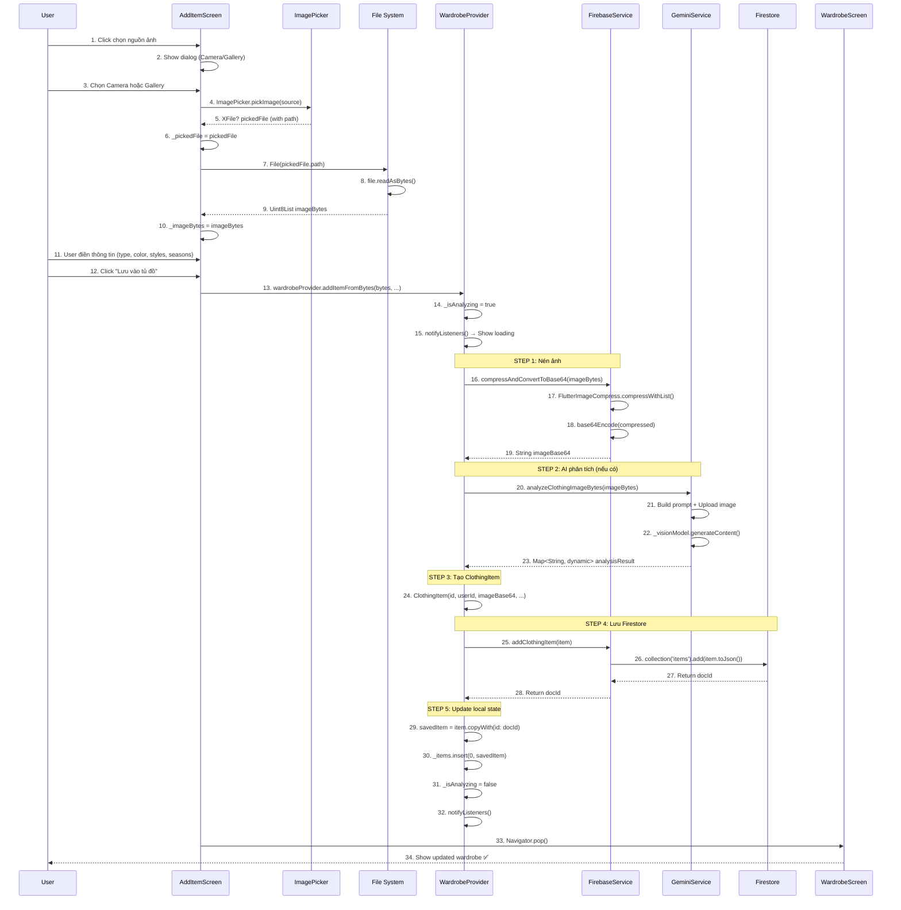

# 📱 Luồng Thêm Item - Mobile (từ file) - Chi tiết

> **Dựa trên tài liệu**: [ALL_Flow.md](file:///d:/FlutterProjects/ai_personal_stylist/ALL_Flow.md#7-thêm-item---mobile-từ-file)

---

## 📊 Sơ đồ Tổng quan



**Sơ đồ Sequence của luồng Thêm Item Mobile**

---

## 🔍 Chi Tiết Từng Bước

### **BƯỚC 1-3: Show Image Source Dialog**

#### File: [add_item_screen.dart](file:///d:/FlutterProjects/ai_personal_stylist/lib/screens/add_item_screen.dart#L100-L140)

```dart
Widget _buildImageSection() {
  return GestureDetector(
    onTap: _imageBytes == null ? _showImageSourceDialog : null,
    child: Container(
      height: 300,
      width: double.infinity,
      decoration: BoxDecoration(
        color: Colors.white,
        borderRadius: BorderRadius.circular(20),
        border: Border.all(
          color: _imageBytes == null 
              ? AppTheme.primaryColor.withValues(alpha: 0.3)
              : Colors.transparent,
          width: 2,
        ),
      ),
      child: _imageBytes == null
          ? _buildImagePlaceholder()
          : _buildImagePreview(),
    ),
  );
}
```

**Giải thích:**
- User nhấn vào placeholder ảnh → gọi `_showImageSourceDialog()`
- Trên Mobile hiện dialog cho phép chọn **Camera** hoặc **Gallery**
- Khác với Web (chỉ có Gallery)

---

### **BƯỚC 4-5: ImagePicker - Camera hoặc Gallery**

#### File: [add_item_screen.dart](file:///d:/FlutterProjects/ai_personal_stylist/lib/screens/add_item_screen.dart#L290-L320)

```dart
Future<void> _showImageSourceDialog() async {
  if (kIsWeb) {
    // Web: chỉ có gallery
    await _loadImage(ImageSource.gallery);
  } else {
    // Mobile: show dialog chọn nguồn
    await showDialog<ImageSource>(
      context: context,
      builder: (BuildContext context) {
        return AlertDialog(
          title: const Text('Chọn nguồn ảnh'),
          content: Column(
            mainAxisSize: MainAxisSize.min,
            children: [
              ListTile(
                leading: const Icon(Icons.camera_alt),
                title: const Text('Chụp ảnh'),
                onTap: () {
                  Navigator.pop(context);
                  _loadImage(ImageSource.camera);
                },
              ),
              ListTile(
                leading: const Icon(Icons.photo_library),
                title: const Text('Chọn từ thư viện'),
                onTap: () {
                  Navigator.pop(context);
                  _loadImage(ImageSource.gallery);
                },
              ),
            ],
          ),
        );
      },
    );
  }
}
```

#### Method `_loadImage()`:

```dart
Future<void> _loadImage(ImageSource source) async {
  try {
    final ImagePicker picker = ImagePicker();
    final XFile? pickedFile = await picker.pickImage(
      source: source,  // ImageSource.camera hoặc ImageSource.gallery
      maxWidth: 1800,
      maxHeight: 1800,
      imageQuality: 85,
    );

    if (pickedFile != null) {
      setState(() {
        _pickedFile = pickedFile;  // Lưu XFile (có path)
      });

      // Đọc bytes từ file
      if (kIsWeb) {
        // Web: đọc trực tiếp từ XFile
        final bytes = await pickedFile.readAsBytes();
        setState(() => _imageBytes = bytes);
      } else {
        // Mobile: đọc từ File path
        final bytes = await File(pickedFile.path).readAsBytes();
        setState(() => _imageBytes = bytes);
      }
    }
  } catch (e) {
    print('❌ Error loading image: $e');
    if (mounted) {
      ScaffoldMessenger.of(context).showSnackBar(
        SnackBar(
          content: Text('Lỗi khi tải ảnh: $e'),
          backgroundColor: AppTheme.errorColor,
        ),
      );
    }
  }
}
```

**Giải thích:**
- **ImageSource.camera**: Mở camera của thiết bị để chụp ảnh mới
- **ImageSource.gallery**: Mở thư viện ảnh để chọn ảnh có sẵn
- `XFile`: Đối tượng cross-platform của ImagePicker, chứa path đến file ảnh
- **Mobile**: Phải đọc bytes qua `File(pickedFile.path).readAsBytes()` vì XFile chỉ chứa path
- **Web**: Không có file system nên đọc trực tiếp `pickedFile.readAsBytes()`

**Khác biệt chính với Web:**
| Platform | XFile | Cách đọc bytes |
|----------|-------|----------------|
| **Web** | Chứa bytes trực tiếp | `pickedFile.readAsBytes()` |
| **Mobile** | Chỉ chứa path | `File(pickedFile.path).readAsBytes()` |

---

### **BƯỚC 6-10: Đọc File và Load Bytes**

#### File: [add_item_screen.dart](file:///d:/FlutterProjects/ai_personal_stylist/lib/screens/add_item_screen.dart#L350-L370)

```dart
// Mobile specific code
if (!kIsWeb) {
  final bytes = await File(pickedFile.path).readAsBytes();
  setState(() => _imageBytes = bytes);
}
```

**Flow:**
1. `File(pickedFile.path)` → Tạo File object từ đường dẫn
2. `.readAsBytes()` → Đọc toàn bộ file thành Uint8List
3. `setState(() => _imageBytes = bytes)` → Lưu vào state để preview

**Ví dụ path trên Mobile:**
- **Android**: `/data/user/0/com.example.app/cache/image_picker123.jpg`
- **iOS**: `/var/mobile/Containers/Data/Application/[UUID]/tmp/image_picker456.jpg`

---

### **BƯỚC 11: User Điền Thông Tin**

#### File: [add_item_screen.dart](file:///d:/FlutterProjects/ai_personal_stylist/lib/screens/add_item_screen.dart#L400-L550)

User điền các trường bắt buộc:

1. **Type** (Loại quần áo): Dropdown
2. **Color** (Màu sắc): Dropdown với màu preview
3. **Styles** (Phong cách): Multi-select chips
4. **Seasons** (Mùa): Multi-select chips

Tùy chọn thêm:
- **Material** (Chất liệu): TextField
- **Brand** (Thương hiệu): TextField
- **Notes** (Ghi chú): TextField

**Code ví dụ:**

```dart
DropdownButtonFormField<ClothingType>(
  value: _selectedType,
  decoration: const InputDecoration(
    labelText: 'Loại quần áo *',
    prefixIcon: Icon(Icons.category),
  ),
  items: ClothingType.values.map((type) {
    return DropdownMenuItem(
      value: type,
      child: Text(type.displayName),
    );
  }).toList(),
  onChanged: (value) => setState(() => _selectedType = value),
  validator: (value) => value == null ? 'Vui lòng chọn loại' : null,
)
```

---

### **BƯỚC 12-13: Click "Lưu vào tủ đồ" - Platform Detection**

#### File: [add_item_screen.dart](file:///d:/FlutterProjects/ai_personal_stylist/lib/screens/add_item_screen.dart#L700-L730)

```dart
Future<void> _saveItem() async {
  if (!_formKey.currentState!.validate()) return;
  if (_imageBytes == null) {
    ScaffoldMessenger.of(context).showSnackBar(
      const SnackBar(content: Text('Vui lòng chọn ảnh')),
    );
    return;
  }

  final wardrobeProvider = Provider.of<WardrobeProvider>(context, listen: false);

  // Create item with selected data
  ClothingItem? item;
  
  if (kIsWeb) {
    // For web, use bytes directly
    item = await wardrobeProvider.addItemFromBytes(
      _imageBytes!,
      type: _selectedType!,
      color: _selectedColor!,
      styles: _selectedStyles,
      seasons: _selectedSeasons,
      material: _selectedMaterial,
    );
  } else {
    // For mobile, read file as bytes and use addItemFromBytes
    final bytes = await File(_pickedFile!.path).readAsBytes();
    item = await wardrobeProvider.addItemFromBytes(
      bytes,
      type: _selectedType!,
      color: _selectedColor!,
      styles: _selectedStyles,
      seasons: _selectedSeasons,
      material: _selectedMaterial,
    );
  }

  if (item != null && mounted) {
    ScaffoldMessenger.of(context).showSnackBar(
      const SnackBar(
        content: Text('Đã thêm vào tủ đồ!'),
        backgroundColor: AppTheme.successColor,
      ),
    );
    Navigator.pop(context);
  }
}
```

**Giải thích:**
- **Mobile**: Đọc lại bytes từ `File(_pickedFile!.path).readAsBytes()`
- Lý do đọc lại: Đảm bảo có bytes mới nhất (trường hợp user chỉnh sửa ảnh sau khi chọn)
- Sau đó gọi **cùng method** `addItemFromBytes()` như Web

**⚠️ Lưu ý:** Dù Mobile và Web đều gọi `addItemFromBytes()`, nhưng cách lấy bytes khác nhau:
- **Web**: `_imageBytes!` (đã có sẵn từ state)
- **Mobile**: `await File(_pickedFile!.path).readAsBytes()` (đọc lại từ file)

---

### **BƯỚC 14-19: STEP 1 - Nén Ảnh**

#### File: [wardrobe_provider.dart](file:///d:/FlutterProjects/ai_personal_stylist/lib/providers/wardrobe_provider.dart#L150-L210)

```dart
Future<ClothingItem?> addItemFromBytes(
  Uint8List imageBytes, {
  required ClothingType type,
  required String color,
  required List<String> styles,
  required List<String> seasons,
  String? material,
}) async {
  try {
    _isAnalyzing = true;
    notifyListeners();

    // STEP 1: Compress image
    print('📦 Compressing image...');
    final imageBase64 = await _firebaseService.compressAndConvertToBase64(imageBytes);
    print('✅ Image compressed and converted to base64');
    
    // ... (tiếp tục các steps)
  } catch (e) {
    print('❌ Error adding item: $e');
    _isAnalyzing = false;
    notifyListeners();
    return null;
  }
}
```

#### File: [firebase_service.dart](file:///d:/FlutterProjects/ai_personal_stylist/lib/services/firebase_service.dart#L35-L70)

```dart
Future<String> compressAndConvertToBase64(Uint8List bytes) async {
  try {
    final originalSize = bytes.length;
    print('📸 Original image size: ${(originalSize / 1024).toStringAsFixed(2)} KB');

    // Compress image
    final compressedBytes = await FlutterImageCompress.compressWithList(
      bytes,
      minWidth: 800,
      minHeight: 800,
      quality: 85,
      format: CompressFormat.jpeg,
    );

    final compressedSize = compressedBytes.length;
    final reduction = ((originalSize - compressedSize) / originalSize * 100);

    print('📦 Compressed size: ${(compressedSize / 1024).toStringAsFixed(2)} KB');
    print('✅ Size reduction: ${reduction.toStringAsFixed(1)}%');

    // Convert to base64
    final base64String = base64Encode(compressedBytes);
    print('🔤 Base64 length: ${base64String.length} characters');

    return base64String;
  } catch (e) {
    print('❌ Error compressing image: $e');
    rethrow;
  }
}
```

**Giải thích:**
- **FlutterImageCompress**: Package nén ảnh cross-platform
- **minWidth/minHeight: 800px**: Đủ lớn để hiển thị đẹp, không quá nặng
- **quality: 85**: Cân bằng giữa chất lượng và dung lượng
- **format: jpeg**: Format phổ biến, nén tốt hơn PNG

**Ví dụ kết quả:**
```
📸 Original image size: 2500.00 KB
📦 Compressed size: 180.50 KB
✅ Size reduction: 92.8%
```

---

### **BƯỚC 20-23: STEP 2 - AI Phân Tích (Optional)**

#### File: [gemini_service.dart](file:///d:/FlutterProjects/ai_personal_stylist/lib/services/gemini_service.dart#L160-L250)

```dart
Future<String> analyzeClothingImageBytes(Uint8List imageBytes) async {
  try {
    print('🤖 Starting AI analysis...');

    // 1. Upload image to Gemini
    final uploadedFile = await _fileManager.uploadBytes(
      imageBytes,
      mimeType: 'image/jpeg',
    );
    print('📤 Image uploaded: ${uploadedFile.uri}');

    // 2. Build prompt
    const prompt = '''
Phân tích quần áo trong ảnh này và trả về JSON với format sau:
{
  "type": "top|bottom|outerwear|footwear|dress|suit|underwear|accessories|sportswear|sleepwear|swimwear|traditional|workwear|other",
  "color": "màu chính của quần áo",
  "material": "cotton|polyester|wool|silk|jean|leather|...",
  "styles": ["casual", "formal", "sporty", "elegant", ...],
  "seasons": ["spring", "summer", "fall", "winter"]
}

Chỉ trả về JSON, không giải thích.
''';

    // 3. Call Gemini API
    final response = await _visionModel
        .generateContent([
          Content.text(prompt),
          Content.file(uploadedFile.uri),
        ])
        .timeout(const Duration(seconds: 30));

    // 4. Parse response
    final text = response.text;
    if (text == null || text.isEmpty) {
      throw Exception('Empty response from AI');
    }

    print('✅ AI analysis complete');
    return text;
  } catch (e) {
    print('❌ AI analysis error: $e');
    rethrow;
  }
}
```

**Giải thích:**
- **Upload bytes**: Gemini cần URI của file đã upload
- **Prompt**: Yêu cầu AI trả về JSON với các trường cụ thể
- **Timeout 30s**: Tránh wait quá lâu
- **Parse JSON**: Extract từ markdown fence nếu có

---

### **BƯỚC 24: STEP 3 - Tạo ClothingItem**

#### File: [wardrobe_provider.dart](file:///d:/FlutterProjects/ai_personal_stylist/lib/providers/wardrobe_provider.dart#L180-L200)

```dart
// Create ClothingItem object
final item = ClothingItem(
  id: '',  // Will be set by Firestore
  userId: _firebaseService.currentUser!.uid,
  imageBase64: imageBase64,
  type: type,
  color: color,
  styles: styles,
  seasons: seasons,
  material: material,
  createdAt: DateTime.now(),
  updatedAt: DateTime.now(),
  isFavorite: false,
  wearCount: 0,
);

print('📝 ClothingItem created: ${item.type.displayName} - $color');
```

**Giải thích:**
- **id: ''**: Firestore sẽ tự generate doc ID
- **userId**: Từ Firebase Auth current user
- **imageBase64**: String base64 đã nén (bước 1)
- **createdAt/updatedAt**: Timestamp hiện tại
- **Default values**: isFavorite = false, wearCount = 0

---

### **BƯỚC 25-28: STEP 4 - Lưu Firestore**

#### File: [firebase_service.dart](file:///d:/FlutterProjects/ai_personal_stylist/lib/services/firebase_service.dart#L155-L175)

```dart
Future<String?> addClothingItem(ClothingItem item) async {
  try {
    print('💾 Saving item to Firestore...');

    final docRef = await _firestore
        .collection('items')
        .add(item.toJson());

    print('✅ Document added with ID: ${docRef.id}');
    return docRef.id;
  } catch (e) {
    print('❌ Error adding item to Firestore: $e');
    return null;
  }
}
```

#### File: [clothing_item.dart](file:///d:/FlutterProjects/ai_personal_stylist/lib/models/clothing_item.dart#L150-L180)

```dart
Map<String, dynamic> toJson() {
  return {
    'userId': userId,
    'imageBase64': imageBase64,  // ⚠️ Base64 string stored in Firestore
    'type': type.name,
    'color': color,
    'styles': styles,
    'seasons': seasons,
    'material': material,
    'brand': brand,
    'notes': notes,
    'createdAt': Timestamp.fromDate(createdAt),
    'updatedAt': Timestamp.fromDate(updatedAt),
    'isFavorite': isFavorite,
    'wearCount': wearCount,
    'lastWorn': lastWorn != null ? Timestamp.fromDate(lastWorn!) : null,
  };
}
```

**Giải thích:**
- **collection('items').add()**: Tạo document mới với auto-generated ID
- **toJson()**: Convert ClothingItem object thành Map để lưu Firestore
- **imageBase64**: Lưu trực tiếp string base64 trong document (không dùng Firebase Storage)

**Lợi ích của Base64 trong Firestore:**
- ✅ Không cần Firebase Storage (tiết kiệm chi phí)
- ✅ Đọc/ghi một lần (không cần 2 requests riêng biệt)
- ✅ Atomic operation (image và metadata cùng document)
- ⚠️ Giới hạn: 1MB/document (đủ cho ảnh nén ~180KB)

---

### **BƯỚC 29-32: STEP 5 - Update Local State**

#### File: [wardrobe_provider.dart](file:///d:/FlutterProjects/ai_personal_stylist/lib/providers/wardrobe_provider.dart#L200-L210)

```dart
// Save to Firestore
final docId = await _firebaseService.addClothingItem(item);

if (docId != null) {
  // Update item with real ID
  final savedItem = item.copyWith(id: docId);

  // Add to local list (insert at top for newest first)
  _items.insert(0, savedItem);

  // Notify listeners to rebuild UI
  _isAnalyzing = false;
  notifyListeners();

  print('✅ Item added successfully: $docId');
  return savedItem;
} else {
  print('❌ Failed to save item');
  _isAnalyzing = false;
  notifyListeners();
  return null;
}
```

**Giải thích:**
- **copyWith(id: docId)**: Tạo bản sao với ID thật từ Firestore
- **_items.insert(0, ...)**: Thêm vào đầu list (hiển thị mới nhất trước)
- **_isAnalyzing = false**: Tắt loading indicator
- **notifyListeners()**: Trigger rebuild UI

**UI Flow:**
1. Loading → Hiện progress indicator
2. Complete → Dismiss loading, show item mới trong grid
3. Navigate back → WardrobeScreen auto refresh vì Provider notify

---

### **BƯỚC 33-34: Navigator Pop và Show Result**

#### File: [add_item_screen.dart](file:///d:/FlutterProjects/ai_personal_stylist/lib/screens/add_item_screen.dart#L725-L735)

```dart
if (item != null && mounted) {
  ScaffoldMessenger.of(context).showSnackBar(
    const SnackBar(
      content: Text('Đã thêm vào tủ đồ!'),
      backgroundColor: AppTheme.successColor,
      duration: Duration(seconds: 2),
    ),
  );
  Navigator.pop(context);  // Back to WardrobeScreen
}
```

**Giải thích:**
- **item != null**: Kiểm tra thành công
- **mounted**: Đảm bảo widget chưa bị dispose
- **SnackBar**: Show thông báo success
- **Navigator.pop()**: Quay về WardrobeScreen

**WardrobeScreen tự động update vì:**
```dart
Consumer<WardrobeProvider>(
  builder: (context, wardrobeProvider, child) {
    final items = wardrobeProvider.items;  // Auto rebuild khi items thay đổi
    return GridView.builder(...);
  }
)
```

---

## 📊 So Sánh Web vs Mobile

| Khía cạnh | Web | Mobile |
|-----------|-----|--------|
| **Image Source** | Gallery only | Camera + Gallery |
| **Image Picker** | `ImagePicker.pickImage(source: gallery)` | `ImagePicker.pickImage(source: camera/gallery)` |
| **XFile** | Chứa bytes trực tiếp | Chỉ chứa path |
| **Read Bytes** | `pickedFile.readAsBytes()` | `File(pickedFile.path).readAsBytes()` |
| **File System** | Không có file system | Có file system (Android/iOS paths) |
| **Compression** | ✅ Same (FlutterImageCompress) | ✅ Same (FlutterImageCompress) |
| **AI Analysis** | ✅ Same (GeminiService) | ✅ Same (GeminiService) |
| **Firestore Save** | ✅ Same (Base64 storage) | ✅ Same (Base64 storage) |

**Điểm giống nhau:** Từ bước nén ảnh trở đi, 2 platforms hoàn toàn giống nhau.

**Điểm khác:** Chỉ khác cách lấy bytes từ ImagePicker.

---

## ⏱️ Thời Gian Thực Thi (Mobile)

### Trường hợp **KHÔNG dùng AI**:
1. **Chọn ảnh (Camera)**: ~2-5 giây (tùy user chụp)
2. **Chọn ảnh (Gallery)**: ~1-3 giây
3. **Đọc bytes từ file**: <1 giây
4. **Nén ảnh**: ~2-4 giây (tùy kích thước gốc)
5. **Tạo ClothingItem**: <0.1 giây
6. **Lưu Firestore**: ~1-2 giây
7. **Update UI**: <0.5 giây

**Tổng: ~6-15 giây** (chủ yếu user chọn ảnh)

### Trường hợp **CÓ dùng AI**:
1-3. **Chọn và đọc ảnh**: ~3-8 giây
4. **Nén ảnh**: ~2-4 giây
5. **AI analyze**: ~15-30 giây ⏰
6. **Tạo ClothingItem**: <0.1 giây
7. **Lưu Firestore**: ~1-2 giây
8. **Update UI**: <0.5 giây

**Tổng: ~21-45 giây** (AI analysis chiếm 60-70%)

---

## 🐛 Error Handling

### 1. **Permission Denied (Camera/Gallery)**

```dart
try {
  final pickedFile = await picker.pickImage(source: source);
} on PlatformException catch (e) {
  if (e.code == 'photo_access_denied') {
    ScaffoldMessenger.of(context).showSnackBar(
      SnackBar(content: Text('Vui lòng cấp quyền truy cập thư viện ảnh')),
    );
  } else if (e.code == 'camera_access_denied') {
    ScaffoldMessenger.of(context).showSnackBar(
      SnackBar(content: Text('Vui lòng cấp quyền sử dụng camera')),
    );
  }
}
```

### 2. **File Read Error**

```dart
try {
  final bytes = await File(pickedFile.path).readAsBytes();
} catch (e) {
  print('❌ Cannot read file: $e');
  ScaffoldMessenger.of(context).showSnackBar(
    SnackBar(content: Text('Không thể đọc file ảnh')),
  );
}
```

### 3. **Image Too Large (Before Compression)**

```dart
if (imageBytes.length > 10 * 1024 * 1024) {  // 10MB
  print('⚠️ Image too large: ${imageBytes.length} bytes');
  ScaffoldMessenger.of(context).showSnackBar(
    SnackBar(content: Text('Ảnh quá lớn (>10MB), vui lòng chọn ảnh khác')),
  );
  return;
}
```

### 4. **Compression Failed**

```dart
// In firebase_service.dart
Future<String> compressAndConvertToBase64(Uint8List bytes) async {
  try {
    final compressedBytes = await FlutterImageCompress.compressWithList(...);
    return base64Encode(compressedBytes);
  } catch (e) {
    print('❌ Compression failed: $e');
    // Fallback: use original bytes (not recommended for large images)
    return base64Encode(bytes);
  }
}
```

### 5. **AI Analysis Timeout**

```dart
// In gemini_service.dart
try {
  final response = await _visionModel
      .generateContent([...])
      .timeout(const Duration(seconds: 30));
} on TimeoutException {
  print('⏰ AI analysis timeout');
  // Return default values or skip AI
  return '{"type": "other", "color": "unknown"}';
}
```

### 6. **Firestore Save Failed**

```dart
final docId = await _firebaseService.addClothingItem(item);

if (docId == null) {
  ScaffoldMessenger.of(context).showSnackBar(
    const SnackBar(
      content: Text('Lỗi khi lưu vào tủ đồ. Vui lòng thử lại.'),
      backgroundColor: AppTheme.errorColor,
    ),
  );
  return;
}
```

---

## 📱 Platform-Specific Notes

### **Android**

1. **Permissions** (AndroidManifest.xml):
```xml
<uses-permission android:name="android.permission.CAMERA" />
<uses-permission android:name="android.permission.READ_EXTERNAL_STORAGE" />
<uses-permission android:name="android.permission.WRITE_EXTERNAL_STORAGE" />
```

2. **File Path Example**:
```
/data/user/0/com.example.ai_personal_stylist/cache/image_picker1234567890.jpg
```

3. **Camera Intent**: Tự động mở app Camera của hệ thống

### **iOS**

1. **Permissions** (Info.plist):
```xml
<key>NSCameraUsageDescription</key>
<string>Cần quyền camera để chụp ảnh quần áo</string>
<key>NSPhotoLibraryUsageDescription</key>
<string>Cần quyền thư viện ảnh để chọn ảnh quần áo</string>
```

2. **File Path Example**:
```
/var/mobile/Containers/Data/Application/[UUID]/tmp/image_picker_ABC123.jpg
```

3. **Camera Access**: Hiện popup yêu cầu permission lần đầu

---

## 🔗 Files Liên Quan

### **Core Files:**
1. [lib/screens/add_item_screen.dart](file:///d:/FlutterProjects/ai_personal_stylist/lib/screens/add_item_screen.dart) - UI và logic chính (755 lines)
2. [lib/providers/wardrobe_provider.dart](file:///d:/FlutterProjects/ai_personal_stylist/lib/providers/wardrobe_provider.dart) - State management (399 lines)
3. [lib/services/firebase_service.dart](file:///d:/FlutterProjects/ai_personal_stylist/lib/services/firebase_service.dart) - Firestore và compress (250+ lines)
4. [lib/services/gemini_service.dart](file:///d:/FlutterProjects/ai_personal_stylist/lib/services/gemini_service.dart) - AI analysis (500+ lines)

### **Model Files:**
5. [lib/models/clothing_item.dart](file:///d:/FlutterProjects/ai_personal_stylist/lib/models/clothing_item.dart) - ClothingItem model (283 lines)

### **Package Dependencies:**
```yaml
# pubspec.yaml
dependencies:
  image_picker: ^1.1.2          # Pick images from camera/gallery
  flutter_image_compress: ^2.3.0 # Compress images
  firebase_storage: ^12.3.6      # (Not used - we use Base64)
  cloud_firestore: ^5.6.5        # Firestore database
```

---

## 🔄 Luồng Liên Quan

### **Trước khi thêm item:**
- [Flow 5: Load Tủ Đồ](file:///d:/FlutterProjects/ai_personal_stylist/ALL_Flow.md#5-load-tủ-đồ-ban-đầu) - Load danh sách items

### **Sau khi thêm item:**
- [Flow 8: Xem Chi Tiết Item](file:///d:/FlutterProjects/ai_personal_stylist/ALL_Flow.md#8-xem-chi-tiết-item) - View item vừa thêm
- [Flow 9: Cập Nhật Item](file:///d:/FlutterProjects/ai_personal_stylist/ALL_Flow.md#9-cập-nhật-item) - Edit thông tin
- [Flow 11: Toggle Favorite](file:///d:/FlutterProjects/ai_personal_stylist/ALL_Flow.md#11-toggle-favorite) - Mark favorite

### **AI Features liên quan:**
- [Flow 13: AI Phân Tích Ảnh](file:///d:/FlutterProjects/ai_personal_stylist/ALL_Flow.md#13-ai-phân-tích-ảnh-quần-áo) - AI analysis details
- [Flow 14: Gợi Ý Outfit](file:///d:/FlutterProjects/ai_personal_stylist/ALL_Flow.md#14-gợi-ý-outfit) - Suggest outfit with new item

---

## ✅ Tóm Tắt

### **Điểm chính của Mobile flow:**

1. ✅ **Image Source Dialog**: User chọn Camera hoặc Gallery (khác Web)
2. ✅ **File System**: Đọc bytes từ file path (khác Web)
3. ✅ **Same Compression**: Dùng FlutterImageCompress giống Web
4. ✅ **Same AI**: Gọi GeminiService giống Web
5. ✅ **Same Storage**: Lưu Base64 vào Firestore giống Web
6. ✅ **Same Provider**: WardrobeProvider update state giống Web

### **Key Differences:**
| Web | Mobile |
|-----|--------|
| Gallery only | Camera + Gallery |
| `pickedFile.readAsBytes()` | `File(path).readAsBytes()` |
| No permissions needed | Require Camera/Gallery permissions |

### **Performance:**
- **Without AI**: ~6-15 giây
- **With AI**: ~21-45 giây
- **Bottleneck**: AI analysis (~15-30s)

---

**📌 Next Steps:**
- [Flow 8: Xem Chi Tiết Item](file:///d:/FlutterProjects/ai_personal_stylist/ALL_Flow.md#8-xem-chi-tiết-item)
- [Flow 9: Cập Nhật Item](file:///d:/FlutterProjects/ai_personal_stylist/ALL_Flow.md#9-cập-nhật-item)
