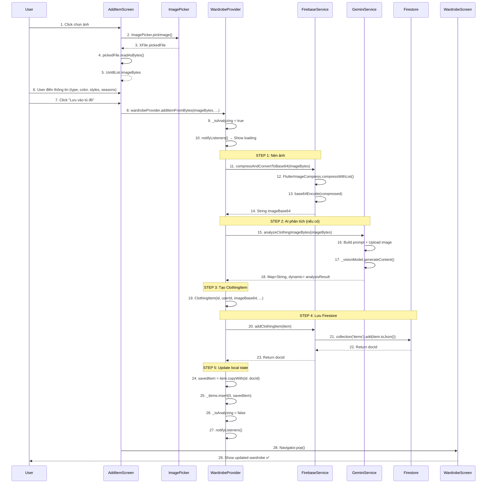

# 📸 Luồng Thêm Item - Web (từ bytes) - Chi tiết

> **Dựa trên tài liệu**: [ALL_Flow.md](file:///d:/FlutterProjects/ai_personal_stylist/ALL_Flow.md#6-thêm-item---web-từ-bytes)

---

## 📊 Sơ đồ Tổng quan



**Sơ đồ Sequence của luồng Thêm Item Web**

---

## 🔍 Chi Tiết Từng Bước

### **BƯỚC 1-3: Chọn Ảnh**

#### File: [add_item_screen.dart](file:///d:/FlutterProjects/ai_personal_stylist/lib/screens/add_item_screen.dart#L100-L140)

```dart
Widget _buildImageSection() {
  return GestureDetector(
    onTap: _imageBytes == null ? _showImageSourceDialog : null,
    child: Container(
      height: 300,
      width: double.infinity,
      decoration: BoxDecoration(
        color: Colors.white,
        borderRadius: BorderRadius.circular(20),
        border: Border.all(
          color: _imageBytes == null 
              ? AppTheme.primaryColor.withValues(alpha: 0.3)
              : Colors.transparent,
          width: 2,
        ),
      ),
      child: _imageBytes == null
          ? _buildImagePlaceholder()
          : _buildImagePreview(),
    ),
  );
}
```

#### Method chọn ảnh:

```dart
Future<void> _showImageSourceDialog() async {
  final picker = ImagePicker();
  
  // Web: Chỉ có Gallery option
  final pickedFile = await picker.pickImage(
    source: ImageSource.gallery,
    maxWidth: 1920,
    maxHeight: 1920,
    imageQuality: 85,
  );
  
  if (pickedFile != null) {
    setState(() {
      _pickedFile = pickedFile;
    });
    await _loadImage();
  }
}
```

#### Giải thích:

**ImagePicker.pickImage()**
- **`source: ImageSource.gallery`**: Trên Web → mở file picker của browser.
- **`maxWidth/maxHeight: 1920`**: Resize nếu ảnh quá lớn (giảm RAM usage).
- **`imageQuality: 85`**: Quality 85% (balance giữa size và quality).

**Return value: `XFile?`**
- **`XFile`**: Cross-platform file wrapper.
- **`null`**: User cancel dialog.

---

### **BƯỚC 4-5: Đọc Ảnh thành Bytes**

#### File: [add_item_screen.dart](file:///d:/FlutterProjects/ai_personal_stylist/lib/screens/add_item_screen.dart#L300-L320)

```dart
Future<void> _loadImage() async {
  if (_pickedFile == null) return;
  
  try {
    // Web: Đọc trực tiếp từ XFile
    final bytes = await _pickedFile!.readAsBytes();
    
    setState(() {
      _imageBytes = bytes;
      _analysisResult = null; // Clear previous analysis
    });
    
    // Optional: Tự động gọi AI phân tích
    if (_useAI) {
      await _analyzeImage();
    }
  } catch (e) {
    ScaffoldMessenger.of(context).showSnackBar(
      SnackBar(content: Text('Lỗi đọc ảnh: $e')),
    );
  }
}
```

#### Giải thích:

**`pickedFile.readAsBytes()`**
- **Trên Web**: Đọc file từ browser's File API → `Uint8List`.
- **Async**: Vì phải đọc từ disk/memory.
- **Return**: `Uint8List` - mảng bytes của ảnh.

**`setState(() => _imageBytes = bytes)`**
- Lưu bytes vào state để preview và upload sau.

---

### **BƯỚC 6-7: User Điền Thông Tin**

#### File: [add_item_screen.dart](file:///d:/FlutterProjects/ai_personal_stylist/lib/screens/add_item_screen.dart#L400-L600)

```dart
Widget _buildEditableFields() {
  return Column(
    children: [
      // Type dropdown
      DropdownButtonFormField<ClothingType>(
        value: _selectedType,
        decoration: InputDecoration(labelText: 'Loại quần áo *'),
        items: ClothingType.values.map((type) {
          return DropdownMenuItem(
            value: type,
            child: Text(type.displayName),
          );
        }).toList(),
        onChanged: (value) => setState(() => _selectedType = value),
        validator: (value) => value == null ? 'Vui lòng chọn loại' : null,
      ),
      
      SizedBox(height: 16),
      
      // Color input
      TextFormField(
        decoration: InputDecoration(labelText: 'Màu sắc *'),
        onChanged: (value) => _selectedColor = value,
        validator: (value) => 
            value == null || value.isEmpty ? 'Vui lòng nhập màu' : null,
      ),
      
      SizedBox(height: 16),
      
      // Styles chips
      _buildStylesSelector(),
      
      SizedBox(height: 16),
      
      // Seasons chips
      _buildSeasonsSelector(),
      
      SizedBox(height: 16),
      
      // Material (optional)
      TextFormField(
        decoration: InputDecoration(labelText: 'Chất liệu (tùy chọn)'),
        onChanged: (value) => _selectedMaterial = value,
      ),
    ],
  );
}
```

#### Validation:

- **Required fields**: `type`, `color`, `styles`, `seasons`.
- **Optional**: `material`, `brand`, `notes`.
- **Form key**: `_formKey.currentState!.validate()` trước khi save.

---

### **BƯỚC 8-10: Gọi Provider**

#### File: [add_item_screen.dart](file:///d:/FlutterProjects/ai_personal_stylist/lib/screens/add_item_screen.dart#L650-L700)

```dart
Future<void> _saveItem() async {
  // Validate form
  if (!_formKey.currentState!.validate()) {
    return;
  }
  
  if (_imageBytes == null) {
    ScaffoldMessenger.of(context).showSnackBar(
      SnackBar(content: Text('Vui lòng chọn ảnh')),
    );
    return;
  }
  
  setState(() => _isSaving = true);
  
  final wardrobeProvider = context.read<WardrobeProvider>();
  
  // Call provider
  final item = await wardrobeProvider.addItemFromBytes(
    _imageBytes!,
    type: _selectedType!,
    color: _selectedColor!,
    styles: _selectedStyles,
    seasons: _selectedSeasons,
    material: _selectedMaterial,
  );
  
  setState(() => _isSaving = false);
  
  if (item != null && mounted) {
    // Success → Navigate back
    Navigator.pop(context);
    ScaffoldMessenger.of(context).showSnackBar(
      SnackBar(content: Text('Đã thêm vào tủ đồ!')),
    );
  } else {
    // Error
    ScaffoldMessenger.of(context).showSnackBar(
      SnackBar(content: Text('Lỗi khi lưu. Vui lòng thử lại.')),
    );
  }
}
```

#### Giải thích:

**`context.read<WardrobeProvider>()`**
- **Read-only**: Không rebuild khi provider thay đổi.
- **Use case**: Chỉ gọi method, không cần listen state.

**Loading state: `_isSaving`**
- UI hiển thị loading button khi đang save.
- Prevent double-tap.

---

### **BƯỚC 11-14: STEP 1 - Nén Ảnh**

#### File: [wardrobe_provider.dart](file:///d:/FlutterProjects/ai_personal_stylist/lib/providers/wardrobe_provider.dart#L150-L175)

```dart
Future<ClothingItem?> addItemFromBytes(
  Uint8List imageBytes, {
  required ClothingType type,
  required String color,
  required List<ClothingStyle> styles,
  required List<Season> seasons,
  String? material,
}) async {
  try {
    _isAnalyzing = true;
    _errorMessage = null;
    notifyListeners();

    print('🖼️ Original image size: ${(imageBytes.length / 1024).toStringAsFixed(1)}KB');
    
    // 1. Nén và convert to Base64
    final imageBase64 = await _firebaseService.compressAndConvertToBase64(imageBytes);
    print('✅ Image compressed and converted to Base64 (${imageBase64.length} chars)');
```

#### File: [firebase_service.dart](file:///d:/FlutterProjects/ai_personal_stylist/lib/services/firebase_service.dart#L35-L60)

```dart
Future<String> compressAndConvertToBase64(Uint8List bytes) async {
  try {
    // Nén ảnh xuống còn ~200KB
    final compressed = await FlutterImageCompress.compressWithList(
      bytes,
      minWidth: 800,  // Giảm width tối đa xuống 800px
      minHeight: 800, // Giảm height tối đa xuống 800px
      quality: 85,    // Chất lượng 85%
    );
    
    final originalSize = bytes.length;
    final compressedSize = compressed.length;
    final ratio = ((originalSize - compressedSize) / originalSize * 100).toStringAsFixed(1);
    
    print('📦 Image compressed: ${(originalSize / 1024).toStringAsFixed(1)}KB → '
          '${(compressedSize / 1024).toStringAsFixed(1)}KB '
          '(saved $ratio%)');
    
    return base64Encode(compressed);
  } catch (e) {
    print('⚠️ Compression failed, using original: $e');
    return base64Encode(bytes);
  }
}
```

#### Giải thích:

**Tại sao phải nén?**
- **Firestore limit**: Document max 1MB.
- **Base64 overhead**: +37% size (200KB raw → ~270KB Base64).
- **Network**: Upload nhanh hơn.

**FlutterImageCompress parameters:**
- **`minWidth/Height: 800`**: Resize về 800x800px nếu lớn hơn.
- **`quality: 85`**: JPEG quality 85% (good balance).
- **Return**: `List<int>` - compressed bytes.

**base64Encode()**
- Convert bytes → Base64 string.
- String này sẽ lưu vào Firestore field `imageBase64`.

---

### **BƯỚC 15-18: STEP 2 - AI Phân Tích (Optional)**

#### File: [wardrobe_provider.dart](file:///d:/FlutterProjects/ai_personal_stylist/lib/providers/wardrobe_provider.dart#L170-L180)

```dart
// Note: AI analysis bị bỏ trong flow này vì user đã điền manual
// Nhưng nếu có toggle "Use AI", flow sẽ như sau:

if (_useAI) {
  final analysis = await _geminiService.analyzeClothingImageBytes(imageBytes);
  if (analysis != null) {
    // Auto-fill từ AI result
    type = ClothingType.fromString(analysis['type']);
    color = analysis['color'];
    styles = (analysis['styles'] as List).map(...).toList();
    seasons = (analysis['seasons'] as List).map(...).toList();
    material = analysis['material'];
  }
}
```

#### File: [gemini_service.dart](file:///d:/FlutterProjects/ai_personal_stylist/lib/services/gemini_service.dart#L45-L90)

```dart
Future<Map<String, dynamic>?> analyzeClothingImageBytes(Uint8List imageBytes) async {
  if (!_isInitialized) {
    print('❌ Gemini not initialized');
    return null;
  }

  try {
    print('🔍 Starting Gemini analysis...');
    
    final prompt = TextPart(AIPrompts.analyzeClothing);
    final imagePart = DataPart('image/jpeg', imageBytes);
    
    final response = await _visionModel.generateContent([
      Content.multi([prompt, imagePart])
    ]).timeout(
      const Duration(seconds: 30),
    );

    final text = response.text;
    if (text == null || text.isEmpty) {
      print('❌ Empty response from Gemini');
      return null;
    }

    final result = safeParseJson(text);
    print('✅ Parsed result: $result');
    return result;
  } catch (e) {
    print('❌ Analyze Image Error: $e');
    return null;
  }
}
```

#### Giải thích:

**Gemini Vision API:**
- **Input**: Prompt (text) + Image (bytes).
- **Model**: `gemini-2.0-flash` (vision-capable).
- **Output**: JSON string với fields: `type`, `color`, `material`, `styles`, `seasons`.

**Timeout 30s:**
- Gemini thường response trong 2-5 giây.
- Timeout để tránh hang forever.

---

### **BƯỚC 19: STEP 3 - Tạo ClothingItem**

#### File: [wardrobe_provider.dart](file:///d:/FlutterProjects/ai_personal_stylist/lib/providers/wardrobe_provider.dart#L185-L205)

```dart
// 2. Create ClothingItem với provided data
final userId = _firebaseService.currentUser?.uid;
if (userId == null) {
  throw Exception('Chưa đăng nhập');
}
print('👤 User ID: $userId');

final item = ClothingItem(
  id: '',  // Sẽ được gán sau khi lưu Firestore
  userId: userId,
  imageBase64: imageBase64,
  type: type,
  color: color,
  material: material,
  styles: styles,
  seasons: seasons,
  createdAt: DateTime.now(),
);
```

#### Giải thích:

**`id: ''`**
- Empty string vì chưa có Firestore doc ID.
- Sẽ được update sau khi `addClothingItem()` return docId.

**`userId: userId`**
- **Quan trọng**: Mỗi item phải thuộc về 1 user.
- Dùng để query: `where('userId', isEqualTo: currentUser.uid)`.

**`imageBase64`**
- Base64 string từ STEP 1.
- Lưu trực tiếp trong Firestore document (không dùng Storage).

---

### **BƯỚC 20-23: STEP 4 - Lưu Firestore**

#### File: [wardrobe_provider.dart](file:///d:/FlutterProjects/ai_personal_stylist/lib/providers/wardrobe_provider.dart#L207-L215)

```dart
print('💾 Saving to Firestore...');

// 3. Save to Firestore
final docId = await _firebaseService.addClothingItem(item);
if (docId == null) {
  throw Exception('Không thể lưu item. Vui lòng kiểm tra:\n'
      '1. Firestore Rules đã cho phép write\n'
      '2. Kết nối internet ổn định');
}
print('✅ Saved with ID: $docId');
```

#### File: [firebase_service.dart](file:///d:/FlutterProjects/ai_personal_stylist/lib/services/firebase_service.dart#L155-L180)

```dart
Future<String?> addClothingItem(ClothingItem item) async {
  try {
    print('📝 Preparing to add item to Firestore...');
    final json = item.toJson();
    print('📦 JSON data size: ${json.toString().length} chars');
    print('🔄 Adding to collection: ${AppConstants.itemsCollection}');
    
    final docRef = await _itemsRef.add(json).timeout(
      const Duration(seconds: 30),
      onTimeout: () {
        throw Exception('Firestore timeout after 30 seconds');
      },
    );
    
    print('✅ Document added with ID: ${docRef.id}');
    return docRef.id;
  } catch (e) {
    print('❌ Add Item Error: $e');
    return null;
  }
}
```

#### Giải thích:

**`item.toJson()`**
```dart
Map<String, dynamic> toJson() {
  return {
    'userId': userId,
    'imageBase64': imageBase64,
    'type': type.name,
    'color': color,
    'material': material,
    'styles': styles.map((s) => s.name).toList(),
    'seasons': seasons.map((s) => s.name).toList(),
    'createdAt': Timestamp.fromDate(createdAt),
    'wearCount': wearCount,
    'isFavorite': isFavorite,
  };
}
```

**`_itemsRef.add(json)`**
- **Collection**: `items` (từ `AppConstants.itemsCollection`).
- **Auto-generate ID**: Firestore tự tạo unique document ID.
- **Return**: `DocumentReference` với field `.id`.

**Timeout 30s:**
- Network có thể chậm.
- Nếu quá 30s → throw exception.

---

### **BƯỚC 24-27: STEP 5 - Update Local State**

#### File: [wardrobe_provider.dart](file:///d:/FlutterProjects/ai_personal_stylist/lib/providers/wardrobe_provider.dart#L217-L225)

```dart
final savedItem = item.copyWith(id: docId);
_items.insert(0, savedItem);  // Insert ở đầu list (mới nhất)

_isAnalyzing = false;
notifyListeners();

return savedItem;
```

#### Giải thích:

**`item.copyWith(id: docId)`**
- Copy item với ID mới từ Firestore.
- Immutable pattern - không modify item gốc.

**`_items.insert(0, savedItem)`**
- Insert vào **index 0** (đầu list).
- **Tại sao**: Firestore query `orderBy('createdAt', descending: true)` → item mới nhất đầu tiên.
- **UI**: Wardrobe screen sẽ show item mới ở đầu grid.

**`notifyListeners()`**
- Trigger rebuild cho tất cả `Consumer<WardrobeProvider>`.
- Các screen khác (Wardrobe, Home) tự động update.

---

### **BƯỚC 28-29: Navigate Back**

#### File: [add_item_screen.dart](file:///d:/FlutterProjects/ai_personal_stylist/lib/screens/add_item_screen.dart#L680-L695)

```dart
if (item != null && mounted) {
  // Success
  Navigator.pop(context);
  
  ScaffoldMessenger.of(context).showSnackBar(
    SnackBar(
      content: Text('✅ Đã thêm vào tủ đồ!'),
      backgroundColor: AppTheme.successColor,
    ),
  );
}
```

#### Khi về WardrobeScreen:

```dart
// WardrobeScreen rebuild tự động vì đang watch WardrobeProvider
Consumer<WardrobeProvider>(
  builder: (context, wardrobe, _) {
    return GridView.builder(
      itemCount: wardrobe.items.length,  // +1 item mới
      itemBuilder: (context, index) {
        final item = wardrobe.items[index];
        return ClothingCard(item: item);
      },
    );
  },
)
```

**UI tự động update** vì:
1. `notifyListeners()` đã được gọi trong provider.
2. `Consumer<WardrobeProvider>` rebuild.
3. Grid show item mới ở đầu.

---

## 🎯 Tổng kết Flow

### Các bước chính:

```
1. User chọn ảnh → XFile
2. Đọc bytes → Uint8List
3. User điền form → Validate
4. Gọi Provider.addItemFromBytes()
   ├─ Nén ảnh → Base64 string
   ├─ (Optional) AI analyze
   ├─ Tạo ClothingItem object
   ├─ Lưu Firestore → get docId
   └─ Update local state → notifyListeners()
5. Navigator.pop() → Back với SnackBar
6. WardrobeScreen tự động rebuild → Show item mới
```

### Thời gian ước tính:

- **Chọn ảnh**: ~2s
- **Đọc bytes**: <1s
- **Điền form**: ~10-30s (user)
- **Nén ảnh**: ~0.5-1s
- **AI analyze**: ~3-5s (nếu dùng)
- **Lưu Firestore**: ~1-2s
- **Total**: ~15-40s

### Error Handling:

```dart
try {
  // Main flow
} catch (e) {
  _isAnalyzing = false;
  _errorMessage = e.toString();
  notifyListeners();
  return null;
}
```

**Các lỗi thường gặp:**
- User chưa login → `userId == null`
- Network timeout → Firestore không response
- Firestore rules → Permission denied
- Image quá lớn → Compression fail (fallback: dùng original)

---

## 📝 Files Liên Quan

| File | Mục đích |
|------|----------|
| [add_item_screen.dart](file:///d:/FlutterProjects/ai_personal_stylist/lib/screens/add_item_screen.dart) | UI, ImagePicker, Form validation |
| [wardrobe_provider.dart](file:///d:/FlutterProjects/ai_personal_stylist/lib/providers/wardrobe_provider.dart) | Business logic, orchestrate services |
| [firebase_service.dart](file:///d:/FlutterProjects/ai_personal_stylist/lib/services/firebase_service.dart) | Compression, Firestore CRUD |
| [gemini_service.dart](file:///d:/FlutterProjects/ai_personal_stylist/lib/services/gemini_service.dart) | AI image analysis |
| [clothing_item.dart](file:///d:/FlutterProjects/ai_personal_stylist/lib/models/clothing_item.dart) | Data model, toJson/fromJson |

---

## 🔗 Liên kết với Flows khác

**Flow trước:** [Load Tủ Đồ](file:///d:/FlutterProjects/ai_personal_stylist/flow_load_wardrobe.md) - Để hiểu cách items được load.

**Flow sau:** 
- [Xem Chi Tiết Item](file:///d:/FlutterProjects/ai_personal_stylist/ALL_Flow.md#8-xem-chi-tiết-item) - Khi user tap vào item vừa thêm.
- [AI Phân Tích Ảnh](file:///d:/FlutterProjects/ai_personal_stylist/ALL_Flow.md#13-ai-phân-tích-ảnh-quần-áo) - Chi tiết về AI analysis step.

---

**💡 Lưu ý quan trọng:**

1. **Web vs Mobile**: Flow này dành cho Web (dùng `readAsBytes()`). Mobile dùng `File.readAsBytes()` - xem [Flow #7](file:///d:/FlutterProjects/ai_personal_stylist/ALL_Flow.md#7-thêm-item---mobile-từ-file).

2. **Base64 Storage**: App này lưu ảnh dạng Base64 trong Firestore thay vì Firebase Storage → **miễn phí 100%**, không cần Blaze plan.

3. **Compression**: Luôn nén ảnh trước khi lưu để tránh vượt quá Firestore document limit (1MB).

4. **User Experience**: Loading state (`_isAnalyzing`, `_isSaving`) rất quan trọng để user biết app đang xử lý.
