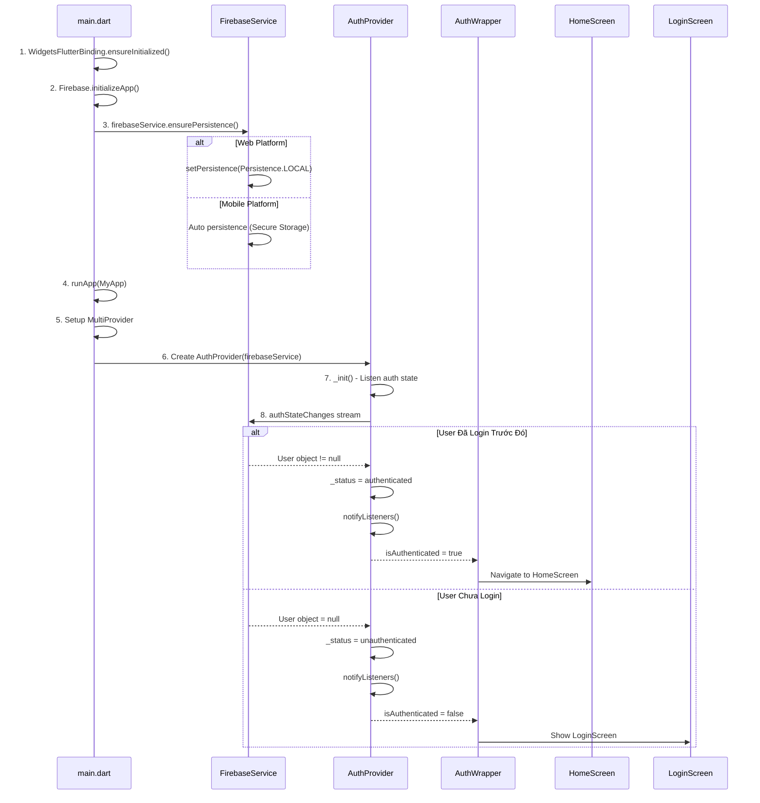

# 🚀 Luồng Khởi động App & Auto Login - Chi tiết

> **Dựa trên tài liệu**: [TẤT_CẢ_LUỒNG_ĐI.md](file:///d:/FlutterProjects/ai_personal_stylist/TẤT_CẢ_LUỒNG_ĐI.md#1-khởi-động-app--auto-login)

---

## 📊 Sơ đồ Tổng quan



**Sơ đồ luồng Khởi động App & Auto Login**

---

## 🔍 Chi Tiết Từng Bước

### **BƯỚC 1: Entry Point - main() Function**

#### File: [main.dart](file:///d:/FlutterProjects/ai_personal_stylist/lib/main.dart#L23-L35)

```dart
void main() async {
  WidgetsFlutterBinding.ensureInitialized();
  await Firebase.initializeApp(
    options: DefaultFirebaseOptions.currentPlatform,
  );
  
  // Thiết lập persistence cho Firebase Auth trước khi runApp
  // Điều này giúp giữ phiên đăng nhập giữa các lần reload/restart
  final firebaseService = FirebaseService();
  await firebaseService.ensurePersistence();
  
  runApp(MyApp(firebaseService: firebaseService));
}
```

#### Giải thích từng dòng:

**Dòng 24: `WidgetsFlutterBinding.ensureInitialized();`**
- **Mục đích**: Đảm bảo Flutter framework đã được khởi tạo trước khi thực hiện các async operations.
- **Tại sao cần**: Vì `main()` là `async` và gọi các Firebase methods, cần binding trước.
- **Khi nào bỏ qua**: Nếu `main()` không có async code, không cần dòng này.

**Dòng 25-27: Firebase.initializeApp()**
```dart
await Firebase.initializeApp(
  options: DefaultFirebaseOptions.currentPlatform,
);
```
- **Mục đích**: Khởi tạo Firebase SDK với cấu hình từ `firebase_options.dart`.
- **`await`**: Bắt buộc phải chờ Firebase init xong mới tiếp tục.
- **`DefaultFirebaseOptions.currentPlatform`**: 
  - Tự động chọn config phù hợp với platform (Web/Android/iOS).
  - File này được generate bởi `flutterfire configure`.

**Dòng 31-32: Tạo FirebaseService & Ensure Persistence**
```dart
final firebaseService = FirebaseService();
await firebaseService.ensurePersistence();
```
- **Tại sao tạo ở đây**: Để gọi `ensurePersistence()` **TRƯỚC** khi `runApp()`.
- **`ensurePersistence()`**: Thiết lập cơ chế lưu phiên đăng nhập (xem chi tiết Bước 2).

**Dòng 34: runApp()**
```dart
runApp(MyApp(firebaseService: firebaseService));
```
- Chạy ứng dụng Flutter.
- Truyền `firebaseService` vào để share cho toàn app qua Provider.

---

### **BƯỚC 2: Thiết lập Persistence**

#### File: [firebase_service.dart](file:///d:/FlutterProjects/ai_personal_stylist/lib/services/firebase_service.dart#L17-L31)

```dart
bool _persistenceSet = false;

Future<void> ensurePersistence() async {
  if (_persistenceSet) return;
  
  if (kIsWeb) {
    try {
      // Trên Web: giữ phiên đăng nhập trong localStorage (persist qua reload/restart)
      await _auth.setPersistence(Persistence.LOCAL);
      print('Firebase Auth persistence set to LOCAL');
    } catch (e) {
      print('Error setting persistence: $e');
    }
  }
  // Trên Mobile: Firebase Auth tự động persist bằng secure storage
  _persistenceSet = true;
}
```

#### Giải thích chi tiết:

**Dòng 14: `bool _persistenceSet = false;`**
- Cờ để đảm bảo chỉ set persistence **một lần duy nhất**.
- Tránh gọi lại khi hot reload hoặc rebuild.

**Dòng 18: Check `_persistenceSet`**
```dart
if (_persistenceSet) return;
```
- Nếu đã set rồi → return luôn, không làm gì.

**Dòng 20-27: Web Platform**
```dart
if (kIsWeb) {
  try {
    await _auth.setPersistence(Persistence.LOCAL);
    print('Firebase Auth persistence set to LOCAL');
  } catch (e) {
    print('Error setting persistence: $e');
  }
}
```
- **`kIsWeb`**: Constant từ `dart:foundation`, `true` nếu đang chạy trên Web.
- **`Persistence.LOCAL`**: 
  - Lưu auth token vào **localStorage** của browser.
  - Token sẽ **tồn tại** ngay cả khi:
    - User đóng tab
    - Refresh trang (F5)
    - Restart browser
  - Token chỉ xóa khi:
    - User clear browser cache/data
    - Gọi `signOut()`
- **Alternatives**:
  - `Persistence.SESSION`: Chỉ tồn tại trong session hiện tại (mất khi đóng tab).
  - `Persistence.NONE`: Không lưu (mất khi reload trang).

**Dòng 29: Mobile Platform**
```dart
// Trên Mobile: Firebase Auth tự động persist bằng secure storage
```
- Android: Lưu trong **Keystore** (encrypted).
- iOS: Lưu trong **Keychain** (encrypted).
- **Không cần** gọi `setPersistence()` trên mobile.

**Dòng 30: Set flag**
```dart
_persistenceSet = true;
```
- Đánh dấu đã thiết lập xong.

---

### **BƯỚC 3: Setup MultiProvider**

#### File: [main.dart](file:///d:/FlutterProjects/ai_personal_stylist/lib/main.dart#L46-L94)

```dart
class _MyAppState extends State<MyApp> {
  // Services
  late final GeminiService _geminiService;
  late final WeatherService _weatherService;

  @override
  void initState() {
    super.initState();
    _initServices();
  }

  void _initServices() {
    _geminiService = GeminiService();
    _weatherService = WeatherService();
    
    // Initialize Gemini with API key
    _geminiService.initialize(AppConstants.geminiApiKey);
  }

  @override
  Widget build(BuildContext context) {
    return MultiProvider(
      providers: [
        // Services - cần Provider để các screen khác access được
        Provider<GeminiService>.value(value: _geminiService),
        Provider<WeatherService>.value(value: _weatherService),
        Provider<FirebaseService>.value(value: widget.firebaseService),
        // Auth Provider
        ChangeNotifierProvider(
          create: (_) => AuthProvider(widget.firebaseService),
        ),
        // Wardrobe Provider
        ChangeNotifierProvider(
          create: (_) => WardrobeProvider(
            widget.firebaseService,
            _geminiService,
            _weatherService,
          ),
        ),
      ],
      child: MaterialApp(
        title: 'AI Personal Stylist',
        debugShowCheckedModeBanner: false,
        theme: AppTheme.lightTheme,
        home: const AuthWrapper(),
      ),
    );
  }
}
```

#### Giải thích:

**Dòng 52-63: initState()**
```dart
@override
void initState() {
  super.initState();
  _initServices();
}

void _initServices() {
  _geminiService = GeminiService();
  _weatherService = WeatherService();
  _geminiService.initialize(AppConstants.geminiApiKey);
}
```
- **Khởi tạo Services** trước khi build widget tree.
- `late final`: Khởi tạo trong `initState`, immutable sau đó.
- Gemini cần `initialize()` với API key riêng.

**Dòng 67-85: MultiProvider Setup**

**Provider cho Services (dòng 69-72):**
```dart
Provider<GeminiService>.value(value: _geminiService),
Provider<WeatherService>.value(value: _weatherService),
Provider<FirebaseService>.value(value: widget.firebaseService),
```
- `Provider.value`: Dùng cho objects **đã tạo sẵn** (không phải ChangeNotifier).
- Các Screen sẽ lấy services bằng:
  ```dart
  final gemini = Provider.of<GeminiService>(context, listen: false);
  ```

**ChangeNotifierProvider cho AuthProvider (dòng 74-76):**
```dart
ChangeNotifierProvider(
  create: (_) => AuthProvider(widget.firebaseService),
),
```
- **`ChangeNotifierProvider`**: Dùng cho class kế thừa `ChangeNotifier`.
- **`create`**: Callback tạo AuthProvider instance.
- **Dependency Injection**: Truyền `firebaseService` vào constructor.
- **Khi nào tạo**: Ngay lập tức khi MultiProvider build lần đầu.

**ChangeNotifierProvider cho WardrobeProvider (dòng 78-84):**
```dart
ChangeNotifierProvider(
  create: (_) => WardrobeProvider(
    widget.firebaseService,
    _geminiService,
    _weatherService,
  ),
),
```
- Inject 3 services vào WardrobeProvider.

**Dòng 86-91: MaterialApp**
```dart
child: MaterialApp(
  title: 'AI Personal Stylist',
  debugShowCheckedModeBanner: false,
  theme: AppTheme.lightTheme,
  home: const AuthWrapper(),
),
```
- **`home: const AuthWrapper()`**: Widget đầu tiên được hiển thị.
- AuthWrapper sẽ quyết định show LoginScreen hay HomeScreen.

---

### **BƯỚC 4: AuthProvider - Listen Auth State**

#### File: [auth_provider.dart](file:///d:/FlutterProjects/ai_personal_stylist/lib/providers/auth_provider.dart#L13-L46)

```dart
enum AuthStatus {
  initial,
  authenticated,
  unauthenticated,
  loading,
  error,
}

class AuthProvider extends ChangeNotifier {
  final FirebaseService _firebaseService;
  
  AuthStatus _status = AuthStatus.initial;
  User? _user;
  String? _errorMessage;

  AuthProvider(this._firebaseService) {
    _init();
  }

  // Getters
  AuthStatus get status => _status;
  User? get user => _user;
  String? get errorMessage => _errorMessage;
  bool get isAuthenticated => _status == AuthStatus.authenticated;
  bool get isLoading => _status == AuthStatus.loading;
  String get displayName => _user?.displayName ?? 'Người dùng';
  String? get photoUrl => _user?.photoURL;
  String? get email => _user?.email;
  String? get userId => _user?.uid;

  /// Initialize auth state listener
  void _init() {
    _firebaseService.authStateChanges.listen((user) {
      _user = user;
      if (user != null) {
        _status = AuthStatus.authenticated;
      } else {
        _status = AuthStatus.unauthenticated;
      }
      notifyListeners();
    });
  }
}
```

#### Giải thích chi tiết:

**Dòng 5-11: AuthStatus Enum**
```dart
enum AuthStatus {
  initial,         // Trạng thái ban đầu, chưa biết user login hay chưa
  authenticated,   // User đã login
  unauthenticated, // User chưa login
  loading,         // Đang loading (khi sign in/sign out)
  error,           // Có lỗi xảy ra
}
```

**Dòng 16: Initial Status**
```dart
AuthStatus _status = AuthStatus.initial;
```
- Khởi tạo ở trạng thái `initial`.
- UI sẽ hiển thị loading spinner khi ở trạng thái này.

**Dòng 20-22: Constructor**
```dart
AuthProvider(this._firebaseService) {
  _init();
}
```
- Nhận `FirebaseService` qua constructor.
- **Ngay lập tức** gọi `_init()` để bắt đầu listen auth state.

**Dòng 28: `isAuthenticated` Getter**
```dart
bool get isAuthenticated => _status == AuthStatus.authenticated;
```
- Shortcut để check xem user đã login chưa.
- AuthWrapper sẽ dùng getter này.

**Dòng 36-46: `_init()` - QUAN TRỌNG NHẤT**

```dart
void _init() {
  _firebaseService.authStateChanges.listen((user) {
    _user = user;
    if (user != null) {
      _status = AuthStatus.authenticated;
    } else {
      _status = AuthStatus.unauthenticated;
    }
    notifyListeners();
  });
}
```

**Dòng 37: `authStateChanges` Stream**
```dart
_firebaseService.authStateChanges.listen((user) {
```
- **`authStateChanges`**: Stream từ FirebaseService (xem dòng 74 trong firebase_service.dart):
  ```dart
  Stream<User?> get authStateChanges => _auth.authStateChanges();
  ```
- **Stream hoạt động như thế nào**:
  1. Stream **tự động emit** User object khi:
     - App khởi động (emit ngay lập tức)
     - User login thành công
     - User logout
     - Token refresh
  2. `.listen()`: Đăng ký callback được gọi mỗi khi stream emit.

**Dòng 38-44: Handle Stream Events**
```dart
_user = user;
if (user != null) {
  _status = AuthStatus.authenticated;
} else {
  _status = AuthStatus.unauthenticated;
}
```
- **Nếu `user != null`**: 
  - User đã login (hoặc đã login từ session trước nhờ persistence).
  - Set `_status = authenticated`.
- **Nếu `user == null`**: 
  - User chưa login.
  - Set `_status = unauthenticated`.

**Dòng 45: `notifyListeners()`**
```dart
notifyListeners();
```
- **Quan trọng**: Báo cho tất cả widgets đang listen (`Consumer`, `Provider.of`) rebuild.
- AuthWrapper đang listen → sẽ rebuild → navigate đúng screen.

---

### **BƯỚC 5: AuthWrapper - Routing Logic**

#### File: [main.dart](file:///d:/FlutterProjects/ai_personal_stylist/lib/main.dart#L96-L123)

```dart
/// Widget wrapper để handle authentication state changes
/// Sử dụng widget riêng để đảm bảo rebuild khi auth state thay đổi
class AuthWrapper extends StatelessWidget {
  const AuthWrapper({super.key});

  @override
  Widget build(BuildContext context) {
    return Consumer<AuthProvider>(
      builder: (context, auth, _) {
        // Show loading while checking auth state
        if (auth.status == AuthStatus.initial) {
          return const Scaffold(
            body: Center(
              child: CircularProgressIndicator(),
            ),
          );
        }
        
        // Navigate based on auth state
        if (auth.isAuthenticated) {
          return const HomeScreen();
        }
        
        return const LoginScreen();
      },
    );
  }
}
```

#### Giải thích chi tiết:

**Dòng 103: `Consumer<AuthProvider>`**
```dart
return Consumer<AuthProvider>(
  builder: (context, auth, _) {
```
- **`Consumer`**: Widget đặc biệt từ package `provider`.
- **Cơ chế hoạt động**:
  1. Tự động **listen** AuthProvider.
  2. Khi AuthProvider gọi `notifyListeners()` → `builder` callback được gọi lại.
  3. Widget rebuild với state mới.
- **Parameters**:
  - `context`: BuildContext hiện tại.
  - `auth`: Instance của AuthProvider (lấy từ Provider tree).
  - `_`: Child widget (không dùng ở đây).

**Dòng 106-112: Check Initial State**
```dart
if (auth.status == AuthStatus.initial) {
  return const Scaffold(
    body: Center(
      child: CircularProgressIndicator(),
    ),
  );
}
```
- **Khi nào xảy ra**: 
  - Ngay khi app khởi động.
  - AuthProvider vừa được tạo, đang chờ `authStateChanges` stream emit lần đầu.
- **Hiển thị**: Loading spinner ở giữa màn hình.
- **Thời gian**: Rất ngắn (~50-200ms), user thường không thấy.

**Dòng 115-117: Navigate to HomeScreen**
```dart
if (auth.isAuthenticated) {
  return const HomeScreen();
}
```
- **Khi nào xảy ra**:
  - `authStateChanges` stream emit `user != null`.
  - **Auto Login**: User đã login trước đó, token còn hạn, persistence restore session.
  - **Manual Login**: User vừa login thành công.
- **Hiển thị**: Màn hình chính của app.

**Dòng 119: Navigate to LoginScreen**
```dart
return const LoginScreen();
```
- **Khi nào xảy ra**:
  - `authStateChanges` stream emit `user == null`.
  - User chưa login, hoặc đã logout.
- **Hiển thị**: Màn hình đăng nhập.

---

## 🔄 Timeline Thực Tế

### **Scenario 1: User CHƯA login (Lần đầu mở app)**

```
0ms    → main() starts
10ms   → Firebase.initializeApp() complete
15ms   → ensurePersistence() complete (set to LOCAL)
20ms   → runApp(MyApp)
25ms   → MultiProvider creates AuthProvider
26ms   → AuthProvider._init() subscribes to authStateChanges
30ms   → authStateChanges emits: null (chưa login)
31ms   → AuthProvider sets _status = unauthenticated
32ms   → notifyListeners()
35ms   → AuthWrapper rebuilds
36ms   → auth.isAuthenticated = false
40ms   → Show LoginScreen ✅
```

### **Scenario 2: User ĐÃ login trước đó (Auto Login)**

```
0ms    → main() starts
10ms   → Firebase.initializeApp() complete
15ms   → ensurePersistence() complete
        ↓ (Firebase Auth kiểm tra localStorage/Keychain)
20ms   → Tìm thấy token hợp lệ!
22ms   → Restore User object từ token
25ms   → runApp(MyApp)
26ms   → MultiProvider creates AuthProvider
27ms   → AuthProvider._init() subscribes to authStateChanges
30ms   → authStateChanges emits: User object ✅
31ms   → AuthProvider sets _status = authenticated
32ms   → notifyListeners()
35ms   → AuthWrapper rebuilds
36ms   → auth.isAuthenticated = true
40ms   → Show HomeScreen ✅ (AUTO LOGIN THÀNH CÔNG!)
```

---

## 🔍 Các Trường Hợp Edge Cases

### **Case 1: Token Hết Hạn**

```dart
// Firebase Auth tự động xử lý
authStateChanges emits:
  - Nếu token còn hạn → User object
  - Nếu token hết hạn → null (tự động logout)
  
→ AuthWrapper tự động navigate về LoginScreen
```

### **Case 2: Mất Kết Nối Internet**

```dart
// Khi app start offline:
- Persistence vẫn load token từ local
- authStateChanges emit User object (từ cache)
- App vẫn show HomeScreen
- Firestore queries sẽ fail (WardrobeProvider xử lý riêng)
```

### **Case 3: User Clear Browser Cache (Web)**

```dart
// localStorage bị xóa
→ Token mất
→ authStateChanges emit null
→ Show LoginScreen
```

---

## 📝 Tóm Tắt Luồng

### **Vai trò từng component:**

| Component | Trách nhiệm | Output |
|-----------|-------------|--------|
| **main.dart** | Khởi tạo Firebase, Services, Providers | Widget tree với Providers |
| **FirebaseService** | Setup persistence, Expose auth stream | `authStateChanges` stream |
| **AuthProvider** | Listen auth state, Quản lý user state | `isAuthenticated`, `user` |
| **AuthWrapper** | Routing logic dựa trên auth state | HomeScreen / LoginScreen |

### **Cơ chế Auto Login:**

1. **Persistence**: `Persistence.LOCAL` lưu token vào localStorage (Web) hoặc Keychain (Mobile)
2. **Token Restore**: Firebase Auth tự động check token khi app khởi động
3. **Stream Emit**: `authStateChanges` emit User object nếu token hợp lệ
4. **AuthProvider Update**: Set `_status = authenticated`
5. **AuthWrapper Navigate**: Show HomeScreen

### **Logs Debug:**

Khi app start với auto login, console sẽ hiển thị:

```
Firebase Auth persistence set to LOCAL
✅ Auto login detected: user_id_abc123
```

---

## 💡 Best Practices Được Áp Dụng

### ✅ **Separation of Concerns**
- **FirebaseService**: Chỉ lo logic Firebase
- **AuthProvider**: Chỉ lo state management
- **AuthWrapper**: Chỉ lo routing logic

### ✅ **Reactive Programming**
- Dùng **Stream** thay vì polling
- UI tự động update khi state thay đổi (không cần manual setState)

### ✅ **Single Source of Truth**
- `authStateChanges` stream là nguồn chân lý duy nhất
- Không có duplicate state

### ✅ **Dependency Injection**
- Services được inject qua constructor
- Dễ test, dễ mock

### ✅ **Error Handling**
```dart
if (kIsWeb) {
  try {
    await _auth.setPersistence(Persistence.LOCAL);
  } catch (e) {
    print('Error setting persistence: $e');
    // App vẫn chạy, chỉ mất tính năng auto login
  }
}
```

---

## 🎯 Câu Hỏi Thường Gặp

### **Q: Tại sao cần `ensurePersistence()` trước `runApp()`?**

**A:** Vì `setPersistence()` phải được gọi **trước** bất kỳ auth operation nào. Nếu gọi sau khi user login, sẽ bị lỗi.

### **Q: `authStateChanges` stream có bao giờ stop không?**

**A:** Không. Stream này chạy suốt vòng đời app. Mỗi khi auth state thay đổi → emit event mới.

### **Q: Nếu user logout rồi login lại, có cần reload app không?**

**A:** Không. Stream tự động emit và AuthWrapper tự động navigate.

### **Q: AuthWrapper tốn performance không vì rebuild nhiều?**

**A:** Không. 
- `Consumer` chỉ rebuild khi `notifyListeners()` được gọi.
- Auth state ít khi thay đổi (chỉ khi login/logout).
- `const HomeScreen()` và `const LoginScreen()` là const widgets → không rebuild nội dung bên trong.

---

## 🔗 Files Liên Quan

- [main.dart](file:///d:/FlutterProjects/ai_personal_stylist/lib/main.dart)
- [auth_provider.dart](file:///d:/FlutterProjects/ai_personal_stylist/lib/providers/auth_provider.dart)
- [firebase_service.dart](file:///d:/FlutterProjects/ai_personal_stylist/lib/services/firebase_service.dart)
- [login_screen.dart](file:///d:/FlutterProjects/ai_personal_stylist/lib/screens/login_screen.dart)
- [home_screen.dart](file:///d:/FlutterProjects/ai_personal_stylist/lib/screens/home_screen.dart)

---

**Bạn muốn tôi giải thích luồng nào tiếp theo?**
- Đăng nhập Google
- Load Tủ Đồ
- Thêm Item với AI
- Gợi ý Outfit
