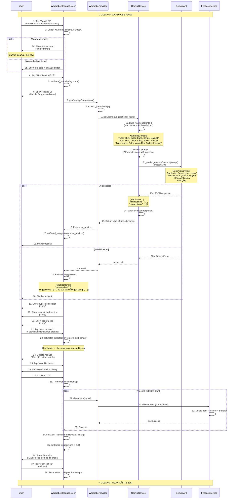
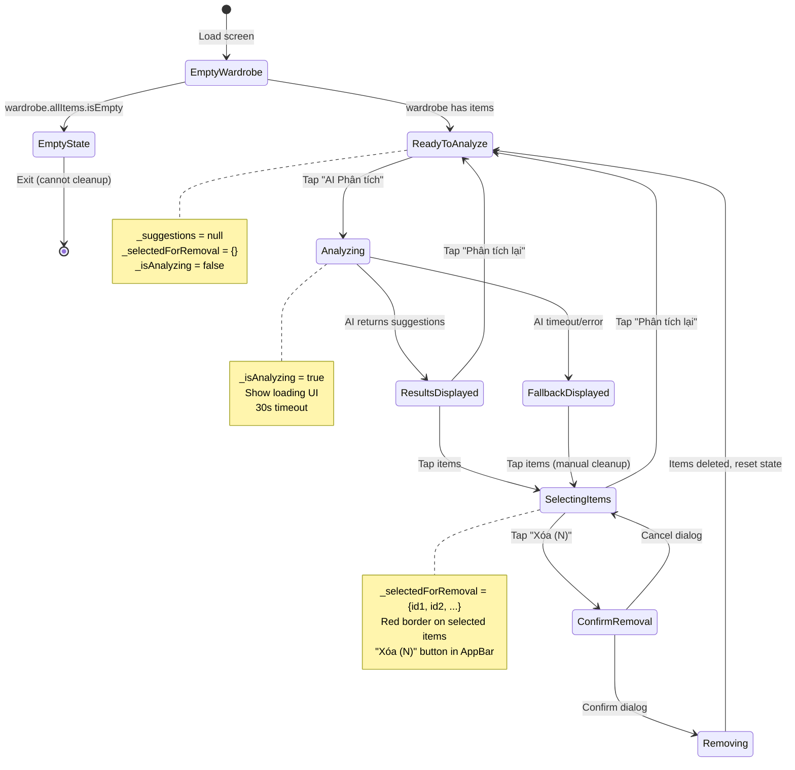

# Flow 16: Dọn Tủ Đồ (Cleanup Suggestions)

## 📋 Mục Lục
1. [Tổng Quan](#tổng-quan)
2. [Sơ Đồ Luồng](#sơ-đồ-luồng)
3. [Chi Tiết Kỹ Thuật](#chi-tiết-kỹ-thuật)
4. [Code Implementation](#code-implementation)
5. [AI Prompt & Detection Logic](#ai-prompt--detection-logic)
6. [Use Cases & Examples](#use-cases--examples)
7. [Flows Liên Quan](#flows-liên-quan)

---

## Tổng Quan

### Mục Đích
Flow này sử dụng **Gemini AI** để analyze toàn bộ wardrobe, identify items nên xóa/donate, và suggest cleanup actions. Giúp user optimize tủ đồ, loại bỏ duplicates, mismatched items, hoặc seasonal items không cần thiết.

### Trigger Points
1. **WardrobeCleanupScreen**: User navigate từ HomeScreen hoặc ProfileScreen
2. **Manual Tap**: User tap "Dọn tủ đồ" button
3. **Periodic Cleanup**: Suggest cleanup sau khi wardrobe quá lớn (>50 items)

### Input Data
- **Wardrobe Items**: Full list of ClothingItem với metadata (type, color, styles, seasons, wearCount)
- **Wardrobe Context**: AI-readable string với tất cả items description

### Output Data
- **Duplicates**: Array of duplicate groups với reason (VD: 2 áo trắng giống nhau)
- **Mismatched**: Array of items không fit với tủ đồ (VD: 1 áo formal giữa tủ casual)
- **Suggestions**: General tips để optimize wardrobe (VD: "Donate đồ không mặc trong 6 tháng")

### AI Detection Categories
```
1. Duplicates: Cùng type + similar color → Suggest keep 1, remove others
2. Mismatched Style: Item style khác biệt so với majority → Suggest remove
3. Seasonal Items: Items chỉ dùng 1 mùa nhưng chiếm space → Suggest store separately
```

---

## Sơ Đồ Luồng

### Flow Diagram


### State Diagram


---

## Chi Tiết Kỹ Thuật

### 1. Cleanup Suggestions Model

**Output Structure** (JSON from Gemini):
```json
{
  "duplicates": [
    {
      "ids": ["item_id_1", "item_id_2"],
      "reason": "Hai áo thun trắng giống nhau, nên giữ 1 và donate 1"
    }
  ],
  "mismatched": [
    {
      "id": "item_id_3",
      "reason": "Áo sơ mi formal không phù hợp với phong cách casual chủ đạo"
    }
  ],
  "suggestions": [
    "Tủ đồ của bạn có nhiều đồ casual, rất phù hợp phong cách hiện tại",
    "Hãy donate những món đồ không mặc trong 6 tháng qua",
    "Cân nhắc thêm vài món đồ basic màu trung tính để dễ phối"
  ]
}
```

**No Dedicated Model Class** - Use `Map<String, dynamic>` directly:
```dart
// wardrobe_cleanup_screen.dart
Map<String, dynamic>? _suggestions;

// Access data:
final duplicates = _suggestions!['duplicates'] as List? ?? [];
final mismatched = _suggestions!['mismatched'] as List? ?? [];
final tips = _suggestions!['suggestions'] as List? ?? [];
```

### 2. Screen State Management

**File**: `lib/screens/wardrobe_cleanup_screen.dart`
```dart
class _WardrobeCleanupScreenState extends State<WardrobeCleanupScreen> {
  bool _isAnalyzing = false;               // ← Loading state during AI analysis
  Map<String, dynamic>? _suggestions;      // ← AI response (duplicates, mismatched, tips)
  final Set<String> _selectedForRemoval = {};  // ← Item IDs user selected to delete

  // Helper getter (not used in code but useful)
  bool get _hasSelections => _selectedForRemoval.isNotEmpty;
}
```

**State Flow**:
1. **Initial**: `_suggestions = null, _selectedForRemoval = {}` → Show "AI Phân tích" button
2. **Analyzing**: `_isAnalyzing = true` → Show loading, button disabled
3. **Results**: `_suggestions != null` → Show duplicates/mismatched sections + manual cleanup
4. **Selecting**: User tap items → `_selectedForRemoval.add(itemId)` → Show "Xóa (N)" in AppBar
5. **Reset**: After deletion or "Phân tích lại" → `_suggestions = null, _selectedForRemoval.clear()`

### 3. Wardrobe Context Generation

**Purpose**: Convert List<ClothingItem> → AI-readable string

**Code** (in `gemini_service.dart`):
```dart
Future<Map<String, dynamic>?> getCleanupSuggestions(
  List<ClothingItem> wardrobe,
) async {
  if (wardrobe.isEmpty) {
    print('Wardrobe is empty');
    return null;
  }

  // Build wardrobe context
  final wardrobeContext = wardrobe
      .map((item) => item.toAIDescription())  // ← Each item to string
      .join('\n');  // ← Join with newline
  
  // Example output:
  // "Type: tshirt, Color: trắng, Material: cotton"
  // "Type: tshirt, Color: trắng, Material: cotton"
  // "Type: jeans, Color: xanh đậm, Material: denim"

  final prompt = AIPrompts.cleanupSuggestion(wardrobeContext);
  final response = await _model.generateContent([Content.text(prompt)])
      .timeout(AppConstants.aiTimeout);
  
  return safeParseJson(response.text);
}
```

**Item Description Format** (from Flow 13):
```dart
// ClothingItem.toAIDescription()
String toAIDescription() {
  return 'Type: ${type.name}, Color: $color, Material: ${material ?? "unknown"}';
}
```

---

## Code Implementation

### 1. Info Card (Intro UI)

```dart
Widget _buildInfoCard() {
  return Container(
    padding: const EdgeInsets.all(16),
    decoration: BoxDecoration(
      gradient: LinearGradient(
        colors: [
          AppTheme.warningColor.withValues(alpha: 0.1),
          AppTheme.warningColor.withValues(alpha: 0.05),
        ],
      ),
      borderRadius: BorderRadius.circular(16),
      border: Border.all(
        color: AppTheme.warningColor.withValues(alpha: 0.3),
      ),
    ),
    child: Row(
      children: [
        Container(
          padding: const EdgeInsets.all(12),
          decoration: BoxDecoration(
            color: AppTheme.warningColor,
            borderRadius: BorderRadius.circular(12),
          ),
          child: const Icon(
            Icons.cleaning_services,  // ← Broom icon
            color: Colors.white,
            size: 24,
          ),
        ),
        const SizedBox(width: 16),
        const Expanded(
          child: Column(
            crossAxisAlignment: CrossAxisAlignment.start,
            children: [
              Text(
                'Dọn dẹp thông minh',
                style: TextStyle(
                  fontWeight: FontWeight.w600,
                  fontSize: 16,
                ),
              ),
              SizedBox(height: 4),
              Text(
                'AI sẽ phân tích và gợi ý những món đồ nên bỏ hoặc donate',
                style: TextStyle(
                  color: AppTheme.textSecondary,
                  fontSize: 13,
                ),
              ),
            ],
          ),
        ),
      ],
    ),
  );
}
```

### 2. Analyze Button

```dart
if (_suggestions == null)  // ← Only show khi chưa analyze
  SizedBox(
    width: double.infinity,
    child: ElevatedButton.icon(
      onPressed: _isAnalyzing ? null : () => _analyzeWardrobe(wardrobe),
      icon: _isAnalyzing
          ? const SizedBox(
              width: 20,
              height: 20,
              child: CircularProgressIndicator(
                strokeWidth: 2,
                color: Colors.white,
              ),
            )
          : const Icon(Icons.auto_awesome),  // ← Sparkle icon
      label: Text(_isAnalyzing ? 'Đang phân tích...' : 'AI Phân tích tủ đồ'),
      style: ElevatedButton.styleFrom(
        padding: const EdgeInsets.symmetric(vertical: 16),
      ),
    ),
  ),
```

**Analysis Handler**:
```dart
Future<void> _analyzeWardrobe(WardrobeProvider wardrobe) async {
  setState(() => _isAnalyzing = true);

  try {
    final suggestions = await wardrobe.getCleanupSuggestions();
    
    if (suggestions != null) {
      setState(() => _suggestions = suggestions);
    } else {
      // ======== FALLBACK SUGGESTIONS ========
      // Nếu AI fail (API key missing, timeout, etc.), show generic tips
      setState(() {
        _suggestions = {
          'duplicates': [],
          'mismatched': [],
          'suggestions': [
            'Tủ đồ của bạn khá gọn gàng!',
            'Hãy xem xét donate những món đồ không mặc trong 6 tháng qua.',
            'Giữ tủ đồ với những item đa năng, dễ phối.',
          ],
        };
      });
    }
  } catch (e) {
    if (mounted) {
      ScaffoldMessenger.of(context).showSnackBar(
        SnackBar(content: Text('Lỗi: $e')),
      );
    }
  } finally {
    setState(() => _isAnalyzing = false);
  }
}
```

### 3. Duplicates Section

**UI**: Show pairs/groups of duplicate items
```dart
if (duplicates.isNotEmpty) ...[
  const SizedBox(height: 24),
  _buildSectionTitle('🔄 Đồ trùng lặp', duplicates.length),  // ← "🔄 Đồ trùng lặp (2)"
  const SizedBox(height: 12),
  
  ...duplicates.map((dup) {
    final ids = (dup['ids'] as List?)?.cast<String>() ?? [];
    final reason = dup['reason'] as String? ?? '';
    
    // Fetch actual items from wardrobe
    final items = ids
        .map((id) => wardrobe.allItems.where((i) => i.id == id).firstOrNull)
        .where((i) => i != null)
        .cast<ClothingItem>()
        .toList();

    if (items.isEmpty) return const SizedBox.shrink();

    return Container(
      margin: const EdgeInsets.only(bottom: 12),
      padding: const EdgeInsets.all(12),
      decoration: BoxDecoration(
        color: Colors.white,
        borderRadius: BorderRadius.circular(12),
        boxShadow: [
          BoxShadow(
            color: Colors.black.withValues(alpha: 0.05),
            blurRadius: 8,
          ),
        ],
      ),
      child: Column(
        crossAxisAlignment: CrossAxisAlignment.start,
        children: [
          // Show duplicate items side-by-side
          Row(
            children: items.map((item) => Expanded(
              child: Padding(
                padding: const EdgeInsets.symmetric(horizontal: 4),
                child: _buildSelectableItem(item),  // ← Selectable item widget
              ),
            )).toList(),
          ),
          
          // Reason explanation
          if (reason.isNotEmpty) ...[
            const SizedBox(height: 8),
            Text(
              reason,  // ← "Hai áo thun trắng giống nhau, nên giữ 1 và donate 1"
              style: const TextStyle(
                color: AppTheme.textSecondary,
                fontSize: 13,
              ),
            ),
          ],
        ],
      ),
    );
  }),
]
```

### 4. Mismatched Section

**UI**: Show single items that don't fit wardrobe style
```dart
if (mismatched.isNotEmpty) ...[
  const SizedBox(height: 24),
  _buildSectionTitle('⚠️ Đồ không phù hợp', mismatched.length),
  const SizedBox(height: 12),
  
  ...mismatched.map((mis) {
    final id = mis['id'] as String? ?? '';
    final reason = mis['reason'] as String? ?? '';
    final item = wardrobe.allItems.where((i) => i.id == id).firstOrNull;

    if (item == null) return const SizedBox.shrink();

    return Container(
      margin: const EdgeInsets.only(bottom: 12),
      padding: const EdgeInsets.all(12),
      decoration: BoxDecoration(
        color: Colors.white,
        borderRadius: BorderRadius.circular(12),
      ),
      child: Row(
        children: [
          // Item thumbnail
          SizedBox(
            width: 80,
            height: 80,
            child: _buildSelectableItem(item),
          ),
          const SizedBox(width: 12),
          
          // Item info + reason
          Expanded(
            child: Column(
              crossAxisAlignment: CrossAxisAlignment.start,
              children: [
                Text(
                  item.type.displayName,  // ← "Áo sơ mi"
                  style: const TextStyle(fontWeight: FontWeight.w600),
                ),
                const SizedBox(height: 4),
                Text(
                  reason,  // ← "Áo sơ mi formal không phù hợp với phong cách casual chủ đạo"
                  style: const TextStyle(
                    color: AppTheme.textSecondary,
                    fontSize: 13,
                  ),
                ),
              ],
            ),
          ),
        ],
      ),
    );
  }),
]
```

### 5. General Tips Section

```dart
if (tips.isNotEmpty) ...[
  const SizedBox(height: 24),
  _buildSectionTitle('💡 Gợi ý', tips.length),
  const SizedBox(height: 12),
  
  Container(
    padding: const EdgeInsets.all(16),
    decoration: BoxDecoration(
      color: Colors.white,
      borderRadius: BorderRadius.circular(12),
    ),
    child: Column(
      children: tips.map((tip) => Padding(
        padding: const EdgeInsets.only(bottom: 8),
        child: Row(
          crossAxisAlignment: CrossAxisAlignment.start,
          children: [
            const Icon(
              Icons.lightbulb_outline,
              color: AppTheme.warningColor,
              size: 20,
            ),
            const SizedBox(width: 8),
            Expanded(
              child: Text(
                tip.toString(),  // ← "Hãy donate những món đồ không mặc trong 6 tháng qua"
                style: const TextStyle(height: 1.4),
              ),
            ),
          ],
        ),
      )).toList(),
    ),
  ),
]
```

### 6. Selectable Item Widget

**Purpose**: Display item with selection state (red border + checkmark)
```dart
Widget _buildSelectableItem(ClothingItem item) {
  final isSelected = _selectedForRemoval.contains(item.id);

  return GestureDetector(
    onTap: () {
      setState(() {
        if (isSelected) {
          _selectedForRemoval.remove(item.id);  // ← Deselect
        } else {
          _selectedForRemoval.add(item.id);     // ← Select
        }
      });
    },
    child: Stack(
      children: [
        // Item image
        ClipRRect(
          borderRadius: BorderRadius.circular(8),
          child: AspectRatio(
            aspectRatio: 1,
            child: ClothingImage(
              item: item,
              fit: BoxFit.cover,
            ),
          ),
        ),
        
        // Red border khi selected
        Positioned.fill(
          child: Container(
            decoration: BoxDecoration(
              borderRadius: BorderRadius.circular(8),
              border: Border.all(
                color: isSelected ? AppTheme.errorColor : Colors.transparent,
                width: 3,  // ← Thick red border
              ),
            ),
          ),
        ),
        
        // Checkmark badge
        if (isSelected)
          Positioned(
            top: 4,
            right: 4,
            child: Container(
              padding: const EdgeInsets.all(2),
              decoration: const BoxDecoration(
                color: AppTheme.errorColor,
                shape: BoxShape.circle,
              ),
              child: const Icon(
                Icons.check,
                color: Colors.white,
                size: 16,
              ),
            ),
          ),
      ],
    ),
  );
}
```

### 7. AppBar Delete Button

**UI**: Show "Xóa (N)" button khi có selections
```dart
Scaffold(
  appBar: AppBar(
    title: const Text('Dọn tủ đồ'),
    actions: [
      // Delete selected button
      if (_selectedForRemoval.isNotEmpty)
        TextButton.icon(
          onPressed: _confirmRemoval,
          icon: const Icon(Icons.delete_outline, color: AppTheme.errorColor),
          label: Text(
            'Xóa (${_selectedForRemoval.length})',  // ← "Xóa (3)"
            style: const TextStyle(color: AppTheme.errorColor),
          ),
        ),
      
      // Delete all button (nuclear option)
      IconButton(
        onPressed: () => _showDeleteAllDialog(context),
        icon: const Icon(Icons.delete_forever, color: AppTheme.errorColor),
        tooltip: 'Xóa tất cả',
      ),
    ],
  ),
)
```

### 8. Confirm Removal Dialog

```dart
void _confirmRemoval() {
  showDialog(
    context: context,
    builder: (context) => AlertDialog(
      shape: RoundedRectangleBorder(
        borderRadius: BorderRadius.circular(20),
      ),
      title: const Text('Xác nhận xóa'),
      content: Text(
        'Bạn có chắc muốn xóa ${_selectedForRemoval.length} món đồ khỏi tủ?\n\n'
        'Hành động này không thể hoàn tác.',
      ),
      actions: [
        TextButton(
          onPressed: () => Navigator.pop(context),
          child: const Text('Hủy'),
        ),
        ElevatedButton(
          onPressed: () async {
            Navigator.pop(context);
            await _removeSelectedItems();
          },
          style: ElevatedButton.styleFrom(
            backgroundColor: AppTheme.errorColor,
          ),
          child: const Text('Xóa'),
        ),
      ],
    ),
  );
}
```

### 9. Delete Selected Items Handler

```dart
Future<void> _removeSelectedItems() async {
  final wardrobe = context.read<WardrobeProvider>();
  
  // Delete each selected item
  for (final id in _selectedForRemoval) {
    await wardrobe.deleteItem(id);  // ← Flow 10: Delete Item
  }

  // Reset state
  setState(() {
    _selectedForRemoval.clear();
    _suggestions = null;  // ← Force re-analyze if user wants
  });

  // Show success feedback
  if (mounted) {
    ScaffoldMessenger.of(context).showSnackBar(
      const SnackBar(
        content: Text('Đã xóa các món đồ đã chọn'),
        backgroundColor: AppTheme.successColor,
      ),
    );
  }
}
```

### 10. Manual Cleanup Section

**Purpose**: Hiển thị tất cả items by type để user tự select (không cần AI)
```dart
Widget _buildManualCleanupSection(WardrobeProvider wardrobe) {
  final itemsByType = wardrobe.itemsByType;  // ← Map<ClothingType, List<ClothingItem>>

  return Column(
    crossAxisAlignment: CrossAxisAlignment.start,
    children: [
      const Text(
        'Dọn dẹp thủ công',
        style: TextStyle(fontSize: 18, fontWeight: FontWeight.w600),
      ),
      const SizedBox(height: 8),
      const Text(
        'Chọn những món đồ bạn muốn bỏ',
        style: TextStyle(color: AppTheme.textSecondary, fontSize: 14),
      ),
      const SizedBox(height: 16),

      // Items grid grouped by type
      ...itemsByType.entries.map((entry) {
        final type = entry.key;
        final items = entry.value;

        return Column(
          crossAxisAlignment: CrossAxisAlignment.start,
          children: [
            Padding(
              padding: const EdgeInsets.symmetric(vertical: 8),
              child: Text(
                '${type.displayName} (${items.length})',  // ← "Áo thun (5)"
                style: const TextStyle(fontWeight: FontWeight.w500),
              ),
            ),
            
            // Grid of items
            GridView.builder(
              shrinkWrap: true,
              physics: const NeverScrollableScrollPhysics(),
              gridDelegate: const SliverGridDelegateWithFixedCrossAxisCount(
                crossAxisCount: 4,  // ← 4 items per row
                crossAxisSpacing: 8,
                mainAxisSpacing: 8,
                childAspectRatio: 1,
              ),
              itemCount: items.length,
              itemBuilder: (context, index) {
                return _buildSelectableItem(items[index]);
              },
            ),
            const SizedBox(height: 16),
          ],
        );
      }),
    ],
  );
}
```

---

## AI Prompt & Detection Logic

### Cleanup Suggestion Prompt

**File**: `lib/utils/constants.dart`
```dart
static String cleanupSuggestion(String wardrobeContext) {
  return '''
As a wardrobe organization expert, analyze this wardrobe and suggest items that could be removed or donated.

WARDROBE ITEMS:
$wardrobeContext

Identify:
1. Duplicate items (same type and similar color)
2. Items that don't match any style in the wardrobe
3. Seasonal items that may not be needed

Return ONLY a valid JSON object:
{
  "duplicates": [
    {"ids": ["id1", "id2"], "reason": "Why they're duplicates in Vietnamese"}
  ],
  "mismatched": [
    {"id": "item_id", "reason": "Why it doesn't fit in Vietnamese"}
  ],
  "suggestions": ["General tip 1 in Vietnamese", "General tip 2 in Vietnamese"]
}

Return ONLY the JSON. No markdown, no extra text.
''';
}
```

**Wardrobe Context Example**:
```
Type: tshirt, Color: trắng, Material: cotton
Type: tshirt, Color: trắng, Material: cotton
Type: jeans, Color: xanh đậm, Material: denim
Type: shirt, Color: đen, Material: polyester
Type: dress, Color: hồng, Material: silk
```

**AI Response Example**:
```json
{
  "duplicates": [
    {
      "ids": ["item_123", "item_456"],
      "reason": "Hai áo thun trắng cotton giống hệt nhau. Nên giữ 1 và donate 1 để giảm bớt tủ đồ."
    }
  ],
  "mismatched": [
    {
      "id": "item_789",
      "reason": "Váy hồng silk là item formal, không phù hợp với tủ đồ casual chủ yếu gồm áo thun và jeans."
    }
  ],
  "suggestions": [
    "Tủ đồ của bạn có phong cách casual rất nhất quán, rất tốt!",
    "Hãy xem xét donate hoặc store riêng váy hồng vì ít dùng trong daily outfit.",
    "Có thể giữ 1 trong 2 áo thun trắng để tiết kiệm không gian."
  ]
}
```

### AI Detection Categories

#### 1. Duplicates (Đồ Trùng Lặp)
**Logic**: Same type + similar color → Suggest keep 1
```
Example:
- Item A: tshirt, trắng
- Item B: tshirt, trắng
→ Duplicate detected

AI suggests:
"Hai áo thun trắng giống nhau, nên giữ 1 và donate 1"
```

#### 2. Mismatched (Đồ Không Phù Hợp)
**Logic**: Item style khác biệt so với majority
```
Example:
Wardrobe: 10 casual items (tshirt, jeans)
Item X: formal shirt, polyester
→ Mismatched detected

AI suggests:
"Áo sơ mi formal không phù hợp với phong cách casual chủ đạo"
```

#### 3. Seasonal Items (Đồ Theo Mùa)
**Logic**: Items chỉ dùng 1 mùa nhưng chiếm space
```
Example:
Item: jacket, wool, seasons: [winter]
Current location: Vietnam (hot climate)
→ Seasonal item detected

AI suggests:
"Áo khoác len chỉ dùng mùa đông, cân nhắc store riêng hoặc donate"
```

**Note**: Flow này chưa integrate weather/location, nên seasonal detection dựa vào seasons field trong ClothingItem.

---

## Use Cases & Examples

### Use Case 1: Tủ Có 2 Áo Trắng Giống Nhau
**Input**:
- Item 1: Áo thun trắng, cotton, casual
- Item 2: Áo thun trắng, cotton, casual
- Total: 10 items

**AI Response**:
```json
{
  "duplicates": [
    {
      "ids": ["item_1", "item_2"],
      "reason": "Hai áo thun trắng cotton hoàn toàn giống nhau. Bạn nên giữ 1 và donate hoặc bỏ 1 để tối ưu không gian tủ đồ."
    }
  ],
  "mismatched": [],
  "suggestions": [
    "Tủ đồ của bạn khá gọn gàng!",
    "Hãy giữ những item đa năng như áo thun trắng (nhưng không cần 2 cái giống hệt).",
  ]
}
```

**UI Display**:
- Section "🔄 Đồ trùng lặp (1)"
- Card showing 2 áo thun side-by-side
- Reason: "Hai áo thun trắng cotton..."
- User select 1 áo → Tap "Xóa (1)" → Confirm → Deleted

**Time**: ~6 giây (AI analysis) + 2 giây (user select + delete)

### Use Case 2: Tủ Casual Có 1 Áo Formal
**Input**:
- 8 casual items (tshirt, jeans, hoodie)
- 1 formal item (áo sơ mi đen, polyester)
- Total: 9 items

**AI Response**:
```json
{
  "duplicates": [],
  "mismatched": [
    {
      "id": "shirt_formal_123",
      "reason": "Áo sơ mi đen formal style không phù hợp với tủ đồ casual chủ yếu gồm áo thun, jeans, và hoodie. Nếu bạn ít dự sự kiện formal, nên donate để tập trung vào casual style."
    }
  ],
  "suggestions": [
    "Tủ đồ của bạn có phong cách casual rất nhất quán.",
    "Nếu không thường xuyên cần áo formal, hãy donate hoặc store riêng.",
    "Thêm vài món đồ basic màu trung tính để dễ phối hơn."
  ]
}
```

**UI Display**:
- Section "⚠️ Đồ không phù hợp (1)"
- Card showing áo sơ mi thumbnail + reason
- User select áo → Delete → Tủ đồ giờ 100% casual

### Use Case 3: Tủ Đã Optimize (Không Có Suggestions)
**Input**:
- 5 diverse items (áo, quần, váy, jacket)
- No duplicates, no mismatched styles
- Total: 5 items

**AI Response**:
```json
{
  "duplicates": [],
  "mismatched": [],
  "suggestions": [
    "Tủ đồ của bạn rất cân bằng và gọn gàng!",
    "Mỗi món đồ đều có vai trò riêng, không thừa thãi.",
    "Hãy tiếp tục maintain số lượng items ở mức vừa phải để dễ quản lý."
  ]
}
```

**UI Display**:
- Section "💡 Gợi ý (3)"
- Show 3 tips với lightbulb icon
- User thấy tủ đồ OK, không cần delete gì

---

## Flows Liên Quan

### Flow 10: Delete Item
**Liên kết**: Cleanup flow → Select items → Call deleteItem()
```dart
// wardrobe_cleanup_screen.dart
Future<void> _removeSelectedItems() async {
  for (final id in _selectedForRemoval) {
    await wardrobe.deleteItem(id);  // ← Flow 10
  }
}
```

**Flow 10** handles:
- Delete from Firestore
- Delete image from Storage
- Update local state (_items.removeWhere)
- Notify listeners

### Flow 13: AI Analyze Image
**Liên kết**: Color detection để identify duplicates
- Flow 13 analyze: `color: "trắng"` (accurate Vietnamese)
- Flow 16 compare: "trắng" == "trắng" → Duplicate detected
- Better color accuracy → Better duplicate detection

### Flow 12: Filter Items
**Liên kết**: Manual cleanup section uses itemsByType
```dart
// wardrobe_provider.dart
Map<ClothingType, List<ClothingItem>> get itemsByType {
  final map = <ClothingType, List<ClothingItem>>{};
  for (final item in _items) {
    map.putIfAbsent(item.type, () => []).add(item);
  }
  return map;
}
```

Used in:
- Flow 12: Filter by type → GridView items
- Flow 16: Manual cleanup section → Group items by type

---

## Tóm Tắt Technical

### Key Takeaways
1. **AI Model**: Gemini 2.0 Flash (text-based wardrobe analysis)
2. **Input**: Full wardrobe context (all items → AI description strings)
3. **Output**: Duplicates (IDs + reason), Mismatched (ID + reason), Suggestions (tips array)
4. **Response Time**: ~6-8 giây (longer than other flows vì analyze full wardrobe)
5. **Fallback**: Generic tips nếu AI fail (app vẫn usable với manual cleanup)

### UX Highlights
- ✅ Visual item selection (tap → red border + checkmark)
- ✅ Grouped display (duplicates side-by-side, mismatched with reason)
- ✅ Manual cleanup option (no AI needed, user tự select by type)
- ✅ "Xóa (N)" button in AppBar (clear count of selections)
- ✅ Confirm dialog (prevent accidental deletions)
- ✅ "Phân tích lại" button (re-analyze after changes)

### Cleanup Categories
1. 🔄 **Duplicates**: Same type + similar color → Suggest keep 1
2. ⚠️ **Mismatched**: Different style from majority → Suggest remove
3. 💡 **General Tips**: Actionable advice (donate unused, keep versatile items)

### Future Enhancements
1. **Wear Count Integration**: Suggest remove items với wearCount = 0 (never worn)
2. **Last Worn Filter**: Suggest donate items not worn in 6+ months
3. **Seasonal Intelligence**: Detect items không match climate (VD: winter coat in Vietnam)
4. **Batch Selection**: "Chọn tất cả duplicates" button for faster cleanup
5. **Undo Delete**: Temporary trash bin trước khi permanent delete

---

**Kết luận**: Flow 16 Cleanup Wardrobe là **optimization tool** giúp user maintain tủ đồ gọn gàng. AI detect duplicates/mismatched, user select items to delete, confirm → Items removed from Firestore/Storage. Có fallback manual cleanup nếu AI fail. Response time ~6-8s acceptable, UI clear với red borders + checkmarks. 🧹✨

