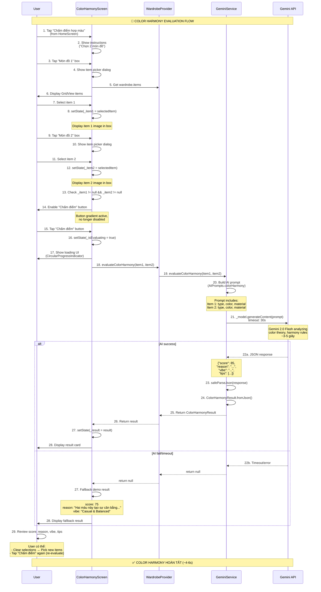
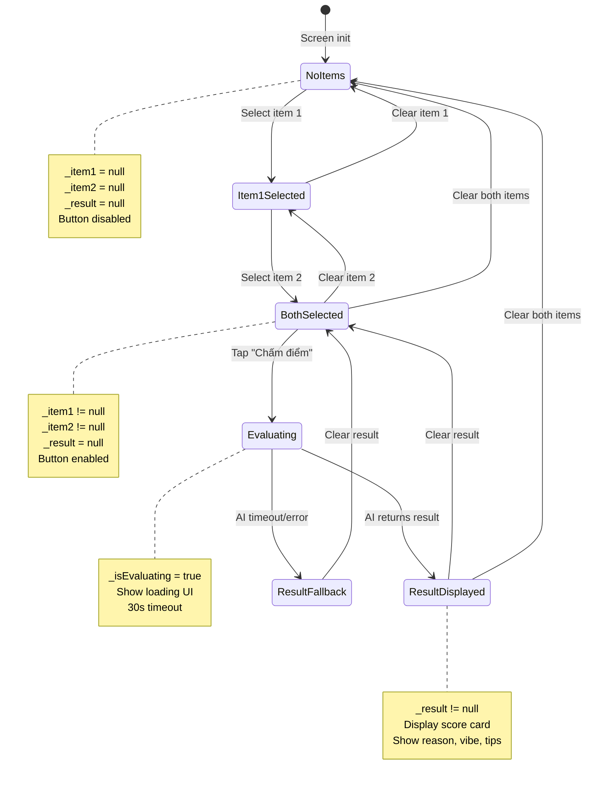

# Flow 15: Chấm Điểm Color Harmony (Hợp Màu)

## 📋 Mục Lục
1. [Tổng Quan](#tổng-quan)
2. [Sơ Đồ Luồng](#sơ-đồ-luồng)
3. [Chi Tiết Kỹ Thuật](#chi-tiết-kỹ-thuật)
4. [Code Implementation](#code-implementation)
5. [AI Prompt & Scoring System](#ai-prompt--scoring-system)
6. [Use Cases & Examples](#use-cases--examples)
7. [Flows Liên Quan](#flows-liên-quan)

---

## Tổng Quan

### Mục Đích
Flow này sử dụng **Gemini AI** để đánh giá độ hài hòa màu sắc (color harmony) giữa 2 clothing items. User chọn 2 món đồ → AI analyze color combination → Trả về score (0-100), lý do, vibe aesthetic, và tips styling.

### Trigger Points
1. **ColorHarmonyScreen**: User navigate từ HomeScreen
2. **Manual Selection**: User tap 2 items từ wardrobe
3. **Learning Tool**: User muốn học color theory

### Input Data
- **Item 1**: ClothingItem với color, type, material
- **Item 2**: ClothingItem với color, type, material

### Output Data
- **Score**: 0-100 (color harmony rating)
- **Reason**: Giải thích tại sao 2 màu hợp/không hợp (Vietnamese)
- **Vibe**: Overall aesthetic (VD: "Classic & Elegant", "Bold & Modern")
- **Tips**: 2-3 styling tips để improve combination

### Scoring System
```
90-100: Perfect harmony, trending combination
70-89:  Good match, works well together
50-69:  Acceptable, could be improved
30-49:  Clashing, not recommended
0-29:   Very poor combination
```

---

## Sơ Đồ Luồng

### Flow Diagram


### State Diagram


---

## Chi Tiết Kỹ Thuật

### 1. Color Harmony Model

**File**: `lib/models/outfit.dart`
```dart
class ColorHarmonyResult {
  final int score;          // ← 0-100 rating
  final String reason;      // ← Vietnamese explanation
  final String vibe;        // ← Aesthetic description
  final List<String> tips;  // ← Styling suggestions

  ColorHarmonyResult({
    required this.score,
    required this.reason,
    required this.vibe,
    this.tips = const [],
  });

  factory ColorHarmonyResult.fromJson(Map<String, dynamic> json) {
    return ColorHarmonyResult(
      score: json['score'] ?? 50,  // ← Default neutral score
      reason: json['reason'] ?? 'Không có thông tin',
      vibe: json['vibe'] ?? 'Neutral',
      tips: (json['tips'] as List<dynamic>?)?.cast<String>() ?? [],
    );
  }
}
```

**Giải thích**:
- **score**: Integer 0-100 cho dễ hiểu (không dùng float như 8.5/10)
- **reason**: Vietnamese explanation để user học color theory
- **vibe**: Aesthetic keyword (VD: "Vintage & Retro", "Minimalist & Clean")
- **tips**: Array of actionable suggestions (2-3 items)

### 2. Screen State Management

**File**: `lib/screens/color_harmony_screen.dart`
```dart
class _ColorHarmonyScreenState extends State<ColorHarmonyScreen> {
  ClothingItem? _item1;           // ← Selected item 1
  ClothingItem? _item2;           // ← Selected item 2
  bool _isEvaluating = false;     // ← Loading state
  ColorHarmonyResult? _result;    // ← AI evaluation result

  // Button enabled condition
  bool get _canEvaluate => _item1 != null && _item2 != null && !_isEvaluating;
}
```

**State Flow**:
1. **Initial**: `_item1 = null, _item2 = null` → Button disabled
2. **Item 1 selected**: `_item1 != null` → Still disabled
3. **Item 2 selected**: `_item1 != null, _item2 != null` → Button enabled
4. **Evaluating**: `_isEvaluating = true` → Button disabled, show loading
5. **Result**: `_result != null` → Display result card

### 3. Item Picker Dialog

**UI**: Show GridView của wardrobe items
```dart
Future<ClothingItem?> _showItemPicker(String title) async {
  return showDialog<ClothingItem>(
    context: context,
    builder: (context) => AlertDialog(
      title: Text(title),  // ← "Chọn món đồ 1" or "Chọn món đồ 2"
      content: SizedBox(
        width: double.maxFinite,
        height: 400,
        child: Consumer<WardrobeProvider>(
          builder: (context, wardrobe, _) {
            final items = wardrobe.items;  // ← Lấy từ provider
            
            return GridView.builder(
              gridDelegate: SliverGridDelegateWithFixedCrossAxisCount(
                crossAxisCount: 2,
                childAspectRatio: 0.75,
                crossAxisSpacing: 12,
                mainAxisSpacing: 12,
              ),
              itemCount: items.length,
              itemBuilder: (context, index) {
                final item = items[index];
                return GestureDetector(
                  onTap: () => Navigator.pop(context, item),  // ← Return selected item
                  child: ClothingCard(
                    item: item,
                    showFavorite: false,
                  ),
                );
              },
            );
          },
        ),
      ),
    ),
  );
}
```

**Usage**:
```dart
// When user tap "Món đồ 1" box
final item = await _showItemPicker('Chọn món đồ 1');
if (item != null) {
  setState(() {
    _item1 = item;
    _result = null;  // ← Clear previous result
  });
}
```

---

## Code Implementation

### 1. Item Selection Boxes

**UI**: 2 boxes side-by-side
```dart
Row(
  children: [
    // Item 1 box
    Expanded(
      child: _buildItemBox(
        label: 'Món đồ 1',
        item: _item1,
        onTap: () async {
          final item = await _showItemPicker('Chọn món đồ 1');
          if (item != null) {
            setState(() {
              _item1 = item;
              _result = null;  // ← Reset result khi change item
            });
          }
        },
      ),
    ),
    
    SizedBox(width: 16),
    
    // Item 2 box
    Expanded(
      child: _buildItemBox(
        label: 'Món đồ 2',
        item: _item2,
        onTap: () async {
          final item = await _showItemPicker('Chọn món đồ 2');
          if (item != null) {
            setState(() {
              _item2 = item;
              _result = null;
            });
          }
        },
      ),
    ),
  ],
)
```

**Item Box Widget**:
```dart
Widget _buildItemBox({
  required String label,
  required ClothingItem? item,
  required VoidCallback onTap,
}) {
  return GestureDetector(
    onTap: onTap,
    child: Container(
      height: 200,
      decoration: BoxDecoration(
        color: Colors.white,
        borderRadius: BorderRadius.circular(16),
        border: Border.all(
          color: item != null ? AppTheme.primaryColor : Colors.grey.shade300,
          width: item != null ? 2 : 1,  // ← Thicker border khi selected
        ),
      ),
      child: item == null
          ? _buildEmptyBox(label)  // ← Placeholder
          : _buildSelectedItem(item, label),  // ← Item image + type
    ),
  );
}
```

**Empty Box Placeholder**:
```dart
Widget _buildEmptyBox(String label) {
  return Column(
    mainAxisAlignment: MainAxisAlignment.center,
    children: [
      Icon(Icons.add_circle_outline, size: 40, color: Colors.grey.shade400),
      SizedBox(height: 8),
      Text(label, style: TextStyle(color: Colors.grey.shade600)),
    ],
  );
}
```

**Selected Item Display**:
```dart
Widget _buildSelectedItem(ClothingItem item, String label) {
  return Stack(
    children: [
      // Item image
      ClipRRect(
        borderRadius: BorderRadius.circular(14),
        child: ClothingImage(item: item, fit: BoxFit.cover),
      ),
      
      // Type label at bottom
      Positioned(
        bottom: 0,
        left: 0,
        right: 0,
        child: Container(
          padding: EdgeInsets.all(8),
          decoration: BoxDecoration(
            gradient: LinearGradient(
              begin: Alignment.topCenter,
              end: Alignment.bottomCenter,
              colors: [Colors.transparent, Colors.black.withOpacity(0.7)],
            ),
          ),
          child: Text(
            item.type.displayName,
            style: TextStyle(color: Colors.white, fontWeight: FontWeight.w600),
          ),
        ),
      ),
      
      // Clear button (X)
      Positioned(
        top: 8,
        right: 8,
        child: GestureDetector(
          onTap: () {
            setState(() {
              if (label == 'Món đồ 1') {
                _item1 = null;
              } else {
                _item2 = null;
              }
              _result = null;
            });
          },
          child: Container(
            padding: EdgeInsets.all(4),
            decoration: BoxDecoration(color: Colors.white, shape: BoxShape.circle),
            child: Icon(Icons.close, size: 16),
          ),
        ),
      ),
    ],
  );
}
```

### 2. Evaluate Button

```dart
SizedBox(
  width: double.infinity,
  child: ElevatedButton.icon(
    onPressed: _canEvaluate ? _evaluateHarmony : null,  // ← Disabled if not ready
    icon: _isEvaluating
        ? SizedBox(
            width: 20,
            height: 20,
            child: CircularProgressIndicator(strokeWidth: 2, color: Colors.white),
          )
        : Icon(Icons.auto_awesome),
    label: Text(_isEvaluating ? 'Đang phân tích...' : 'Chấm điểm'),
    style: ElevatedButton.styleFrom(
      padding: EdgeInsets.symmetric(vertical: 16),
      disabledBackgroundColor: Colors.grey.shade300,  // ← Visual feedback
    ),
  ),
)
```

**Evaluation Handler**:
```dart
Future<void> _evaluateHarmony() async {
  if (!_canEvaluate) return;

  setState(() {
    _isEvaluating = true;
    _result = null;  // ← Clear old result
  });

  try {
    final wardrobeProvider = context.read<WardrobeProvider>();
    final result = await wardrobeProvider.evaluateColorHarmony(_item1!, _item2!);

    if (result != null) {
      setState(() => _result = result);
    } else {
      // ======== FALLBACK DEMO RESULT ========
      // Nếu AI fail (API key missing, timeout, etc.), show demo result
      setState(() {
        _result = ColorHarmonyResult(
          score: 75,
          reason: 'Hai màu này tạo nên sự cân bằng tốt. '
                  '${_item1!.color} và ${_item2!.color} bổ trợ cho nhau.',
          vibe: 'Casual & Balanced',
          tips: [
            'Có thể thêm phụ kiện màu trung tính',
            'Phù hợp cho các dịp đi chơi, cafe',
          ],
        );
      });
    }
  } catch (e) {
    ScaffoldMessenger.of(context).showSnackBar(
      SnackBar(content: Text('Lỗi: $e')),
    );
  } finally {
    setState(() => _isEvaluating = false);
  }
}
```

### 3. Result Display Card

```dart
if (_result != null) ...[
  Container(
    padding: EdgeInsets.all(20),
    decoration: BoxDecoration(
      gradient: LinearGradient(
        colors: [
          _getScoreColor().withOpacity(0.1),
          Colors.white,
        ],
      ),
      borderRadius: BorderRadius.circular(20),
      border: Border.all(color: _getScoreColor(), width: 2),
    ),
    child: Column(
      children: [
        // ======== SCORE CIRCLE ========
        Container(
          width: 100,
          height: 100,
          decoration: BoxDecoration(
            shape: BoxShape.circle,
            gradient: RadialGradient(
              colors: [
                _getScoreColor(),
                _getScoreColor().withOpacity(0.7),
              ],
            ),
          ),
          child: Center(
            child: Text(
              '${_result!.score}',
              style: TextStyle(
                fontSize: 40,
                fontWeight: FontWeight.bold,
                color: Colors.white,
              ),
            ),
          ),
        ),
        
        SizedBox(height: 16),
        
        // ======== SCORE LABEL ========
        Text(
          _getScoreLabel(_result!.score),
          style: TextStyle(
            fontSize: 18,
            fontWeight: FontWeight.w600,
            color: _getScoreColor(),
          ),
        ),
        
        SizedBox(height: 8),
        
        // ======== VIBE ========
        Text(
          _result!.vibe,
          style: TextStyle(
            fontSize: 14,
            color: AppTheme.textSecondary,
            fontStyle: FontStyle.italic,
          ),
        ),
        
        SizedBox(height: 16),
        Divider(),
        SizedBox(height: 16),
        
        // ======== REASON ========
        Row(
          crossAxisAlignment: CrossAxisAlignment.start,
          children: [
            Icon(Icons.lightbulb_outline, color: AppTheme.accentColor),
            SizedBox(width: 12),
            Expanded(
              child: Text(
                _result!.reason,
                style: TextStyle(fontSize: 15, height: 1.5),
              ),
            ),
          ],
        ),
        
        // ======== TIPS ========
        if (_result!.tips.isNotEmpty) ...[
          SizedBox(height: 16),
          Align(
            alignment: Alignment.centerLeft,
            child: Text(
              'Gợi ý styling:',
              style: TextStyle(fontWeight: FontWeight.w600),
            ),
          ),
          SizedBox(height: 8),
          ..._result!.tips.map((tip) => Padding(
            padding: EdgeInsets.only(bottom: 8),
            child: Row(
              crossAxisAlignment: CrossAxisAlignment.start,
              children: [
                Icon(Icons.check_circle, size: 16, color: AppTheme.successColor),
                SizedBox(width: 8),
                Expanded(child: Text(tip)),
              ],
            ),
          )),
        ],
      ],
    ),
  ),
]
```

**Helper Methods**:
```dart
Color _getScoreColor() {
  if (_result!.score >= 90) return Colors.green;
  if (_result!.score >= 70) return Colors.blue;
  if (_result!.score >= 50) return Colors.orange;
  return Colors.red;
}

String _getScoreLabel(int score) {
  if (score >= 90) return 'Hoàn hảo!';
  if (score >= 70) return 'Hợp màu tốt';
  if (score >= 50) return 'Chấp nhận được';
  if (score >= 30) return 'Không nên kết hợp';
  return 'Xung đột màu sắc';
}
```

---

## AI Prompt & Scoring System

### Color Harmony Prompt

**File**: `lib/utils/constants.dart`
```dart
static String colorHarmony(String item1Desc, String item2Desc) {
  return '''
As a color theory expert, evaluate the color harmony between these two clothing items:

Item 1: $item1Desc
Item 2: $item2Desc

Return ONLY a valid JSON object:
{
  "score": 0-100,
  "reason": "Explanation in Vietnamese why these colors work or don't work together",
  "vibe": "The overall aesthetic vibe (e.g., 'Classic & Elegant', 'Bold & Modern', 'Earthy & Natural')",
  "tips": ["Tip 1 in Vietnamese", "Tip 2 in Vietnamese"]
}

Scoring guide:
- 90-100: Perfect harmony, trending combination
- 70-89:  Good match, works well together
- 50-69:  Acceptable, could be improved
- 30-49:  Clashing, not recommended
- 0-29:   Very poor combination

Return ONLY the JSON. No markdown, no extra text.
''';
}
```

**Item Description Example**:
```dart
// ClothingItem.toAIDescription() method
String toAIDescription() {
  return 'Type: ${type.name}, Color: $color, Material: ${material ?? "unknown"}';
}

// Example output:
// "Type: tshirt, Color: trắng, Material: cotton"
// "Type: jeans, Color: xanh đậm, Material: denim"
```

**AI Response Example**:
```json
{
  "score": 85,
  "reason": "Trắng và xanh denim là combo cơ bản trong thời trang, tạo vẻ clean và tươi mới. Hai màu này bổ sung tốt cho nhau mà không cạnh tranh về thị giác.",
  "vibe": "Classic & Timeless",
  "tips": [
    "Có thể thêm giày trắng để tạo monochrome look",
    "Phụ kiện da nâu sẽ tăng thêm điểm nhấn vintage"
  ]
}
```

### Color Theory Rules (AI Knowledge)

Gemini AI sử dụng color theory principles:

1. **Complementary Colors**: Opposite on color wheel (VD: Blue ↔ Orange) → High contrast
2. **Analogous Colors**: Adjacent on wheel (VD: Blue-Green-Cyan) → Harmonious
3. **Triadic Colors**: Equidistant on wheel (VD: Red-Yellow-Blue) → Vibrant
4. **Neutral Pairings**: White/Black/Gray với any color → Always safe (score 70-80)
5. **Monochrome**: Same color, different shades → Very harmonious (score 85-95)

**Example Scoring Logic**:
```
Trắng + Đen         → 95 (Classic monochrome)
Xanh navy + Trắng   → 90 (Classic contrast)
Đỏ + Xanh lá       → 45 (Complementary but clashing in clothing)
Hồng + Đỏ          → 80 (Analogous, warm palette)
Be + Nâu           → 85 (Earthy, natural harmony)
```

---

## Use Cases & Examples

### Use Case 1: Áo Trắng + Quần Jeans Xanh
**Input**:
- Item 1: Áo thun trắng (tshirt, trắng, cotton)
- Item 2: Quần jeans xanh đậm (jeans, xanh đậm, denim)

**AI Response**:
```json
{
  "score": 92,
  "reason": "Combo áo trắng và quần jeans xanh là kinh điển trong thời trang casual. Màu trắng sáng tạo sự tương phản hoàn hảo với xanh denim đậm, mang lại vẻ sạch sẽ và năng động.",
  "vibe": "Classic & Effortless",
  "tips": [
    "Giày sneaker trắng sẽ tạo monochrome look hiện đại",
    "Thêm túi da nâu để điểm nhấn vintage",
    "Phù hợp mọi dịp từ đi chơi đến đi làm"
  ]
}
```

**Time**: ~4 giây

### Use Case 2: Áo Đỏ + Quần Xanh Lá
**Input**:
- Item 1: Áo sơ mi đỏ (shirt, đỏ, cotton)
- Item 2: Quần tây xanh lá (pants, xanh lá, polyester)

**AI Response**:
```json
{
  "score": 38,
  "reason": "Đỏ và xanh lá là màu bổ sung trên bánh xe màu, nhưng trong trang phục lại tạo cảm giác mâu thuẫn thị giác. Hai màu này quá nổi bật khi đặt cạnh nhau, gây khó chịu cho mắt.",
  "vibe": "Clashing & Overwhelming",
  "tips": [
    "Thay quần xanh lá bằng quần be hoặc xám trung tính",
    "Hoặc giữ quần xanh lá nhưng đổi áo đỏ thành áo trắng/be",
    "Nếu muốn màu nổi, chỉ nên dùng 1 trong 2 làm điểm nhấn"
  ]
}
```

**Time**: ~5 giây

### Use Case 3: Váy Be + Áo Khoác Nâu
**Input**:
- Item 1: Váy đầm be (dress, be, linen)
- Item 2: Áo khoác nâu nhạt (jacket, nâu nhạt, wool)

**AI Response**:
```json
{
  "score": 88,
  "reason": "Be và nâu là cặp màu đất cổ điển, tạo vẻ ấm áp và thanh lịch. Tone màu gần nhau mang lại sự hài hòa nhẹ nhàng, phù hợp phong cách minimalist và vintage.",
  "vibe": "Earthy & Elegant",
  "tips": [
    "Giày da nâu đậm sẽ hoàn thiện look vintage",
    "Túi xách màu kem để tăng sự tinh tế",
    "Phù hợp mùa thu và các dịp cafe, brunch"
  ]
}
```

---

## Flows Liên Quan

### Flow 13: AI Analyze Image
**Liên kết**: Color data từ Flow 13 → Input cho Flow 15
- Flow 13 analyze: `color: "trắng"` (accurate Vietnamese)
- Flow 15 evaluate: Compare "trắng" vs "xanh đậm"
- Better color accuracy → Better harmony evaluation

### Flow 14: Suggest Outfit
**Liên kết**: Flow 14 có thể integrate color scoring
```dart
// Future enhancement: Add color score to outfit
final outfit = await suggestOutfit('Hẹn hò');

// Evaluate color harmony cho suggested items
final harmonyTop = await evaluateColorHarmony(outfit.top!, outfit.bottom!);
outfit = outfit.copyWith(colorScore: harmonyTop.score);

// Display: "Outfit này có độ hợp màu: 85/100"
```

### Flow 12: Filter Items
**Liên kết**: Filter by color → Easier to find matching items
- User filter "Áo" → Thấy 5 áo (trắng, đen, xanh, đỏ, be)
- User filter "Quần" → Thấy 3 quần (đen, xanh, be)
- User pick áo trắng + quần xanh → Evaluate harmony

---

## Tóm Tắt Technical

### Key Takeaways
1. **AI Model**: Gemini 2.0 Flash (text-based color theory analysis)
2. **Input**: 2 items với color + type + material
3. **Output**: Score (0-100) + Reason + Vibe + Tips
4. **Response Time**: ~4-6 giây (acceptable)
5. **Fallback**: Demo result nếu AI fail (app vẫn usable)

### UX Highlights
- ✅ Visual item selection (tap boxes → picker dialog)
- ✅ Clear button (X) để change items
- ✅ Disabled button khi chưa đủ 2 items
- ✅ Loading state với CircularProgressIndicator
- ✅ Color-coded result (green/blue/orange/red)

### Educational Value
- 🎓 User học color theory qua AI explanations
- 🎓 Tips giúp improve styling skills
- 🎓 Vibe descriptions giúp hiểu aesthetics

### Future Enhancements
1. **Color Palette Suggestions**: Gợi ý accessories color để complete look
2. **Save Combinations**: Lưu high-score combinations để reuse
3. **History**: Xem lại các evaluations trước đó
4. **Batch Evaluation**: Evaluate cả outfit (3-4 items) thay vì chỉ 2

---

**Kết luận**: Flow 15 Color Harmony là **educational tool** giúp user học cách phối màu. AI đánh giá dựa trên color theory, trả về score dễ hiểu (0-100) và tips actionable. Response time ~5s acceptable, có fallback demo nếu AI fail. 🎨✨

