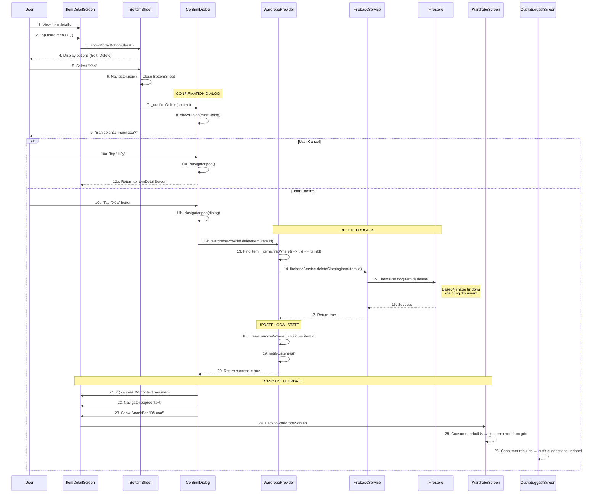

# 🗑️ Luồng Xóa Item - Chi tiết

> **Dựa trên tài liệu**: [ALL_Flow.md](file:///d:/FlutterProjects/ai_personal_stylist/ALL_Flow.md#10-xóa-item)

---

## 📊 Sơ đồ Tổng quan



**Sơ đồ Sequence của luồng Xóa Item**

---

## 🔍 Chi Tiết Từng Bước

### **BƯỚC 1-5: Show Delete Option**

#### File: [item_detail_screen.dart](file:///d:/FlutterProjects/ai_personal_stylist/lib/screens/item_detail_screen.dart#L360-L375)

```dart
void _showOptions(BuildContext context) {
  showModalBottomSheet(
    context: context,
    shape: const RoundedRectangleBorder(
      borderRadius: BorderRadius.vertical(top: Radius.circular(20)),
    ),
    builder: (context) => Container(
      padding: const EdgeInsets.all(20),
      child: Column(
        mainAxisSize: MainAxisSize.min,
        children: [
          // Edit option
          ListTile(
            leading: const Icon(Icons.edit),
            title: const Text('Chỉnh sửa'),
            onTap: () {
              Navigator.pop(context);
              // Navigate to edit screen
            },
          ),
          
          // Delete option (RED color for danger)
          ListTile(
            leading: const Icon(
              Icons.delete_outline, 
              color: AppTheme.errorColor,
            ),
            title: const Text(
              'Xóa', 
              style: TextStyle(color: AppTheme.errorColor),
            ),
            onTap: () {
              Navigator.pop(context);  // Close bottom sheet
              _confirmDelete(context);  // Show confirmation dialog
            },
          ),
        ],
      ),
    ),
  );
}
```

**Thiết kế UI:**
- **Màu đỏ**: Chỉ ra hành động nguy hiểm
- **Icon delete_outline**: Tín hiệu trực quan rõ ràng
- **Bottom sheet**: Ngăn chặn tap nhầm
- **Đóng trước**: Navigator.pop() trước khi hiện dialog

---

### **BƯỚC 7-9: Confirmation Dialog**

#### File: [item_detail_screen.dart](file:///d:/FlutterProjects/ai_personal_stylist/lib/screens/item_detail_screen.dart#L380-L414)

```dart
void _confirmDelete(BuildContext context) {
  showDialog(
    context: context,
    builder: (ctx) => AlertDialog(
      title: const Text('Xác nhận xóa'),
      content: Text(
        'Bạn có chắc muốn xóa ${item.type.displayName} này?',
      ),
      actions: [
        // Cancel button
        TextButton(
          onPressed: () => Navigator.pop(ctx),
          child: const Text('Hủy'),
        ),
        
        // Delete button (RED with elevated style)
        ElevatedButton(
          onPressed: () async {
            // Close confirmation dialog first
            Navigator.pop(ctx);
            
            // Perform delete operation
            final success = await context
                .read<WardrobeProvider>()
                .deleteItem(item.id);
            
            // If successful and widget still mounted
            if (success && context.mounted) {
              // Go back to WardrobeScreen
              Navigator.pop(context);
              
              // Show success message
              ScaffoldMessenger.of(context).showSnackBar(
                const SnackBar(content: Text('Đã xóa!')),
              );
            }
          },
          style: ElevatedButton.styleFrom(
            backgroundColor: AppTheme.errorColor,  // Red background
          ),
          child: const Text('Xóa'),
        ),
      ],
    ),
  );
}
```

**Cân nhắc UX:**

1. **Xác nhận 2 lần**: BottomSheet → Dialog ngăn chặn tai nạn
2. **Thông báo động**: Hiển thị loại item (Áo, Quần, etc.)
3. **Hành động rõ ràng**: "Hủy" vs "Xóa"
4. **Thứ bậc trực quan**: Nút đỏ nổi bật
5. **Xử lý Async**: await thao tác xóa
6. **Kiểm tra Mounted**: Xác minh context trước khi navigate

---

### **BƯỚC 12-17: Delete from Firestore**

#### File: [wardrobe_provider.dart](file:///d:/FlutterProjects/ai_personal_stylist/lib/providers/wardrobe_provider.dart#L351-L364)

```dart
/// Delete clothing item
Future<bool> deleteItem(String itemId) async {
  try {
    // [STEP 1] Find item in local list (for validation)
    final item = _items.firstWhere((i) => i.id == itemId);
    
    // [STEP 2] Delete from Firestore
    final success = await _firebaseService.deleteClothingItem(item.id);
    
    if (success) {
      // [STEP 3] Remove from local state
      _items.removeWhere((i) => i.id == itemId);
      
      // [STEP 4] Trigger UI rebuild
      notifyListeners();
    }
    
    return success;
  } catch (e) {
    _errorMessage = e.toString();
    notifyListeners();
    return false;
  }
}
```

#### File: [firebase_service.dart](file:///d:/FlutterProjects/ai_personal_stylist/lib/services/firebase_service.dart#L176-L184)

```dart
/// Delete clothing item from Firestore
Future<bool> deleteClothingItem(String itemId) async {
  try {
    // Delete document from Firestore
    // NOTE: Base64 image will be automatically deleted with the document
    await _itemsRef.doc(itemId).delete();
    
    print('✅ Item deleted: $itemId');
    return true;
  } catch (e) {
    print('❌ Delete Item Error: $e');
    return false;
  }
}
```

**Phân tích chi tiết luồng Xóa:**

```
wardrobeProvider.deleteItem(id)
    ↓
1. Find item: _items.firstWhere(i => i.id == id)
    ↓
2. firebaseService.deleteClothingItem(id)
    ↓
3. Firestore: collection('items').doc(id).delete()
    ↓
    Document Deleted
    ├─→ userId: "user123" (deleted)
    ├─→ imageBase64: "iVBORw0KGgo..." (~200KB, deleted)
    ├─→ type: "top" (deleted)
    ├─→ color: "blue" (deleted)
    └─→ ALL FIELDS DELETED (no orphaned data)
    ↓
4. _items.removeWhere(i => i.id == id)
    ↓
5. notifyListeners()
    ↓
UI Rebuilds → Item disappears
```

---

### **BƯỚC 18-19: Update Local State**

#### Mô hình cập nhật State:

```dart
// BEFORE DELETE
_items = [
  ClothingItem(id: 'abc123', type: top, color: 'blue'),
  ClothingItem(id: 'def456', type: bottom, color: 'black'),
  ClothingItem(id: 'ghi789', type: footwear, color: 'white'),
]

// DELETE id = 'def456'
_items.removeWhere((i) => i.id == 'def456')

// AFTER DELETE
_items = [
  ClothingItem(id: 'abc123', type: top, color: 'blue'),
  ClothingItem(id: 'ghi789', type: footwear, color: 'white'),
]

// TRIGGER REBUILD
notifyListeners()
```

**Tại sao dùng removeWhere thay vì remove:**

```dart
// ❌ BAD: remove() needs exact object reference
_items.remove(item);  // May fail if not same instance

// ✅ GOOD: removeWhere() uses predicate (works with ID)
_items.removeWhere((i) => i.id == itemId);  // Always works
```

---

### **BƯỚC 20-26: Cascade UI Update**

#### Mô hình Consumer trong WardrobeScreen:

```dart
// In wardrobe_screen.dart
Consumer<WardrobeProvider>(
  builder: (context, wardrobe, _) {
    final items = wardrobe.filteredItems;
    
    if (items.isEmpty) {
      return Center(
        child: Column(
          mainAxisAlignment: MainAxisAlignment.center,
          children: [
            Icon(Icons.checkroom, size: 100, color: Colors.grey),
            SizedBox(height: 20),
            Text(
              'Tủ đồ trống',
              style: TextStyle(fontSize: 18, color: Colors.grey),
            ),
          ],
        ),
      );
    }
    
    return GridView.builder(
      itemCount: items.length,
      itemBuilder: (context, index) {
        final item = items[index];
        return ClothingCard(
          item: item,
          onTap: () => Navigator.push(
            context,
            MaterialPageRoute(
              builder: (_) => ItemDetailScreen(item: item),
            ),
          ),
        );
      },
    );
  },
)
```

**Cập nhật Cascade:**

```
Provider.notifyListeners()
    ↓
WardrobeScreen.Consumer rebuilds
    → GridView.itemCount reduces by 1
    → Grid animates item removal
    ↓
OutfitSuggestScreen.Consumer rebuilds
    → Available items updated
    → Previous outfit suggestions may become invalid
    ↓
ProfileScreen.Consumer rebuilds
    → Total item count decreases
    → Category counts update
```

---

## 🔄 Alternative Delete Locations

### **Option 1: Delete from WardrobeScreen (Swipe)**

#### Ý tưởng triển khai:

```dart
// In wardrobe_screen.dart
GridView.builder(
  itemBuilder: (context, index) {
    final item = items[index];
    
    return Dismissible(
      key: Key(item.id),
      direction: DismissDirection.endToStart,
      background: Container(
        alignment: Alignment.centerRight,
        padding: EdgeInsets.only(right: 20),
        color: AppTheme.errorColor,
        child: Icon(Icons.delete, color: Colors.white),
      ),
      confirmDismiss: (direction) async {
        return await showDialog<bool>(
          context: context,
          builder: (ctx) => AlertDialog(
            title: Text('Xác nhận xóa'),
            content: Text('Xóa ${item.type.displayName}?'),
            actions: [
              TextButton(
                onPressed: () => Navigator.pop(ctx, false),
                child: Text('Hủy'),
              ),
              ElevatedButton(
                onPressed: () => Navigator.pop(ctx, true),
                child: Text('Xóa'),
                style: ElevatedButton.styleFrom(
                  backgroundColor: AppTheme.errorColor,
                ),
              ),
            ],
          ),
        ) ?? false;
      },
      onDismissed: (direction) async {
        final success = await wardrobeProvider.deleteItem(item.id);
        
        if (success) {
          ScaffoldMessenger.of(context).showSnackBar(
            SnackBar(
              content: Text('Đã xóa ${item.type.displayName}'),
              action: SnackBarAction(
                label: 'Hoàn tác',
                onPressed: () {
                  // TODO: Implement undo functionality
                },
              ),
            ),
          );
        }
      },
      child: ClothingCard(item: item),
    );
  },
)
```

**Ưu điểm:**
- ✅ Xóa nhanh (swipe gesture)
- ✅ Phản hồi trực quan (nền đỏ)
- ✅ Vẫn có xác nhận
- ✅ Pattern quen thuộc (như app email)

**Nhược điểm:**
- ⚠️ Có thể swipe nhầm
- ⚠️ User mới khó phát hiện

---

### **Option 2: Delete from Cleanup Screen**

#### File: [wardrobe_cleanup_screen.dart](file:///d:/FlutterProjects/ai_personal_stylist/lib/screens/wardrobe_cleanup_screen.dart#L595)

```dart
// Delete items suggested by AI for cleanup
ListTile(
  title: Text(item.type.displayName),
  subtitle: Text('Màu: ${item.color}'),
  trailing: IconButton(
    icon: Icon(Icons.delete, color: AppTheme.errorColor),
    onPressed: () async {
      final confirmed = await showDialog<bool>(
        context: context,
        builder: (ctx) => AlertDialog(
          title: Text('Xác nhận xóa'),
          content: Text('Xóa món đồ này khỏi tủ?'),
          actions: [
            TextButton(
              onPressed: () => Navigator.pop(ctx, false),
              child: Text('Hủy'),
            ),
            ElevatedButton(
              onPressed: () => Navigator.pop(ctx, true),
              child: Text('Xóa'),
              style: ElevatedButton.styleFrom(
                backgroundColor: AppTheme.errorColor,
              ),
            ),
          ],
        ),
      );
      
      if (confirmed == true) {
        await wardrobe.deleteItem(item.id);
        setState(() => _selectedItems.remove(item.id));
        
        ScaffoldMessenger.of(context).showSnackBar(
          SnackBar(content: Text('Đã xóa!')),
        );
      }
    },
  ),
)
```

**Trường hợp sử dụng:**
- AI gợi ý items cần xóa (trùng lặp, không dùng, v.v.)
- User xem xét và xóa theo lô
- Là phần của luồng tối ưu tủ đồ

---

### **Option 3: Batch Delete All Items**

#### File: [wardrobe_provider.dart](file:///d:/FlutterProjects/ai_personal_stylist/lib/providers/wardrobe_provider.dart#L366-L384)

```dart
/// Delete all items (for testing or reset)
Future<bool> deleteAllItems() async {
  try {
    // Get all item IDs
    final itemIds = _items.map((i) => i.id).toList();
    
    // Delete each item from Firestore
    for (final id in itemIds) {
      await deleteItem(id);
    }
    
    // Clear local list
    _items.clear();
    notifyListeners();
    
    return true;
  } catch (e) {
    _errorMessage = e.toString();
    notifyListeners();
    return false;
  }
}
```

**Ví dụ sử dụng:**

```dart
// In ProfileScreen or Settings
ElevatedButton(
  onPressed: () async {
    final confirmed = await showDialog<bool>(
      context: context,
      builder: (ctx) => AlertDialog(
        title: Text('⚠️ Xóa toàn bộ tủ đồ'),
        content: Text(
          'Hành động này KHÔNG THỂ HOÀN TÁC!\n\n'
          'Tất cả ${wardrobeProvider.items.length} món đồ sẽ bị xóa vĩnh viễn.',
        ),
        actions: [
          TextButton(
            onPressed: () => Navigator.pop(ctx, false),
            child: Text('Hủy'),
          ),
          ElevatedButton(
            onPressed: () => Navigator.pop(ctx, true),
            child: Text('Xóa tất cả'),
            style: ElevatedButton.styleFrom(
              backgroundColor: AppTheme.errorColor,
            ),
          ),
        ],
      ),
    );
    
    if (confirmed == true) {
      // Show loading
      showDialog(
        context: context,
        barrierDismissible: false,
        builder: (_) => Center(child: CircularProgressIndicator()),
      );
      
      // Delete all
      final success = await wardrobeProvider.deleteAllItems();
      
      // Close loading
      Navigator.pop(context);
      
      if (success) {
        ScaffoldMessenger.of(context).showSnackBar(
          SnackBar(content: Text('Đã xóa toàn bộ tủ đồ')),
        );
      }
    }
  },
  child: Text('Xóa toàn bộ tủ đồ'),
  style: ElevatedButton.styleFrom(
    backgroundColor: AppTheme.errorColor,
  ),
)
```

**Cảnh báo:**
- 🚨 **PHÁ HỦY**: Không thể hoàn tác
- 🚨 **CHẬM**: O(n) lần xóa Firestore
- 🚨 **TỐN KÉM**: Thao tác ghi Firestore
- ✅ **Trường hợp dùng**: Testing, reset tài khoản

---

## 🐛 Error Handling

### **1. Item Not Found Error**

```dart
Future<bool> deleteItem(String itemId) async {
  try {
    // This throws if item not found
    final item = _items.firstWhere((i) => i.id == itemId);
    
    // ... rest of delete logic
  } on StateError catch (e) {
    // firstWhere throws StateError if not found
    _errorMessage = 'Item không tồn tại';
    notifyListeners();
    return false;
  } catch (e) {
    _errorMessage = e.toString();
    notifyListeners();
    return false;
  }
}
```

**Triển khai tốt hơn:**

```dart
Future<bool> deleteItem(String itemId) async {
  try {
    // Use firstWhereOrNull (safer)
    final item = _items.firstWhereOrNull((i) => i.id == itemId);
    
    if (item == null) {
      _errorMessage = 'Item không tồn tại trong local state';
      notifyListeners();
      return false;
    }
    
    // Delete from Firestore
    final success = await _firebaseService.deleteClothingItem(item.id);
    
    if (success) {
      _items.removeWhere((i) => i.id == itemId);
      notifyListeners();
    }
    
    return success;
  } catch (e) {
    _errorMessage = e.toString();
    notifyListeners();
    return false;
  }
}
```

---

### **2. Firestore Delete Errors**

```dart
Future<bool> deleteClothingItem(String itemId) async {
  try {
    await _itemsRef.doc(itemId).delete();
    return true;
  } on FirebaseException catch (e) {
    if (e.code == 'not-found') {
      print('❌ Document not found in Firestore');
      // Item already deleted → return true (idempotent)
      return true;
    } else if (e.code == 'permission-denied') {
      print('❌ Permission denied: User not authorized');
      return false;
    } else if (e.code == 'unavailable') {
      print('❌ Firestore unavailable: Network issue');
      return false;
    } else {
      print('❌ Unknown FirebaseException: ${e.code} - ${e.message}');
      return false;
    }
  } catch (e) {
    print('❌ Delete Item Error: $e');
    return false;
  }
}
```

---

### **3. Context Mounted Check**

```dart
void _confirmDelete(BuildContext context) {
  showDialog(
    context: context,
    builder: (ctx) => AlertDialog(
      // ...
      actions: [
        ElevatedButton(
          onPressed: () async {
            Navigator.pop(ctx);  // Close dialog
            
            final success = await context
                .read<WardrobeProvider>()
                .deleteItem(item.id);
            
            // CRITICAL: Check if widget still mounted
            if (success && context.mounted) {
              Navigator.pop(context);  // Back to WardrobeScreen
              
              // Only show SnackBar if context valid
              if (context.mounted) {
                ScaffoldMessenger.of(context).showSnackBar(
                  const SnackBar(content: Text('Đã xóa!')),
                );
              }
            } else if (!success && context.mounted) {
              ScaffoldMessenger.of(context).showSnackBar(
                const SnackBar(
                  content: Text('Lỗi khi xóa. Vui lòng thử lại.'),
                  backgroundColor: AppTheme.errorColor,
                ),
              );
            }
          },
          child: const Text('Xóa'),
        ),
      ],
    ),
  );
}
```

**Tại sao context.mounted quan trọng:**

- ⚠️ User có thể navigate đi trong khi đang xóa async
- ⚠️ Widget có thể bị dispose khi delete đang chờ
- ⚠️ Navigator.pop() trên context unmounted → crash
- ✅ Luôn kiểm tra `context.mounted` sau await

---

### **4. Network Timeout**

```dart
Future<bool> deleteClothingItem(String itemId) async {
  try {
    await _itemsRef
        .doc(itemId)
        .delete()
        .timeout(const Duration(seconds: 10));
    
    return true;
  } on TimeoutException {
    print('❌ Delete timeout: Check network connection');
    return false;
  } catch (e) {
    print('❌ Delete Item Error: $e');
    return false;
  }
}
```

---

## 💾 Data Integrity

### **Những gì bị xóa:**

```json
// Firestore Document (DELETED COMPLETELY)
{
  "id": "abc123",
  "userId": "user456",
  "imageBase64": "iVBORw0KGgo...",  // ~200KB Base64 image
  "type": "top",
  "color": "blue",
  "material": "cotton",
  "styles": ["casual", "sporty"],
  "seasons": ["summer", "spring"],
  "brand": "Nike",
  "notes": "Bought on sale",
  "createdAt": "2024-01-15T10:30:00Z",
  "lastWorn": "2024-12-10T08:00:00Z",
  "wearCount": 5,
  "isFavorite": true
}

// After delete: DOCUMENT NOT FOUND (404)
```

**Điểm chính:**

1. ✅ **Xóa toàn bộ document**: Tất cả fields bị xóa
2. ✅ **Xóa ảnh Base64**: Không có storage mồ côi
3. ✅ **Thao tác nguyên tử**: Tất cả hoặc không
4. ✅ **Không cần cascade delete**: Không có tham chiếu đến collections khác
5. ⚠️ **KHÔNG THỂ ĐẢO NGƯỢC**: Không thể hoàn tác (trừ khi implement soft delete)

---

### **Ảnh hưởng đến các tính năng khác:**

```
Delete Item "abc123"
    ↓
WardrobeScreen
    → Grid count reduces by 1
    → If was filtered, filter results update
    → If was last item, show empty state
    ↓
OutfitSuggestScreen
    → Available items for outfit suggestions reduced
    → If "abc123" was in current outfit → outfit invalid
    → AI suggestions will use remaining items
    ↓
ColorHarmonyScreen
    → If "abc123" was selected for comparison → reset selection
    ↓
ProfileScreen
    → Total items count decreases
    → Category counts update (Áo: 10 → 9)
    → Stats recalculate
```

---

## 🔄 Soft Delete Alternative

### **Ý tưởng: Đánh dấu Đã xóa thay vì Xóa thật**

```dart
// Add field to ClothingItem model
class ClothingItem {
  // ... existing fields
  final bool isDeleted;
  final DateTime? deletedAt;
  
  ClothingItem({
    // ...
    this.isDeleted = false,
    this.deletedAt,
  });
}

// Soft delete implementation
Future<bool> softDeleteItem(String itemId) async {
  try {
    final item = _items.firstWhere((i) => i.id == itemId);
    
    // Update Firestore: mark as deleted
    final success = await _firebaseService.updateClothingItem(
      item.copyWith(
        isDeleted: true,
        deletedAt: DateTime.now(),
      ),
    );
    
    if (success) {
      // Remove from UI (but not from Firestore)
      _items.removeWhere((i) => i.id == itemId);
      notifyListeners();
    }
    
    return success;
  } catch (e) {
    _errorMessage = e.toString();
    notifyListeners();
    return false;
  }
}

// Filter out deleted items when loading
Future<void> loadItems() async {
  _status = WardrobeStatus.loading;
  notifyListeners();
  
  final allItems = await _firebaseService.getUserItems();
  
  // Filter out soft-deleted items
  _items = allItems.where((item) => !item.isDeleted).toList();
  
  _status = WardrobeStatus.loaded;
  notifyListeners();
}

// Undo delete (restore)
Future<bool> restoreItem(String itemId) async {
  try {
    // Query Firestore for deleted item
    final doc = await _firebaseService.getItemById(itemId);
    
    if (doc != null && doc.isDeleted) {
      // Restore: mark as not deleted
      final restored = doc.copyWith(
        isDeleted: false,
        deletedAt: null,
      );
      
      final success = await _firebaseService.updateClothingItem(restored);
      
      if (success) {
        _items.add(restored);
        notifyListeners();
      }
      
      return success;
    }
    
    return false;
  } catch (e) {
    _errorMessage = e.toString();
    notifyListeners();
    return false;
  }
}

// Permanent delete (cleanup old soft-deleted items)
Future<void> permanentDeleteOldItems() async {
  final thirtyDaysAgo = DateTime.now().subtract(Duration(days: 30));
  
  // Query Firestore for items deleted > 30 days ago
  final snapshot = await _itemsRef
      .where('isDeleted', isEqualTo: true)
      .where('deletedAt', isLessThan: Timestamp.fromDate(thirtyDaysAgo))
      .get();
  
  // Delete permanently
  for (final doc in snapshot.docs) {
    await doc.reference.delete();
  }
}
```

**Ưu điểm:**
- ✅ Khả năng hoàn tác (khôi phục trong 30 ngày)
- ✅ An toàn khôi phục dữ liệu
- ✅ Phân tích items đã xóa

**Nhược điểm:**
- ⚠️ Firestore đọc cả items đã xóa (tốn chi phí)
- ⚠️ Cần dọn dẹp định kỳ
- ⚠️ Queries phức tạp hơn

---

## ⏱️ Performance Analysis

### **Phân tích thời gian Xóa:**

1. **Show BottomSheet**: ~100ms
2. **User select Delete**: Variable
3. **Show confirmation dialog**: ~100ms
4. **User confirm**: Variable
5. **Close dialog**: ~50ms
6. **Local state: firstWhere**: ~1ms (O(n), but n is small)
7. **Firestore delete**: ~300-800ms (network dependent)
8. **Local state: removeWhere**: ~1ms
9. **notifyListeners**: ~50ms
10. **UI rebuild**: ~100-200ms

**Total: ~0.6-1.3 giây** (chủ yếu Firestore)

---

### **Hiệu suất Xóa hàng loạt:**

```dart
// ❌ SLOW: Sequential deletes (O(n) network calls)
for (final id in itemIds) {
  await deleteItem(id);  // Each waits for previous
}
// Time: n * 800ms (10 items = 8 seconds!)

// ✅ FASTER: Parallel deletes
await Future.wait(
  itemIds.map((id) => deleteItem(id)),
);
// Time: ~800ms (all parallel)
```

---

### **Chi phí Firestore:**

- **1 Delete Operation**: 1 write unit
- **100 Deletes**: 100 write units
- **Free Tier**: 20,000 writes/day
- **Cost**: Minimal for typical use

---

## 📊 Delete Statistics

### **Theo dõi Xóa (Tùy chọn):**

```dart
// Add to ClothingItem model or separate collection
class DeletionLog {
  final String itemId;
  final String userId;
  final ClothingType itemType;
  final DateTime deletedAt;
  final String? reason;  // "cleanup", "duplicate", "user_request"
  
  DeletionLog({
    required this.itemId,
    required this.userId,
    required this.itemType,
    required this.deletedAt,
    this.reason,
  });
}

// Log deletion before deleting
Future<bool> deleteItem(String itemId) async {
  try {
    final item = _items.firstWhere((i) => i.id == itemId);
    
    // Log deletion (optional)
    await _firebaseService.logDeletion(
      DeletionLog(
        itemId: item.id,
        userId: item.userId,
        itemType: item.type,
        deletedAt: DateTime.now(),
        reason: 'user_request',
      ),
    );
    
    // Proceed with delete
    final success = await _firebaseService.deleteClothingItem(item.id);
    
    if (success) {
      _items.removeWhere((i) => i.id == itemId);
      notifyListeners();
    }
    
    return success;
  } catch (e) {
    _errorMessage = e.toString();
    notifyListeners();
    return false;
  }
}
```

**Trường hợp sử dụng:**
- Phân tích: Items nào bị xóa nhiều nhất?
- Hành vi người dùng: User có xóa loại nào nhiều hơn?
- Khôi phục: Phục hồi items xóa nhầm

---

## 🎨 UX Enhancements

### **1. Undo Delete (SnackBar Action)**

```dart
void _confirmDelete(BuildContext context) {
  showDialog(
    context: context,
    builder: (ctx) => AlertDialog(
      // ... dialog content
      actions: [
        ElevatedButton(
          onPressed: () async {
            Navigator.pop(ctx);
            
            // Store item before deleting
            final deletedItem = item;
            
            final success = await context
                .read<WardrobeProvider>()
                .deleteItem(item.id);
            
            if (success && context.mounted) {
              Navigator.pop(context);
              
              // Show SnackBar with UNDO action
              ScaffoldMessenger.of(context).showSnackBar(
                SnackBar(
                  content: Text('Đã xóa ${deletedItem.type.displayName}'),
                  duration: Duration(seconds: 5),
                  action: SnackBarAction(
                    label: 'Hoàn tác',
                    onPressed: () async {
                      // Re-add item
                      final restored = await context
                          .read<WardrobeProvider>()
                          .addItem(deletedItem);
                      
                      if (restored != null) {
                        ScaffoldMessenger.of(context).showSnackBar(
                          SnackBar(content: Text('Đã khôi phục!')),
                        );
                      }
                    },
                  ),
                ),
              );
            }
          },
          child: Text('Xóa'),
        ),
      ],
    ),
  );
}
```

**Lưu ý:** Yêu cầu lưu trữ toàn bộ item trước khi xóa, và có method `addItem()` chấp nhận item đã tồn tại.

---

### **2. Delete Animation**

```dart
// In wardrobe_screen.dart
AnimatedList(
  key: _listKey,
  initialItemCount: items.length,
  itemBuilder: (context, index, animation) {
    final item = items[index];
    
    return SizeTransition(
      sizeFactor: animation,
      child: ClothingCard(
        item: item,
        onDelete: () async {
          // Confirm delete
          final confirmed = await _confirmDelete(context, item);
          
          if (confirmed) {
            // Animate removal
            _listKey.currentState?.removeItem(
              index,
              (context, animation) => SizeTransition(
                sizeFactor: animation,
                child: ClothingCard(item: item),
              ),
              duration: Duration(milliseconds: 300),
            );
            
            // Actually delete
            await wardrobeProvider.deleteItem(item.id);
          }
        },
      ),
    );
  },
)
```

---

### **3. Batch Select & Delete**

```dart
// Selection mode in WardrobeScreen
bool _isSelectionMode = false;
Set<String> _selectedItemIds = {};

AppBar(
  title: _isSelectionMode
      ? Text('${_selectedItemIds.length} đã chọn')
      : Text('Tủ đồ'),
  actions: [
    if (_isSelectionMode)
      IconButton(
        icon: Icon(Icons.delete),
        onPressed: () async {
          final confirmed = await showDialog<bool>(
            context: context,
            builder: (ctx) => AlertDialog(
              title: Text('Xác nhận xóa'),
              content: Text(
                'Xóa ${_selectedItemIds.length} món đồ đã chọn?',
              ),
              actions: [
                TextButton(
                  onPressed: () => Navigator.pop(ctx, false),
                  child: Text('Hủy'),
                ),
                ElevatedButton(
                  onPressed: () => Navigator.pop(ctx, true),
                  child: Text('Xóa'),
                  style: ElevatedButton.styleFrom(
                    backgroundColor: AppTheme.errorColor,
                  ),
                ),
              ],
            ),
          );
          
          if (confirmed == true) {
            // Delete in parallel
            await Future.wait(
              _selectedItemIds.map((id) => 
                wardrobeProvider.deleteItem(id)
              ),
            );
            
            setState(() {
              _isSelectionMode = false;
              _selectedItemIds.clear();
            });
            
            ScaffoldMessenger.of(context).showSnackBar(
              SnackBar(content: Text('Đã xóa ${confirmed} món đồ')),
            );
          }
        },
      ),
  ],
)

// In GridView
ClothingCard(
  item: item,
  isSelected: _selectedItemIds.contains(item.id),
  onLongPress: () {
    setState(() {
      _isSelectionMode = true;
      _selectedItemIds.add(item.id);
    });
  },
  onTap: _isSelectionMode
      ? () {
          setState(() {
            if (_selectedItemIds.contains(item.id)) {
              _selectedItemIds.remove(item.id);
              if (_selectedItemIds.isEmpty) {
                _isSelectionMode = false;
              }
            } else {
              _selectedItemIds.add(item.id);
            }
          });
        }
      : () => Navigator.push(...),
)
```

---

## 🔗 Files Liên Quan

### **Core Files:**

1. [lib/screens/item_detail_screen.dart](file:///d:/FlutterProjects/ai_personal_stylist/lib/screens/item_detail_screen.dart) - Delete option UI (414 lines)
2. [lib/providers/wardrobe_provider.dart](file:///d:/FlutterProjects/ai_personal_stylist/lib/providers/wardrobe_provider.dart) - `deleteItem()` method (399 lines)
3. [lib/services/firebase_service.dart](file:///d:/FlutterProjects/ai_personal_stylist/lib/services/firebase_service.dart) - `deleteClothingItem()` method (235 lines)

### **Vị trí Xóa thay thế:**

4. [lib/screens/wardrobe_screen.dart](file:///d:/FlutterProjects/ai_personal_stylist/lib/screens/wardrobe_screen.dart) - Swipe để xóa (460 dòng)
5. [lib/screens/wardrobe_cleanup_screen.dart](file:///d:/FlutterProjects/ai_personal_stylist/lib/screens/wardrobe_cleanup_screen.dart) - Xóa theo gợi ý cleanup (600+ dòng)

### **Components liên quan:**

6. [lib/widgets/clothing_card.dart](file:///d:/FlutterProjects/ai_personal_stylist/lib/widgets/clothing_card.dart) - Card UI
7. [lib/utils/theme.dart](file:///d:/FlutterProjects/ai_personal_stylist/lib/utils/theme.dart) - AppTheme.errorColor

---

## 🔄 Luồng Liên Quan

### **Trước khi delete:**

- [Flow 8: Xem Chi Tiết Item](file:///d:/FlutterProjects/ai_personal_stylist/flow_view_item_detail.md) - View item before deleting
- [Flow 9: Cập Nhật Item](file:///d:/FlutterProjects/ai_personal_stylist/flow_update_item.md) - Edit before deciding to delete

### **Sau khi delete:**

- [Flow 5: Load Tủ Đồ](file:///d:/FlutterProjects/ai_personal_stylist/ALL_Flow.md#5-load-tủ-đồ-ban-đầu) - Refresh wardrobe list
- [Flow 14: Gợi Ý Outfit](file:///d:/FlutterProjects/ai_personal_stylist/ALL_Flow.md#14-gợi-ý-outfit) - Outfit suggestions with fewer items

### **Luồng thay thế:**

- [Flow 16: Dọn Tủ Đồ](file:///d:/FlutterProjects/ai_personal_stylist/ALL_Flow.md#16-dọn-tủ-đồ-cleanup-suggestions) - Xóa theo gợi ý AI
- **Batch Delete**: Xóa nhiều items cùng lúc
- **Soft Delete**: Đánh dấu đã xóa với tùy chọn hoàn tác

---

## ✅ Tóm Tắt

### **Điểm chính của Delete Item flow:**

1. ✅ **Xác nhận 2 lần**: BottomSheet → Dialog ngăn chặn tai nạn
2. ✅ **Cảnh báo trực quan**: Màu đỏ, ngôn ngữ rõ ràng
3. ✅ **Xóa nguyên tử**: Firestore document + ảnh Base64
4. ✅ **Đồng bộ State**: Provider pattern → tất cả màn hình cập nhật
5. ✅ **Xử lý lỗi**: Network, Firestore, kiểm tra context mounted
6. ✅ **Nhiều điểm vào**: ItemDetail, Swipe, Cleanup screen
7. ✅ **Thao tác hàng loạt**: Xóa nhiều items song song

### **Các lựa chọn triển khai chính:**

| Lựa chọn | Lý do |
|--------|-----------|
| **Hard delete** | Không tốn storage, dữ liệu sạch |
| **removeWhere** | Xóa dựa trên ID, đáng tin cậy |
| **context.mounted** | Ngăn crash sau async |
| **Red UI elements** | Chỉ báo nguy hiểm rõ ràng |
| **Confirmation dialog** | Ngăn xóa nhầm |

### **Hiệu suất:**
- **Thời gian xóa**: ~0.6-1.3 giây (độ trễ Firestore)
- **Xóa hàng loạt**: Khuyến nghị thực thi song song
- **Chi phí**: 1 write unit mỗi lần xóa (tối thiểu)

### **Bảo mật:**
- ✅ Firestore rules kiểm tra userId khớp
- ✅ Không có dữ liệu mồ côi (Base64 xóa cùng doc)
- ✅ Thao tác nguyên tử (tất cả hoặc không)

---

**📌 Các bước tiếp theo:**
- [Flow 11: Toggle Favorite](file:///d:/FlutterProjects/ai_personal_stylist/ALL_Flow.md#11-toggle-favorite)
- [Flow 12: Filter Items](file:///d:/FlutterProjects/ai_personal_stylist/ALL_Flow.md#12-filter-items-theo-typecategory)
- [Flow 16: Dọn Tủ Đồ](file:///d:/FlutterProjects/ai_personal_stylist/ALL_Flow.md#16-dọn-tủ-đồ-cleanup-suggestions)
