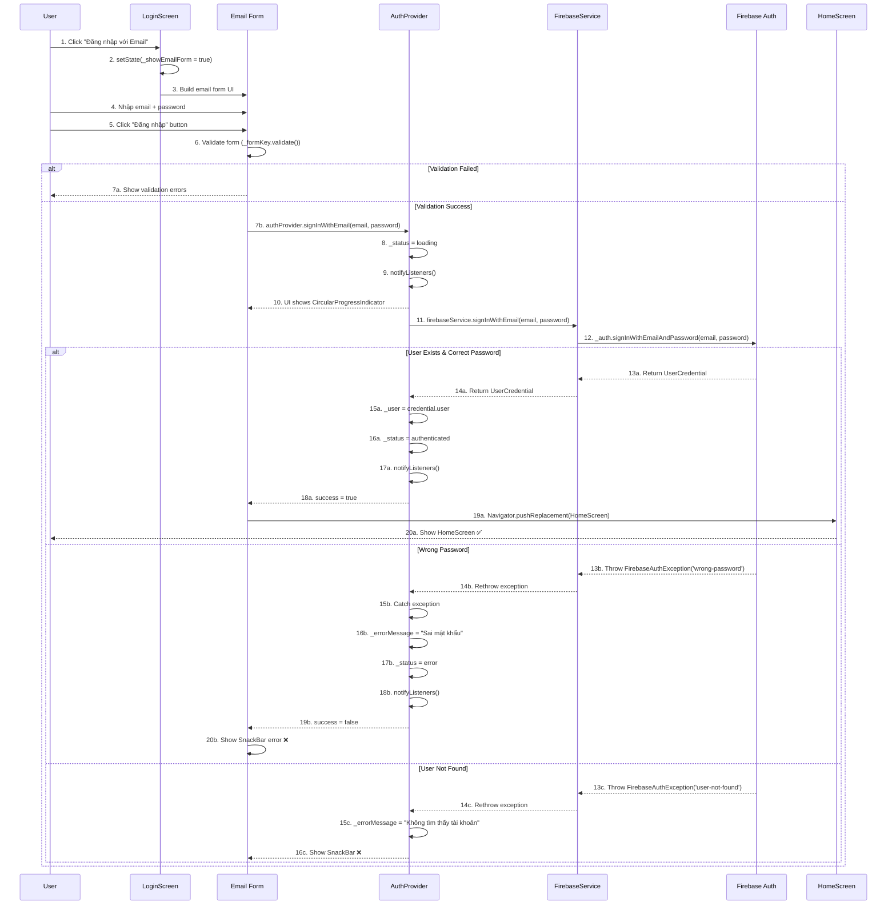

# 📧 Luồng Đăng nhập Email/Password - Chi tiết

> **Dựa trên tài liệu**: [TẤT_CẢ_LUỒNG_ĐI.md](file:///d:/FlutterProjects/ai_personal_stylist/TẤT_CẢ_LUỒNG_ĐI.md#3-đăng-nhập-emailpassword)

---

## 📊 Sơ đồ Tổng quan



**Sơ đồ Sequence của luồng Đăng nhập Email/Password**

---

## 🔍 Chi Tiết Từng Bước

### **BƯỚC 1-3: Show Email Form**

#### File: [login_screen.dart](file:///d:/FlutterProjects/ai_personal_stylist/lib/screens/login_screen.dart#L146-L167)

```dart
// Email/Password Sign In Button
SizedBox(
  width: double.infinity,
  child: ElevatedButton.icon(
    onPressed: () => setState(() => _showEmailForm = true),
    style: ElevatedButton.styleFrom(
      backgroundColor: Colors.white,
      foregroundColor: AppTheme.textPrimary,
      padding: const EdgeInsets.symmetric(vertical: 16),
      shape: RoundedRectangleBorder(
        borderRadius: BorderRadius.circular(16),
      ),
    ),
    icon: const Icon(Icons.email_outlined),
    label: const Text(
      'Đăng nhập với Email',
      style: TextStyle(
        fontSize: 16,
        fontWeight: FontWeight.w600,
      ),
    ),
  ),
),
```

#### Giải thích:

**Dòng 149: `onPressed: () => setState(() => _showEmailForm = true)`**
- **Arrow function shorthand**: Gọi `setState` để update state.
- **`_showEmailForm = true`**: Set flag để hiển thị email form.
- **Effect**: `Consumer` builder được gọi lại → check `_showEmailForm` (dòng 139).

**Dòng 139-141: Conditional Rendering**
```dart
if (_showEmailForm) {
  return _buildEmailForm(auth);
}
```
- **Nếu `true`**: Hiển thị email form thay vì login buttons.
- **Animation**: Flutter tự động animate transition (implicit animation).

---

### **BƯỚC 4: Email Form UI**

#### File: [login_screen.dart](file:///d:/FlutterProjects/ai_personal_stylist/lib/screens/login_screen.dart#L280-L407)

```dart
Widget _buildEmailForm(AuthProvider auth) {
  return Container(
    padding: const EdgeInsets.all(20),
    decoration: BoxDecoration(
      color: Colors.white,
      borderRadius: BorderRadius.circular(20),
    ),
    child: Form(
      key: _formKey,
      child: Column(
        mainAxisSize: MainAxisSize.min,
        children: [
          // Header với Back button
          Row(
            children: [
              IconButton(
                onPressed: () => setState(() {
                  _showEmailForm = false;
                  _isRegisterMode = false;
                  _emailController.clear();
                  _passwordController.clear();
                }),
                icon: const Icon(Icons.arrow_back),
              ),
              Expanded(
                child: Text(
                  _isRegisterMode ? 'Đăng ký' : 'Đăng nhập',
                  style: const TextStyle(
                    fontSize: 20,
                    fontWeight: FontWeight.bold,
                  ),
                  textAlign: TextAlign.center,
                ),
              ),
              const SizedBox(width: 48), // Balance layout
            ],
          ),

          const SizedBox(height: 20),

          // Email field
          TextFormField(
            controller: _emailController,
            keyboardType: TextInputType.emailAddress,
            decoration: InputDecoration(
              labelText: 'Email',
              prefixIcon: const Icon(Icons.email_outlined),
              border: OutlineInputBorder(
                borderRadius: BorderRadius.circular(12),
              ),
            ),
            validator: (value) {
              if (value == null || value.isEmpty) {
                return 'Vui lòng nhập email';
              }
              if (!value.contains('@')) {
                return 'Email không hợp lệ';
              }
              return null;
            },
          ),

          const SizedBox(height: 16),

          // Password field
          TextFormField(
            controller: _passwordController,
            obscureText: _obscurePassword,
            decoration: InputDecoration(
              labelText: 'Mật khẩu',
              prefixIcon: const Icon(Icons.lock_outlined),
              suffixIcon: IconButton(
                icon: Icon(
                  _obscurePassword ? Icons.visibility_off : Icons.visibility,
                ),
                onPressed: () => setState(() => _obscurePassword = !_obscurePassword),
              ),
              border: OutlineInputBorder(
                borderRadius: BorderRadius.circular(12),
              ),
            ),
            validator: (value) {
              if (value == null || value.isEmpty) {
                return 'Vui lòng nhập mật khẩu';
              }
              if (value.length < 6) {
                return 'Mật khẩu tối thiểu 6 ký tự';
              }
              return null;
            },
          ),

          const SizedBox(height: 24),

          // Submit button
          SizedBox(
            width: double.infinity,
            child: ElevatedButton(
              onPressed: () => _submitEmailForm(auth),
              style: ElevatedButton.styleFrom(
                padding: const EdgeInsets.symmetric(vertical: 16),
              ),
              child: Text(
                _isRegisterMode ? 'Đăng ký' : 'Đăng nhập',
                style: const TextStyle(
                  fontSize: 16,
                  fontWeight: FontWeight.w600,
                ),
              ),
            ),
          ),

          const SizedBox(height: 16),

          // Toggle Login/Register
          TextButton(
            onPressed: () => setState(() => _isRegisterMode = !_isRegisterMode),
            child: Text(
              _isRegisterMode 
                  ? 'Đã có tài khoản? Đăng nhập' 
                  : 'Chưa có tài khoản? Đăng ký',
              style: const TextStyle(color: AppTheme.primaryColor),
            ),
          ),
        ],
      ),
    ),
  );
}
```

#### Giải thích chi tiết:

**Dòng 287-288: Form Widget**
```dart
child: Form(
  key: _formKey,
```
- **`Form`**: Widget quản lý validation cho các `TextFormField` con.
- **`_formKey`**: GlobalKey để access form state từ bên ngoài.
  ```dart
  final _formKey = GlobalKey<FormState>(); // Dòng 19
  ```

**Dòng 295-302: Back Button Handler**
```dart
IconButton(
  onPressed: () => setState(() {
    _showEmailForm = false;
    _isRegisterMode = false;
    _emailController.clear();
    _passwordController.clear();
  }),
  icon: const Icon(Icons.arrow_back),
),
```
- **Reset state**: Hide form, reset mode về login, clear input.
- **Clear controllers**: Xóa text trong TextFields.

**Dòng 321-340: Email Field Validation**
```dart
validator: (value) {
  if (value == null || value.isEmpty) {
    return 'Vui lòng nhập email';
  }
  if (!value.contains('@')) {
    return 'Email không hợp lệ';
  }
  return null;
},
```
- **Validator function**: Được gọi khi `_formKey.currentState!.validate()`.
- **Return `null`**: Validation passed.
- **Return `String`**: Error message → hiển thị dưới TextField.
- **Logic**:
  1. Check empty
  2. Check format đơn giản (có `@`)
  3. Return `null` nếu OK

**Dòng 347-370: Password Field với Toggle Visibility**
```dart
TextFormField(
  controller: _passwordController,
  obscureText: _obscurePassword,
  decoration: InputDecoration(
    suffixIcon: IconButton(
      icon: Icon(
        _obscurePassword ? Icons.visibility_off : Icons.visibility,
      ),
      onPressed: () => setState(() => _obscurePassword = !_obscurePassword),
    ),
  ),
  validator: (value) {
    if (value == null || value.isEmpty) {
      return 'Vui lòng nhập mật khẩu';
    }
    if (value.length < 6) {
      return 'Mật khẩu tối thiểu 6 ký tự';
    }
    return null;
  },
),
```
- **`obscureText: _obscurePassword`**: 
  - `true` → hiển thị `••••••`
  - `false` → hiển thị plain text
- **Suffix IconButton**: 
  - Toggle `_obscurePassword` state
  - Icon thay đổi: visibility_off ↔ visibility
- **Validation**:
  - Check empty
  - Check length >= 6 (Firebase requirement)

**Dòng 378: Submit Button**
```dart
onPressed: () => _submitEmailForm(auth),
```
- Gọi method `_submitEmailForm` với AuthProvider instance.

**Dòng 395-403: Toggle Login/Register Mode**
```dart
TextButton(
  onPressed: () => setState(() => _isRegisterMode = !_isRegisterMode),
  child: Text(
    _isRegisterMode 
        ? 'Đã có tài khoản? Đăng nhập' 
        : 'Chưa có tài khoản? Đăng ký',
    style: const TextStyle(color: AppTheme.primaryColor),
  ),
),
```
- **Toggle flag**: Flip giữa Login và Register mode.
- **Effect**:
  - Title thay đổi (dòng 306)
  - Button text thay đổi (dòng 383)
  - Logic submit khác nhau (dòng 417 vs 420)

---

### **BƯỚC 5-6: Form Submission & Validation**

#### File: [login_screen.dart](file:///d:/FlutterProjects/ai_personal_stylist/lib/screens/login_screen.dart#L410-L436)

```dart
Future<void> _submitEmailForm(AuthProvider auth) async {
  if (!_formKey.currentState!.validate()) return;

  final email = _emailController.text.trim();
  final password = _passwordController.text;

  bool success;
  if (_isRegisterMode) {
    success = await auth.registerWithEmail(email, password);
  } else {
    success = await auth.signInWithEmail(email, password);
  }

  if (success && mounted) {
    Navigator.pushReplacement(
      context,
      MaterialPageRoute(builder: (_) => const HomeScreen()),
    );
  } else if (auth.errorMessage != null && mounted) {
    ScaffoldMessenger.of(context).showSnackBar(
      SnackBar(
        content: Text(auth.errorMessage!),
        backgroundColor: AppTheme.errorColor,
      ),
    );
  }
}
```

#### Giải thích từng dòng:

**Dòng 411: Form Validation**
```dart
if (!_formKey.currentState!.validate()) return;
```
- **`_formKey.currentState!.validate()`**: 
  - Gọi tất cả `validator` functions của các `TextFormField` trong Form.
  - Return `true` nếu TẤT CẢ validators return `null`.
  - Return `false` nếu CÓ BẤT KỲ validator nào return error string.
- **`!`**: Null assertion (chắc chắn `currentState` không null vì đã init).
- **Nếu validation fail**: 
  - Error messages tự động hiển thị dưới TextFields.
  - `return` sớm → không gọi AuthProvider.

**Dòng 413-414: Get Input Values**
```dart
final email = _emailController.text.trim();
final password = _passwordController.text;
```
- **`_emailController.text`**: Lấy text từ TextField.
- **`.trim()`**: Xóa whitespace đầu/cuối (tránh "email@gmail.com " với space cuối).
- **Password không trim**: Giữ nguyên (password có thể có space hợp lệ).

**Dòng 416-421: Conditional Logic**
```dart
bool success;
if (_isRegisterMode) {
  success = await auth.registerWithEmail(email, password);
} else {
  success = await auth.signInWithEmail(email, password);
}
```
- **`_isRegisterMode`**: Flag phân biệt Login vs Register.
- **Register**: Tạo account mới.
- **Login**: Đăng nhập account có sẵn.
- **Both return `bool`**: `true` = success, `false` = fail.

**Dòng 423-427: Success Navigation**
```dart
if (success && mounted) {
  Navigator.pushReplacement(
    context,
    MaterialPageRoute(builder: (_) => const HomeScreen()),
  );
}
```
- Giống Google Sign-In flow.
- **`pushReplacement`**: Clear LoginScreen khỏi stack.

**Dòng 428-435: Error Handling**
```dart
else if (auth.errorMessage != null && mounted) {
  ScaffoldMessenger.of(context).showSnackBar(
    SnackBar(
      content: Text(auth.errorMessage!),
      backgroundColor: AppTheme.errorColor,
    ),
  );
}
```
- Hiển thị error với background màu đỏ (error color).
- `auth.errorMessage` được set trong AuthProvider catch block.

---

### **BƯỚC 7-9: AuthProvider - Sign In Logic**

#### File: [auth_provider.dart](file:///d:/FlutterProjects/ai_personal_stylist/lib/providers/auth_provider.dart#L105-L135)

```dart
/// Sign in with Email/Password
Future<bool> signInWithEmail(String email, String password) async {
  try {
    _status = AuthStatus.loading;
    _errorMessage = null;
    notifyListeners();

    final result = await _firebaseService.signInWithEmail(email, password);
    
    if (result != null) {
      _user = result.user;
      _status = AuthStatus.authenticated;
      notifyListeners();
      return true;
    } else {
      _status = AuthStatus.unauthenticated;
      _errorMessage = 'Đăng nhập thất bại';
      notifyListeners();
      return false;
    }
  } on FirebaseAuthException catch (e) {
    _status = AuthStatus.error;
    _errorMessage = _getFirebaseErrorMessage(e.code);
    notifyListeners();
    return false;
  } catch (e) {
    _status = AuthStatus.error;
    _errorMessage = 'Đã xảy ra lỗi';
    notifyListeners();
    return false;
  }
}
```

#### Giải thích:

**Dòng 107-109: Set Loading State**
```dart
_status = AuthStatus.loading;
_errorMessage = null;
notifyListeners();
```
- Giống flow Google Sign-In.
- UI hiển thị loading (nếu có Consumer listen).

**Dòng 111: Call FirebaseService**
```dart
final result = await _firebaseService.signInWithEmail(email, password);
```
- Chờ Firebase Auth verify email + password.

**Dòng 113-126: Success/Failure Handling**
- Giống Google Sign-In flow.

**Dòng 124-128: Catch FirebaseAuthException** 🔥
```dart
on FirebaseAuthException catch (e) {
  _status = AuthStatus.error;
  _errorMessage = _getFirebaseErrorMessage(e.code);
  notifyListeners();
  return false;
}
```
- **`on FirebaseAuthException`**: Catch specific exception type.
- **`e.code`**: Error code từ Firebase (ví dụ: `'wrong-password'`, `'user-not-found'`).
- **`_getFirebaseErrorMessage(e.code)`**: Convert error code → Vietnamese message.

**Dòng 129-134: Catch Generic Exception**
```dart
catch (e) {
  _status = AuthStatus.error;
  _errorMessage = 'Đã xảy ra lỗi';
  notifyListeners();
  return false;
}
```
- Fallback cho các errors không phải FirebaseAuthException.

---

### **BƯỚC 10: Firebase Error Code Mapping**

#### File: [auth_provider.dart](file:///d:/FlutterProjects/ai_personal_stylist/lib/providers/auth_provider.dart#L170-L188)

```dart
/// Get Vietnamese error message
String _getFirebaseErrorMessage(String code) {
  switch (code) {
    case 'email-already-in-use':
      return 'Email này đã được sử dụng';
    case 'invalid-email':
      return 'Email không hợp lệ';
    case 'weak-password':
      return 'Mật khẩu quá yếu (tối thiểu 6 ký tự)';
    case 'user-not-found':
      return 'Không tìm thấy tài khoản';
    case 'wrong-password':
      return 'Sai mật khẩu';
    case 'invalid-credential':
      return 'Email hoặc mật khẩu không đúng';
    default:
      return 'Đã xảy ra lỗi: $code';
  }
}
```

#### Firebase Auth Error Codes:

| Error Code | Scenario | User-Friendly Message |
|------------|----------|----------------------|
| `email-already-in-use` | Register với email đã tồn tại | "Email này đã được sử dụng" |
| `invalid-email` | Email format sai | "Email không hợp lệ" |
| `weak-password` | Password < 6 ký tự | "Mật khẩu quá yếu (tối thiểu 6 ký tự)" |
| `user-not-found` | Login với email chưa register | "Không tìm thấy tài khoản" |
| `wrong-password` | Password sai | "Sai mật khẩu" |
| `invalid-credential` | Email/password không match | "Email hoặc mật khẩu không đúng" |

#### Giải thích:

**Tại sao cần mapping?**
- Firebase error codes là tiếng Anh, technical.
- User cần messages tiếng Việt, dễ hiểu.
- Centralized mapping → dễ maintain.

**Default case:**
```dart
default:
  return 'Đã xảy ra lỗi: $code';
```
- Fallback cho error codes mới/không xử lý.
- Vẫn hiển thị error code để dev debug.

---

### **BƯỚC 11-12: FirebaseService - Auth API Call**

#### File: [firebase_service.dart](file:///d:/FlutterProjects/ai_personal_stylist/lib/services/firebase_service.dart#L104-L115)

```dart
/// Sign in with Email/Password
Future<UserCredential?> signInWithEmail(String email, String password) async {
  try {
    return await _auth.signInWithEmailAndPassword(
      email: email,
      password: password,
    );
  } catch (e) {
    print('Email Sign-In Error: $e');
    rethrow;
  }
}
```

#### Giải thích:

**Dòng 107-110: Firebase Auth API**
```dart
return await _auth.signInWithEmailAndPassword(
  email: email,
  password: password,
);
```
- **`_auth.signInWithEmailAndPassword()`**: 
  - Method từ Firebase Auth SDK.
  - Gửi request đến Firebase backend.
  - Verify email + password.
  - Return `UserCredential` nếu đúng.
  - Throw `FirebaseAuthException` nếu sai.

**Dòng 111-114: Error Handling**
```dart
catch (e) {
  print('Email Sign-In Error: $e');
  rethrow;
}
```
- **`print(e)`**: Log error cho dev.
- **`rethrow`**: 🔥 **QUAN TRỌNG**
  - Throw lại exception để AuthProvider catch.
  - Nếu không rethrow → AuthProvider nhận `null` → mất thông tin error code.
  - **So sánh với Google Sign-In**: 
    - Google: `return null` (không có error codes chi tiết)
    - Email: `rethrow` (có error codes specific)

---

### **BƯỚC 13: Register Flow**

#### File: [auth_provider.dart](file:///d:/FlutterProjects/ai_personal_stylist/lib/providers/auth_provider.dart#L137-L168)

```dart
/// Register with Email/Password
Future<bool> registerWithEmail(String email, String password) async {
  try {
    _status = AuthStatus.loading;
    _errorMessage = null;
    notifyListeners();

    final result = await _firebaseService.registerWithEmail(email, password);
    
    if (result != null) {
      _user = result.user;
      _status = AuthStatus.authenticated;
      notifyListeners();
      return true;
    } else {
      _status = AuthStatus.unauthenticated;
      _errorMessage = 'Đăng ký thất bại';
      notifyListeners();
      return false;
    }
  } on FirebaseAuthException catch (e) {
    _status = AuthStatus.error;
    _errorMessage = _getFirebaseErrorMessage(e.code);
    notifyListeners();
    return false;
  } catch (e) {
    _status = AuthStatus.error;
    _errorMessage = 'Đã xảy ra lỗi';
    notifyListeners();
    return false;
  }
}
```

#### File: [firebase_service.dart](file:///d:/FlutterProjects/ai_personal_stylist/lib/services/firebase_service.dart#L117-L128)

```dart
/// Register with Email/Password
Future<UserCredential?> registerWithEmail(String email, String password) async {
  try {
    return await _auth.createUserWithEmailAndPassword(
      email: email,
      password: password,
    );
  } catch (e) {
    print('Email Register Error: $e');
    rethrow;
  }
}
```

#### Giải thích:

**Khác biệt với Sign In:**
- **API**: `createUserWithEmailAndPassword` thay vì `signInWithEmailAndPassword`
- **Logic**: Tạo user mới trong Firebase Auth
- **Validation**: Firebase tự động check:
  - Email đã tồn tại chưa → `email-already-in-use`
  - Email format → `invalid-email`
  - Password strength → `weak-password` (< 6 chars)

**Flow giống hệt Sign In** sau khi API call.

---

## ⏱️ Timeline Thực Tế

### **Scenario 1: Login Thành công**

```
0ms     → User click "Đăng nhập với Email" button
5ms     → setState(_showEmailForm = true)
10ms    → UI rebuild → Show email form
        ↓
        [USER INPUT]
        User nhập: email@example.com
        User nhập: password123
        
3000ms  → User click "Đăng nhập" button
3005ms  → _submitEmailForm() called
3010ms  → _formKey.validate() → SUCCESS
3015ms  → email = "email@example.com" (trimmed)
3020ms  → password = "password123"
3025ms  → Check _isRegisterMode = false
3030ms  → Call auth.signInWithEmail(email, password)
3035ms  → AuthProvider: _status = loading
3036ms  → notifyListeners() (nếu có Consumer)
3040ms  → FirebaseService.signInWithEmail()
3045ms  → _auth.signInWithEmailAndPassword()
        ↓
        [FIREBASE BACKEND]
        Hash password
        Compare với stored hash
        Validate credentials
        
3200ms  → Firebase return UserCredential
3205ms  → AuthProvider: _user = credential.user
3210ms  → AuthProvider: _status = authenticated
3215ms  → notifyListeners()
3220ms  → Return success = true
3225ms  → Check mounted = true
3230ms  → Navigator.pushReplacement(HomeScreen)
3300ms  → HomeScreen rendered ✅
```

**Tổng thời gian: ~3.3 giây** (bao gồm user typing)

---

### **Scenario 2: Wrong Password**

```
0ms     → User opens email form
...
3000ms  → User types: email@example.com, wrongpassword
3030ms  → Click "Đăng nhập"
3040ms  → Validation passed (format OK)
3050ms  → Firebase Auth API call
        ↓
        [FIREBASE BACKEND]
        Hash password
        Compare với stored hash → NOT MATCH
        
3200ms  → Firebase throws FirebaseAuthException('wrong-password')
3205ms  → FirebaseService catches → rethrow
3210ms  → AuthProvider catches FirebaseAuthException
3215ms  → e.code = 'wrong-password'
3220ms  → _getFirebaseErrorMessage('wrong-password')
3225ms  → _errorMessage = "Sai mật khẩu"
3230ms  → _status = error
3235ms  → notifyListeners()
3240ms  → Return success = false
3245ms  → Check auth.errorMessage != null
3250ms  → Show SnackBar: "Sai mật khẩu" ❌
```

---

### **Scenario 3: Email Not Found**

```
...
3200ms  → Firebase query users collection
3220ms  → Email not found in database
3230ms  → Firebase throws FirebaseAuthException('user-not-found')
3240ms  → rethrow → catch → map
3250ms  → _errorMessage = "Không tìm thấy tài khoản"
3260ms  → Show SnackBar ❌
```

---

### **Scenario 4: Register - Email Already Exists**

```
...
User toggle to Register mode
User types: existing@email.com, password123
Click "Đăng ký"
        ↓
3200ms  → Firebase check: email exists in database
3220ms  → Throw FirebaseAuthException('email-already-in-use')
3240ms  → _errorMessage = "Email này đã được sử dụng"
3250ms  → Show SnackBar ❌
```

---

### **Scenario 5: Validation Failed (Client-side)**

```
0ms     → User opens email form
1000ms  → User types: "invalidemail" (no @)
2000ms  → User types: "123" (password < 6 chars)
3000ms  → User clicks "Đăng nhập"
3005ms  → _formKey.validate() called
3010ms  → Email validator: !value.contains('@') → return error
3015ms  → Password validator: value.length < 6 → return error
3020ms  → validate() returns false
3025ms  → return early (không call API)
3030ms  → UI shows errors:
          - "Email không hợp lệ" (dưới email field)
          - "Mật khẩu tối thiểu 6 ký tự" (dưới password field)
```

**Lợi ích Client-side Validation:**
- Không waste API call
- Instant feedback (30ms thay vì 200ms)
- Giảm load server

---

## 🔍 So Sánh Login Methods

| Aspect | Google Sign-In | Email/Password |
|--------|---------------|----------------|
| **UI** | 1 button | Form với 2 TextFields + Validation |
| **User Input** | Chọn account (popup) | Nhập email + password |
| **Validation** | None (Google handles) | Client-side (empty, format, length) |
| **Time** | ~2-3s | ~3-3.5s (do typing) |
| **Errors** | Generic | Specific error codes |
| **Error Messages** | "Đăng nhập thất bại" | "Sai mật khẩu", "Email đã tồn tại", etc. |
| **Security** | OAuth2 token | Password hashing |
| **UX** | Easier (no typing) | Familiar (traditional) |

---

## 🔐 Security Features

### **1. Password Hashing**

```
User types: "mypassword123"
    ↓
Firebase hashes with bcrypt/scrypt
    ↓
Stored in database: "$2a$10$N9qo8uLOickgx2ZMRZoMye..."
    ↓
When login:
- Hash input password
- Compare hashes
- Never compare plain text
```

### **2. Client-side Validation**

```dart
validator: (value) {
  if (value == null || value.isEmpty) {
    return 'Vui lòng nhập mật khẩu';
  }
  if (value.length < 6) {
    return 'Mật khẩu tối thiểu 6 ký tự';
  }
  return null;
},
```
- **Prevent weak passwords**: >= 6 chars
- **Prevent empty**: Force user input
- **Prevent obvious mistakes**: No @ in email

### **3. Firebase Backend Validation**

- Email format (RFC 5322)
- Password strength (entropy check)
- Rate limiting (prevent brute force)
- IP blocking (suspicious activity)

---

## 🎨 UX Best Practices

### ✅ **1. Toggle Password Visibility**

```dart
suffixIcon: IconButton(
  icon: Icon(
    _obscurePassword ? Icons.visibility_off : Icons.visibility,
  ),
  onPressed: () => setState(() => _obscurePassword = !_obscurePassword),
),
```
- User có thể verify password đã nhập đúng.

### ✅ **2. Instant Validation Feedback**

- Validation errors hiển thị dưới field ngay lập tức.
- Không cần submit form mới thấy errors.

### ✅ **3. Dual-mode Form (Login/Register)**

```dart
TextButton(
  onPressed: () => setState(() => _isRegisterMode = !_isRegisterMode),
  child: Text(
    _isRegisterMode 
        ? 'Đã có tài khoản? Đăng nhập' 
        : 'Chưa có tài khoản? Đăng ký',
  ),
),
```
- Không cần navigate sang screen khác.
- Single form, dual purpose.

### ✅ **4. Clear Input on Back**

```dart
onPressed: () => setState(() {
  _showEmailForm = false;
  _isRegisterMode = false;
  _emailController.clear();
  _passwordController.clear();
}),
```
- Clear sensitive data khi user back.
- Reset về trạng thái ban đầu.

### ✅ **5. Error Color SnackBar**

```dart
SnackBar(
  content: Text(auth.errorMessage!),
  backgroundColor: AppTheme.errorColor, // Red
),
```
- Visual cue cho error (red background).

---

## 🚨 Common Errors & Solutions

### **Error 1: "Email không hợp lệ"**

**Nguyên nhân:**
- User quên @
- Sai format (ví dụ: "email@")

**Giải pháp:**
```dart
if (!value.contains('@')) {
  return 'Email không hợp lệ';
}
```

**Cải tiến có thể làm:**
```dart
// Regex validation chặt chẽ hơn
final emailRegex = RegExp(r'^[\w-\.]+@([\w-]+\.)+[\w-]{2,4}$');
if (!emailRegex.hasMatch(value)) {
  return 'Email không đúng định dạng';
}
```

---

### **Error 2: "Mật khẩu tối thiểu 6 ký tự"**

**Firebase requirement**: Min 6 chars

**Client-side check:**
```dart
if (value.length < 6) {
  return 'Mật khẩu tối thiểu 6 ký tự';
}
```

---

### **Error 3: "Email này đã được sử dụng" (Register)**

**Scenario**: User register với email đã tồn tại

**Firebase response**: `FirebaseAuthException('email-already-in-use')`

**Solution**: Suggest user to login instead
```dart
case 'email-already-in-use':
  return 'Email này đã được sử dụng. Vui lòng đăng nhập hoặc sử dụng email khác.';
```

---

### **Error 4: "Không tìm thấy tài khoản" (Login)**

**Scenario**: User login với email chưa register

**Solution**: Suggest registration
```dart
case 'user-not-found':
  return 'Không tìm thấy tài khoản. Vui lòng đăng ký tài khoản mới.';
```

---

## 💡 Code Improvements

### **Suggestion 1: Email Autocomplete**

```dart
TextFormField(
  controller: _emailController,
  keyboardType: TextInputType.emailAddress,
  autofillHints: const [AutofillHints.email], // ← ADD THIS
  decoration: InputDecoration(...),
),
```
- Browser/OS suggest recently used emails.

---

### **Suggestion 2: Password Strength Indicator**

```dart
String _getPasswordStrength(String password) {
  if (password.length < 6) return 'Yếu';
  if (password.length < 8) return 'Trung bình';
  if (password.contains(RegExp(r'[A-Z]')) && 
      password.contains(RegExp(r'[0-9]'))) {
    return 'Mạnh';
  }
  return 'Trung bình';
}
```
- Display below password field.
- Color code: Red (weak) → Yellow (medium) → Green (strong).

---

### **Suggestion 3: Forgot Password**

```dart
TextButton(
  onPressed: () async {
    if (_emailController.text.isEmpty) {
      ScaffoldMessenger.of(context).showSnackBar(
        SnackBar(content: Text('Vui lòng nhập email')),
      );
      return;
    }
    await FirebaseAuth.instance.sendPasswordResetEmail(
      email: _emailController.text.trim(),
    );
    ScaffoldMessenger.of(context).showSnackBar(
      SnackBar(content: Text('Email reset mật khẩu đã được gửi!')),
    );
  },
  child: Text('Quên mật khẩu?'),
),
```

---

## 📝 Tóm Tắt

### **Flow tóm gọn:**

```
User click "Email" → Show form → Nhập email + password 
→ Validate → Firebase Auth → Success/Error → Navigate/SnackBar
```

### **Key Differences từ Google Sign-In:**

| Feature | Google | Email/Password |
|---------|--------|---------------|
| **Form** | No | Yes (2 fields) |
| **Validation** | Server-only | Client + Server |
| **Error handling** | Generic | Specific error codes |
| **Dual mode** | No | Yes (Login + Register) |

### **Critical Points:**

1. ✅ **Client-side validation** trước khi gọi API
2. ✅ **`rethrow` exception** để preserve error codes
3. ✅ **Error code mapping** cho tiếng Việt
4. ✅ **Clear form** khi back
5. ✅ **Check `mounted`** trước navigate

---

## 🔗 Files Liên Quan

- [login_screen.dart](file:///d:/FlutterProjects/ai_personal_stylist/lib/screens/login_screen.dart#L280-L436) - Email form UI
- [auth_provider.dart](file:///d:/FlutterProjects/ai_personal_stylist/lib/providers/auth_provider.dart#L105-L188) - Sign in/Register logic + Error mapping
- [firebase_service.dart](file:///d:/FlutterProjects/ai_personal_stylist/lib/services/firebase_service.dart#L104-L128) - Firebase Auth API

---

**Bạn muốn tôi giải thích luồng nào tiếp theo?**
- **Luồng 5: Load Tủ Đồ** (Firestore query, shimmer loading)
- **Luồng 6: Thêm Item** (Image compression, Base64, AI analysis)
- **Luồng 14: Gợi ý Outfit** (AI prompting, weather integration)
