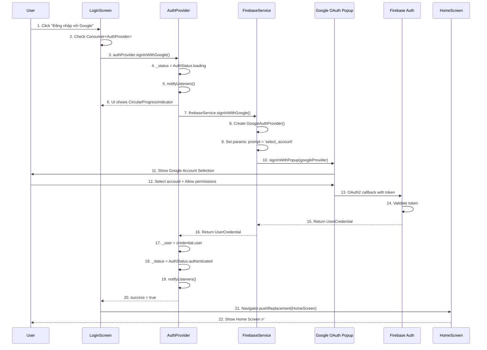
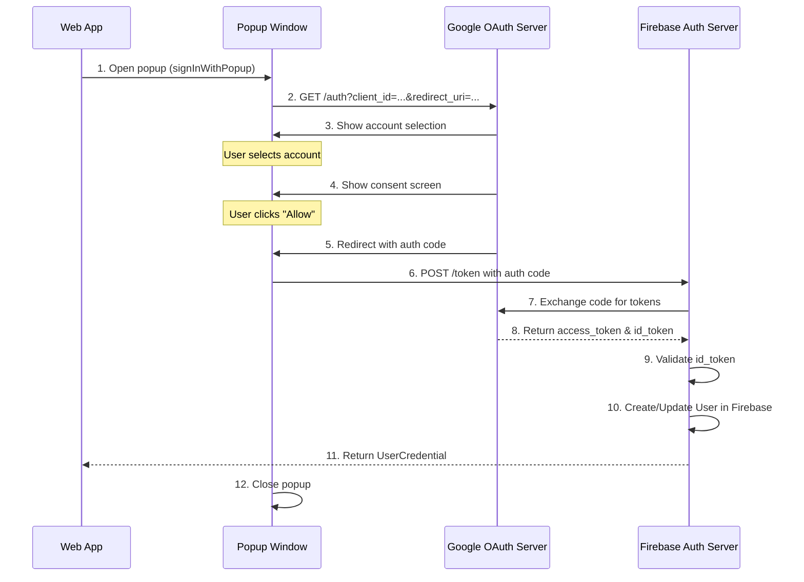

# 🔐 Luồng Đăng nhập Google - Chi tiết

> **Dựa trên tài liệu**: [TẤT_CẢ_LUỒNG_ĐI.md](file:///d:/FlutterProjects/ai_personal_stylist/TẤT_CẢ_LUỒNG_ĐI.md#2-đăng-nhập-google)

---

## 📊 Sơ đồ Tổng quan



**Sơ đồ Sequence của luồng Đăng nhập Google**

---

## 🔍 Chi Tiết Từng Bước

### **BƯỚC 1-2: User Interaction**

#### File: [login_screen.dart](file:///d:/FlutterProjects/ai_personal_stylist/lib/screens/login_screen.dart#L172-L198)

```dart
// Google Sign In Button
SizedBox(
  width: double.infinity,
  child: OutlinedButton.icon(
    onPressed: () => _signInWithGoogle(auth),
    style: OutlinedButton.styleFrom(
      foregroundColor: Colors.white,
      side: const BorderSide(color: Colors.white, width: 2),
      padding: const EdgeInsets.symmetric(vertical: 16),
      shape: RoundedRectangleBorder(
        borderRadius: BorderRadius.circular(16),
      ),
    ),
    icon: Image.network(
      'https://www.google.com/favicon.ico',
      width: 24,
      height: 24,
      errorBuilder: (_, __, ___) => const Icon(Icons.g_mobiledata),
    ),
    label: const Text(
      'Đăng nhập với Google',
      style: TextStyle(
        fontSize: 16,
        fontWeight: FontWeight.w600,
      ),
    ),
  ),
),
```

#### Giải thích:

**Dòng 175: `onPressed: () => _signInWithGoogle(auth)`**
- **Callback**: Khi user tap button → gọi method `_signInWithGoogle`.
- **Parameter `auth`**: Instance của `AuthProvider` từ `Consumer<AuthProvider>` (dòng 132-133).

**Dòng 184-189: Google Favicon Icon**
```dart
icon: Image.network(
  'https://www.google.com/favicon.ico',
  width: 24,
  height: 24,
  errorBuilder: (_, __, ___) => const Icon(Icons.g_mobiledata),
),
```
- Load icon Google từ URL.
- **`errorBuilder`**: Nếu load thất bại (no internet) → fallback về icon `g_mobiledata`.

---

### **BƯỚC 3: Consumer & Loading State**

#### File: [login_screen.dart](file:///d:/FlutterProjects/ai_personal_stylist/lib/screens/login_screen.dart#L132-L136)

```dart
Consumer<AuthProvider>(
  builder: (context, auth, _) {
    if (auth.isLoading) {
      return const CircularProgressIndicator(color: Colors.white);
    }
```

#### Giải thích:

**Dòng 132: `Consumer<AuthProvider>`**
- Listen changes từ `AuthProvider`.
- Rebuild khi `notifyListeners()` được gọi.

**Dòng 134-136: Loading State**
```dart
if (auth.isLoading) {
  return const CircularProgressIndicator(color: Colors.white);
}
```
- **Khi nào**: Khi `AuthProvider._status == AuthStatus.loading`.
- **UI**: Thay thế toàn bộ login buttons bằng loading spinner.
- **Tại sao không dùng overlay**: Đơn giản hơn, user không thể tap gì cả.

---

### **BƯỚC 4-6: Call AuthProvider**

#### File: [login_screen.dart](file:///d:/FlutterProjects/ai_personal_stylist/lib/screens/login_screen.dart#L252-L264)

```dart
Future<void> _signInWithGoogle(AuthProvider auth) async {
  final success = await auth.signInWithGoogle();
  if (success && mounted) {
    Navigator.pushReplacement(
      context,
      MaterialPageRoute(builder: (_) => const HomeScreen()),
    );
  } else if (auth.errorMessage != null && mounted) {
    ScaffoldMessenger.of(context).showSnackBar(
      SnackBar(content: Text(auth.errorMessage!)),
    );
  }
}
```

#### Giải thích chi tiết:

**Dòng 252: Method Signature**
```dart
Future<void> _signInWithGoogle(AuthProvider auth) async {
```
- **`Future<void>`**: Async method, không return giá trị.
- **Parameter `auth`**: AuthProvider instance được truyền từ `Consumer`.

**Dòng 253: Gọi AuthProvider**
```dart
final success = await auth.signInWithGoogle();
```
- **`await`**: Chờ quá trình đăng nhập hoàn tất.
- **Return**: `bool` - `true` nếu thành công, `false` nếu thất bại.
- **Blocking**: UI bị "freeze" tại dòng này cho đến khi:
  - User chọn account Google
  - User cancel popup
  - Có lỗi xảy ra

**Dòng 254-258: Success Case**
```dart
if (success && mounted) {
  Navigator.pushReplacement(
    context,
    MaterialPageRoute(builder: (_) => const HomeScreen()),
  );
}
```
- **`success && mounted`**: 
  - `success`: Đăng nhập thành công.
  - `mounted`: Widget vẫn còn trong tree (chưa bị dispose).
  - **Tại sao check `mounted`**: Nếu user back ngay trong lúc đang login, widget bị dispose → crash nếu gọi `Navigator`.
- **`pushReplacement`**: 
  - Replace LoginScreen bằng HomeScreen.
  - User không thể back về LoginScreen.
  - Clear navigation stack.

**Dòng 259-263: Error Case**
```dart
else if (auth.errorMessage != null && mounted) {
  ScaffoldMessenger.of(context).showSnackBar(
    SnackBar(content: Text(auth.errorMessage!)),
  );
}
```
- Hiển thị SnackBar với error message.
- `auth.errorMessage` được set trong AuthProvider khi có lỗi.

---

### **BƯỚC 7-9: AuthProvider Processing**

#### File: [auth_provider.dart](file:///d:/FlutterProjects/ai_personal_stylist/lib/providers/auth_provider.dart#L49-L74)

```dart
/// Sign in with Google
Future<bool> signInWithGoogle() async {
  try {
    _status = AuthStatus.loading;
    _errorMessage = null;
    notifyListeners();

    final result = await _firebaseService.signInWithGoogle();
    
    if (result != null) {
      _user = result.user;
      _status = AuthStatus.authenticated;
      notifyListeners();
      return true;
    } else {
      _status = AuthStatus.unauthenticated;
      _errorMessage = 'Đăng nhập thất bại';
      notifyListeners();
      return false;
    }
  } catch (e) {
    _status = AuthStatus.error;
    _errorMessage = e.toString();
    notifyListeners();
    return false;
  }
}
```

#### Giải thích từng dòng:

**Dòng 51-53: Set Loading State**
```dart
_status = AuthStatus.loading;
_errorMessage = null;
notifyListeners();
```
- **`_status = loading`**: Đánh dấu đang xử lý.
- **Clear error**: Xóa error message cũ (nếu có).
- **`notifyListeners()`**: 
  - Báo UI rebuild.
  - `Consumer` trong LoginScreen detect `auth.isLoading == true`.
  - UI thay login buttons bằng `CircularProgressIndicator`.

**Dòng 55: Gọi FirebaseService**
```dart
final result = await _firebaseService.signInWithGoogle();
```
- **Blocking point**: Chờ user hoàn tất Google OAuth flow.
- **Return**: `UserCredential?` - object chứa user info hoặc `null` nếu fail.

**Dòng 57-62: Success Path**
```dart
if (result != null) {
  _user = result.user;
  _status = AuthStatus.authenticated;
  notifyListeners();
  return true;
}
```
- **`_user = result.user`**: Lưu User object (chứa uid, email, displayName, photoURL).
- **`_status = authenticated`**: Đánh dấu đã login thành công.
- **`notifyListeners()`**: 
  - UI rebuild.
  - `Consumer` detect `auth.isLoading = false`.
  - `_signInWithGoogle()` nhận `success = true` → navigate HomeScreen.
- **Return `true`**: Báo LoginScreen thành công.

**Dòng 63-68: Failure Path (result == null)**
```dart
else {
  _status = AuthStatus.unauthenticated;
  _errorMessage = 'Đăng nhập thất bại';
  notifyListeners();
  return false;
}
```
- **Khi nào**: FirebaseService return `null` (user cancel, network error).
- Set error message → LoginScreen hiển thị SnackBar.

**Dòng 69-74: Exception Catch**
```dart
catch (e) {
  _status = AuthStatus.error;
  _errorMessage = e.toString();
  notifyListeners();
  return false;
}
```
- Catch bất kỳ exception nào (network crash, Firebase down, popup blocked).
- Log error cho debug.

---

### **BƯỚC 10-15: Firebase Auth - Google OAuth Flow**

#### File: [firebase_service.dart](file:///d:/FlutterProjects/ai_personal_stylist/lib/services/firebase_service.dart#L79-L92)

```dart
/// Sign in with Google
Future<UserCredential?> signInWithGoogle() async {
  try {
    final GoogleAuthProvider googleProvider = GoogleAuthProvider();
    // Force account selection prompt every time
    googleProvider.setCustomParameters({
      'prompt': 'select_account',
    });
    return await _auth.signInWithPopup(googleProvider);
  } catch (e) {
    print('Google Sign-In Error: $e');
    return null;
  }
}
```

#### Giải thích chi tiết:

**Dòng 82: Tạo GoogleAuthProvider**
```dart
final GoogleAuthProvider googleProvider = GoogleAuthProvider();
```
- **`GoogleAuthProvider`**: Class từ `firebase_auth` package.
- Object config cho Google OAuth flow.

**Dòng 84-86: Custom Parameters**
```dart
googleProvider.setCustomParameters({
  'prompt': 'select_account',
});
```
- **`prompt: 'select_account'`**: 
  - **Ý nghĩa**: Bắt buộc user **chọn lại account** mỗi lần đăng nhập.
  - **Tại sao**: 
    - Nếu không set → Google tự động login bằng account đang login trên browser.
    - User không thấy popup → confusing UX.
    - Với `select_account` → luôn show popup để user xác nhận.
- **Alternatives**:
  - `prompt: 'consent'`: Force hiển thị màn hình permissions.
  - `prompt: 'none'`: Silent login (không hiển thị popup).

**Dòng 87: signInWithPopup**
```dart
return await _auth.signInWithPopup(googleProvider);
```
- **`signInWithPopup`**: Method từ Firebase Auth (Web platform).
- **Cơ chế hoạt động**:
  1. Mở **popup window** mới (kích thước ~400x600px).
  2. Redirect đến Google OAuth consent screen.
  3. User chọn account.
  4. User cho phép permissions (email, profile).
  5. Google redirect về Firebase với authorization code.
  6. Firebase exchange code lấy OAuth token.
  7. Firebase tạo User object.
  8. Popup đóng, method return `UserCredential`.

**Dòng 89-92: Error Handling**
```dart
catch (e) {
  print('Google Sign-In Error: $e');
  return null;
}
```
- **Errors có thể xảy ra**:
  - **Popup blocked**: Browser chặn popup.
  - **Network error**: Mất internet trong lúc OAuth.
  - **User cancelled**: User đóng popup.
  - **Invalid domain**: Domain không được whitelist trong Firebase Console.

---

## ⏱️ Timeline Thực Tế

### **Scenario 1: Đăng nhập Thành công**

```
0ms     → User click "Đăng nhập với Google" button
5ms     → _signInWithGoogle(auth) được gọi
10ms    → auth.signInWithGoogle() starts
15ms    → AuthProvider: _status = loading
16ms    → notifyListeners()
20ms    → Consumer rebuilds → Show CircularProgressIndicator
25ms    → FirebaseService.signInWithGoogle() starts
30ms    → Create GoogleAuthProvider, set prompt = 'select_account'
35ms    → signInWithPopup() opens popup window
        ↓
        [USER ACTION - Chọn Google Account]
        User chọn account: accounts.google.com
        User click "Allow" permissions
        
2000ms  → Google OAuth callback complete
2100ms  → Firebase validate token
2150ms  → Firebase create User object
2200ms  → UserCredential returned
2210ms  → AuthProvider: _user = credential.user
2215ms  → AuthProvider: _status = authenticated
2216ms  → notifyListeners()
2220ms  → Consumer rebuilds → Hide loading
2225ms  → _signInWithGoogle receives success = true
2230ms  → Check mounted = true
2235ms  → Navigator.pushReplacement(HomeScreen)
2300ms  → HomeScreen rendered ✅
```

**Tổng thời gian: ~2.3 giây** (phần lớn là user interaction)

---

### **Scenario 2: User Cancel Popup**

```
0ms     → User click button
...
35ms    → Popup opens
        ↓
        [USER ACTION - Cancel]
        User clicks X (close popup)
        
500ms   → Popup closed without credentials
510ms   → signInWithPopup() throws error
515ms   → catch block: return null
520ms   → AuthProvider: result == null
525ms   → _status = unauthenticated
526ms   → _errorMessage = 'Đăng nhập thất bại'
527ms   → notifyListeners()
530ms   → Consumer rebuilds → Show buttons lại
535ms   → _signInWithGoogle receives success = false
540ms   → Check auth.errorMessage != null
545ms   → Show SnackBar: "Đăng nhập thất bại" ❌
```

---

### **Scenario 3: Popup Blocked**

```
0ms     → User click button
...
35ms    → signInWithPopup() tries to open popup
40ms    → Browser blocks popup (popup blocker)
45ms    → Firebase throws error: "popup-blocked"
50ms    → catch block in FirebaseService
55ms    → return null
60ms    → AuthProvider receives null
65ms    → Set error state
70ms    → Show SnackBar: "Popup đã bị chặn. Vui lòng cho phép popup." ❌
```

---

## 🔒 OAuth2 Flow - Behind the Scenes

### **Google OAuth2 Protocol:**



**Chi tiết các bước OAuth2**

---

## 🚨 Error Handling

### **Common Errors & Solutions:**

| Error Code | Nguyên nhân | Giải pháp |
|------------|-------------|-----------|
| `popup-blocked` | Browser block popup | Hướng dẫn user allow popup |
| `popup-closed-by-user` | User đóng popup | Retry, không cần thông báo |
| `network-request-failed` | Mất internet | Kiểm tra kết nối mạng |
| `auth/unauthorized-domain` | Domain chưa whitelist | Thêm domain vào Firebase Console |
| `auth/operation-not-allowed` | Google sign-in chưa enable | Enable trong Firebase Console |
| `auth/account-exists-with-different-credential` | Email đã dùng bằng provider khác | Link accounts hoặc yêu cầu sign in bằng provider cũ |

### **Code xử lý Error trong AuthProvider:**

```dart
catch (e) {
  _status = AuthStatus.error;
  _errorMessage = e.toString();
  notifyListeners();
  return false;
}
```

**Cải tiến có thể làm:**

```dart
catch (e) {
  _status = AuthStatus.error;
  
  // Parse Firebase Auth errors
  if (e is FirebaseAuthException) {
    switch (e.code) {
      case 'popup-blocked':
        _errorMessage = 'Popup bị chặn. Vui lòng cho phép popup và thử lại.';
        break;
      case 'popup-closed-by-user':
        _errorMessage = 'Bạn đã hủy đăng nhập.';
        break;
      case 'network-request-failed':
        _errorMessage = 'Lỗi kết nối. Vui lòng kiểm tra internet.';
        break;
      default:
        _errorMessage = 'Đăng nhập thất bại: ${e.message}';
    }
  } else {
    _errorMessage = 'Đã xảy ra lỗi: ${e.toString()}';
  }
  
  notifyListeners();
  return false;
}
```

---

## 📱 Platform Differences

### **Web (signInWithPopup)**

✅ **Ưu điểm:**
- UX tốt (popup riêng, không rời khỏi app)
- Nhanh (không cần redirect)

❌ **Nhược điểm:**
- Có thể bị popup blocker
- Safari có thể reject nếu user không click button (anti-tracking)

### **Mobile (signInWithCredential)**

> **Lưu ý**: Project này hiện tại chỉ support Web. Để support Mobile, cần:

```dart
// Android & iOS
import 'package:google_sign_in/google_sign_in.dart';

Future<UserCredential?> signInWithGoogle() async {
  final GoogleSignIn googleSignIn = GoogleSignIn();
  final GoogleSignInAccount? account = await googleSignIn.signIn();
  
  if (account == null) return null; // User cancelled
  
  final GoogleSignInAuthentication auth = await account.authentication;
  final credential = GoogleAuthProvider.credential(
    accessToken: auth.accessToken,
    idToken: auth.idToken,
  );
  
  return await _auth.signInWithCredential(credential);
}
```

---

## 💡 Best Practices Được Áp Dụng

### ✅ **1. Mounted Check**

```dart
if (success && mounted) {
  Navigator.pushReplacement(...);
}
```
- Tránh crash khi widget bị dispose trong lúc async operation.

### ✅ **2. Loading State Management**

```dart
_status = AuthStatus.loading;
notifyListeners(); // UI hiển thị loading ngay lập tức
await _firebaseService.signInWithGoogle();
```
- User thấy feedback ngay, không "đơ" UI.

### ✅ **3. Error Messaging**

```dart
if (auth.errorMessage != null && mounted) {
  ScaffoldMessenger.of(context).showSnackBar(
    SnackBar(content: Text(auth.errorMessage!)),
  );
}
```
- User biết chính xác lỗi gì xảy ra.

### ✅ **4. Force Account Selection**

```dart
googleProvider.setCustomParameters({
  'prompt': 'select_account',
});
```
- User luôn kiểm soát được account nào đang login.
- Tránh nhầm lẫn khi có nhiều Google accounts.

### ✅ **5. Navigation Strategy**

```dart
Navigator.pushReplacement(
  context,
  MaterialPageRoute(builder: (_) => const HomeScreen()),
);
```
- **`pushReplacement`** thay vì `push`:
  - Clear LoginScreen khỏi stack.
  - User không thể back về LoginScreen sau khi login.
  - Consistent với UX pattern của authentication.

---

## 🎯 Security Considerations

### **1. OAuth State Parameter**

Firebase Auth tự động add `state` parameter để prevent CSRF attacks:

```
https://accounts.google.com/o/oauth2/auth?
  client_id=...
  &redirect_uri=...
  &state=randomly_generated_token  ← Firebase tự động thêm
```

### **2. Token Validation**

```dart
FB->>FB: 9. Validate id_token
```
- Firebase verify token signature with Google's public keys.
- Đảm bảo token không bị tamper.

### **3. HTTPS Only**

- OAuth redirect chỉ work với HTTPS (production).
- Localhost cho phép HTTP (development).

### **4. Domain Whitelist**

Trong Firebase Console → Authentication → Settings → Authorized domains:
```
- localhost (auto-added)
- your-app.web.app (auto-added for Firebase Hosting)
- your-custom-domain.com (manual add)
```

---

## 🔗 Files Liên Quan

- [login_screen.dart](file:///d:/FlutterProjects/ai_personal_stylist/lib/screens/login_screen.dart#L172-L264) - UI & button handler
- [auth_provider.dart](file:///d:/FlutterProjects/ai_personal_stylist/lib/providers/auth_provider.dart#L49-L74) - State management
- [firebase_service.dart](file:///d:/FlutterProjects/ai_personal_stylist/lib/services/firebase_service.dart#L79-L92) - Firebase Auth API
- [home_screen.dart](file:///d:/FlutterProjects/ai_personal_stylist/lib/screens/home_screen.dart) - Màn hình sau login

---

## 📝 Tóm Tắt

### **Flow tóm gọn:**

```
User click → Loading state → Popup Google → User select account 
→ OAuth callback → Firebase validate → Update state → Navigate HomeScreen
```

### **Key Components:**

| Component | Role | Output |
|-----------|------|--------|
| **LoginScreen** | UI & Navigation | Trigger sign in, navigate to HomeScreen |
| **AuthProvider** | State management | Loading/Success/Error states |
| **FirebaseService** | Firebase Auth integration | UserCredential or null |
| **Google OAuth** | Identity verification | Authorization code → Tokens |

### **Critical Points:**

1. ✅ **Always check `mounted`** trước khi navigate
2. ✅ **Set loading state** trước khi async call
3. ✅ **Handle errors gracefully** với user-friendly messages
4. ✅ **Use `pushReplacement`** để clear auth screens khỏi stack
5. ✅ **Force account selection** để tránh auto-login confusion

---

**Bạn muốn tôi giải thích luồng nào tiếp theo?**
- Load Tủ Đồ (Firestore queries)
- Thêm Item với AI (Image compression + Gemini)
- Gợi ý Outfit (AI prompting + Weather integration)
