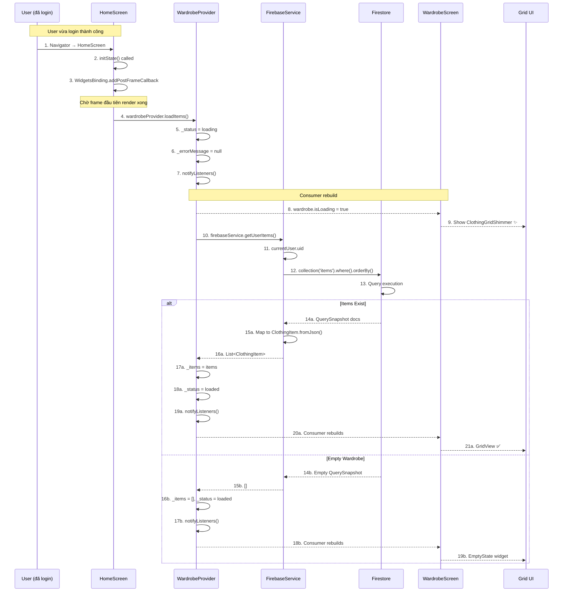

# 📦 Luồng Load Tủ Đồ (Ban đầu) - Chi tiết

> **Mục tiêu**: Hiểu cách app load danh sách items từ Firestore khi user vào HomeScreen

---

## 📊 Sơ đồ Tổng quan



---

## 🔍 Chi Tiết Từng Bước

### **BƯỚC 1-3: HomeScreen initState - Trigger Load**

#### File: [home_screen.dart:L28-43](file:///d:/FlutterProjects/ai_personal_stylist/lib/screens/home_screen.dart#L28-L43)

```dart
@override
void initState() {
  super.initState();
  _screens = [
    _HomeTab(onViewAllTap: () => _navigateToTab(1)),
    const WardrobeScreen(),
    const OutfitSuggestScreen(),
    const ProfileScreen(),
  ];
  // Load data khi vào home
  WidgetsBinding.instance.addPostFrameCallback((_) {
    final wardrobeProvider = context.read<WardrobeProvider>();
    wardrobeProvider.loadItems();
    wardrobeProvider.loadWeather();
  });
}
```

#### **Giải thích từng phần:**

**Dòng 29: `@override void initState()`**
- **`@override`**: Annotation báo rằng method này ghi đè (override) method `initState()` của class cha (`State`)
- **`initState()`**: Method được gọi **MỘT LẦN DUY NHẤT** khi State object được tạo
- **Timing**: Được gọi trước `build()`, sau `createState()`

**Dòng 30: `super.initState()`**
- **Bắt buộc** gọi trước khi làm gì khác
- Gọi `initState()` của class cha để đảm bảo setup đúng

**Dòng 31-36: Khởi tạo `_screens`**
```dart
_screens = [
  _HomeTab(onViewAllTap: () => _navigateToTab(1)),
  const WardrobeScreen(),
  const OutfitSuggestScreen(),
  const ProfileScreen(),
];
```
- **`_screens`**: `late final List<Widget>` - danh sách 4 screens cho 4 tabs
- **`onViewAllTap: () => _navigateToTab(1)`**: Callback function, khi tap "Xem tất cả" ở HomeTab → chuyển sang tab index 1 (WardrobeScreen)
- **`const`**: Widgets không đổi (stateless) → optimize performance

---

**Dòng 38-42: `addPostFrameCallback` - Phần QUAN TRỌNG NHẤT** 🔥

```dart
WidgetsBinding.instance.addPostFrameCallback((_) {
  final wardrobeProvider = context.read<WardrobeProvider>();
  wardrobeProvider.loadItems();
  wardrobeProvider.loadWeather();
});
```

#### **Phân tích chi tiết:**

**`WidgetsBinding.instance`**
- **`WidgetsBinding`**: Singleton class quản lý Flutter framework
- **`.instance`**: Lấy instance duy nhất của WidgetsBinding
- **Vai trò**: Bridge giữa Flutter framework và engine

**`addPostFrameCallback(callback)`**
- **Tham số**: Một function (callback) với signature `void Function(Duration timeStamp)`
- **`(_)`**: Parameter ignored (không dùng `timeStamp`)
- **Khi nào chạy**: SAU KHI frame đầu tiên render xong

**Timeline chi tiết:**
```
0ms   → initState() called
1ms   → addPostFrameCallback() registered (chưa chạy callback!)
2ms   → initState() hoàn thành, return
5ms   → build() được gọi
16ms  → First frame rendered (60fps = 16.67ms/frame)
17ms  → POST-FRAME CALLBACK FIRES ← Callback chạy ở đây!
18ms  → loadItems() được gọi
```

---

**Tại sao KHÔNG gọi trực tiếp `loadItems()` trong `initState`?**

```dart
// ❌ SAI - Sẽ BỊ LỖI!
@override
void initState() {
  super.initState();
  final provider = context.read<WardrobeProvider>();
  provider.loadItems(); // ← Gọi ngay ở đây
}
```

**Vấn đề:**
1. `provider.loadItems()` → gọi `notifyListeners()`
2. `notifyListeners()` → trigger rebuild tất cả Consumer widgets
3. Rebuild xảy ra **TRONG LÚC** Flutter đang build first frame
4. → **Flutter Error**: `"setState() or markNeedsBuild() called during build"`

**✅ ĐÚNG - Với `postFrameCallback`:**
```dart
WidgetsBinding.instance.addPostFrameCallback((_) {
  // Chờ first frame vẽ xong → safe to call notifyListeners
  context.read<WardrobeProvider>().loadItems();
});
```

**Lợi ích:**
- Đảm bảo first frame đã render xong
- `notifyListeners()` không conflict với build cycle
- App không crash

---

**`context.read<WardrobeProvider>()`**

Cú pháp này đến từ **Provider package**:

```dart
final wardrobeProvider = context.read<WardrobeProvider>();
```

**Breakdown:**
- **`context`**: BuildContext - reference đến vị trí widget trong widget tree
- **`.read<T>()`**: Method từ Provider package
- **`<WardrobeProvider>`**: Generic type - loại Provider cần lấy
- **Return**: Instance của WardrobeProvider

**`read` vs `watch`:**

| Method | Khi nào dùng | Rebuild khi Provider changes? |
|--------|--------------|-------------------------------|
| `read()` | Chỉ gọi method 1 lần | ❌ No |
| `watch()` | Build UI dựa trên data | ✅ Yes |

**Ở đây dùng `read()` vì:**
- Chỉ cần gọi `loadItems()` một lần
- Không cần rebuild khi Provider changes (sẽ dùng `Consumer` ở nơi khác)

---

**`wardrobeProvider.loadItems()`**

Gọi method `loadItems()` của WardrobeProvider để fetch data từ Firestore.

---

### **BƯỚC 4-7: WardrobeProvider - Set Loading State**

#### File: [wardrobe_provider.dart:L115-129](file:///d:/FlutterProjects/ai_personal_stylist/lib/providers/wardrobe_provider.dart#L115-L129)

```dart
/// Load all items for current user
Future<void> loadItems() async {
  try {
    _status = WardrobeStatus.loading;
    _errorMessage = null;
    notifyListeners();

    _items = await _firebaseService.getUserItems();
    _status = WardrobeStatus.loaded;
    notifyListeners();
  } catch (e) {
    _status = WardrobeStatus.error;
    _errorMessage = e.toString();
    notifyListeners();
  }
}
```

#### **Giải thích từng dòng:**

**Dòng 116: `Future<void> loadItems() async`**
- **`Future<void>`**: Return type - async function không return value
- **`async`**: Keyword đánh dấu function chạy bất đồng bộ (asynchronous)
- **Cho phép dùng `await`** trong function body

**Dòng 117: `try {`**
- Bắt đầu try-catch block để handle errors

**Dòng 118: `_status = WardrobeStatus.loading;`**
- **`_status`**: Private variable (underscore `_`)
- **`WardrobeStatus`**: Enum với các values: `initial`, `loading`, `loaded`, `error`
- **Set `loading`**: Đánh dấu đang load data

**Enum Definition:**
```dart
enum WardrobeStatus {
  initial,  // Chưa load lần nào
  loading,  // Đang load
  loaded,   // Load xong
  error,    // Có lỗi
}
```

**Dòng 119: `_errorMessage = null;`**
- Clear error message cũ (nếu có từ lần load trước)
- **Type**: `String?` (nullable)

**Dòng 120: `notifyListeners();`**
- **CỰC KỲ QUAN TRỌNG!**
- Method từ `ChangeNotifier` (class cha của WardrobeProvider)
- **Vai trò**: Notify tất cả listeners (Consumers) rằng state đã thay đổi
- **Effect**: Tất cả `Consumer<WardrobeProvider>` widgets sẽ rebuild

**Flow:**
```
_status = loading
    ↓
notifyListeners() called
    ↓
All Consumer<WardrobeProvider> build() methods re-run
    ↓
WardrobeScreen checks wardrobe.isLoading
    ↓
Returns ClothingGridShimmer widget
    ↓
UI shows shimmer animation ✨
```

---

**Dòng 122: `_items = await _firebaseService.getUserItems();`**

**Cú pháp:**
- **`await`**: Keyword đợi Future complete
- **`_firebaseService.getUserItems()`**: Return `Future<List<ClothingItem>>`
- **`await`** unwrap Future → lấy `List<ClothingItem>` thật
- **Assign** vào `_items`

**Không có `await`:**
```dart
_items = _firebaseService.getUserItems(); // ❌ Sai!
// _items type: Future<List<ClothingItem>> ← Sai type!
```

**Có `await`:**
```dart
_items = await _firebaseService.getUserItems(); // ✅ Đúng
// _items type: List<ClothingItem> ← Đúng!
```

**Dòng 123: `_status = WardrobeStatus.loaded;`**
- Set status thành `loaded` - đã load xong

**Dòng 124: `notifyListeners();`**
- Notify lại lần nữa!
- **Effect**: Consumer rebuild với data mới (`_items`)

---

**Dòng 125-129: Error handling**
```dart
} catch (e) {
  _status = WardrobeStatus.error;
  _errorMessage = e.toString();
  notifyListeners();
}
```

- **`catch (e)`**: Bắt mọi exception
- **`e.toString()`**: Convert exception thành string
- Notify để UI hiển thị error state

---

### **BƯỚC 8-9: Consumer Rebuild - Show Shimmer**

#### File: [wardrobe_screen.dart:L229-236](file:///d:/FlutterProjects/ai_personal_stylist/lib/screens/wardrobe_screen.dart#L229-L236)

```dart
Expanded(
  child: Consumer<WardrobeProvider>(
    builder: (context, wardrobe, _) {
      if (wardrobe.isLoading) {
        return Padding(
          padding: const EdgeInsets.all(16),
          child: ClothingGridShimmer(),
        );
      }
      
      if (wardrobe.items.isEmpty) {
        return EmptyState(...);
      }
      
      return RefreshIndicator(
        child: GridView.builder(...),
      );
    },
  ),
),
```

#### **Giải thích chi tiết:**

**`Expanded` widget:**
```dart
Expanded(
  child: ...
)
```
- **Vai trò**: Chiếm hết space còn lại trong Column/Row
- Ở đây: Chiếm space dưới header và category filters

**`Consumer<WardrobeProvider>` widget:**
```dart
Consumer<WardrobeProvider>(
  builder: (context, wardrobe, _) {
    // Build UI here
  },
)
```

**Consumer là gì?**
- Widget từ Provider package
- **Listen** to Provider changes
- **Rebuild** khi Provider gọi `notifyListeners()`

**Generic `<WardrobeProvider>`:**
- Specify loại Provider cần listen
- Type-safe: Compiler check đúng type

**`builder` parameter:**
```dart
builder: (context, wardrobe, _) {
  // Function body
}
```

**Signature:**
```dart
Widget Function(BuildContext context, T value, Widget? child)
```

**Parameters:**
- **`context`**: BuildContext - vị trí trong widget tree
- **`wardrobe`**: WardrobeProvider instance - data object
- **`_`**: Widget? child - optional child (không dùng nên ignore với `_`)

**Method này được gọi khi nào?**
1. Lần đầu Consumer được add vào tree
2. Mỗi khi WardrobeProvider gọi `notifyListeners()`

---

**`if (wardrobe.isLoading)` - Check Loading State**

```dart
if (wardrobe.isLoading) {
  return Padding(
    padding: const EdgeInsets.all(16),
    child: ClothingGridShimmer(),
  );
}
```

**`wardrobe.isLoading`:**
- **Getter** trong WardrobeProvider:
  ```dart
  bool get isLoading => _status == WardrobeStatus.loading;
  ```
- **Return**: `true` nếu `_status == loading`, ngược lại `false`

**`ClothingGridShimmer()`:**
- Custom widget hiển thị shimmer effect
- "Skeleton screen" - placeholder animation
- **Better UX** hơn CircularProgressIndicator

**Visual:**
```
┌────────┐  ┌────────┐
│░░░░░░░░│  │░░░░░░░░│  ← Shimmer animation (sáng tối liên tục)
│░░░░░░░░│  │░░░░░░░░│
└────────┘  └────────┘
┌────────┐  ┌────────┐
│░░░░░░░░│  │░░░░░░░░│
│░░░░░░░░│  │░░░░░░░░│
└────────┘  └────────┘
```

---

### **BƯỚC 10-13: Firestore Query**

#### File: [firebase_service.dart:L187-205](file:///d:/FlutterProjects/ai_personal_stylist/lib/services/firebase_service.dart#L187-L205)

```dart
Future<List<ClothingItem>> getUserItems() async {
  try {
    final userId = currentUser?.uid;
    if (userId == null) return [];
    
    final snapshot = await _itemsRef
        .where('userId', isEqualTo: userId)
        .orderBy('createdAt', descending: true)
        .get();
    
    return snapshot.docs
        .map((doc) => ClothingItem.fromJson(doc.data(), doc.id))
        .toList();
  } catch (e) {
    print('Get Items Error: $e');
    return [];
  }
}
```

#### **Giải thích từng dòng:**

**Dòng 189: `final userId = currentUser?.uid;`**

**Cú pháp:**
- **`currentUser`**: Getter return `User?` (nullable) từ FirebaseAuth
- **`?.uid`**: Null-aware operator
  - Nếu `currentUser != null` → lấy `.uid`
  - Nếu `currentUser == null` → return `null`
- **`final`**: Immutable variable

**Equivalent code:**
```dart
String? userId;
if (currentUser != null) {
  userId = currentUser.uid;
} else {
  userId = null;
}
```

**Dòng 190: `if (userId == null) return [];`**
- **Guard clause**: Early return nếu user chưa login
- Return empty list thay vì throw error

---

**Dòng 192-195: Firestore Query** 🔥

```dart
final snapshot = await _itemsRef
    .where('userId', isEqualTo: userId)
    .orderBy('createdAt', descending: true)
    .get();
```

**Cú pháp từng phần:**

**`_itemsRef`:**
```dart
CollectionReference<Map<String, dynamic>> get _itemsRef =>
    _firestore.collection('items');
```
- **Type**: `CollectionReference<Map<String, dynamic>>`
- **Reference** đến collection `'items'` trong Firestore
- **Chưa fetch data**, chỉ là reference

**`.where('userId', isEqualTo: userId)`:**
- **Method**: `where(String field, {Object? isEqualTo})`
- **Tham số 1**: `'userId'` - field name trong document
- **Named parameter**: `isEqualTo: userId` - value để filter
- **Effect**: **Filter** chỉ documents có `userId` field == user hiện tại
- **Return**: `Query` object (chưa execute)

**Firestore document structure:**
```json
{
  "userId": "user_abc123",
  "imageBase64": "...",
  "type": "top",
  "color": "blue",
  ...
}
```

**`.orderBy('createdAt', descending: true)`:**
- **Method**: `orderBy(String field, {bool descending})`
- **Tham số 1**: `'createdAt'` - field để sort
- **Named parameter**: `descending: true` - sort giảm dần (newest first)
- **Return**: `Query` object (vẫn chưa execute)

**⚠️ Composite Index Required!**

Firestore yêu cầu **composite index** cho query kết hợp `where` + `orderBy`:

```
Collection: items
Fields indexed:
  - userId (Ascending)
  - createdAt (Descending)
```

**Tại sao cần index?**
- Firestore là NoSQL database
- Để query nhanh, phải có index sẵn
- Không có index → query fail với error

**Tạo index:**
- Lần đầu chạy query → Firestore báo lỗi + link tạo index
- Click link → auto-tạo index
- Đợi vài phút → index ready → query works

**`.get()`:**
- **Method**: `Future<QuerySnapshot> get()`
- **Execute query** và fetch data từ server
- **Return**: `Future<QuerySnapshot>`
- **`await`** để lấy `QuerySnapshot` thật

**`QuerySnapshot` là gì?**
```dart
class QuerySnapshot {
  List<QueryDocumentSnapshot> docs;  // Danh sách documents
  int size;                          // Số documents
  // ... other properties
}
```

---

**Dòng 197-199: Map Documents to Objects**

```dart
return snapshot.docs
    .map((doc) => ClothingItem.fromJson(doc.data(), doc.id))
    .toList();
```

**Breakdown:**

**`snapshot.docs`:**
- **Type**: `List<QueryDocumentSnapshot>`
- Danh sách tất cả documents match query

**`QueryDocumentSnapshot` structure:**
```dart
class QueryDocumentSnapshot {
  String id;                   // Document ID
  Map<String, dynamic> data(); // Document data
  // ... other methods
}
```

**`.map((doc) => ...)`:**
- **Method**: `Iterable<T> map<T>(T Function(E) f)`
- **Transform** mỗi document thành `ClothingItem`
- **`(doc) => ...`**: Arrow function - shorthand for function

**Equivalent code:**
```dart
.map((doc) {
  return ClothingItem.fromJson(doc.data(), doc.id);
})
```

**`ClothingItem.fromJson(doc.data(), doc.id)`:**
- **Factory constructor** của ClothingItem
- **Tham số 1**: `doc.data()` - `Map<String, dynamic>` chứa fields
- **Tham số 2**: `doc.id` - `String` document ID
- **Return**: `ClothingItem` object

**Factory constructor trong ClothingItem:**
```dart
factory ClothingItem.fromJson(Map<String, dynamic> json, String id) {
  return ClothingItem(
    id: id,
    userId: json['userId'] as String,
    imageBase64: json['imageBase64'] as String,
    type: ClothingType.values.firstWhere(
      (e) => e.name == json['type'],
      orElse: () => ClothingType.other,
    ),
    color: json['color'] as String,
    // ... parse other fields
    createdAt: (json['createdAt'] as Timestamp).toDate(),
  );
}
```

**`.toList()`:**
- Convert `Iterable<ClothingItem>` → `List<ClothingItem>`
- **Cần thiết** vì `map()` return `Iterable`, không phải `List`

---

**Dòng 200-204: Error Handling**

```dart
} catch (e) {
  print('Get Items Error: $e');
  return [];
}
```

**Errors có thể xảy ra:**
1. **Network error**: Mất internet
2. **Permission denied**: Firestore Rules chặn read
3. **Index missing**: Composite index chưa tạo
4. **Parse error**: Document structure không match model

**Behavior:**
- Print error to console (debug)
- Return empty list (không crash app)
- WardrobeProvider nhận `[]` → hiển thị EmptyState

---

### **BƯỚC 14-18: Display Grid / Empty State**

#### **Scenario A: Items Exist**

```dart
return RefreshIndicator(
  onRefresh: () => wardrobe.loadItems(),
  child: GridView.builder(
    padding: const EdgeInsets.all(16),
    gridDelegate: const SliverGridDelegateWithFixedCrossAxisCount(
      crossAxisCount: 2,
      crossAxisSpacing: 12,
      mainAxisSpacing: 12,
      childAspectRatio: 0.75,
    ),
    itemCount: wardrobe.items.length,
    itemBuilder: (context, index) {
      final item = wardrobe.items[index];
      return ClothingCard(
        item: item,
        onTap: () => _navigateToDetail(item),
        onLongPress: () => _showItemOptions(item),
        onFavorite: () => wardrobe.toggleFavorite(item),
      );
    },
  ),
);
```

**RefreshIndicator:**
- **Material Design** pull-to-refresh widget
- **`onRefresh`**: Callback gọi khi user pull down
- **Return**: `Future<void>` - đợi async operation complete

**GridView.builder:**
- **Lazy loading** grid
- Chỉ build visible items + một vài items xung quanh
- **Better performance** với large lists

**gridDelegate: `SliverGridDelegateWithFixedCrossAxisCount`:**
- **`crossAxisCount: 2`**: 2 columns
- **`crossAxisSpacing: 12`**: Spacing giữa columns (horizontal)
- **`mainAxisSpacing: 12`**: Spacing giữa rows (vertical)
- **`childAspectRatio: 0.75`**: Width/Height ratio
  - 0.75 = 3:4 aspect ratio (portrait)
  - Nếu width = 100 → height = 133

**itemCount: `wardrobe.items.length`:**
- Số lượng items trong grid
- `items` getter return filtered list

**itemBuilder:**
- Function build widget cho mỗi index
- **Gọi lazy**: Chỉ gọi khi item visible

---

#### **Scenario B: Empty Wardrobe**

```dart
if (wardrobe.items.isEmpty) {
  return EmptyState(
    icon: Icons.checkroom,
    title: 'Tủ đồ trống',
    subtitle: 'Hãy thêm quần áo để bắt đầu!',
    action: ElevatedButton.icon(
      onPressed: () => Navigator.push(...AddItemScreen()),
      icon: const Icon(Icons.add),
      label: const Text('Thêm đồ mới'),
    ),
  );
}
```

**EmptyState:**
- Custom widget hiển thị khi không có data
- Better UX hơn blank screen
- **Call-to-action** button để add first item

---

## ⏱️ Timeline Thực Tế

```
0ms     → User login thành công
5ms     → Navigator.pushReplacement(HomeScreen)
10ms    → HomeScreen.createState()
15ms    → HomeScreen.initState()
17ms    →   addPostFrameCallback registered
20ms    → HomeScreen.build()
35ms    → First frame rendered
50ms    → PostFrameCallback fires ← Vì sao 50ms? (Có thể chậm hơn 16ms nếu first build phức tạp)
52ms    → context.read<WardrobeProvider>()
54ms    → wardrobeProvider.loadItems()
55ms    →   _status = loading
56ms    →   notifyListeners()
60ms    → Consumer<WardrobeProvider> rebuild
65ms    → ClothingGridShimmer rendered ✨
        ↓
        [FIRESTORE QUERY]
        
150ms   → Firestore query complete (depends on network)
155ms   → snapshot.docs.map() - parse 10 items (~0.5ms each)
160ms   → Return List<ClothingItem>
161ms   → _items = items
162ms   → _status = loaded
163ms   → notifyListeners()
168ms   → Consumer rebuild
175ms   → GridView.builder starts building
200ms   → All visible ClothingCards rendered ✅
```

**Tổng: ~200ms** từ HomeScreen → Grid hiển thị

---

## 🔄 Filter Mechanism (Client-side)

```dart
// User tap category chip
setState(() => _selectedCategory = 'top');
if (category == 'all') {
  wardrobeProvider.clearFilter();
} else {
  wardrobeProvider.setFilterCategory('top');
}
```

**WardrobeProvider:**

```dart
void setFilterCategory(String? category) {
  _filterCategory = category;
  notifyListeners();
}

void clearFilter() {
  _filterCategory = null;
  _filterType = null;
  notifyListeners();
}
```

**Filtered Getter:**

```dart
List<ClothingItem> get items => _filteredItems;

List<ClothingItem> get _filteredItems {
  if (_filterCategory != null) {
    return _items.where((item) {
      return item.type.category == _filterCategory;
    }).toList();
  }
  return _items;
}
```

**`.where()` method:**
- Filter list dựa trên condition
- **Không modify** `_items` gốc
- Return new filtered list

**Tại sao filter ở client, không query lại Firestore?**

**Client-side (Current):**
- **Pros**: Instant (0ms), no network roundtrip, no Firestore read costs
- **Cons**: Phải load all items trước

**Server-side (Alternative):**
- **Pros**: Chỉ load items cần thiết
- **Cons**: Mỗi filter = 1 Firestore query (~100-200ms), tốn read quota

**Verdict**: Client-side tốt hơn cho small datasets (<100 items)

---

## 💡 Best Practices Đã Áp Dụng

### ✅ **1. postFrameCallback Pattern**

```dart
WidgetsBinding.instance.addPostFrameCallback((_) {
  // Safe to call notifyListeners here
  wardrobeProvider.loadItems();
});
```

**Tránh**: `setState() during build` error

### ✅ **2. Shimmer Loading (Skeleton Screen)**

```dart
if (wardrobe.isLoading) {
  return ClothingGridShimmer(); // ← Better than CircularProgressIndicator
}
```

**Lợi ích:**
- Users thấy structure of content
- Perceived performance tốt hơn
- Modern UX pattern

### ✅ **3. Empty State with CTA**

```dart
EmptyState(
  title: 'Tủ đồ trống',
  action: ElevatedButton('Thêm đồ mới'),
)
```

**Lợi ích:**
- Clear call-to-action
- Users biết làm gì tiếp theo

### ✅ **4. Pull-to-Refresh**

```dart
RefreshIndicator(
  onRefresh: () => wardrobe.loadItems(),
  child: GridView(...),
)
```

**Lợi ích:**
- Native gesture
- Familiar UX pattern
- Easy to implement

### ✅ **5. Lazy Loading with GridView.builder**

```dart
GridView.builder(
  itemBuilder: (context, index) {
    // Only build visible items
  },
)
```

**Lợi ích:**
- Better performance
- Lower memory usage
- Smooth scrolling

---

## 📝 Tóm Tắt

### **Flow:**
```
HomeScreen initState → postFrameCallback → loadItems() 
→ Firestore query (where + orderBy) → Map to objects 
→ Update state → notifyListeners() → Consumer rebuilds → GridView
```

### **Key Timeline:**

| Event | Time | UI State |
|-------|------|----------|
| initState() | 0ms | - |
| First frame | 35ms | Blank |
| PostFrameCallback | 50ms | - |
| Loading set | 56ms | **Shimmer** ✨ |
| Firestore complete | 150ms | Still shimmer |
| Loaded set | 163ms | **Grid render starts** |
| Grid rendered | 200ms | **Grid visible** ✅ |

### **Firestore Query:**
```sql
-- Pseudo-SQL (Firestore là NoSQL nhưng query tương tự)
SELECT *
FROM items
WHERE userId = 'current_user_uid'
ORDER BY createdAt DESC
```

**Requires Index:**
```
Collection: items
Fields: userId (ASC), createdAt (DESC)
```

---

## 🔗 Files Liên Quan

- [home_screen.dart:L38-42](file:///d:/FlutterProjects/ai_personal_stylist/lib/screens/home_screen.dart#L38-L42) - initState load trigger
- [wardrobe_screen.dart:L229-284](file:///d:/FlutterProjects/ai_personal_stylist/lib/screens/wardrobe_screen.dart#L229-L284) - Consumer & UI
- [wardrobe_provider.dart:L115-129](file:///d:/FlutterProjects/ai_personal_stylist/lib/providers/wardrobe_provider.dart#L115-L129) - loadItems logic
- [firebase_service.dart:L187-205](file:///d:/FlutterProjects/ai_personal_stylist/lib/services/firebase_service.dart#L187-L205) - Firestore query

---

**Đã hiểu luồng Load Tủ Đồ chi tiết! 📦✅**
