# Flow 17: Load Weather Data (Tải Dữ Liệu Thời Tiết)

## 📋 Mục Lục
1. [Tổng Quan](#tổng-quan)
2. [Sơ Đồ Luồng](#sơ-đồ-luồng)
3. [Chi Tiết Kỹ Thuật](#chi-tiết-kỹ-thuật)
4. [Code Implementation](#code-implementation)
5. [OpenWeatherMap API Integration](#openweathermap-api-integration)
6. [Use Cases & Examples](#use-cases--examples)
7. [Flows Liên Quan](#flows-liên-quan)

---

## Tổng Quan

### Mục Đích
Flow này tích hợp **OpenWeatherMap API** để lấy thông tin thời tiết real-time cho user's location. Weather data được sử dụng trong **Flow 14 (Suggest Outfit)** để AI gợi ý outfit phù hợp với thời tiết hiện tại.

### Trigger Points
1. **App Startup**: Auto load weather khi user vào HomeScreen (init callback)
2. **Change Location**: User chọn city khác trong ProfileScreen/HomeScreen
3. **Manual Refresh**: User tap vào WeatherWidget để reload (optional)
4. **Suggest Outfit**: Flow 14 check weather trước khi suggest

### Input Data
- **City Name**: String (VD: "Quy Nhon", "Ho Chi Minh", "Hanoi")
- **Country Code**: String (default: "VN")
- **API Key**: OpenWeatherMap API key từ constants

### Output Data
- **WeatherInfo**: Object chứa temperature, feelsLike, humidity, windSpeed, description, icon
- **Clothing Suggestions**: Array of tips dựa vào weather (VD: "Nên mặc áo khoác dày")
- **Cache**: Weather data được cache 30 phút để giảm API calls

### Weather Data Structure
```dart
WeatherInfo {
  temperature: 28.0,          // ← Nhiệt độ thực tế (°C)
  feelsLike: 30.0,           // ← Cảm giác như (°C)
  humidity: 70,              // ← Độ ẩm (%)
  windSpeed: 3.0,            // ← Tốc độ gió (m/s)
  description: "Partly cloudy",  // ← Mô tả thời tiết
  icon: "02d",               // ← Icon code (từ OpenWeatherMap)
  cityName: "Quy Nhon",      // ← Tên thành phố
  timestamp: DateTime.now(), // ← Thời điểm fetch
}
```

---

## Sơ Đồ Luồng

### Flow Diagram - Auto Load (App Startup)
```mermaid
sequenceDiagram
    participant U as User
    participant HS as HomeScreen
    participant WP as WardrobeProvider
    participant WS as WeatherService
    participant API as OpenWeatherMap API

    Note over U,API: ☀️ AUTO LOAD WEATHER (APP STARTUP)

    %% Bước 1-3: User open app
    U->>HS: 1. Navigate to HomeScreen<br/>(after login)
    HS->>HS: 2. initState() called
    HS->>HS: 3. addPostFrameCallback()
    
    Note over HS: WidgetsBinding.instance.addPostFrameCallback((_) {<br/>  wardrobeProvider.loadItems();<br/>  wardrobeProvider.loadWeather();<br/>});

    %% Bước 4-6: Load weather
    HS->>WP: 4. loadWeather()
    WP->>WS: 5. getCurrentWeather(city: "Quy Nhon")
    
    %% Bước 7-9: Check cache
    WS->>WS: 6. Check _cachedWeather != null?
    WS->>WS: 7. Check cache expiry<br/>(30 minutes)
    
    alt Cache valid (< 30 min)
        WS-->>WP: 8a. Return cached weather
        Note over WS: Skip API call,<br/>instant return
        WP-->>HS: 9a. Return weather
        HS->>U: 10a. Display WeatherWidget
        
    else Cache expired or null
        WS->>WS: 8b. Check API key valid
        
        alt API key missing/invalid
            WS->>WS: 9b. _getDefaultWeather()
            Note over WS: Fallback: 28°C, Partly cloudy<br/>Quy Nhon, Vietnam
            WS-->>WP: 10b. Return default weather
            WP-->>HS: 11b. Return weather
            HS->>U: 12b. Display WeatherWidget (default)
            
        else API key valid
            %% Bước 13-17: Call OpenWeatherMap API
            WS->>WS: 9c. Build API URL
            Note over WS: https://api.openweathermap.org/data/2.5/weather<br/>?q=Quy Nhon,VN<br/>&appid={API_KEY}<br/>&units=metric
            
            WS->>API: 10. GET /weather<br/>timeout: 10s
            
            Note over API: OpenWeatherMap processing<br/>~1-2 giây
            
            alt API success
                API-->>WS: 11a. JSON response (200 OK)
                Note over API: {"main": {"temp": 28, "feels_like": 30, ...},<br/>"weather": [{"description": "...", "icon": "02d"}],<br/>"name": "Quy Nhon"}
                
                WS->>WS: 12. WeatherInfo.fromJson(json)
                WS->>WS: 13. Cache weather + timestamp
                WS-->>WP: 14. Return WeatherInfo
                
            else API fail/timeout
                API-->>WS: 11b. Error (timeout/4xx/5xx)
                WS->>WS: 12. _getDefaultWeather()
                WS-->>WP: 13. Return default weather
            end
            
            WP->>WP: 15. setState(_weather = weather)
            WP->>WP: 16. notifyListeners()
            WP-->>HS: 17. Weather updated
            
            HS->>HS: 18. Consumer<WardrobeProvider> rebuild
            HS->>U: 19. Display WeatherWidget
        end
    end

    Note over U,API: ✅ WEATHER LOADED (~2-3s hoặc instant nếu cached)
```

### Flow Diagram - Change Location

```mermaid
sequenceDiagram
    participant U as User
    participant HS as HomeScreen
    participant WP as WardrobeProvider
    participant WS as WeatherService
    participant API as OpenWeatherMap API

    Note over U,API: 🌍 CHANGE WEATHER LOCATION FLOW

    %% Bước 1-4: User tap weather widget
    U->>HS: 1. Tap WeatherWidget
    HS->>HS: 2. onTap: _showChangeLocationDialog()
    HS->>U: 3. Show city picker dialog
    Note over U: Dialog shows cities:<br/>- Quy Nhơn<br/>- Hồ Chí Minh<br/>- Hà Nội<br/>- Đà Nẵng<br/>- Nha Trang<br/>- Cần Thơ

    U->>HS: 4. Select "Hồ Chí Minh"
    HS->>HS: 5. Navigator.pop(context)

    %% Bước 6-8: Change location
    HS->>WP: 6. changeWeatherLocation("Ho Chi Minh")
    WP->>WS: 7. clearCache()
    Note over WS: _cachedWeather = null<br/>_lastFetchTime = null

    WP->>WS: 8. getCurrentWeather(city: "Ho Chi Minh")
    
    %% Bước 9-12: Call API (no cache)
    WS->>WS: 9. Check cache → null (just cleared)
    WS->>API: 10. GET /weather?q=Ho Chi Minh,VN
    
    API-->>WS: 11. JSON response
    WS->>WS: 12. WeatherInfo.fromJson(json)
    WS->>WS: 13. Cache new weather
    
    WS-->>WP: 14. Return WeatherInfo (HCM)
    WP->>WP: 15. setState(_weather = newWeather)
    WP->>WP: 16. notifyListeners()
    
    %% Bước 17-19: UI update
    WP-->>HS: 17. Weather updated
    HS->>HS: 18. Consumer rebuild
    HS->>U: 19. Display WeatherWidget (HCM data)
    HS->>U: 20. Show SnackBar<br/>("Đang cập nhật thời tiết Hồ Chí Minh...")

    Note over U,API: ✅ LOCATION CHANGED (~2-3s)
```


### State Diagram

```mermaid
stateDiagram-v2
    [*] --> NoWeather: App init
    
    NoWeather --> Loading: loadWeather() called
    
    Loading --> CheckingCache: Check cache validity
    
    CheckingCache --> CachedValid: Cache < 30min old
    CheckingCache --> CachedExpired: Cache expired/null
    
    CachedValid --> WeatherLoaded: Return cached weather (instant)
    
    CachedExpired --> CheckingAPIKey: Validate API key
    
    CheckingAPIKey --> DefaultWeather: API key missing/invalid
    CheckingAPIKey --> CallingAPI: API key valid
    
    CallingAPI --> WeatherLoaded: API success (200 OK)
    CallingAPI --> DefaultWeather: API fail/timeout
    
    DefaultWeather --> WeatherLoaded: Use fallback (28°C, Quy Nhon)
    
    WeatherLoaded --> Loading: changeWeatherLocation() → clearCache()
    WeatherLoaded --> CheckingCache: loadWeather() again (refresh)
    
    note right of NoWeather
        _weather = null
        No WeatherWidget displayed
    end note
    
    note right of Loading
        Calling WeatherService
        May check cache first
    end note
    
    note right of CachedValid
        _cachedWeather != null
        DateTime.now() - _lastFetchTime < 30min
        Skip API call
    end note
    
    note right of CallingAPI
        GET api.openweathermap.org
        timeout: 10s
        units: metric (°C)
    end note
    
    note right of WeatherLoaded
        _weather != null
        WeatherWidget displayed
        notifyListeners() → UI rebuild
    end note
```


---

## Chi Tiết Kỹ Thuật

### 1. WeatherInfo Model

**File**: `lib/models/weather.dart`
```dart
class WeatherInfo {
  final double temperature;      // ← Nhiệt độ (°C)
  final double feelsLike;        // ← Cảm giác như (°C)
  final int humidity;            // ← Độ ẩm (%)
  final double windSpeed;        // ← Tốc độ gió (m/s)
  final String description;      // ← Mô tả (VD: "Partly cloudy")
  final String icon;             // ← Icon code từ OpenWeatherMap (VD: "02d")
  final String cityName;         // ← Tên thành phố
  final DateTime timestamp;      // ← Thời điểm fetch

  WeatherInfo({
    required this.temperature,
    required this.feelsLike,
    required this.humidity,
    required this.windSpeed,
    required this.description,
    required this.icon,
    required this.cityName,
    required this.timestamp,
  });

  // ======== FACTORY FROM JSON ========
  factory WeatherInfo.fromJson(Map<String, dynamic> json) {
    final main = json['main'] ?? {};
    final wind = json['wind'] ?? {};
    final weather = (json['weather'] as List?)?.firstOrNull ?? {};
    
    return WeatherInfo(
      temperature: (main['temp'] ?? 25).toDouble(),
      feelsLike: (main['feels_like'] ?? 25).toDouble(),
      humidity: main['humidity'] ?? 50,
      windSpeed: (wind['speed'] ?? 0).toDouble(),
      description: weather['description'] ?? 'Clear',
      icon: weather['icon'] ?? '01d',
      cityName: json['name'] ?? 'Unknown',
      timestamp: DateTime.now(),
    );
  }

  // ======== GETTERS ========
  
  /// Temperature description (Vietnamese)
  String get temperatureDescription {
    if (temperature < 15) return 'Lạnh';
    if (temperature < 22) return 'Mát mẻ';
    if (temperature < 28) return 'Ấm áp';
    if (temperature < 35) return 'Nóng';
    return 'Rất nóng';
  }

  /// Icon URL từ OpenWeatherMap CDN
  String get iconUrl => 'https://openweathermap.org/img/wn/$icon@2x.png';

  /// Clothing suggestions từ weather
  List<String> get clothingSuggestions {
    final suggestions = <String>[];
    
    // Temperature-based suggestions
    if (temperature < 15) {
      suggestions.add('Nên mặc áo khoác dày');
      suggestions.add('Có thể cần áo len hoặc hoodie');
    } else if (temperature < 22) {
      suggestions.add('Thời tiết mát, phù hợp áo khoác nhẹ');
    } else if (temperature > 30) {
      suggestions.add('Nên chọn đồ thoáng mát');
      suggestions.add('Ưu tiên chất liệu cotton');
    }
    
    // Weather condition suggestions
    if (description.toLowerCase().contains('rain')) {
      suggestions.add('Mang theo áo mưa hoặc ô');
    }
    
    // Wind-based suggestions
    if (windSpeed > 5) {
      suggestions.add('Gió mạnh, tránh đồ quá mỏng');
    }
    
    return suggestions;
  }

  /// AI description cho Flow 14 (Suggest Outfit)
  String toAIDescription() {
    return '''
Weather: $description
Temperature: ${temperature.round()}°C (feels like ${feelsLike.round()}°C)
Humidity: $humidity%
Wind: ${windSpeed.round()} m/s
Condition: $temperatureDescription
''';
  }
}
```

### 2. WeatherService

**File**: `lib/services/weather_service.dart`
```dart
class WeatherService {
  WeatherInfo? _cachedWeather;      // ← Cached weather data
  DateTime? _lastFetchTime;         // ← Timestamp of last fetch

  /// Get current weather (with cache)
  Future<WeatherInfo?> getCurrentWeather({
    String city = AppConstants.defaultCity,
    String countryCode = AppConstants.defaultCountryCode,
  }) async {
    // ======== CHECK CACHE ========
    if (_cachedWeather != null && _lastFetchTime != null) {
      final diff = DateTime.now().difference(_lastFetchTime!);
      if (diff < AppConstants.weatherCacheDuration) {  // ← 30 minutes
        print('Weather: Using cached data (${diff.inMinutes} min old)');
        return _cachedWeather;
      }
    }

    try {
      // ======== VALIDATE API KEY ========
      final apiKey = AppConstants.weatherApiKey;
      if (apiKey.isEmpty || apiKey == 'YOUR_OPENWEATHERMAP_API_KEY') {
        print('Warning: Weather API key not configured');
        return _getDefaultWeather();
      }

      // ======== BUILD API URL ========
      final url = Uri.parse(
        '${AppConstants.weatherBaseUrl}/weather'
        '?q=$city,$countryCode'
        '&appid=$apiKey'
        '&units=metric'  // ← Celsius (°C)
      );

      // ======== CALL API ========
      final response = await http.get(url).timeout(
        const Duration(seconds: 10),  // ← 10s timeout
      );

      if (response.statusCode == 200) {
        final json = jsonDecode(response.body);
        _cachedWeather = WeatherInfo.fromJson(json);
        _lastFetchTime = DateTime.now();
        print('Weather: Fetched successfully for $city');
        return _cachedWeather;
      } else {
        print('Weather API Error: ${response.statusCode}');
        return _getDefaultWeather();
      }
    } catch (e) {
      print('Weather Service Error: $e');
      return _getDefaultWeather();
    }
  }

  /// Default weather khi không có API key hoặc lỗi
  WeatherInfo _getDefaultWeather() {
    return WeatherInfo(
      temperature: 28,
      feelsLike: 30,
      humidity: 70,
      windSpeed: 3,
      description: 'Partly cloudy',
      icon: '02d',
      cityName: AppConstants.defaultCity,  // ← "Quy Nhon"
      timestamp: DateTime.now(),
    );
  }

  /// Clear cache (force refresh on next call)
  void clearCache() {
    _cachedWeather = null;
    _lastFetchTime = null;
    print('Weather cache cleared');
  }
}
```

### 3. WardrobeProvider Integration

**File**: `lib/providers/wardrobe_provider.dart`
```dart
class WardrobeProvider extends ChangeNotifier {
  final WeatherService _weatherService;
  WeatherInfo? _weather;  // ← Current weather data

  // Getter
  WeatherInfo? get weather => _weather;

  // Constructor
  WardrobeProvider(
    this._firebaseService,
    this._geminiService,
    this._weatherService,  // ← Inject WeatherService
  );

  /// Load weather
  Future<void> loadWeather({String? city}) async {
    try {
      _weather = await _weatherService.getCurrentWeather(
        city: city ?? AppConstants.defaultCity,
      );
      notifyListeners();  // ← Trigger UI rebuild
    } catch (e) {
      print('Load Weather Error: $e');
    }
  }

  /// Change weather location
  Future<void> changeWeatherLocation(String city) async {
    _weatherService.clearCache();  // ← Force fresh fetch
    await loadWeather(city: city);
  }
}
```

---

## Code Implementation

### 1. Auto Load Weather (HomeScreen init)

**File**: `lib/screens/home_screen.dart`
```dart
class _HomeScreenState extends State<HomeScreen> {
  @override
  void initState() {
    super.initState();
    
    // Load data khi vào home
    WidgetsBinding.instance.addPostFrameCallback((_) {
      final wardrobeProvider = context.read<WardrobeProvider>();
      wardrobeProvider.loadItems();       // ← Load wardrobe items
      wardrobeProvider.loadWeather();     // ← Load weather (auto)
    });
  }
}
```

**Why addPostFrameCallback?**
- Tránh gọi `context.read()` trong `initState()` khi widget tree chưa build xong
- Callback execute sau khi frame đầu tiên render
- Safe practice cho Provider access

### 2. Display Weather Widget

**File**: `lib/screens/home_screen.dart`
```dart
// In HomeTab CustomScrollView
SliverToBoxAdapter(
  child: Padding(
    padding: const EdgeInsets.symmetric(horizontal: 20),
    child: Consumer<WardrobeProvider>(
      builder: (context, wardrobe, _) {
        // ======== CHECK WEATHER != NULL ========
        if (wardrobe.weather == null) {
          return const SizedBox.shrink();  // ← Hide widget if no weather
        }
        
        // ======== DISPLAY WEATHER WIDGET ========
        return GestureDetector(
          onTap: () => _showChangeLocationDialog(context, wardrobe),
          child: WeatherWidget(weather: wardrobe.weather!),
        );
      },
    ),
  ),
),
```

### 3. WeatherWidget (Full Display)

**File**: `lib/widgets/common_widgets.dart`
```dart
class WeatherWidget extends StatelessWidget {
  final WeatherInfo weather;
  final bool compact;  // ← Compact vs full display

  const WeatherWidget({
    super.key,
    required this.weather,
    this.compact = false,
  });

  @override
  Widget build(BuildContext context) {
    if (compact) {
      return _buildCompact();  // ← Small version for headers
    }
    return _buildFull();  // ← Large card for home screen
  }

  Widget _buildFull() {
    return Container(
      padding: const EdgeInsets.all(16),
      decoration: BoxDecoration(
        gradient: LinearGradient(
          colors: [
            _getWeatherColor().withValues(alpha: 0.8),
            _getWeatherColor(),
          ],
          begin: Alignment.topLeft,
          end: Alignment.bottomRight,
        ),
        borderRadius: BorderRadius.circular(16),
      ),
      child: Column(
        crossAxisAlignment: CrossAxisAlignment.start,
        children: [
          // ======== MAIN INFO (Icon + Temp + City) ========
          Row(
            children: [
              Image.network(
                weather.iconUrl,  // ← OpenWeatherMap icon CDN
                width: 64,
                height: 64,
                errorBuilder: (_, __, ___) => const Icon(
                  Icons.cloud,
                  size: 48,
                  color: Colors.white,
                ),
              ),
              const SizedBox(width: 16),
              Expanded(
                child: Column(
                  crossAxisAlignment: CrossAxisAlignment.start,
                  children: [
                    Text(
                      formatTemperature(weather.temperature),  // ← "28°C"
                      style: const TextStyle(
                        fontSize: 36,
                        fontWeight: FontWeight.bold,
                        color: Colors.white,
                      ),
                    ),
                    Text(
                      weather.cityName,  // ← "Quy Nhon"
                      style: TextStyle(
                        fontSize: 14,
                        color: Colors.white.withValues(alpha: 0.9),
                      ),
                    ),
                  ],
                ),
              ),
            ],
          ),
          
          const SizedBox(height: 16),
          
          // ======== DETAILS CHIPS ========
          Row(
            children: [
              _buildInfoChip(Icons.thermostat, 
                  'Cảm giác ${formatTemperature(weather.feelsLike)}'),
              const SizedBox(width: 12),
              _buildInfoChip(Icons.water_drop, '${weather.humidity}%'),
              const SizedBox(width: 12),
              _buildInfoChip(Icons.air, '${weather.windSpeed.round()} m/s'),
            ],
          ),
          
          // ======== CLOTHING SUGGESTION ========
          if (weather.clothingSuggestions.isNotEmpty) ...[
            const SizedBox(height: 12),
            Text(
              weather.clothingSuggestions.first,  // ← "Nên chọn đồ thoáng mát"
              style: TextStyle(
                fontSize: 13,
                color: Colors.white.withValues(alpha: 0.9),
              ),
            ),
          ],
        ],
      ),
    );
  }

  Widget _buildInfoChip(IconData icon, String text) {
    return Container(
      padding: const EdgeInsets.symmetric(horizontal: 10, vertical: 6),
      decoration: BoxDecoration(
        color: Colors.white.withValues(alpha: 0.2),
        borderRadius: BorderRadius.circular(20),
      ),
      child: Row(
        mainAxisSize: MainAxisSize.min,
        children: [
          Icon(icon, size: 16, color: Colors.white),
          const SizedBox(width: 4),
          Text(text, style: const TextStyle(fontSize: 12, color: Colors.white)),
        ],
      ),
    );
  }

  // ======== DYNAMIC GRADIENT COLOR ========
  Color _getWeatherColor() {
    final temp = weather.temperature;
    if (temp < 15) return const Color(0xFF5B86E5);  // ← Cold: Blue
    if (temp < 22) return const Color(0xFF36D1DC);  // ← Cool: Cyan
    if (temp < 28) return const Color(0xFF56CCF2);  // ← Warm: Light blue
    if (temp < 35) return const Color(0xFFF2994A);  // ← Hot: Orange
    return const Color(0xFFEB5757);  // ← Very hot: Red
  }
}
```

### 4. Change Location Dialog

**File**: `lib/screens/home_screen.dart`
```dart
void _showChangeLocationDialog(BuildContext context, WardrobeProvider wardrobe) {
  final cities = [
    {'name': 'Quy Nhon', 'display': 'Quy Nhơn'},
    {'name': 'Ho Chi Minh', 'display': 'Hồ Chí Minh'},
    {'name': 'Hanoi', 'display': 'Hà Nội'},
    {'name': 'Da Nang', 'display': 'Đà Nẵng'},
    {'name': 'Nha Trang', 'display': 'Nha Trang'},
    {'name': 'Can Tho', 'display': 'Cần Thơ'},
    {'name': 'Hai Phong', 'display': 'Hải Phòng'},
    {'name': 'Vung Tau', 'display': 'Vũng Tàu'},
  ];

  showDialog(
    context: context,
    builder: (context) => AlertDialog(
      shape: RoundedRectangleBorder(
        borderRadius: BorderRadius.circular(20),
      ),
      content: Column(
        mainAxisSize: MainAxisSize.min,
        children: [
          // ======== HEADER ========
          Row(
            children: [
              const Icon(Icons.location_on, color: AppTheme.primaryColor),
              const SizedBox(width: 8),
              const Text(
                'Chọn thành phố',
                style: TextStyle(fontSize: 18, fontWeight: FontWeight.w600),
              ),
            ],
          ),
          const SizedBox(height: 8),
          Text(
            'Hiện tại: ${wardrobe.weather?.cityName ?? "Không xác định"}',
            style: const TextStyle(color: AppTheme.textSecondary),
          ),
          const SizedBox(height: 16),
          
          // ======== CITY LIST ========
          Flexible(
            child: ListView.builder(
              shrinkWrap: true,
              itemCount: cities.length,
              itemBuilder: (context, index) {
                final city = cities[index];
                final currentCity = wardrobe.weather?.cityName;
                final isSelected = currentCity != null && 
                    currentCity.toLowerCase() == city['name']!.toLowerCase();
                
                return ListTile(
                  leading: Icon(
                    isSelected ? Icons.check_circle : Icons.location_city,
                    color: isSelected ? AppTheme.primaryColor : AppTheme.textSecondary,
                  ),
                  title: Text(
                    city['display']!,
                    style: TextStyle(
                      fontWeight: isSelected ? FontWeight.w600 : FontWeight.normal,
                      color: isSelected ? AppTheme.primaryColor : null,
                    ),
                  ),
                  onTap: () {
                    Navigator.pop(context);
                    
                    // ======== CHANGE LOCATION ========
                    wardrobe.changeWeatherLocation(city['name']!);
                    
                    // Show feedback
                    ScaffoldMessenger.of(context).showSnackBar(
                      SnackBar(
                        content: Text('Đang cập nhật thời tiết ${city['display']}...'),
                        duration: const Duration(seconds: 2),
                      ),
                    );
                  },
                );
              },
            ),
          ),
        ],
      ),
    ),
  );
}
```

---

## OpenWeatherMap API Integration

### API Endpoint
```
GET https://api.openweathermap.org/data/2.5/weather
```

### Request Parameters
```
?q=Quy Nhon,VN          // ← City name, country code
&appid={API_KEY}        // ← Your OpenWeatherMap API key
&units=metric           // ← Celsius (°C) vs imperial (°F)
```

### Example Request
```
GET https://api.openweathermap.org/data/2.5/weather?q=Quy%20Nhon,VN&appid=abc123&units=metric
```

### Example Response (200 OK)
```json
{
  "weather": [
    {
      "id": 801,
      "main": "Clouds",
      "description": "few clouds",
      "icon": "02d"
    }
  ],
  "main": {
    "temp": 28.5,
    "feels_like": 30.2,
    "temp_min": 27.0,
    "temp_max": 30.0,
    "pressure": 1012,
    "humidity": 70
  },
  "wind": {
    "speed": 3.5,
    "deg": 120
  },
  "clouds": {
    "all": 20
  },
  "name": "Quy Nhon",
  "cod": 200
}
```

### Error Handling

#### 1. API Key Invalid (401)
```json
{
  "cod": 401,
  "message": "Invalid API key"
}
```
**Fallback**: Return `_getDefaultWeather()` (28°C, Partly cloudy, Quy Nhon)

#### 2. City Not Found (404)
```json
{
  "cod": "404",
  "message": "city not found"
}
```
**Fallback**: Return default weather

#### 3. Timeout (>10s)
```dart
final response = await http.get(url).timeout(
  const Duration(seconds: 10),
);
```
**Fallback**: Catch timeout exception → Return default weather

### Cache Mechanism

**Purpose**: Reduce API calls (free tier limit: 60 calls/min, 1000 calls/day)

**Implementation**:
```dart
// Check cache before API call
if (_cachedWeather != null && _lastFetchTime != null) {
  final diff = DateTime.now().difference(_lastFetchTime!);
  if (diff < AppConstants.weatherCacheDuration) {  // ← 30 minutes
    return _cachedWeather;  // ← Instant return, no API call
  }
}
```

**Cache Duration**: 30 minutes (configurable in `AppConstants`)
```dart
static const Duration weatherCacheDuration = Duration(minutes: 30);
```

**Cache Invalidation**:
- User change location: `clearCache()` → Force fresh fetch
- App restart: Cache lost (in-memory, not persistent)

---

## Use Cases & Examples

### Use Case 1: App Startup (Default City)
**Scenario**: User mở app lần đầu

**Input**:
- City: "Quy Nhon" (default từ AppConstants)
- Country: "VN"
- API key: Valid

**Flow**:
1. HomeScreen init → `loadWeather()`
2. WeatherService check cache → null (first time)
3. Call API: `GET /weather?q=Quy Nhon,VN`
4. Response time: ~2 giây
5. Parse JSON → WeatherInfo (28°C, Partly cloudy)
6. Cache weather + timestamp
7. notifyListeners() → WeatherWidget rebuild

**Output**:
```dart
WeatherInfo {
  temperature: 28.0,
  feelsLike: 30.0,
  humidity: 70,
  windSpeed: 3.0,
  description: "Partly cloudy",
  icon: "02d",
  cityName: "Quy Nhon",
  timestamp: 2025-12-17 10:30:00
}
```

**UI Display**:
- WeatherWidget shows: "28°C" + Quy Nhon
- Gradient color: Light blue (warm weather)
- Suggestion: "Nên chọn đồ thoáng mát"

**Time**: ~2-3 giây (first fetch)

---

### Use Case 2: Cache Hit (Reload Within 30 Min)
**Scenario**: User navigate back to HomeScreen sau 10 phút

**Input**:
- City: "Quy Nhon" (same as cached)
- Cache age: 10 minutes (< 30 min limit)

**Flow**:
1. HomeScreen init → `loadWeather()`
2. WeatherService check cache → Valid (10 min old)
3. Return `_cachedWeather` instantly
4. No API call → Save quota

**Output**: Same WeatherInfo from cache

**Time**: <100ms (instant)

---

### Use Case 3: Change Location (Hồ Chí Minh)
**Scenario**: User tap WeatherWidget → Select "Hồ Chí Minh"

**Input**:
- City: "Ho Chi Minh"
- Country: "VN"

**Flow**:
1. User tap WeatherWidget → Dialog opens
2. User select "Hồ Chí Minh"
3. Call `changeWeatherLocation("Ho Chi Minh")`
4. `clearCache()` → Force new fetch
5. Call API: `GET /weather?q=Ho Chi Minh,VN`
6. Response: 31°C, Sunny
7. Cache new weather
8. notifyListeners() → UI update

**Output**:
```dart
WeatherInfo {
  temperature: 31.0,
  feelsLike: 35.0,
  humidity: 75,
  windSpeed: 2.5,
  description: "Clear sky",
  icon: "01d",
  cityName: "Ho Chi Minh City",
  timestamp: 2025-12-17 10:35:00
}
```

**UI Display**:
- WeatherWidget shows: "31°C" + Ho Chi Minh City
- Gradient color: Orange (hot weather)
- Suggestion: "Nên chọn đồ thoáng mát, Ưu tiên chất liệu cotton"
- SnackBar: "Đang cập nhật thời tiết Hồ Chí Minh..."

**Time**: ~2 giây

---

### Use Case 4: API Key Missing (Fallback)
**Scenario**: Dev chưa set API key (or invalid key)

**Input**:
- API key: "YOUR_OPENWEATHERMAP_API_KEY" (default placeholder)

**Flow**:
1. `loadWeather()` called
2. WeatherService check API key → Invalid
3. Skip API call → Return `_getDefaultWeather()`
4. Log: "Warning: Weather API key not configured"

**Output**:
```dart
WeatherInfo {
  temperature: 28.0,
  feelsLike: 30.0,
  humidity: 70,
  windSpeed: 3.0,
  description: "Partly cloudy",
  icon: "02d",
  cityName: "Quy Nhon",
  timestamp: 2025-12-17 10:30:00
}
```

**Time**: Instant (no API call)

**Note**: App vẫn functional, chỉ data không real-time

---

## Flows Liên Quan

### Flow 14: Suggest Outfit
**Liên kết**: Weather data → AI outfit suggestion

**Code** (in `outfit_suggest_screen.dart`):
```dart
Future<void> _generateOutfit() async {
  final wardrobeProvider = context.read<WardrobeProvider>();
  
  // ======== GET WEATHER ========
  final weather = wardrobeProvider.weather;
  
  // ======== SUGGEST OUTFIT WITH WEATHER CONTEXT ========
  final outfit = await wardrobeProvider.suggestOutfit(
    occasion: _selectedOccasion,
    weatherContext: weather?.toAIDescription() ?? 'Unknown weather',
  );
}
```

**AI Prompt** (in Flow 14):
```
WEATHER:
Weather: Partly cloudy
Temperature: 28°C (feels like 30°C)
Humidity: 70%
Wind: 3 m/s
Condition: Nóng

Suggest outfit suitable for this weather...
```

**Weather influence on outfit**:
- **Hot (>30°C)**: AI suggest tshirt, shorts, breathable materials
- **Cool (<22°C)**: AI suggest jacket, long pants, warmer fabrics
- **Rainy**: AI suggest jacket, avoid white/light colors
- **Windy**: AI suggest layers, avoid skirts

---

### Flow 1: App Startup & Auto Login
**Liên kết**: HomeScreen init → Load weather

**Code** (in `home_screen.dart`):
```dart
@override
void initState() {
  super.initState();
  
  WidgetsBinding.instance.addPostFrameCallback((_) {
    final wardrobeProvider = context.read<WardrobeProvider>();
    wardrobeProvider.loadItems();       // ← Flow 5: Load wardrobe
    wardrobeProvider.loadWeather();     // ← Flow 17: Load weather
  });
}
```

**Sequence**:
1. User login (Flow 1-3)
2. Navigate to HomeScreen
3. `loadItems()` + `loadWeather()` parallel
4. UI shows wardrobe + weather simultaneously

---

## Tóm Tắt Technical

### Key Takeaways
1. **API**: OpenWeatherMap free tier (60 calls/min, 1000 calls/day)
2. **Cache**: 30 minutes in-memory cache → Reduce API calls
3. **Fallback**: Default weather (28°C, Quy Nhon) if API fail
4. **Response Time**: ~2-3s (first fetch), <100ms (cached)
5. **Integration**: Weather data → Flow 14 AI outfit suggestion

### Configuration
**File**: `lib/utils/constants.dart`
```dart
class AppConstants {
  static const String weatherApiKey = ApiKeys.weatherApiKey;  // ← From api_keys.dart (gitignored)
  static const String weatherBaseUrl = 'https://api.openweathermap.org/data/2.5';
  static const String defaultCity = 'Quy Nhon';
  static const String defaultCountryCode = 'VN';
  static const Duration weatherCacheDuration = Duration(minutes: 30);
}
```

### Supported Cities (Vietnam)
- Quy Nhơn (default)
- Hồ Chí Minh
- Hà Nội
- Đà Nẵng
- Nha Trang
- Cần Thơ
- Hải Phòng
- Vũng Tàu

**Extensible**: Add any city in OpenWeatherMap database

### Weather-Based Suggestions
```dart
// Automatic suggestions based on conditions
if (temperature < 15)  → "Nên mặc áo khoác dày"
if (temperature > 30)  → "Nên chọn đồ thoáng mát"
if (rain)              → "Mang theo áo mưa hoặc ô"
if (windSpeed > 5)     → "Gió mạnh, tránh đồ quá mỏng"
```

### Future Enhancements
1. **Persistent Cache**: Save to SharedPreferences → Survive app restart
2. **Hourly Forecast**: Show next 24h weather → Better outfit planning
3. **Auto-Location**: Use GPS to detect user's city automatically
4. **Weather Alerts**: Notify if extreme weather (rain, cold, hot)
5. **Multiple Cities**: Save favorite cities list in user profile

---

**Kết luận**: Flow 17 Load Weather là **supporting feature** integrate OpenWeatherMap API để lấy real-time weather data. Cache 30 phút giảm API calls, fallback default weather nếu fail. Weather data được sử dụng trong Flow 14 để AI suggest outfit phù hợp thời tiết. Response time ~2-3s (first fetch) acceptable, UI với gradient color theo nhiệt độ. ☀️🌧️

