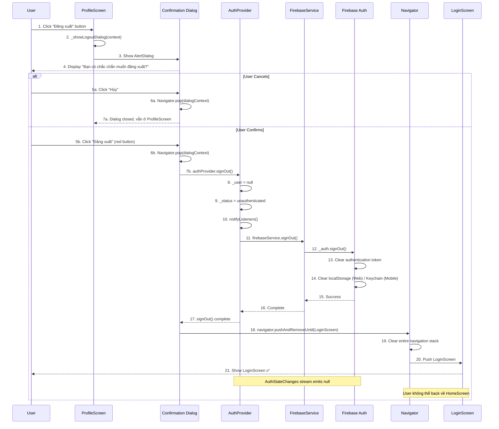

# 🚪 Luồng Đăng xuất - Chi tiết

> **Dựa trên tài liệu**: [TẤT_CẢ_LUỒNG_ĐI.md](file:///d:/FlutterProjects/ai_personal_stylist/TẤT_CẢ_LUỒNG_ĐI.md#4-đăng-xuất)

---

## 📊 Sơ đồ Tổng quan



**Sơ đồ Sequence của luồng Đăng xuất**

---

## 🔍 Chi Tiết Từng Bước

### **BƯỚC 1-2: Logout Button UI**

#### File: [profile_screen.dart](file:///d:/FlutterProjects/ai_personal_stylist/lib/screens/profile_screen.dart#L178-L193)

```dart
// Logout button
SizedBox(
  width: double.infinity,
  child: OutlinedButton.icon(
    onPressed: () => _showLogoutDialog(context),
    icon: const Icon(Icons.logout, color: AppTheme.errorColor),
    label: const Text(
      'Đăng xuất',
      style: TextStyle(color: AppTheme.errorColor),
    ),
    style: OutlinedButton.styleFrom(
      padding: const EdgeInsets.symmetric(vertical: 16),
      side: const BorderSide(color: AppTheme.errorColor),
    ),
  ),
),
```

#### Giải thích:

**Dòng 182: `onPressed: () => _showLogoutDialog(context)`**
- Không đăng xuất ngay lập tức.
- Show confirmation dialog trước.
- **UX Best Practice**: Ngăn user vô tình đăng xuất.

**Dòng 183-187: Error Color Theme**
```dart
icon: const Icon(Icons.logout, color: AppTheme.errorColor),
label: const Text(
  'Đăng xuất',
  style: TextStyle(color: AppTheme.errorColor),
),
```
- **Red color**: Visual warning cho destructive action.
- `Icons.logout`: Icon mũi tên ra cửa.

**Dòng 188-192: Outlined Style**
```dart
style: OutlinedButton.styleFrom(
  padding: const EdgeInsets.symmetric(vertical: 16),
  side: const BorderSide(color: AppTheme.errorColor),
),
```
- **Outlined** thay vì Filled:
  - Less prominent → user ít vô tình click.
  - Nhưng vẫn visible.

---

### **BƯỚC 3-4: Confirmation Dialog**

#### File: [profile_screen.dart](file:///d:/FlutterProjects/ai_personal_stylist/lib/screens/profile_screen.dart#L349-L386)

```dart
void _showLogoutDialog(BuildContext context) {
  final authProvider = context.read<AuthProvider>();
  final navigator = Navigator.of(context);
  
  showDialog(
    context: context,
    builder: (dialogContext) => AlertDialog(
      shape: RoundedRectangleBorder(
        borderRadius: BorderRadius.circular(20),
      ),
      title: const Text('Đăng xuất?'),
      content: const Text(
        'Bạn có chắc chắn muốn đăng xuất khỏi tài khoản?',
      ),
      actions: [
        TextButton(
          onPressed: () => Navigator.pop(dialogContext),
          child: const Text('Hủy'),
        ),
        ElevatedButton(
          onPressed: () async {
            Navigator.pop(dialogContext);
            await authProvider.signOut();
            // Force navigate to login screen và xóa hết navigation stack
            navigator.pushAndRemoveUntil(
              MaterialPageRoute(builder: (_) => const LoginScreen()),
              (route) => false,
            );
          },
          style: ElevatedButton.styleFrom(
            backgroundColor: AppTheme.errorColor,
          ),
          child: const Text('Đăng xuất'),
        ),
      ],
    ),
  );
}
```

#### Giải thích chi tiết:

**Dòng 350-351: Capture Context Early**
```dart
final authProvider = context.read<AuthProvider>();
final navigator = Navigator.of(context);
```
- **Tại sao capture ở đây thay vì dùng trong callback?**
  - `dialogContext` (trong builder) khác với `context` (ProfileScreen).
  - Nếu dùng `context` sau khi dialog đóng → có thể bị dispose → crash.
  - **Best Practice**: Capture `Navigator` và `Provider` trước khi async operations.

**Dòng 355: Builder với `dialogContext`**
```dart
builder: (dialogContext) => AlertDialog(
```
- **`dialogContext`**: Context của dialog, không phải ProfileScreen.
- Dùng để `Navigator.pop(dialogContext)` chỉ đóng dialog, không đóng ProfileScreen.

**Dòng 364-367: Cancel Button**
```dart
TextButton(
  onPressed: () => Navigator.pop(dialogContext),
  child: const Text('Hủy'),
),
```
- Close dialog, không làm gì cả.
- User quay về ProfileScreen.

**Dòng 368-383: Confirm Button** 🔥

```dart
ElevatedButton(
  onPressed: () async {
    Navigator.pop(dialogContext);
    await authProvider.signOut();
    // Force navigate to login screen và xóa hết navigation stack
    navigator.pushAndRemoveUntil(
      MaterialPageRoute(builder: (_) => const LoginScreen()),
      (route) => false,
    );
  },
  style: ElevatedButton.styleFrom(
    backgroundColor: AppTheme.errorColor,
  ),
  child: const Text('Đăng xuất'),
),
```

#### Giải thích từng dòng trong callback:

**Dòng 370: `Navigator.pop(dialogContext)`**
- Đóng dialog trước tiên.
- Nếu không đóng → dialog vẫn hiển thị khi navigate → weird UX.

**Dòng 371: `await authProvider.signOut()`**
- **`await`**: Chờ sign out hoàn tất.
- **Quá trình**:
  1. Clear local state (`_user = null`)
  2. Call Firebase Auth API
  3. Clear token storage

**Dòng 373-376: Navigation Strategy** 🎯

```dart
navigator.pushAndRemoveUntil(
  MaterialPageRoute(builder: (_) => const LoginScreen()),
  (route) => false,
);
```

**`pushAndRemoveUntil` là gì?**
- **Push**: Thêm LoginScreen vào stack.
- **RemoveUntil**: Xóa tất cả routes cho đến khi gặp route thỏa predicate.
- **Predicate `(route) => false`**: 
  - **Không bao giờ** return `true`.
  - → Xóa **TẤT CẢ** routes trong stack.

**Kết quả:**
```
Before:
Stack: [LoginScreen, HomeScreen, ProfileScreen, Dialog]
         ↓ pop dialog
Stack: [LoginScreen, HomeScreen, ProfileScreen]
         ↓ signOut + pushAndRemoveUntil
Stack: [LoginScreen] ← ONLY LoginScreen left
```

**Tại sao không dùng `pushReplacement`?**

```dart
// ❌ BAD
Navigator.pushReplacement(
  context,
  MaterialPageRoute(builder: (_) => const LoginScreen()),
);
```

**Vấn đề:**
```
Before: [SomeOtherScreen, HomeScreen, ProfileScreen]
After:  [SomeOtherScreen, HomeScreen, LoginScreen]
                                      ↑ User có thể back về HomeScreen!
```

**With `pushAndRemoveUntil`:**
```
Before: [SomeOtherScreen, HomeScreen, ProfileScreen]
After:  [LoginScreen]
         ↑ Clean slate, user KHÔNG THỂ back
```

---

### **BƯỚC 7-10: AuthProvider Sign Out**

#### File: [auth_provider.dart](file:///d:/FlutterProjects/ai_personal_stylist/lib/providers/auth_provider.dart#L190-L204)

```dart
/// Sign out
Future<void> signOut() async {
  try {
    // Set state TRƯỚC khi signOut để UI phản hồi ngay
    _user = null;
    _status = AuthStatus.unauthenticated;
    notifyListeners();
    
    // Sau đó mới thực hiện signOut Firebase
    await _firebaseService.signOut();
  } catch (e) {
    _errorMessage = e.toString();
    notifyListeners();
  }
}
```

#### Giải thích:

**Dòng 193-195: Set State TRƯỚC Firebase API** 🔥

```dart
// Set state TRƯỚC khi signOut để UI phản hồi ngay
_user = null;
_status = AuthStatus.unauthenticated;
notifyListeners();
```

**Tại sao set state trước?**

**Order 1 (Current - GOOD):**
```
1. Set _user = null (local)           → 0ms
2. notifyListeners()                  → 1ms
3. UI rebuild (nếu có Consumer)       → 5ms
4. await Firebase signOut()           → 100-200ms
```
→ **UI responsive ngay lập tức** (5ms)

**Order 2 (Alternative - BAD):**
```
1. await Firebase signOut()           → 100-200ms
2. Set _user = null                   → 201ms
3. notifyListeners()                  → 202ms
4. UI rebuild                         → 207ms
```
→ **UI đơ 200ms** trước khi update

**Trade-off:**
- ✅ UX tốt hơn (instant feedback)
- ⚠️ Nếu Firebase signOut fail → state đã bị clear nhưng token vẫn còn
- 💡 Acceptable vì signOut rất ít khi fail, và worst case user chỉ cần logout lại

**Dòng 198: Firebase Sign Out**
```dart
await _firebaseService.signOut();
```
- Call FirebaseService để clear token storage.

**Dòng 199-202: Error Handling**
```dart
catch (e) {
  _errorMessage = e.toString();
  notifyListeners();
}
```
- Catch bất kỳ error nào (rất rare).
- Không rollback state (vì đã set `_user = null`).

---

### **BƯỚC 11-15: Firebase Auth Sign Out**

#### File: [firebase_service.dart](file:///d:/FlutterProjects/ai_personal_stylist/lib/services/firebase_service.dart#L130-L133)

```dart
/// Sign out
Future<void> signOut() async {
  await _auth.signOut();
}
```

#### Giải thích:

**Dòng 132: `_auth.signOut()`**
- Firebase Auth SDK method.
- **Hành động:**
  1. Clear current user session
  2. Remove authentication token
  3. Clear persistence storage:
     - **Web**: Remove from localStorage
     - **Mobile**: Remove from Keychain/Keystore
  4. Emit `null` trên `authStateChanges` stream

**Tại sao không có error handling?**
- `signOut()` của Firebase **rất ít khi fail**.
- Nếu fail → rethrow để AuthProvider catch (nhưng thường không xảy ra).

---

### **BƯỚC 16-21: Navigation & Stream Update**

#### Auth State Stream Reaction

**File**: auth_provider.dart (dòng 36-46 - đã giải thích ở luồng Auto Login)

```dart
void _init() {
  _firebaseService.authStateChanges.listen((user) {
    _user = user;
    if (user != null) {
      _status = AuthStatus.authenticated;
    } else {
      _status = AuthStatus.unauthenticated;
    }
    notifyListeners();
  });
}
```

**Khi signOut():**
```
Firebase signOut() 
    ↓
authStateChanges stream emits: null
    ↓
_init() callback fires:
    _user = null
    _status = unauthenticated
    notifyListeners()
    ↓
(Nhưng đã set ở bước 7 rồi, nên không thay đổi gì)
```

**Tại sao vẫn set state 2 lần?**
1. **Local set** (dòng 193-195): Instant UI update
2. **Stream emit** (dòng 37-44): Ensure consistency với Firebase state

---

## ⏱️ Timeline Thực Tế

### **Scenario: User Logout Thành công**

```
0ms     → User click "Đăng xuất" button trong ProfileScreen
5ms     → _showLogoutDialog(context) called
10ms    → Capture authProvider và navigator
15ms    → showDialog() creates AlertDialog
20ms    → Dialog rendered với 2 buttons ✅
        ↓
        [USER DECISION]
        User đọc dialog
        User click "Đăng xuất" (red button)
        
2000ms  → ElevatedButton.onPressed() fires
2005ms  → Navigator.pop(dialogContext) → Dialog closed
2010ms  → authProvider.signOut() starts
2015ms  → AuthProvider: _user = null
2016ms  → AuthProvider: _status = unauthenticated
2017ms  → notifyListeners()
        ↓ (Nếu có Consumer listening, sẽ rebuild - nhưng ProfileScreen sắp bị unmount)
2020ms  → firebaseService.signOut() starts
2025ms  → Firebase Auth: _auth.signOut()
2050ms  → Clear localStorage/Keychain
2070ms  → authStateChanges emits null
2075ms  → Stream listener fires (redundant, đã clear rồi)
2080ms  → Firebase signOut complete
2085ms  → authProvider.signOut() returns
2090ms  → navigator.pushAndRemoveUntil() starts
2095ms  → Remove ProfileScreen from stack
2100ms  → Remove HomeScreen from stack
2105ms  → Remove any other screens from stack
2110ms  → Push LoginScreen
2150ms  → LoginScreen build() called
2200ms  → LoginScreen rendered ✅
        ↓
Stack: [LoginScreen] ONLY
User is logged out completely
Back button → Exit app (nothing to pop)
```

**Tổng thời gian: ~2.2 giây** (bao gồm user reading dialog)

---

## 🔐 State & Storage Cleanup

### **What Gets Cleared:**

| Component | Before Logout | After Logout |
|-----------|---------------|-------------|
| **AuthProvider._user** | User object | `null` ✅ |
| **AuthProvider._status** | `authenticated` | `unauthenticated` ✅ |
| **Firebase Auth token** | Valid JWT | Deleted ✅ |
| **localStorage (Web)** | Contains token | Cleared ✅ |
| **Keychain (iOS)** | Contains token | Cleared ✅ |
| **Keystore (Android)** | Contains token | Cleared ✅ |
| **WardrobeProvider._items** | User's items | Vẫn còn ⚠️ |
| **Navigation stack** | [Home, Profile] | [Login] ✅ |

### **⚠️ Lưu ý về WardrobeProvider:**

```dart
// WardrobeProvider KHÔNG tự động clear sau logout!
wardrobeProvider._items // vẫn chứa items của user cũ
```

**Tại sao?**
- WardrobeProvider không listen auth state.
- Provider instance không bị dispose sau logout.

**Có vấn đề không?**
- **Không** - vì khi user logout:
  - Navigate về LoginScreen
  - WardrobeProvider không hiển thị trên LoginScreen
  - Khi user login lại → `loadItems()` sẽ fetch data mới từ Firestore
  - Data cũ bị **overwrite**

**Nếu muốn cleanup triệt để:**

```dart
// Có thể thêm vào AuthProvider.signOut():
void signOut() async {
  try {
    _user = null;
    _status = AuthStatus.unauthenticated;
    
    // Clear WardrobeProvider
    final wardrobeProvider = context.read<WardrobeProvider>();
    wardrobeProvider.clearAllData(); // Method mới cần implement
    
    notifyListeners();
    await _firebaseService.signOut();
  } catch (e) {
    // ...
  }
}
```

---

## 🎨 UX Best Practices

### ✅ **1. Confirmation Dialog**

```dart
void _showLogoutDialog(BuildContext context) {
  showDialog(
    context: context,
    builder: (dialogContext) => AlertDialog(
      title: const Text('Đăng xuất?'),
      content: const Text('Bạn có chắc chắn muốn đăng xuất khỏi tài khoản?'),
      // ...
    ),
  );
}
```

**Lợi ích:**
- Ngăn user vô tình logout
- Cho user cơ hội suy nghĩ lại
- Standard UX pattern

---

### ✅ **2. Visual Warning (Red Color)**

```dart
ElevatedButton(
  onPressed: () async { /* ... */ },
  style: ElevatedButton.styleFrom(
    backgroundColor: AppTheme.errorColor, // Red
  ),
  child: const Text('Đăng xuất'),
),
```

**Ý nghĩa:**
- Red = Destructive action
- User nhận thức đây là action quan trọng
- Giảm misclick

---

### ✅ **3. Clear Navigation Stack**

```dart
navigator.pushAndRemoveUntil(
  MaterialPageRoute(builder: (_) => const LoginScreen()),
  (route) => false, // Clear ALL routes
);
```

**Tại sao quan trọng:**
- User không thể back về HomeScreen sau logout
- Prevent unauthorized access
- Clean state transition

---

### ✅ **4. Instant Local State Update**

```dart
// Set state TRƯỚC khi signOut để UI phản hồi ngay
_user = null;
_status = AuthStatus.unauthenticated;
notifyListeners();

// Sau đó mới thực hiện signOut Firebase
await _firebaseService.signOut();
```

**Lợi ích:**
- UI update ngay lập tức (~5ms)
- Không đợi Firebase API (~200ms)
- Better perceived performance

---

### ✅ **5. Early Context Capture**

```dart
void _showLogoutDialog(BuildContext context) {
  final authProvider = context.read<AuthProvider>();
  final navigator = Navigator.of(context);
  
  showDialog(
    context: context,
    builder: (dialogContext) => AlertDialog(
      // Sử dụng authProvider và navigator đã capture
      onPressed: () async {
        Navigator.pop(dialogContext);
        await authProvider.signOut();
        navigator.pushAndRemoveUntil(...);
      },
    ),
  );
}
```

**Tại sao:**
- Tránh crash khi context bị dispose
- Ensure navigation hoạt động đúng
- Defensive programming

---

## 🚨 Edge Cases & Error Handling

### **Case 1: Firebase signOut() Fails**

```dart
catch (e) {
  _errorMessage = e.toString();
  notifyListeners();
}
```

**Scenario:** Network error, Firebase down

**Behavior:**
- Local state đã clear (`_user = null`)
- Token vẫn có thể còn trong storage
- User vẫn bị navigate về LoginScreen

**Impact:** 
- Low - user chỉ cần logout lại nếu cần
- Token sẽ expire after some time

---

### **Case 2: User Spams Logout Button**

**Problem:** User click "Đăng xuất" nhiều lần nhanh

**Current Code:**
```dart
onPressed: () => _showLogoutDialog(context),
```

**Behavior:**
- Multiple dialogs stack on top of each other
- Messy UX

**Solution:**
```dart
bool _isLoggingOut = false;

void _showLogoutDialog(BuildContext context) async {
  if (_isLoggingOut) return; // Prevent multiple dialogs
  _isLoggingOut = true;
  
  await showDialog(...);
  
  _isLoggingOut = false;
}
```

---

### **Case 3: Dialog Dismissed by Back Button**

**Scenario:** User press back button (Android) khi dialog đang mở

**Behavior:**
```dart
Navigator.pop(dialogContext); // Dialog closes
// Không gọi signOut()
// User vẫn ở ProfileScreen, vẫn logged in ✅
```

**Expected:** Giống như click "Hủy" → Correct! ✅

---

### **Case 4: App Killed During Logout**

**Scenario:** User force close app khi đang logout

**Behavior:**
1. Local state (`_user = null`) → Lost (app killed)
2. Firebase token → Vẫn bị clear (nếu `signOut()` đã complete)
3. Next app start → Auto login fail → Show LoginScreen

**Outcome:** Depends on timing, nhưng worst case user phải login lại → Acceptable

---

## 📊 So Sánh Logout Strategies

### **Strategy 1: Clear State First (Current)**

```dart
_user = null;
notifyListeners();
await _firebaseService.signOut();
```

**Pros:**
- ✅ UI update nhanh (5ms)
- ✅ User không thấy lag

**Cons:**
- ⚠️ Nếu Firebase fail, state và storage inconsistent
- ⚠️ Nhưng impact thấp

---

### **Strategy 2: Firebase First**

```dart
await _firebaseService.signOut();
_user = null;
notifyListeners();
```

**Pros:**
- ✅ State và storage luôn consistent
- ✅ Nếu Firebase fail, state không bị clear

**Cons:**
- ❌ UI đơ 200ms
- ❌ User thấy lag

---

### **Strategy 3: Parallel**

```dart
final logoutFuture = _firebaseService.signOut();
_user = null;
notifyListeners();
await logoutFuture;
```

**Pros:**
- ✅ Best of both worlds?

**Cons:**
- ⚠️ Phức tạp hơn
- ⚠️ Race conditions possible
- ⚠️ Không cần thiết cho logout

---

**Project chọn Strategy 1** - đúng đắn cho UX-focused app

---

## 💡 Code Improvements

### **Suggestion 1: Loading State During Logout**

```dart
ElevatedButton(
  onPressed: _isLoggingOut 
      ? null 
      : () async {
          setState(() => _isLoggingOut = true);
          Navigator.pop(dialogContext);
          await authProvider.signOut();
          navigator.pushAndRemoveUntil(...);
        },
  child: _isLoggingOut
      ? const SizedBox(
          width: 16,
          height: 16,
          child: CircularProgressIndicator(strokeWidth: 2),
        )
      : const Text('Đăng xuất'),
),
```

**Lợi ích:**
- User thấy feedback rõ ràng
- Prevent double-tap

---

### **Suggestion 2: Logout Analytics**

```dart
await authProvider.signOut();

// Log analytics event
FirebaseAnalytics().logEvent(
  name: 'user_logout',
  parameters: {
    'user_id': authProvider.userId,
    'timestamp': DateTime.now().toIso8601String(),
  },
);

navigator.pushAndRemoveUntil(...);
```

---

### **Suggestion 3: Cleanup Other Providers**

```dart
Future<void> signOut() async {
  try {
    _user = null;
    _status = AuthStatus.unauthenticated;
    notifyListeners();
    
    // Broadcast logout event to other providers
    _eventBus.fire(LogoutEvent());
    
    await _firebaseService.signOut();
  } catch (e) {
    _errorMessage = e.toString();
    notifyListeners();
  }
}
```

Các providers khác listen:
```dart
class WardrobeProvider {
  WardrobeProvider() {
    eventBus.on<LogoutEvent>().listen((_) {
      clearAllData(); // Clear items, state, etc.
    });
  }
}
```

---

## 📝 Tóm Tắt

### **Flow tóm gọn:**

```
Click button → Confirmation → Confirm → Clear local state 
→ Firebase signOut → Clear token → Navigate LoginScreen → Clear stack
```

### **Key Points:**

| Point | Implementation |
|-------|----------------|
| **Confirmation** | AlertDialog với 2 buttons |
| **State Update** | Set `_user = null` **TRƯỚC** Firebase API |
| **Navigation** | `pushAndRemoveUntil` với predicate `(route) => false` |
| **Token Cleanup** | Firebase Auth tự động clear localStorage/Keychain |
| **Stack Cleanup** | Remove ALL routes, chỉ giữ LoginScreen |

### **Critical Decisions:**

1. ✅ **Confirmation dialog** - Prevent accidental logout
2. ✅ **Local state first** - Instant UI update
3. ✅ **`pushAndRemoveUntil`** - Clean navigation stack
4. ✅ **Early context capture** - Prevent crashes
5. ✅ **Red color** - Visual warning

---

## 🔗 Files Liên Quan

- [profile_screen.dart](file:///d:/FlutterProjects/ai_personal_stylist/lib/screens/profile_screen.dart#L349-L386) - Logout dialog UI
- [auth_provider.dart](file:///d:/FlutterProjects/ai_personal_stylist/lib/providers/auth_provider.dart#L190-L204) - Sign out logic
- [firebase_service.dart](file:///d:/FlutterProjects/ai_personal_stylist/lib/services/firebase_service.dart#L130-L133) - Firebase Auth API
- [login_screen.dart](file:///d:/FlutterProjects/ai_personal_stylist/lib/screens/login_screen.dart) - Destination after logout

---

**Bạn muốn tôi giải thích luồng nào tiếp theo?**
- **Luồng 5: Load Tủ Đồ** (Firestore query, shimmer loading, pagination)
- **Luồng 6: Thêm Item** (Image compression, Base64, AI analysis)
- **Luồng 14: Gợi ý Outfit** (AI prompting, weather integration, outfit building)
