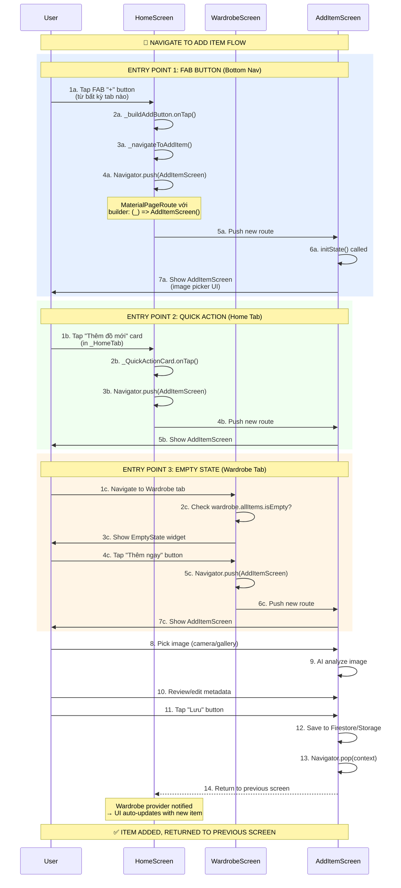
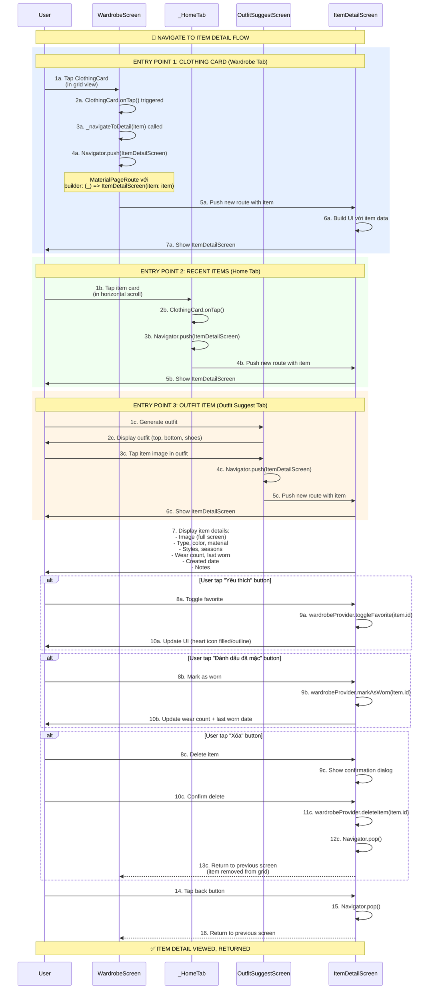

# Flow 19 & 20: Navigate tới Add Item và Item Detail

## 📋 Mục Lục
1. [Tổng Quan](#tổng-quan)
2. [Flow 19: Navigate tới Add Item](#flow-19-navigate-tới-add-item)
3. [Flow 20: Navigate tới Item Detail](#flow-20-navigate-tới-item-detail)
4. [Chi Tiết Kỹ Thuật](#chi-tiết-kỹ-thuật)
5. [Code Implementation](#code-implementation)
6. [Navigation Patterns](#navigation-patterns)

---

## Tổng Quan

### Mục Đích
Hai flows này document các navigation patterns chính trong app:
- **Flow 19**: Navigate đến AddItemScreen từ nhiều entry points (FAB, quick actions, empty state)
- **Flow 20**: Navigate đến ItemDetailScreen khi user tap vào clothing card

### Trigger Points Summary

**Flow 19 - Add Item Navigation**:
1. **FAB Button**: Tap "+" button trong bottom nav (mọi tab)
2. **Quick Action**: Tap "Thêm đồ mới" card trong Home tab
3. **Empty State**: Tap "Thêm ngay" button khi wardrobe trống

**Flow 20 - Item Detail Navigation**:
1. **Clothing Card**: Tap vào bất kỳ ClothingCard nào trong WardrobeScreen
2. **Recent Items**: Tap item trong horizontal scroll (Home tab)
3. **Outfit Display**: Tap item trong suggested outfit (OutfitSuggestScreen)

---

## Flow 19: Navigate tới Add Item

### Sơ Đồ Luồng


### Entry Points Detail

#### Entry Point 1: FAB Button (Bottom Navigation)
**Location**: HomeScreen bottom nav, center position

**Code**:
```dart
// In _HomeScreenState
Widget _buildAddButton() {
  return GestureDetector(
    onTap: () => _navigateToAddItem(),
    child: Container(
      width: 56,
      height: 56,
      decoration: BoxDecoration(
        gradient: AppTheme.primaryGradient,
        shape: BoxShape.circle,
        boxShadow: [
          BoxShadow(
            color: AppTheme.primaryColor.withValues(alpha: 0.4),
            blurRadius: 12,
            offset: const Offset(0, 4),
          ),
        ],
      ),
      child: const Icon(Icons.add, color: Colors.white, size: 28),
    ),
  );
}

void _navigateToAddItem() {
  Navigator.push(
    context,
    MaterialPageRoute(builder: (_) => const AddItemScreen()),
  );
}
```

**Characteristics**:
- ✅ Available từ **mọi tab** (Home, Wardrobe, Outfit Suggest, Profile)
- ✅ Most prominent entry point (FAB design pattern)
- ✅ Always visible (fixed position trong bottom nav)

---

#### Entry Point 2: Quick Action Card (Home Tab)
**Location**: _HomeTab, "Hành động nhanh" section

**Code**:
```dart
// In _HomeTab
Row(
  children: [
    Expanded(
      child: _QuickActionCard(
        icon: Icons.add_a_photo,
        title: 'Thêm đồ mới',
        color: AppTheme.primaryColor,
        onTap: () => Navigator.push(
          context,
          MaterialPageRoute(builder: (_) => const AddItemScreen()),
        ),
      ),
    ),
    // ... other quick actions
  ],
)
```

**Characteristics**:
- ✅ Visible chỉ trong **Home tab**
- ✅ Contextual action (1 trong 4 quick actions)
- ✅ Larger tap target than FAB (full card width)

---

#### Entry Point 3: Empty State (Wardrobe Tab)
**Location**: WardrobeScreen, khi wardrobe.allItems.isEmpty

**Code**:
```dart
// In WardrobeScreen
Consumer<WardrobeProvider>(
  builder: (context, wardrobe, _) {
    if (wardrobe.allItems.isEmpty) {
      return EmptyState(
        icon: Icons.checkroom,
        title: 'Tủ đồ trống',
        subtitle: 'Hãy thêm quần áo đầu tiên của bạn!',
        action: ElevatedButton.icon(
          onPressed: () => Navigator.push(
            context,
            MaterialPageRoute(builder: (_) => const AddItemScreen()),
          ),
          icon: const Icon(Icons.add),
          label: const Text('Thêm ngay'),
        ),
      );
    }
    
    // ... normal grid view
  },
)
```

**Characteristics**:
- ✅ Visible chỉ khi **wardrobe trống** (first-time user experience)
- ✅ Call-to-action rõ ràng (primary action)
- ✅ Disappears sau khi user add item đầu tiên

---

### AddItemScreen UI Flow

**After Navigation**:
```
1. Image Picker Section
   - Camera button (mobile)
   - Gallery button (mobile/web)
   - Drag & drop zone (web)

2. AI Analysis (auto-triggered after pick)
   - Show loading spinner
   - Call GeminiService.analyzeClothingImageBytes()
   - Display analysis result

3. Editable Fields
   - Type dropdown (tshirt, shirt, jeans, ...)
   - Color input
   - Material dropdown
   - Styles multi-select
   - Seasons multi-select

4. Save Button
   - Validate fields
   - Call wardrobeProvider.addItemFromBytes()
   - Show success message
   - Navigator.pop() → Return to previous screen
```

**Already Documented In**:
- Flow 6: Add Item - Web (từ bytes)
- Flow 7: Add Item - Mobile (từ file)

---

## Flow 20: Navigate tới Item Detail

### Sơ Đồ Luồng


### Entry Points Detail

#### Entry Point 1: Clothing Card (Wardrobe Grid)
**Location**: WardrobeScreen grid view

**Code**:
```dart
// In WardrobeScreen
GridView.builder(
  gridDelegate: SliverGridDelegateWithFixedCrossAxisCount(
    crossAxisCount: 2,
    childAspectRatio: 0.75,
    crossAxisSpacing: 12,
    mainAxisSpacing: 12,
  ),
  itemCount: filteredItems.length,
  itemBuilder: (context, index) {
    final item = filteredItems[index];
    return ClothingCard(
      item: item,
      onTap: () => _navigateToDetail(item),  // ← Tap to navigate
    );
  },
)

void _navigateToDetail(ClothingItem item) {
  Navigator.push(
    context,
    MaterialPageRoute(
      builder: (_) => ItemDetailScreen(item: item),
    ),
  );
}
```

**Characteristics**:
- ✅ Primary entry point (most common use case)
- ✅ Available cho tất cả items trong wardrobe
- ✅ Tap anywhere trên card → Navigate

---

#### Entry Point 2: Recent Items (Home Tab Horizontal Scroll)
**Location**: _HomeTab, "Thêm gần đây" section

**Code**:
```dart
// In _HomeTab
SizedBox(
  height: 150,
  child: ListView.builder(
    scrollDirection: Axis.horizontal,
    itemCount: recentItems.length,  // ← Max 4 items
    itemBuilder: (context, index) {
      final item = recentItems[index];
      return Container(
        width: 110,
        margin: const EdgeInsets.only(right: 12),
        child: GestureDetector(
          onTap: () => Navigator.push(
            context,
            MaterialPageRoute(
              builder: (_) => ItemDetailScreen(item: item),
            ),
          ),
          child: ClothingCard(item: item, compact: true),
        ),
      );
    },
  ),
)
```

**Characteristics**:
- ✅ Preview của recent items (max 4)
- ✅ Quick access từ Home tab
- ✅ Horizontal scroll (swipe left/right)

---

#### Entry Point 3: Outfit Item (Suggested Outfit)
**Location**: OutfitSuggestScreen, trong generated outfit display

**Code**:
```dart
// In OutfitSuggestScreen (after outfit generated)
if (_outfit != null) ...[
  Row(
    children: [
      // Top item
      if (_outfit!.top != null)
        Expanded(
          child: GestureDetector(
            onTap: () => Navigator.push(
              context,
              MaterialPageRoute(
                builder: (_) => ItemDetailScreen(item: _outfit!.top!),
              ),
            ),
            child: ClothingCard(item: _outfit!.top!),
          ),
        ),
      
      // Bottom item
      if (_outfit!.bottom != null)
        Expanded(
          child: GestureDetector(
            onTap: () => Navigator.push(
              context,
              MaterialPageRoute(
                builder: (_) => ItemDetailScreen(item: _outfit!.bottom!),
              ),
            ),
            child: ClothingCard(item: _outfit!.bottom!),
          ),
        ),
    ],
  ),
  
  // Shoes
  if (_outfit!.shoes != null)
    GestureDetector(
      onTap: () => Navigator.push(
        context,
        MaterialPageRoute(
          builder: (_) => ItemDetailScreen(item: _outfit!.shoes!),
        ),
      ),
      child: ClothingCard(item: _outfit!.shoes!),
    ),
]
```

**Characteristics**:
- ✅ Contextual navigation (user xem outfit, tap item to see detail)
- ✅ Up to 3 items (top, bottom, shoes)
- ✅ Helpful for understanding AI suggestions

---

### ItemDetailScreen UI Structure

**Sections**:
```
1. Full-Screen Image
   - ClothingImage widget
   - Hero animation từ ClothingCard
   - Zoomable (pinch to zoom)

2. Item Info Card
   - Type badge (VD: "Áo thun")
   - Color display
   - Material info
   - Styles chips (casual, formal, ...)
   - Seasons chips (spring, summer, ...)

3. Stats Section
   - Wear count: "Đã mặc 5 lần"
   - Last worn: "Lần cuối: 3 ngày trước"
   - Created date: "Thêm vào: 15/12/2025"

4. Notes Section (if any)
   - User notes about item

5. Action Buttons
   - Toggle Favorite (heart icon)
   - Mark as Worn
   - Delete (với confirmation)
```

**Already Documented In**:
- Flow 8: Xem Chi Tiết Item (full detail screen implementation)
- Flow 11: Toggle Favorite (favorite button logic)
- Flow 10: Xóa Item (delete button với confirmation)

---

## Chi Tiết Kỹ Thuật

### Navigation State Preservation

**Key Insight**: Cả 2 flows dùng `Navigator.push` → Previous screen state preserved

**Example**:
```dart
// User ở Tab 1 (Wardrobe), scroll to position 50
// Tap item → Navigate to ItemDetailScreen
Navigator.push(
  context,
  MaterialPageRoute(builder: (_) => ItemDetailScreen(item: item)),
);

// User tap back button
Navigator.pop(context);

// Return to Tab 1, scroll position = 50 (preserved)
```

**Why?**:
- `Navigator.push` overlays new route on top of existing route
- Existing route widget tree không bị destroy
- State (scroll position, form data, etc.) preserved

---

### Return Value After Navigation

**Pattern**: Navigator.pop() có thể return value về previous screen

**Example** (Delete Item):
```dart
// In ItemDetailScreen
await wardrobeProvider.deleteItem(item.id);
Navigator.pop(context, true);  // ← Return true (item deleted)

// In WardrobeScreen
final result = await Navigator.push(
  context,
  MaterialPageRoute(builder: (_) => ItemDetailScreen(item: item)),
);

if (result == true) {
  // Item was deleted, maybe show snackbar
  ScaffoldMessenger.of(context).showSnackBar(
    SnackBar(content: Text('Đã xóa item')),
  );
}
```

**Note**: Trong codebase hiện tại, không dùng return value (rely on Provider notifyListeners)

---

## Code Implementation

### ClothingCard with onTap

**File**: `lib/widgets/clothing_card.dart` (assumed structure)
```dart
class ClothingCard extends StatelessWidget {
  final ClothingItem item;
  final VoidCallback? onTap;
  final bool compact;

  const ClothingCard({
    super.key,
    required this.item,
    this.onTap,
    this.compact = false,
  });

  @override
  Widget build(BuildContext context) {
    return GestureDetector(
      onTap: onTap,  // ← Tap callback
      child: Container(
        decoration: BoxDecoration(
          color: Colors.white,
          borderRadius: BorderRadius.circular(12),
          boxShadow: [
            BoxShadow(
              color: Colors.black.withValues(alpha: 0.05),
              blurRadius: 8,
            ),
          ],
        ),
        child: Column(
          crossAxisAlignment: CrossAxisAlignment.start,
          children: [
            // Item image
            Expanded(
              child: ClothingImage(item: item, fit: BoxFit.cover),
            ),
            
            // Item info
            Padding(
              padding: const EdgeInsets.all(8),
              child: Column(
                crossAxisAlignment: CrossAxisAlignment.start,
                children: [
                  Text(
                    item.type.displayName,
                    style: TextStyle(fontWeight: FontWeight.w600),
                  ),
                  Text(
                    item.color,
                    style: TextStyle(color: AppTheme.textSecondary),
                  ),
                ],
              ),
            ),
            
            // Favorite indicator
            if (item.isFavorite)
              Positioned(
                top: 8,
                right: 8,
                child: Icon(Icons.favorite, color: Colors.red),
              ),
          ],
        ),
      ),
    );
  }
}
```

---

### ItemDetailScreen Constructor

**File**: `lib/screens/item_detail_screen.dart`
```dart
class ItemDetailScreen extends StatelessWidget {
  final ClothingItem item;  // ← Item passed via constructor

  const ItemDetailScreen({
    super.key,
    required this.item,
  });

  @override
  Widget build(BuildContext context) {
    return Scaffold(
      appBar: AppBar(
        title: Text(item.type.displayName),
        actions: [
          // Delete button
          IconButton(
            icon: Icon(Icons.delete_outline),
            onPressed: () => _confirmDelete(context),
          ),
        ],
      ),
      body: SingleChildScrollView(
        child: Column(
          children: [
            // Full-screen image
            ClothingImage(item: item, height: 400),
            
            // Item details
            _buildItemInfo(),
            _buildStats(),
            _buildNotes(),
            
            // Actions
            _buildActionButtons(),
          ],
        ),
      ),
    );
  }
  
  void _confirmDelete(BuildContext context) async {
    final confirmed = await showDialog<bool>(
      context: context,
      builder: (context) => AlertDialog(
        title: Text('Xác nhận xóa'),
        content: Text('Bạn có chắc muốn xóa món đồ này?'),
        actions: [
          TextButton(
            onPressed: () => Navigator.pop(context, false),
            child: Text('Hủy'),
          ),
          ElevatedButton(
            onPressed: () => Navigator.pop(context, true),
            child: Text('Xóa'),
          ),
        ],
      ),
    );
    
    if (confirmed == true) {
      await context.read<WardrobeProvider>().deleteItem(item.id);
      Navigator.pop(context);  // ← Return to previous screen
    }
  }
}
```

---

## Navigation Patterns

### Pattern 1: Direct Push (Most Common)
```dart
// One-liner navigation
Navigator.push(
  context,
  MaterialPageRoute(builder: (_) => AddItemScreen()),
);
```

**Characteristics**:
- ✅ Simplest pattern
- ✅ No data passing needed (AddItemScreen)
- ✅ Standard Material transition

---

### Pattern 2: Push with Data
```dart
// Pass item to detail screen
Navigator.push(
  context,
  MaterialPageRoute(
    builder: (_) => ItemDetailScreen(item: item),
  ),
);
```

**Characteristics**:
- ✅ Data passed via constructor
- ✅ Type-safe (ClothingItem required)
- ✅ No null checks needed

---

### Pattern 3: Await Result
```dart
// Wait for result from navigation
final result = await Navigator.push(
  context,
  MaterialPageRoute(builder: (_) => AddItemScreen()),
);

if (result == true) {
  // Item was added successfully
  ScaffoldMessenger.of(context).showSnackBar(
    SnackBar(content: Text('Đã thêm item mới!')),
  );
}
```

**Characteristics**:
- ✅ Async/await pattern
- ✅ Handle result from child screen
- ✅ Optional (can ignore result)

---

### Pattern 4: Hero Animation (Future Enhancement)
```dart
// ClothingCard with Hero tag
Hero(
  tag: 'item_${item.id}',
  child: ClothingImage(item: item),
)

// ItemDetailScreen with matching Hero tag
Hero(
  tag: 'item_${item.id}',
  child: ClothingImage(item: item, height: 400),
)
```

**Result**: Smooth image transition animation between screens

---

## Tóm Tắt Technical

### Flow 19: Add Item Navigation

**Entry Points**:
1. **FAB Button**: Mọi tab, always visible (most prominent)
2. **Quick Action**: Home tab only, 1 trong 4 actions
3. **Empty State**: Wardrobe tab, first-time user experience

**Destination**: AddItemScreen (Flow 6/7)

**Return**: Navigator.pop() sau khi save item

---

### Flow 20: Item Detail Navigation

**Entry Points**:
1. **Clothing Card**: Wardrobe grid (primary use case)
2. **Recent Items**: Home tab horizontal scroll
3. **Outfit Items**: Suggested outfit tap (3 items max)

**Destination**: ItemDetailScreen (Flow 8)

**Actions Available**:
- Toggle Favorite (Flow 11)
- Mark as Worn
- Delete Item (Flow 10)

**Return**: Navigator.pop() after action or back button

---

### Navigation Characteristics

**Both Flows**:
- ✅ Use `Navigator.push` (overlay pattern)
- ✅ State preservation of previous screen
- ✅ Standard Material transition
- ✅ Back button support (hardware + AppBar)
- ✅ Can return value via `Navigator.pop(context, value)`

**Performance**:
- **Navigation time**: <100ms (instant)
- **Build time**: <200ms (AddItemScreen), <100ms (ItemDetailScreen)
- **Transition animation**: 300ms (Material default)

---

### UX Highlights

**Flow 19 (Add Item)**:
- ✅ **3 entry points** cho flexibility
- ✅ **FAB always visible** (primary action)
- ✅ **Empty state CTA** guides first-time users
- ✅ **AI analysis auto-trigger** sau pick image

**Flow 20 (Item Detail)**:
- ✅ **Tap anywhere trên card** (large tap target)
- ✅ **Context-aware** (recent items, outfit items)
- ✅ **Actions available** (favorite, wear, delete)
- ✅ **Full-screen image** for better viewing

---

### Future Enhancements

**Flow 19**:
1. **Deep Link**: Open AddItemScreen from notification/share intent
2. **Quick Add**: Camera → AI analyze → Save (skip form) for power users
3. **Batch Upload**: Add multiple items at once
4. **Template Presets**: "Add shirt", "Add jeans" with pre-filled fields

**Flow 20**:
1. **Hero Animation**: Smooth image transition từ card → detail
2. **Swipe Gestures**: Swipe left/right to navigate between items
3. **Edit Mode**: Tap to edit item metadata inline
4. **Share Item**: Export item image + metadata to social media
5. **Similar Items**: AI suggest similar items from wardrobe

---

**Kết luận**: Flow 19 & 20 document navigation patterns đến AddItemScreen (3 entry points: FAB, quick action, empty state) và ItemDetailScreen (3 entry points: wardrobe grid, recent items, outfit items). Both flows use Navigator.push với state preservation, standard Material transitions. Clear entry points với good UX practices (FAB prominence, empty state CTA, large tap targets). 📱✨

