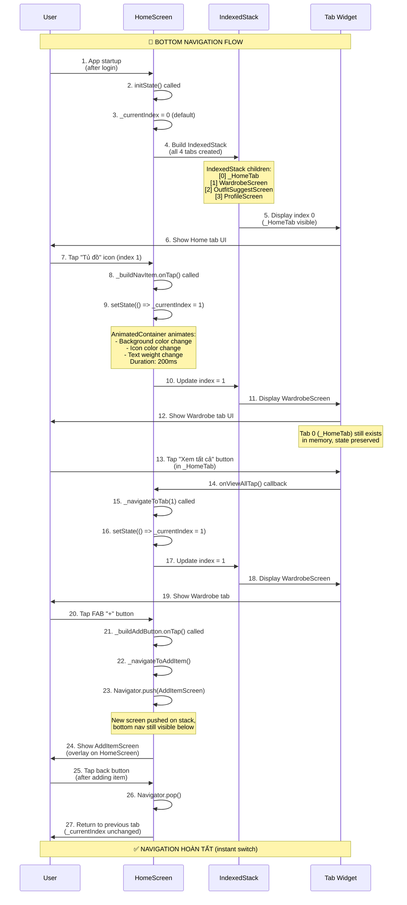
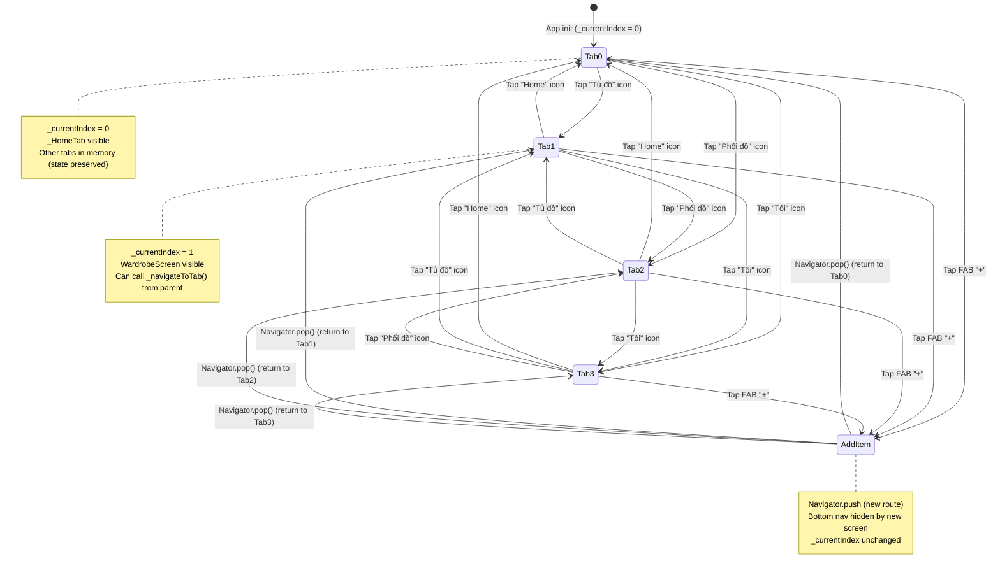

# Flow 18: Navigate giữa Tabs (Bottom Navigation)

## 📋 Mục Lục
1. [Tổng Quan](#tổng-quan)
2. [Sơ Đồ Luồng](#sơ-đồ-luồng)
3. [Chi Tiết Kỹ Thuật](#chi-tiết-kỹ-thuật)
4. [Code Implementation](#code-implementation)
5. [Tab Structure](#tab-structure)
6. [Navigation Patterns](#navigation-patterns)

---

## Tổng Quan

### Mục Đích
Flow này quản lý bottom navigation bar với 4 tabs chính + 1 FAB button. User có thể navigate giữa các tabs để access các features khác nhau: Home, Wardrobe, Outfit Suggest, Profile. Tab state được preserve khi switch back.

### Trigger Points
1. **Tap Tab Icon**: User tap icon trong bottom nav → Switch to that tab
2. **Programmatic Navigation**: Child widget call `_navigateToTab(index)` (VD: "Xem tất cả" → Tab 1)
3. **FAB Button**: User tap "+" button → Navigate to AddItemScreen (not a tab)

### Tabs Overview
```
Tab 0: Home (🏠)
  - Welcome header with greeting
  - Weather widget
  - Quick actions (Add Item, Suggest Outfit, Color Harmony, Cleanup)
  - Recent items preview (horizontal scroll)
  
Tab 1: Wardrobe (👔)
  - Full wardrobe grid view
  - Filter by category
  - Search functionality
  - Item cards with favorite indicator
  
Tab 2: Outfit Suggest (✨)
  - AI outfit suggestion with weather integration
  - Occasion selector
  - Generated outfit display
  - Regenerate button
  
Tab 3: Profile (👤)
  - User info (name, email, photo)
  - Settings (style preference, weather location)
  - Wardrobe cleanup access
  - Logout button

FAB: Add Item (+)
  - Navigate to AddItemScreen (Flow 6/7)
  - Not a tab, uses Navigator.push
```

### Navigation State
- **_currentIndex**: Int (0-3) tracking active tab
- **IndexedStack**: Preserves state của tất cả tabs (không rebuild khi switch)
- **AnimatedContainer**: Smooth animation khi tap tab (200ms)

---

## Sơ Đồ Luồng

### Flow Diagram - Tab Navigation


### State Diagram


---

## Chi Tiết Kỹ Thuật

### 1. HomeScreen State Management

**File**: `lib/screens/home_screen.dart`
```dart
class _HomeScreenState extends State<HomeScreen> {
  int _currentIndex = 0;  // ← Active tab index (0-3)

  late final List<Widget> _screens;  // ← All tab widgets

  @override
  void initState() {
    super.initState();
    
    // ======== INITIALIZE TABS ========
    _screens = [
      _HomeTab(onViewAllTap: () => _navigateToTab(1)),  // ← Tab 0: Home
      const WardrobeScreen(),                           // ← Tab 1: Wardrobe
      const OutfitSuggestScreen(),                      // ← Tab 2: Outfit Suggest
      const ProfileScreen(),                            // ← Tab 3: Profile
    ];
    
    // ======== LOAD DATA ON STARTUP ========
    WidgetsBinding.instance.addPostFrameCallback((_) {
      final wardrobeProvider = context.read<WardrobeProvider>();
      wardrobeProvider.loadItems();    // ← Flow 5: Load wardrobe
      wardrobeProvider.loadWeather();  // ← Flow 17: Load weather
    });
  }

  /// Navigate to specific tab - public method for child widgets
  void _navigateToTab(int index) {
    setState(() => _currentIndex = index);
  }
}
```

**Key Points**:
- `_screens` initialized in `initState()` (không rebuild every frame)
- `_navigateToTab()` exposed to child widgets (VD: _HomeTab can call to switch tab)
- `addPostFrameCallback` safe pattern to load data after first frame

### 2. IndexedStack (State Preservation)

**Purpose**: Keep all tabs in memory, switch visibility by index
```dart
@override
Widget build(BuildContext context) {
  return Scaffold(
    body: IndexedStack(
      index: _currentIndex,  // ← Only this tab is visible
      children: _screens,    // ← All 4 tabs exist in memory
    ),
    bottomNavigationBar: ...,
  );
}
```

**Benefits**:
- ✅ **State Preserved**: Tab 1 wardrobe scroll position maintained khi switch to Tab 2 → back to Tab 1
- ✅ **Fast Switch**: No rebuild, just change visibility (instant)
- ✅ **No Flicker**: Smooth transition between tabs
- ❌ **Memory**: All tabs in memory (OK cho 4 tabs nhỏ)

**Alternative**: TabBarView (rebuild on switch, không preserve state)

### 3. Bottom Navigation Bar

**UI**: Custom design với gradient + animations
```dart
bottomNavigationBar: Container(
  decoration: BoxDecoration(
    gradient: LinearGradient(
      colors: [
        Colors.white,
        AppTheme.primaryColor.withValues(alpha: 0.05),
      ],
      begin: Alignment.topCenter,
      end: Alignment.bottomCenter,
    ),
    boxShadow: [
      BoxShadow(
        color: AppTheme.primaryColor.withValues(alpha: 0.1),
        blurRadius: 20,
        offset: const Offset(0, -5),  // ← Shadow upward
      ),
    ],
  ),
  child: SafeArea(
    child: Padding(
      padding: const EdgeInsets.symmetric(horizontal: 16, vertical: 8),
      child: Row(
        mainAxisAlignment: MainAxisAlignment.spaceAround,
        children: [
          _buildNavItem(0, Icons.home_rounded, 'Home'),
          _buildNavItem(1, Icons.checkroom_rounded, 'Tủ đồ'),
          _buildAddButton(),  // ← FAB in the middle
          _buildNavItem(2, Icons.auto_awesome, 'Phối đồ'),
          _buildNavItem(3, Icons.person_rounded, 'Tôi'),
        ],
      ),
    ),
  ),
)
```

**Layout**:
```
[Home] [Tủ đồ] [+] [Phối đồ] [Tôi]
   0      1      FAB    2       3
```

---

## Code Implementation

### 1. Nav Item Widget

**Purpose**: Individual tab icon with label + animation
```dart
Widget _buildNavItem(int index, IconData icon, String label) {
  final isSelected = _currentIndex == index;
  
  return GestureDetector(
    onTap: () {
      setState(() => _currentIndex = index);  // ← Switch tab
    },
    child: AnimatedContainer(
      duration: const Duration(milliseconds: 200),  // ← Smooth animation
      padding: const EdgeInsets.symmetric(horizontal: 12, vertical: 8),
      decoration: BoxDecoration(
        color: isSelected 
            ? AppTheme.primaryColor.withValues(alpha: 0.1)  // ← Light purple background
            : Colors.transparent,
        borderRadius: BorderRadius.circular(12),
      ),
      child: Column(
        mainAxisSize: MainAxisSize.min,
        children: [
          // Icon
          Icon(
            icon,
            color: isSelected ? AppTheme.primaryColor : AppTheme.textLight,
            size: 24,
          ),
          const SizedBox(height: 4),
          
          // Label
          Text(
            label,
            style: TextStyle(
              color: isSelected ? AppTheme.primaryColor : AppTheme.textLight,
              fontSize: 11,
              fontWeight: isSelected ? FontWeight.w600 : FontWeight.normal,
            ),
          ),
        ],
      ),
    ),
  );
}
```

**Animation Flow**:
1. User tap icon
2. `setState(() => _currentIndex = index)` triggers rebuild
3. `AnimatedContainer` detects `isSelected` changed
4. Animates over 200ms:
   - Background: transparent → light purple
   - Icon color: gray → purple
   - Text weight: normal → bold

### 2. FAB Add Button

**Purpose**: Center floating action button to navigate to AddItemScreen
```dart
Widget _buildAddButton() {
  return GestureDetector(
    onTap: () => _navigateToAddItem(),
    child: Container(
      width: 56,
      height: 56,
      decoration: BoxDecoration(
        gradient: AppTheme.primaryGradient,  // ← Purple gradient
        shape: BoxShape.circle,
        boxShadow: [
          BoxShadow(
            color: AppTheme.primaryColor.withValues(alpha: 0.4),
            blurRadius: 12,
            offset: const Offset(0, 4),  // ← Shadow downward
          ),
        ],
      ),
      child: const Icon(
        Icons.add,
        color: Colors.white,
        size: 28,
      ),
    ),
  );
}

void _navigateToAddItem() {
  Navigator.push(
    context,
    MaterialPageRoute(builder: (_) => const AddItemScreen()),
  );
  // NOTE: _currentIndex KHÔNG thay đổi, tab state preserved
  // Khi Navigator.pop() từ AddItemScreen, return về tab hiện tại
}
```

**Navigation Pattern**:
- FAB không thay đổi `_currentIndex`
- Dùng `Navigator.push` (overlay mới trên HomeScreen)
- User tap back → `Navigator.pop()` → Return về tab đang active trước đó

### 3. Programmatic Navigation (Child → Parent)

**Use Case**: _HomeTab có button "Xem tất cả" → Switch to WardrobeScreen (Tab 1)

**Implementation**:
```dart
// In _HomeScreenState (parent)
_screens = [
  _HomeTab(onViewAllTap: () => _navigateToTab(1)),  // ← Pass callback
  const WardrobeScreen(),
  ...
];

void _navigateToTab(int index) {
  setState(() => _currentIndex = index);
}

// In _HomeTab (child)
class _HomeTab extends StatelessWidget {
  final VoidCallback? onViewAllTap;
  
  const _HomeTab({this.onViewAllTap});

  @override
  Widget build(BuildContext context) {
    return CustomScrollView(
      slivers: [
        // ...
        SliverToBoxAdapter(
          child: Row(
            mainAxisAlignment: MainAxisAlignment.spaceBetween,
            children: [
              const Text('Thêm gần đây'),
              TextButton(
                onPressed: onViewAllTap,  // ← Call callback to switch tab
                child: const Text('Xem tất cả'),
              ),
            ],
          ),
        ),
        // ...
      ],
    );
  }
}
```

**Flow**:
1. User tap "Xem tất cả" button in Tab 0
2. `onViewAllTap()` callback invoked
3. Parent `_navigateToTab(1)` called
4. `setState(() => _currentIndex = 1)`
5. IndexedStack switches to WardrobeScreen

---

## Tab Structure

### Tab 0: Home (_HomeTab)

**Purpose**: Dashboard with quick access to all features
```dart
CustomScrollView(
  slivers: [
    // 1. Header with greeting + avatar
    SliverToBoxAdapter(
      child: Row(
        children: [
          CircleAvatar(backgroundImage: NetworkImage(photoUrl)),
          Text('${getGreeting()} 👋'),  // ← "Chào buổi sáng"
          Text(displayName),
        ],
      ),
    ),
    
    // 2. Weather widget (tappable to change location)
    SliverToBoxAdapter(
      child: GestureDetector(
        onTap: () => _showChangeLocationDialog(),
        child: WeatherWidget(weather: wardrobe.weather),
      ),
    ),
    
    // 3. Quick actions (4 buttons)
    SliverToBoxAdapter(
      child: Row(
        children: [
          _QuickActionCard('Thêm đồ', Icons.add_a_photo, onTap: navigateToAddItem),
          _QuickActionCard('Phối đồ', Icons.auto_awesome, onTap: navigateToOutfitSuggest),
          _QuickActionCard('Hợp màu', Icons.palette, onTap: navigateToColorHarmony),
          _QuickActionCard('Dọn tủ', Icons.cleaning_services, onTap: navigateToCleanup),
        ],
      ),
    ),
    
    // 4. Recent items preview (horizontal scroll, max 4 items)
    SliverToBoxAdapter(
      child: SizedBox(
        height: 150,
        child: ListView.builder(
          scrollDirection: Axis.horizontal,
          itemCount: min(4, wardrobe.allItems.length),
          itemBuilder: (context, index) => ClothingCard(item: wardrobe.allItems[index]),
        ),
      ),
    ),
  ],
)
```

**Greeting Logic**:
```dart
String getGreeting() {
  final hour = DateTime.now().hour;
  if (hour < 12) return 'Chào buổi sáng';
  if (hour < 18) return 'Chào buổi chiều';
  return 'Chào buổi tối';
}
```

---

### Tab 1: Wardrobe (WardrobeScreen)

**Purpose**: Full wardrobe grid view with filters
```dart
// Already documented in Flow 5, Flow 12
GridView.builder(
  gridDelegate: SliverGridDelegateWithFixedCrossAxisCount(
    crossAxisCount: 2,
    childAspectRatio: 0.75,
  ),
  itemCount: filteredItems.length,
  itemBuilder: (context, index) {
    return ClothingCard(
      item: filteredItems[index],
      onTap: () => Navigator.push(
        context,
        MaterialPageRoute(builder: (_) => ItemDetailScreen(item: item)),
      ),
    );
  },
)
```

**Navigation**: ClothingCard tap → ItemDetailScreen (Flow 8, Flow 20)

---

### Tab 2: Outfit Suggest (OutfitSuggestScreen)

**Purpose**: AI outfit generation with occasion selector
```dart
// Already documented in Flow 14
Column(
  children: [
    WeatherWidget(weather: wardrobe.weather, compact: true),
    OccasionSelector(selectedOccasion: _selectedOccasion),
    ElevatedButton(
      onPressed: _generateOutfit,
      child: Text('Gợi ý outfit'),
    ),
    if (_outfit != null) OutfitDisplay(outfit: _outfit),
  ],
)
```

**Navigation**: None (self-contained screen)

---

### Tab 3: Profile (ProfileScreen)

**Purpose**: User settings + account management
```dart
Column(
  children: [
    // User info
    CircleAvatar(backgroundImage: NetworkImage(photoUrl)),
    Text(displayName),
    Text(email),
    
    // Settings tiles
    ListTile(
      title: 'Phong cách yêu thích',
      trailing: DropdownButton(
        value: stylePreference,
        items: ['Casual', 'Formal', 'Streetwear', ...],
        onChanged: (value) => updateStylePreference(value),
      ),
    ),
    
    ListTile(
      title: 'Thành phố',
      trailing: Text(currentCity),
      onTap: () => _showChangeLocationDialog(),
    ),
    
    ListTile(
      title: 'Dọn tủ đồ',
      trailing: Icon(Icons.chevron_right),
      onTap: () => Navigator.push(
        context,
        MaterialPageRoute(builder: (_) => WardrobeCleanupScreen()),
      ),
    ),
    
    // Logout button
    ElevatedButton(
      onPressed: () async {
        await authProvider.signOut();
        Navigator.pushAndRemoveUntil(
          context,
          MaterialPageRoute(builder: (_) => LoginScreen()),
          (route) => false,
        );
      },
      child: Text('Đăng xuất'),
    ),
  ],
)
```

**Navigation**: 
- Cleanup tile → WardrobeCleanupScreen (Flow 16)
- Logout → LoginScreen (clear stack)

---

## Navigation Patterns

### Pattern 1: Tab Switching (IndexedStack)
```dart
// User tap tab icon
_buildNavItem(1, Icons.checkroom_rounded, 'Tủ đồ')
  .onTap: setState(() => _currentIndex = 1)

// IndexedStack updates
IndexedStack(
  index: _currentIndex,  // ← 0 → 1
  children: [_HomeTab(), WardrobeScreen(), ...],
)
// Result: WardrobeScreen visible, _HomeTab hidden (but state preserved)
```

**Characteristics**:
- ✅ Instant (no animation, just visibility toggle)
- ✅ State preserved (scroll position, form data, etc.)
- ✅ No rebuild (existing widgets reused)

---

### Pattern 2: Modal Navigation (Navigator.push)
```dart
// FAB button tap
Navigator.push(
  context,
  MaterialPageRoute(builder: (_) => AddItemScreen()),
);

// After adding item
Navigator.pop(context);  // ← Return to previous tab
```

**Characteristics**:
- ✅ Full screen overlay (hides bottom nav)
- ✅ _currentIndex unchanged (return to same tab)
- ✅ Standard back button behavior

**Use Cases**:
- Add item (Flow 6/7)
- Item detail (Flow 8)
- Color harmony (Flow 15)
- Wardrobe cleanup (Flow 16)

---

### Pattern 3: Callback Navigation (Child → Parent)
```dart
// Parent setup
_HomeTab(onViewAllTap: () => _navigateToTab(1))

// Child usage
TextButton(
  onPressed: onViewAllTap,  // ← Callback to parent
  child: Text('Xem tất cả'),
)
```

**Characteristics**:
- ✅ Child can trigger parent state change
- ✅ Clean separation of concerns
- ✅ No direct parent reference needed

---

### Pattern 4: Replace Navigation (pushReplacement)
```dart
// Login success → HomeScreen (no back to login)
Navigator.pushReplacement(
  context,
  MaterialPageRoute(builder: (_) => HomeScreen()),
);

// Logout → LoginScreen (clear all stack)
Navigator.pushAndRemoveUntil(
  context,
  MaterialPageRoute(builder: (_) => LoginScreen()),
  (route) => false,  // ← Remove all previous routes
);
```

**Characteristics**:
- ✅ Replace current route (no back button)
- ✅ Clear navigation stack
- ✅ Prevent back to previous screen

**Use Cases**:
- Login → Home (Flow 2/3)
- Logout → Login (Flow 4)

---

## Tóm Tắt Technical

### Key Takeaways
1. **4 Tabs**: Home, Wardrobe, Outfit Suggest, Profile
2. **IndexedStack**: State preservation, instant switch
3. **FAB Button**: Navigate to AddItemScreen (không thay đổi tab)
4. **AnimatedContainer**: Smooth 200ms animation on tab switch
5. **Callback Pattern**: Child widgets can trigger parent tab switch

### Navigation State
```dart
_currentIndex = 0  → _HomeTab visible
_currentIndex = 1  → WardrobeScreen visible
_currentIndex = 2  → OutfitSuggestScreen visible
_currentIndex = 3  → ProfileScreen visible
```

### Tab Switch Time
- **Tab switch**: Instant (<16ms, just visibility change)
- **Animation**: 200ms (background color, icon color, text weight)
- **Data load**: Already loaded on app startup (no delay)

### Memory Usage
- **All tabs in memory**: ~4 widgets + their state
- **Acceptable**: Tabs are lightweight, no performance impact
- **Alternative**: Use `AutomaticKeepAliveClientMixin` if tabs were heavy

### UX Highlights
- ✅ **State Preserved**: Wardrobe scroll, outfit generated, profile edits
- ✅ **Smooth Animation**: AnimatedContainer 200ms transition
- ✅ **Visual Feedback**: Selected tab has purple background + bold text
- ✅ **FAB Prominent**: Center position, gradient, shadow
- ✅ **Quick Access**: Home tab quick actions to all features

### Future Enhancements
1. **Badge Indicators**: Notification count on tabs (VD: new items added)
2. **Swipe Gestures**: Swipe left/right to switch tabs
3. **Tab Labels Toggle**: Hide labels on scroll for more space
4. **Deep Linking**: Navigate to specific tab from notification
5. **Tab Customization**: User can reorder tabs

---

**Kết luận**: Flow 18 Bottom Navigation sử dụng **IndexedStack** để preserve state của 4 tabs (Home, Wardrobe, Outfit Suggest, Profile) + FAB button to add items. Tab switch instant với AnimatedContainer 200ms animation. Callback pattern cho child widgets trigger parent tab switch. Clean, smooth UX với visual feedback. 📱✨

