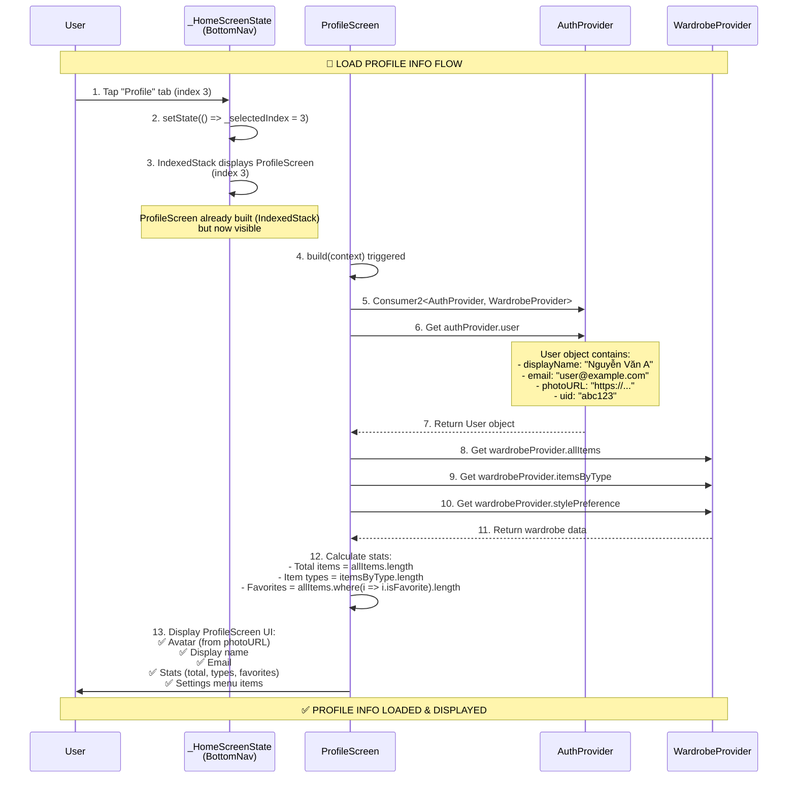
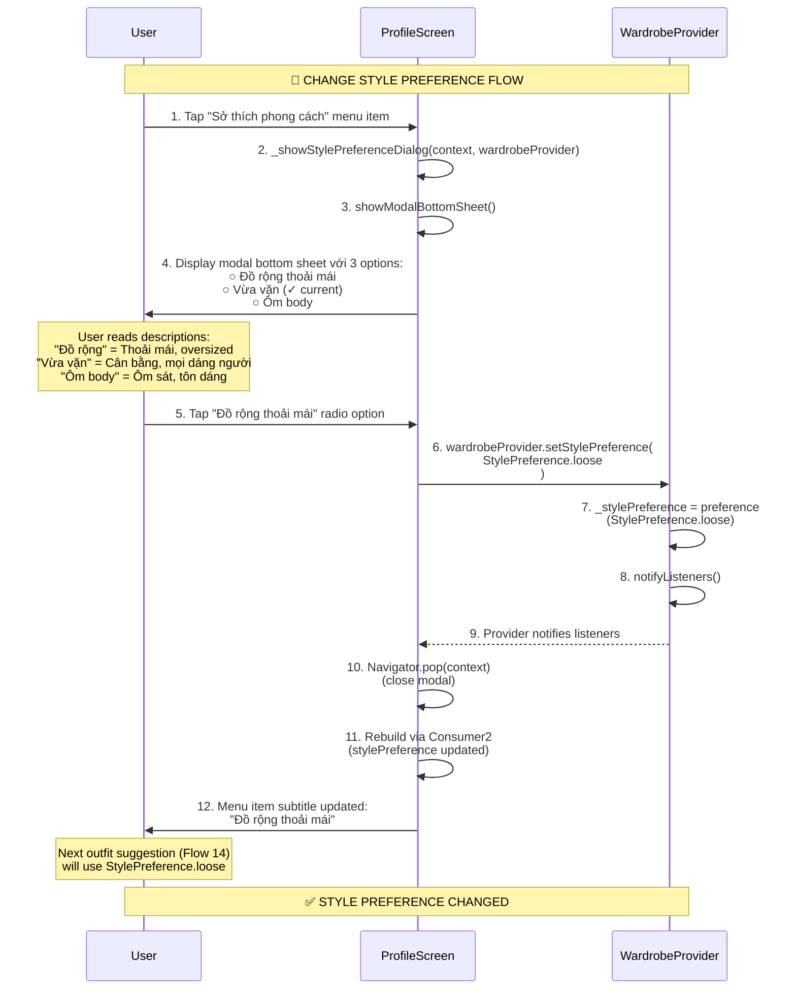
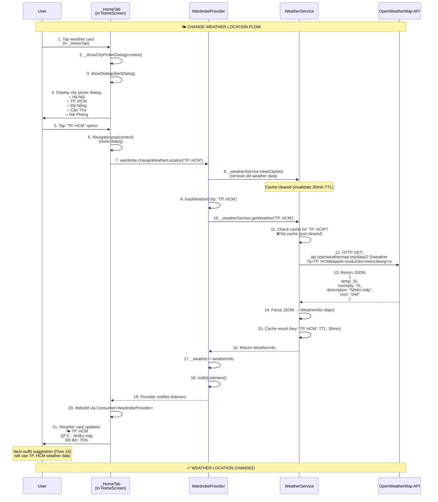

# Flow 21-23: Profile & Settings

## 📋 Mục Lục
1. [Tổng Quan](#tổng-quan)
2. [Flow 21: Load Profile Info](#flow-21-load-profile-info)
3. [Flow 22: Change Style Preference](#flow-22-change-style-preference)
4. [Flow 23: Change Weather Location](#flow-23-change-weather-location)
5. [Chi Tiết Kỹ Thuật](#chi-tiết-kỹ-thuật)
6. [Code Implementation](#code-implementation)

---

## Tổng Quan

### Mục Đích
Document các profile & settings flows trong ProfileScreen:
- **Flow 21**: Load và display user profile info (name, email, stats)
- **Flow 22**: Change style preference cho AI outfit suggestions
- **Flow 23**: Change weather location (ảnh hưởng outfit suggestions)

### Common Screen
Tất cả 3 flows diễn ra trong **ProfileScreen** (Tab 3 của bottom nav)

**Key Features**:
- 📊 **Profile Stats**: Tổng đồ, loại đồ, yêu thích
- ⚙️ **Settings Menu**: Edit profile, wardrobe stats, cleanup, style preference
- 🌤️ **Weather Location**: Thay đổi city cho weather-based outfit suggestions
- 🚪 **Logout**: Sign out và clear session

---

## Flow 21: Load Profile Info

### Trigger
User navigate to **Profile tab** (tap tab 3 trong bottom nav)

### Sơ Đồ Luồng


### Profile Info Sections

#### 1. Header (Gradient Banner)
```
┌─────────────────────────────────────┐
│     🎨 Gradient Background          │
│                                     │
│        👤 Avatar (circular)         │
│                                     │
│      Nguyễn Văn A                   │
│      user@example.com               │
│                                     │
│  ┌─────┬─────────┬─────────┐        │
│  │ 25  │   12    │    8    │        │
│  │Tổng │  Loại   │ Yêu thích│       │
│  └─────┴─────────┴─────────┘        │
└─────────────────────────────────────┘
```

**Data Sources**:
- **Avatar**: `authProvider.user?.photoURL` (Google photo hoặc default icon)
- **Name**: `authProvider.user?.displayName` (default: "Người dùng")
- **Email**: `authProvider.user?.email`
- **Stats**:
  - Tổng đồ: `wardrobeProvider.allItems.length`
  - Loại đồ: `wardrobeProvider.itemsByType.length`
  - Yêu thích: `wardrobeProvider.allItems.where((i) => i.isFavorite).length`

---

#### 2. Settings Menu
```
┌─────────────────────────────────────┐
│ Cài đặt                             │
├─────────────────────────────────────┤
│ 👤  Thông tin cá nhân           >   │
│     Chỉnh sửa hồ sơ của bạn         │
├─────────────────────────────────────┤
│ 📊  Thống kê tủ đồ              >   │
│     Xem chi tiết tủ đồ của bạn      │
├─────────────────────────────────────┤
│ 🧹  Dọn tủ đồ                   >   │
│     AI gợi ý đồ nên bỏ              │
├─────────────────────────────────────┤
│ 👔  Sở thích phong cách         >   │
│     Vừa vặn (current preference)    │
└─────────────────────────────────────┘
```

**Menu Items**:
1. **Thông tin cá nhân**: Edit display name (dialog)
2. **Thống kê tủ đồ**: Modal bottom sheet với detailed stats
3. **Dọn tủ đồ**: Navigate to WardrobeCleanupScreen (Flow 16)
4. **Sở thích phong cách**: Change style preference (Flow 22) ← Modal bottom sheet

---

#### 3. About & Logout
```
┌─────────────────────────────────────┐
│ Khác                                │
├─────────────────────────────────────┤
│ ℹ️  Về ứng dụng                 >   │
│     Phiên bản 1.0.0                 │
└─────────────────────────────────────┘

┌─────────────────────────────────────┐
│       🚪 Đăng xuất (red border)     │
└─────────────────────────────────────┘
```

---

### State Management

**AuthProvider** (user info):
```dart
class AuthProvider extends ChangeNotifier {
  User? _user;
  
  User? get user => _user;
  
  Stream<User?> get authStateChanges => 
      _firebaseService.authStateChanges;
  
  Future<void> updateDisplayName(String newName) async {
    await _user?.updateDisplayName(newName);
    await _user?.reload();
    _user = _firebaseService.currentUser;
    notifyListeners();
  }
}
```

**WardrobeProvider** (stats):
```dart
class WardrobeProvider extends ChangeNotifier {
  List<ClothingItem> _items = [];
  StylePreference _stylePreference = StylePreference.regular;
  
  List<ClothingItem> get allItems => _items;
  
  Map<ClothingType, List<ClothingItem>> get itemsByType {
    final map = <ClothingType, List<ClothingItem>>{};
    for (var item in _items) {
      map[item.type] = [...(map[item.type] ?? []), item];
    }
    return map;
  }
  
  StylePreference get stylePreference => _stylePreference;
}
```

---

## Flow 22: Change Style Preference

### Trigger
User tap **"Sở thích phong cách"** menu item trong ProfileScreen

### Sơ Đồ Luồng


### Style Preference Options

**Enum Definition**:
```dart
enum StylePreference {
  loose,    // Đồ rộng thoải mái
  regular,  // Vừa vặn
  fitted;   // Ôm body

  String get displayName {
    switch (this) {
      case StylePreference.loose:
        return 'Đồ rộng thoải mái';
      case StylePreference.regular:
        return 'Vừa vặn';
      case StylePreference.fitted:
        return 'Ôm body';
    }
  }

  String get aiDescription {
    switch (this) {
      case StylePreference.loose:
        return 'User prefers loose, relaxed, oversized clothing. '
               'Prioritize comfort over fitted looks.';
      case StylePreference.regular:
        return 'User prefers regular fit clothing, '
               'balanced between loose and fitted.';
      case StylePreference.fitted:
        return 'User prefers fitted, slim, body-hugging clothing. '
               'Prioritize sleek silhouettes.';
    }
  }
}
```

---

### Modal Bottom Sheet UI

```
┌─────────────────────────────────────┐
│ Sở thích phong cách                 │
│ AI sẽ ưu tiên gợi ý outfit theo     │
│ sở thích của bạn                    │
├─────────────────────────────────────┤
│                                     │
│ ○  Đồ rộng thoải mái                │
│    Thoải mái, oversized, không bó   │
│                                     │
│ ●  Vừa vặn                          │  ← Selected
│    Cân bằng, phù hợp mọi dáng       │
│                                     │
│ ○  Ôm body                          │
│    Ôm sát, tôn dáng, sleek          │
│                                     │
└─────────────────────────────────────┘
```

**Implementation**:
```dart
void _showStylePreferenceDialog(
  BuildContext context,
  WardrobeProvider wardrobeProvider,
) {
  showModalBottomSheet(
    context: context,
    shape: const RoundedRectangleBorder(
      borderRadius: BorderRadius.vertical(top: Radius.circular(20)),
    ),
    builder: (context) => Padding(
      padding: const EdgeInsets.all(20),
      child: Column(
        mainAxisSize: MainAxisSize.min,
        children: [
          const Text('Sở thích phong cách', style: ...),
          const Text('AI sẽ ưu tiên gợi ý...', style: ...),
          const SizedBox(height: 20),
          
          // Radio buttons cho từng option
          ...StylePreference.values.map((style) => 
            RadioListTile<StylePreference>(
              value: style,
              groupValue: wardrobeProvider.stylePreference,
              onChanged: (value) {
                if (value != null) {
                  wardrobeProvider.setStylePreference(value);
                  Navigator.pop(context);
                }
              },
              title: Text(style.displayName),
              subtitle: Text(_getStyleDescription(style)),
              activeColor: AppTheme.primaryColor,
            ),
          ),
        ],
      ),
    ),
  );
}
```

---

### Impact on AI Suggestions

**Flow 14 (Suggest Outfit)** sử dụng `stylePreference`:

```dart
// In WardrobeProvider.suggestOutfit()
final suggestion = await _geminiService.suggestOutfit(
  wardrobe: _items,
  weatherContext: weatherContext,
  occasion: occasion,
  stylePreference: _stylePreference.aiDescription,  // ← Used here
);
```

**AI Prompt Example** (StylePreference.loose):
```
You are a fashion stylist AI. Suggest an outfit from this wardrobe:
- Weather: 28°C, sunny, 70% humidity
- Occasion: casual
- Style Preference: User prefers loose, relaxed, oversized clothing. 
  Prioritize comfort over fitted looks.

Available items:
1. Áo thun (white, cotton, casual, summer)
2. Quần jean (blue, denim, casual, all seasons)
...

Suggest outfit with reasoning.
```

**Result**: AI will prioritize loose-fit items (oversized tshirts, wide-leg jeans) over fitted options

---

## Flow 23: Change Weather Location

### Trigger
User tap **weather card** trong HomeScreen → City picker dialog

### Sơ Đồ Luồng


### City Picker Dialog

**Available Cities** (hardcoded list):
```dart
final cities = [
  {'name': 'Hà Nội', 'icon': '🏛️'},
  {'name': 'TP. HCM', 'icon': '🌆'},
  {'name': 'Đà Nẵng', 'icon': '🏖️'},
  {'name': 'Cần Thơ', 'icon': '🌾'},
  {'name': 'Hải Phòng', 'icon': '⚓'},
  {'name': 'Nha Trang', 'icon': '🏝️'},
  {'name': 'Huế', 'icon': '🏰'},
  {'name': 'Vũng Tàu', 'icon': '🏖️'},
];
```

**Dialog UI**:
```
┌─────────────────────────────────────┐
│ Chọn thành phố                      │
├─────────────────────────────────────┤
│                                     │
│ 🏛️  Hà Nội                     >    │
│                                     │
│ 🌆  TP. HCM (✓ current)        >    │
│                                     │
│ 🏖️  Đà Nẵng                    >    │
│                                     │
│ 🌾  Cần Thơ                     >    │
│                                     │
│ ⚓  Hải Phòng                   >    │
│                                     │
└─────────────────────────────────────┘
```

**Implementation**:
```dart
// In _HomeTab
void _showCityPickerDialog(BuildContext context) {
  final cities = [
    {'name': 'Hà Nội', 'icon': '🏛️'},
    {'name': 'TP. HCM', 'icon': '🌆'},
    {'name': 'Đà Nẵng', 'icon': '🏖️'},
    {'name': 'Cần Thơ', 'icon': '🌾'},
    {'name': 'Hải Phòng', 'icon': '⚓'},
  ];

  showDialog(
    context: context,
    builder: (context) => AlertDialog(
      title: const Text('Chọn thành phố'),
      content: SingleChildScrollView(
        child: Column(
          mainAxisSize: MainAxisSize.min,
          children: cities.map((city) {
            return ListTile(
              leading: Text(city['icon']!, style: TextStyle(fontSize: 24)),
              title: Text(city['name']!),
              onTap: () {
                Navigator.pop(context);
                final wardrobe = context.read<WardrobeProvider>();
                wardrobe.changeWeatherLocation(city['name']!);
              },
            );
          }).toList(),
        ),
      ),
    ),
  );
}
```

---

### Weather Service Cache Behavior

**Cache Logic** (documented in Flow 17):
```dart
class WeatherService {
  final _cache = <String, _CachedWeather>{};
  static const _cacheDuration = Duration(minutes: 30);

  Future<WeatherInfo> getWeather(String city) async {
    // Check cache
    if (_cache.containsKey(city)) {
      final cached = _cache[city]!;
      if (DateTime.now().difference(cached.timestamp) < _cacheDuration) {
        print('✅ Using cached weather for $city');
        return cached.data;
      }
    }

    // Fetch new data
    final weather = await _fetchFromAPI(city);
    
    // Update cache
    _cache[city] = _CachedWeather(
      data: weather,
      timestamp: DateTime.now(),
    );

    return weather;
  }

  void clearCache() {
    _cache.clear();
    print('🗑️ Weather cache cleared');
  }
}
```

**changeWeatherLocation** behavior:
```dart
// In WardrobeProvider
Future<void> changeWeatherLocation(String city) async {
  _weatherService.clearCache();  // ← Force fresh API call
  await loadWeather(city: city);
}
```

**Why clear cache?**:
- User expects **immediate update** khi change city
- Old city cache không còn relevant
- New city might have stale cache (> 30min old)

---

## Chi Tiết Kỹ Thuật

### Consumer Pattern (Flow 21)

**Why Consumer2?**:
```dart
Consumer2<AuthProvider, WardrobeProvider>(
  builder: (context, authProvider, wardrobeProvider, _) {
    final user = authProvider.user;
    final items = wardrobeProvider.allItems;
    
    // Rebuild when EITHER provider changes
    return /* UI */;
  },
)
```

**Benefits**:
- ✅ Auto rebuild khi AuthProvider hoặc WardrobeProvider notifyListeners
- ✅ No need manual setState
- ✅ Efficient: Chỉ rebuild ProfileScreen widget tree, không rebuild toàn bộ app

---

### IndexedStack State Preservation

**Profile tab behavior** (Flow 18 context):
```dart
// In _HomeScreenState
IndexedStack(
  index: _selectedIndex,
  children: const [
    _HomeTab(),        // index 0
    WardrobeScreen(),  // index 1
    OutfitSuggestScreen(),  // index 2
    ProfileScreen(),   // index 3 ← ProfileScreen always built
  ],
)
```

**Key Point**:
- ProfileScreen **không rebuild** khi user switch tabs (IndexedStack preserves state)
- **Consumer2** trong ProfileScreen rebuild khi provider changes (independent of tab switching)
- **Stats update** ngay lập tức khi user add/delete item ở tab khác, sau đó switch về Profile tab

---

### Style Preference Persistence

**Current Implementation**: In-memory only (lost on app restart)

**Expected Behavior**:
```dart
// On change
void setStylePreference(StylePreference preference) {
  _stylePreference = preference;
  notifyListeners();
  // TODO: Save to Firestore user preferences
  // _firebaseService.updateUserPreference('stylePreference', preference.name);
}

// On app start (in WardrobeProvider constructor)
WardrobeProvider(...) {
  // TODO: Load from Firestore
  // _loadStylePreference();
}
```

**Future Enhancement**: Persist to Firestore `users/{uid}/preferences` collection

---

## Code Implementation

### Flow 21: ProfileScreen Build

**File**: `lib/screens/profile_screen.dart`
```dart
class ProfileScreen extends StatelessWidget {
  const ProfileScreen({super.key});

  @override
  Widget build(BuildContext context) {
    return Scaffold(
      backgroundColor: AppTheme.backgroundColor,
      body: Consumer2<AuthProvider, WardrobeProvider>(
        builder: (context, authProvider, wardrobeProvider, _) {
          final user = authProvider.user;

          return CustomScrollView(
            slivers: [
              // Header with gradient
              SliverToBoxAdapter(
                child: Container(
                  padding: const EdgeInsets.fromLTRB(20, 60, 20, 30),
                  decoration: const BoxDecoration(
                    gradient: AppTheme.primaryGradient,
                    borderRadius: BorderRadius.vertical(
                      bottom: Radius.circular(30),
                    ),
                  ),
                  child: Column(
                    children: [
                      // Avatar
                      Container(
                        padding: const EdgeInsets.all(4),
                        decoration: BoxDecoration(
                          color: Colors.white,
                          shape: BoxShape.circle,
                          boxShadow: [
                            BoxShadow(
                              color: Colors.black.withValues(alpha: 0.2),
                              blurRadius: 10,
                            ),
                          ],
                        ),
                        child: CircleAvatar(
                          radius: 50,
                          backgroundImage: user?.photoURL != null
                              ? NetworkImage(user!.photoURL!)
                              : null,
                          child: user?.photoURL == null
                              ? const Icon(Icons.person, size: 50)
                              : null,
                        ),
                      ),

                      const SizedBox(height: 16),

                      // Name
                      Text(
                        user?.displayName ?? 'Người dùng',
                        style: const TextStyle(
                          color: Colors.white,
                          fontSize: 24,
                          fontWeight: FontWeight.bold,
                        ),
                      ),

                      // Email
                      if (user?.email != null)
                        Text(
                          user!.email!,
                          style: TextStyle(
                            color: Colors.white.withValues(alpha: 0.8),
                            fontSize: 14,
                          ),
                        ),

                      const SizedBox(height: 20),

                      // Stats
                      Row(
                        mainAxisAlignment: MainAxisAlignment.spaceEvenly,
                        children: [
                          _buildStat(
                            label: 'Tổng đồ',
                            value: wardrobeProvider.allItems.length.toString(),
                            icon: Icons.checkroom,
                          ),
                          _buildDivider(),
                          _buildStat(
                            label: 'Loại đồ',
                            value: wardrobeProvider.itemsByType.length.toString(),
                            icon: Icons.style,
                          ),
                          _buildDivider(),
                          _buildStat(
                            label: 'Yêu thích',
                            value: wardrobeProvider.allItems
                                .where((i) => i.isFavorite)
                                .length
                                .toString(),
                            icon: Icons.favorite,
                          ),
                        ],
                      ),
                    ],
                  ),
                ),
              ),

              // Settings menu (rest of UI)
              // ...
            ],
          );
        },
      ),
    );
  }
}
```

---

### Flow 22: Style Preference Change

**File**: `lib/providers/wardrobe_provider.dart`
```dart
class WardrobeProvider extends ChangeNotifier {
  StylePreference _stylePreference = StylePreference.regular;
  
  StylePreference get stylePreference => _stylePreference;
  
  void setStylePreference(StylePreference preference) {
    _stylePreference = preference;
    notifyListeners();  // ← Trigger UI rebuild
  }
  
  // Used in Flow 14 (Suggest Outfit)
  Future<Outfit?> suggestOutfit(String occasion) async {
    try {
      _isSuggestingOutfit = true;
      notifyListeners();

      final weatherContext = _weather?.toAIDescription() ?? 
          'Temperature: 28°C, Humidity: 70%, Condition: Ấm áp';

      // Pass stylePreference to AI
      final suggestion = await _geminiService.suggestOutfit(
        wardrobe: _items,
        weatherContext: weatherContext,
        occasion: occasion,
        stylePreference: _stylePreference.aiDescription,  // ← Here
      );

      // ... parse suggestion
    } catch (e) {
      // ... error handling
    }
  }
}
```

**File**: `lib/screens/profile_screen.dart` (modal dialog)
```dart
void _showStylePreferenceDialog(
  BuildContext context,
  WardrobeProvider wardrobeProvider,
) {
  showModalBottomSheet(
    context: context,
    shape: const RoundedRectangleBorder(
      borderRadius: BorderRadius.vertical(top: Radius.circular(20)),
    ),
    builder: (context) => Padding(
      padding: const EdgeInsets.all(20),
      child: Column(
        mainAxisSize: MainAxisSize.min,
        crossAxisAlignment: CrossAxisAlignment.start,
        children: [
          const Text(
            'Sở thích phong cách',
            style: TextStyle(fontSize: 20, fontWeight: FontWeight.bold),
          ),
          const SizedBox(height: 8),
          const Text(
            'AI sẽ ưu tiên gợi ý outfit theo sở thích của bạn',
            style: TextStyle(color: AppTheme.textSecondary),
          ),
          const SizedBox(height: 20),
          
          // Radio buttons
          ...StylePreference.values.map((style) =>
            RadioListTile<StylePreference>(
              value: style,
              groupValue: wardrobeProvider.stylePreference,
              onChanged: (value) {
                if (value != null) {
                  wardrobeProvider.setStylePreference(value);
                  Navigator.pop(context);  // ← Close modal
                }
              },
              title: Text(style.displayName),
              subtitle: Text(
                _getStyleDescription(style),
                style: const TextStyle(fontSize: 12),
              ),
              activeColor: AppTheme.primaryColor,
              contentPadding: EdgeInsets.zero,
            ),
          ),
        ],
      ),
    ),
  );
}

String _getStyleDescription(StylePreference style) {
  switch (style) {
    case StylePreference.loose:
      return 'Thoải mái, oversized, không bó sát';
    case StylePreference.regular:
      return 'Cân bằng, phù hợp mọi dáng người';
    case StylePreference.fitted:
      return 'Ôm sát, tôn dáng, sleek';
  }
}
```

---

### Flow 23: Weather Location Change

**File**: `lib/screens/home_screen.dart` (_HomeTab weather card)
```dart
class _HomeTab extends StatelessWidget {
  // ... (line 540-600)
  
  void _showCityPickerDialog(BuildContext context) {
    final cities = [
      {'name': 'Hà Nội', 'icon': '🏛️'},
      {'name': 'TP. HCM', 'icon': '🌆'},
      {'name': 'Đà Nẵng', 'icon': '🏖️'},
      {'name': 'Cần Thơ', 'icon': '🌾'},
      {'name': 'Hải Phòng', 'icon': '⚓'},
    ];

    showDialog(
      context: context,
      builder: (context) => AlertDialog(
        shape: RoundedRectangleBorder(
          borderRadius: BorderRadius.circular(20),
        ),
        title: const Text('Chọn thành phố'),
        content: SingleChildScrollView(
          child: Column(
            mainAxisSize: MainAxisSize.min,
            children: cities.map((city) {
              return ListTile(
                leading: Text(
                  city['icon']!,
                  style: const TextStyle(fontSize: 24),
                ),
                title: Text(city['name']!),
                onTap: () {
                  Navigator.pop(context);
                  final wardrobe = context.read<WardrobeProvider>();
                  wardrobe.changeWeatherLocation(city['name']!);
                },
              );
            }).toList(),
          ),
        ),
      ),
    );
  }

  // Weather card (tappable)
  Widget _buildWeatherCard(WardrobeProvider wardrobe) {
    return GestureDetector(
      onTap: () => _showCityPickerDialog(context),  // ← Tap to change
      child: Container(
        padding: const EdgeInsets.all(16),
        decoration: BoxDecoration(
          gradient: LinearGradient(
            colors: [Colors.blue.shade400, Colors.blue.shade600],
            begin: Alignment.topLeft,
            end: Alignment.bottomRight,
          ),
          borderRadius: BorderRadius.circular(16),
        ),
        child: Row(
          children: [
            const Icon(Icons.wb_sunny, color: Colors.white, size: 40),
            const SizedBox(width: 12),
            Expanded(
              child: Column(
                crossAxisAlignment: CrossAxisAlignment.start,
                children: [
                  Text(
                    wardrobe.weather?.city ?? 'Hà Nội',
                    style: const TextStyle(
                      color: Colors.white,
                      fontWeight: FontWeight.w600,
                    ),
                  ),
                  Text(
                    '${wardrobe.weather?.temperature.toStringAsFixed(0) ?? '--'}°C - ${wardrobe.weather?.description ?? 'Đang tải...'}',
                    style: TextStyle(
                      color: Colors.white.withValues(alpha: 0.9),
                      fontSize: 13,
                    ),
                  ),
                ],
              ),
            ),
            const Icon(Icons.chevron_right, color: Colors.white),
          ],
        ),
      ),
    );
  }
}
```

**File**: `lib/providers/wardrobe_provider.dart`
```dart
class WardrobeProvider extends ChangeNotifier {
  final WeatherService _weatherService;
  WeatherInfo? _weather;
  
  WeatherInfo? get weather => _weather;
  
  /// Change weather location
  Future<void> changeWeatherLocation(String city) async {
    _weatherService.clearCache();  // ← Clear old cache
    await loadWeather(city: city);  // ← Fetch new weather
  }
  
  /// Load weather (called by changeWeatherLocation)
  Future<void> loadWeather({String? city}) async {
    try {
      final defaultCity = city ?? 'Hà Nội';
      _weather = await _weatherService.getWeather(defaultCity);
      notifyListeners();  // ← Update UI
      print('✅ Weather loaded: ${_weather?.city}, ${_weather?.temperature}°C');
    } catch (e) {
      print('❌ Error loading weather: $e');
      // Keep old weather data, don't set to null
    }
  }
}
```

**File**: `lib/services/weather_service.dart`
```dart
class WeatherService {
  final _cache = <String, _CachedWeather>{};
  static const _cacheDuration = Duration(minutes: 30);
  
  /// Clear cache (used when changing location)
  void clearCache() {
    _cache.clear();
    print('🗑️ Weather cache cleared');
  }
  
  /// Get weather with 30min cache
  Future<WeatherInfo> getWeather(String city) async {
    // Check cache
    if (_cache.containsKey(city)) {
      final cached = _cache[city]!;
      if (DateTime.now().difference(cached.timestamp) < _cacheDuration) {
        print('✅ Using cached weather for $city');
        return cached.data;
      }
    }

    print('🌐 Fetching fresh weather for $city from API...');
    
    // Fetch from OpenWeatherMap API
    final response = await http.get(Uri.parse(
      'https://api.openweathermap.org/data/2.5/weather'
      '?q=$city&appid=${AppConstants.openWeatherApiKey}'
      '&units=metric&lang=vi'
    ));

    if (response.statusCode == 200) {
      final data = json.decode(response.body);
      final weather = WeatherInfo(
        city: city,
        temperature: data['main']['temp'].toDouble(),
        humidity: data['main']['humidity'],
        description: data['weather'][0]['description'],
        icon: data['weather'][0]['icon'],
      );
      
      // Cache result
      _cache[city] = _CachedWeather(
        data: weather,
        timestamp: DateTime.now(),
      );
      
      return weather;
    } else {
      throw Exception('Failed to load weather: ${response.statusCode}');
    }
  }
}

class _CachedWeather {
  final WeatherInfo data;
  final DateTime timestamp;

  _CachedWeather({required this.data, required this.timestamp});
}
```

---

## Tóm Tắt Technical

### Flow 21: Load Profile Info

**Trigger**: Navigate to Profile tab (index 3)

**Data Sources**:
- **AuthProvider**: user (displayName, email, photoURL)
- **WardrobeProvider**: allItems, itemsByType, stylePreference

**UI Sections**:
1. **Header**: Avatar, name, email, stats (total/types/favorites)
2. **Settings Menu**: Edit profile, stats, cleanup, style preference
3. **Logout**: Sign out button

**State Management**: Consumer2<AuthProvider, WardrobeProvider>

---

### Flow 22: Change Style Preference

**Trigger**: Tap "Sở thích phong cách" menu item

**Options**: Loose / Regular / Fitted (enum StylePreference)

**UI**: Modal bottom sheet với RadioListTile

**Impact**: Next outfit suggestion (Flow 14) uses stylePreference.aiDescription in AI prompt

**Persistence**: In-memory only (TODO: save to Firestore)

---

### Flow 23: Change Weather Location

**Trigger**: Tap weather card trong _HomeTab

**UI**: AlertDialog với city picker (5-8 cities)

**Flow**:
1. User tap city → Close dialog
2. Call `wardrobeProvider.changeWeatherLocation(city)`
3. Clear weather cache (invalidate old data)
4. Fetch fresh weather from OpenWeatherMap API
5. Update UI (weather card shows new city + temp)

**Cache Behavior**: clearCache() → Force fresh API call (bypass 30min TTL)

**Impact**: Next outfit suggestion (Flow 14) uses updated weather context

---

### Performance Notes

**Flow 21** (Load Profile):
- **No API calls** (data already in providers)
- **Build time**: <100ms (Consumer2 rebuild)
- **Stats calculation**: O(n) where n = allItems.length (negligible for < 1000 items)

**Flow 22** (Change Style Preference):
- **No API calls** (in-memory state update)
- **Update time**: <50ms (notifyListeners + rebuild)
- **Modal animation**: 300ms (Material default)

**Flow 23** (Change Weather Location):
- **API call**: 200-500ms (OpenWeatherMap latency)
- **clearCache()**: O(1) (HashMap clear)
- **Total time**: ~500ms (API call dominant)

---

### UX Highlights

**Flow 21** (Profile):
- ✅ **Gradient header** với avatar (visually appealing)
- ✅ **Live stats** (auto-update via Consumer2)
- ✅ **Menu items** rõ ràng với icons + subtitles

**Flow 22** (Style Preference):
- ✅ **3 clear options** với descriptions
- ✅ **Radio buttons** (single selection, intuitive)
- ✅ **Auto-close modal** after selection (smooth UX)
- ✅ **AI-powered** (affects outfit suggestions)

**Flow 23** (Weather Location):
- ✅ **City picker** với emoji icons (fun, easy to scan)
- ✅ **Instant update** (clearCache ensures fresh data)
- ✅ **Weather card tappable** (discoverable action)
- ✅ **5-8 major cities** (covers most users)

---

### Future Enhancements

**Flow 21**:
1. **Edit Avatar**: Upload custom avatar (camera/gallery)
2. **Detailed Stats**: Charts (items added over time, most worn types)
3. **Export Data**: Download wardrobe as CSV/JSON

**Flow 22**:
1. **Persist to Firestore**: Save stylePreference to `users/{uid}/preferences`
2. **More Options**: Add "Minimalist", "Colorful", "Monochrome" preferences
3. **AI Learning**: Track outfit acceptance rate, auto-adjust preference

**Flow 23**:
1. **Auto-detect Location**: Use GPS to auto-select nearest city
2. **More Cities**: Search bar to pick any city worldwide
3. **Forecast**: Show 7-day forecast in modal
4. **Weather Icons**: Use OpenWeatherMap icons instead of emoji

---

**Kết luận**: Flow 21-23 document profile & settings features trong ProfileScreen. Flow 21 loads user info + wardrobe stats (Consumer2 pattern). Flow 22 changes style preference cho AI outfit suggestions (modal bottom sheet với radio buttons). Flow 23 changes weather location (city picker dialog, clearCache, fresh API call). All flows use Provider pattern cho state management, với clear UX flows và smooth animations. 👤⚙️🌤️✨

