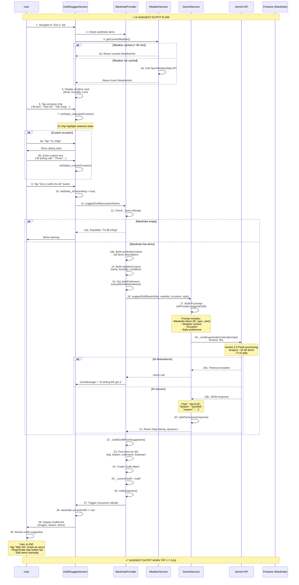
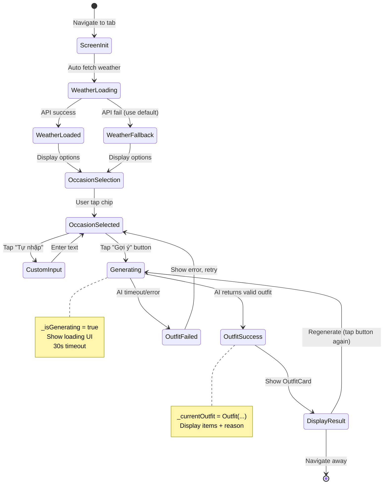

# Flow 14: Gợi Ý Outfit với AI (Gemini 2.0)

## 📋 Mục Lục
1. [Tổng Quan](#tổng-quan)
2. [Sơ Đồ Luồng](#sơ-đồ-luồng)
3. [Chi Tiết Kỹ Thuật](#chi-tiết-kỹ-thuật)
4. [Code Implementation](#code-implementation)
5. [AI Prompt Engineering](#ai-prompt-engineering)
6. [Performance & Error Handling](#performance--error-handling)
7. [Use Cases Thực Tế](#use-cases-thực-tế)
8. [Flows Liên Quan](#flows-liên-quan)

---

## Tổng Quan

### Mục Đích
Flow này sử dụng **Google Gemini 2.0 Flash AI** để phân tích toàn bộ tủ đồ, kết hợp với thông tin thời tiết và dịp cụ thể (occasion) để gợi ý outfit phù hợp nhất. Đây là **killer feature** của app, giúp user không phải suy nghĩ "hôm nay mặc gì".

### Trigger Points
1. **OutfitSuggestScreen**: User chọn occasion → Tap "Gợi ý outfit cho tôi"
2. **Main Navigation**: Tab "Gợi ý" trong bottom navigation
3. **Weather Integration**: Auto load weather data khi screen mở

### Input Data
- **Wardrobe**: Toàn bộ items trong `_items` (ClothingItem list)
- **Weather**: Temperature, humidity, condition từ OpenWeatherMap API
- **Occasion**: 9 options (Hàng ngày, Đi làm, Hẹn hò, Tiệc tùng, v.v.) + custom input
- **Style Preference**: Casual/Formal/Streetwear (optional)

### Output Data
- **Outfit**: Object chứa top, bottom, outerwear, footwear, accessories
- **Reason**: AI explanation tại sao chọn combination này (Vietnamese)
- **Color Score**: Đánh giá harmony (optional)

### Kết Quả Mong Đợi
- ✅ AI trả về outfit trong ~5-10 giây
- ✅ Combination hợp lý (match weather + occasion)
- ✅ UI hiển thị items với ảnh + reason
- ✅ User có thể "Mặc thử" hoặc regenerate

---

## Sơ Đồ Luồng

### Flow Diagram


### State Diagram


---

## Chi Tiết Kỹ Thuật

### 1. Occasion Selection

**File**: `lib/utils/constants.dart`
```dart
class Occasions {
  static const List<Map<String, String>> list = [
    {'id': 'daily', 'name': 'Hàng ngày', 'icon': '☀️'},
    {'id': 'work', 'name': 'Đi làm', 'icon': '💼'},
    {'id': 'date', 'name': 'Hẹn hò', 'icon': '💕'},
    {'id': 'party', 'name': 'Tiệc tùng', 'icon': '🎉'},
    {'id': 'sport', 'name': 'Thể thao', 'icon': '🏃'},
    {'id': 'travel', 'name': 'Du lịch', 'icon': '✈️'},
    {'id': 'formal', 'name': 'Sự kiện trang trọng', 'icon': '🎩'},
    {'id': 'beach', 'name': 'Đi biển', 'icon': '🏖️'},
    {'id': 'casual', 'name': 'Cafe/Đi chơi', 'icon': '☕'},
  ];
}
```

**UI Implementation**: Wrap layout với occasion chips
```dart
Wrap(
  spacing: 10,
  runSpacing: 10,
  children: [
    ...Occasions.list.map((occasion) => OccasionChip(
      id: occasion['id']!,
      name: occasion['name']!,
      icon: occasion['icon']!,
      isSelected: _selectedOccasion == occasion['id'],
      onTap: () => setState(() => _selectedOccasion = occasion['id']),
    )),
    // Custom input option
    OccasionChip(
      id: 'custom',
      name: 'Tự nhập',
      icon: '✏️',
      isSelected: _customOccasion != null,
      onTap: () => _showCustomOccasionDialog(),
    ),
  ],
)
```

**Giải thích**:
- 9 occasions cố định cover 80% use cases
- Custom input cho flexibility (VD: "Đi phỏng vấn", "Gặp đối tác")
- Icon emoji để UI thân thiện

### 2. Weather Integration

**WeatherService Auto-Fetch**:
```dart
Future<WeatherInfo?> getCurrentWeather({
  String city = 'Ho Chi Minh City',
  String countryCode = 'VN',
}) async {
  // Check 30-min cache
  if (_cachedWeather != null && _lastFetchTime != null) {
    final diff = DateTime.now().difference(_lastFetchTime!);
    if (diff < Duration(minutes: 30)) {
      return _cachedWeather;  // ← Return cached
    }
  }

  // Call OpenWeatherMap API
  final url = Uri.parse(
    'https://api.openweathermap.org/data/2.5/weather'
    '?q=$city,$countryCode&appid=$apiKey&units=metric'
  );
  final response = await http.get(url).timeout(Duration(seconds: 10));
  
  if (response.statusCode == 200) {
    _cachedWeather = WeatherInfo.fromJson(jsonDecode(response.body));
    _lastFetchTime = DateTime.now();
    return _cachedWeather;
  }
  
  // Fallback default
  return _getDefaultWeather();  // ← 28°C, 70% humidity
}
```

**Weather to AI Context**:
```dart
// WeatherInfo model
String toAIDescription() {
  return 'Temperature: ${temperature.round()}°C, '
         'Humidity: $humidity%, '
         'Condition: $description';
}

// Example output: "Temperature: 32°C, Humidity: 75%, Condition: Sunny"
```

**Giải thích**:
- Cache 30 phút để tránh spam API
- Timeout 10s để không block UI
- Fallback default nếu API fail (app vẫn usable)

### 3. AI Suggest Outfit Logic

**Provider Method**: `wardrobe_provider.dart`
```dart
Future<Outfit?> suggestOutfit(String occasion) async {
  try {
    _isSuggestingOutfit = true;
    notifyListeners();

    // 1. Prepare weather context
    final weatherContext = _weather?.toAIDescription() ?? 
        'Temperature: 28°C, Humidity: 70%, Condition: Ấm áp';

    // 2. Call Gemini AI
    final suggestion = await _geminiService.suggestOutfit(
      wardrobe: _items,              // ← Full wardrobe
      weatherContext: weatherContext,
      occasion: occasion,
      stylePreference: _stylePreference.aiDescription,  // ← User preference
    );

    if (suggestion == null) {
      throw Exception('AI không thể gợi ý outfit');
    }

    // 3. Build Outfit from AI suggestion
    final outfit = _buildOutfitFromSuggestion(suggestion, occasion);
    _currentOutfit = outfit;
    
    _isSuggestingOutfit = false;
    notifyListeners();
    return outfit;
    
  } catch (e) {
    _isSuggestingOutfit = false;
    _errorMessage = e.toString();
    notifyListeners();
    return null;
  }
}
```

**Build Outfit Helper**:
```dart
Outfit _buildOutfitFromSuggestion(Map<String, dynamic> suggestion, String occasion) {
  // Helper: Find item by ID
  ClothingItem? findItem(String? id) {
    if (id == null || id == 'null') return null;
    return _items.firstWhere(
      (item) => item.id == id,
      orElse: () => _items.first,  // ← Fallback nếu ID không tồn tại
    );
  }

  // Parse accessories array
  final accessoryIds = suggestion['accessories'] as List<dynamic>? ?? [];
  final accessories = accessoryIds
      .map((id) => findItem(id.toString()))
      .whereType<ClothingItem>()  // ← Remove nulls
      .toList();

  return Outfit(
    id: _uuid.v4(),  // ← Generate unique ID
    top: findItem(suggestion['top']?.toString()),
    bottom: findItem(suggestion['bottom']?.toString()),
    outerwear: findItem(suggestion['outerwear']?.toString()),
    footwear: findItem(suggestion['footwear']?.toString()),
    accessories: accessories,
    occasion: occasion,
    reason: suggestion['reason'] ?? 'AI gợi ý outfit này cho bạn',
    createdAt: DateTime.now(),
  );
}
```

**Giải thích**:
- AI trả về item IDs, provider map IDs → ClothingItem objects
- Nullable fields: top/bottom/outerwear/footwear có thể null (VD: dress không cần bottom)
- Accessories là array (có thể 0-N items)
- `orElse: () => _items.first`: Fallback nếu AI trả về invalid ID

---

## Code Implementation

### 1. Generate Outfit Button

**UI**: `outfit_suggest_screen.dart`
```dart
ElevatedButton.icon(
  onPressed: (_selectedOccasion != null || _customOccasion != null) && !_isGenerating
      ? _generateOutfit
      : null,  // ← Disabled nếu chưa chọn occasion
  icon: _isGenerating
      ? SizedBox(
          width: 20,
          height: 20,
          child: CircularProgressIndicator(strokeWidth: 2, color: Colors.white),
        )
      : Icon(Icons.auto_awesome),
  label: Text(_isGenerating ? 'Đang tạo outfit...' : 'Gợi ý outfit cho tôi'),
  style: ElevatedButton.styleFrom(
    padding: EdgeInsets.symmetric(vertical: 16),
  ),
)
```

**Handler**:
```dart
Future<void> _generateOutfit() async {
  setState(() => _isGenerating = true);

  try {
    final wardrobeProvider = context.read<WardrobeProvider>();
    
    // Check empty wardrobe
    if (wardrobeProvider.allItems.isEmpty) {
      ScaffoldMessenger.of(context).showSnackBar(
        SnackBar(content: Text('Tủ đồ trống! Hãy thêm quần áo trước.')),
      );
      return;
    }

    // Get occasion name
    final occasionName = _customOccasion ?? Occasions.getName(_selectedOccasion!);
    
    // Call provider
    await wardrobeProvider.suggestOutfit(occasionName);

    // Show error if any
    if (wardrobeProvider.errorMessage != null) {
      ScaffoldMessenger.of(context).showSnackBar(
        SnackBar(content: Text(wardrobeProvider.errorMessage!)),
      );
    }
  } finally {
    setState(() => _isGenerating = false);
  }
}
```

### 2. Outfit Display

**Consumer Pattern**:
```dart
Consumer<WardrobeProvider>(
  builder: (context, wardrobe, _) {
    // Loading state
    if (wardrobe.isSuggestingOutfit) {
      return OutfitShimmer();  // ← Skeleton loading
    }

    // Empty state
    if (wardrobe.currentOutfit == null) {
      return _buildEmptyState();
    }

    // Success state
    return Padding(
      padding: EdgeInsets.all(20),
      child: Column(
        children: [
          Text('Outfit được gợi ý', style: TextStyle(fontSize: 18, fontWeight: FontWeight.w600)),
          SizedBox(height: 16),
          OutfitCard(
            outfit: wardrobe.currentOutfit!,
            onWear: () => _markOutfitAsWorn(wardrobe.currentOutfit!),
          ),
        ],
      ),
    );
  },
)
```

**OutfitCard Widget**: Hiển thị images grid + reason
```dart
class OutfitCard extends StatelessWidget {
  final Outfit outfit;
  final VoidCallback? onWear;

  Widget build(BuildContext context) {
    return Container(
      decoration: BoxDecoration(
        color: Colors.white,
        borderRadius: BorderRadius.circular(20),
        boxShadow: [BoxShadow(color: Colors.black12, blurRadius: 10)],
      ),
      child: Column(
        children: [
          // Items grid (2x2 hoặc 2x3)
          GridView.count(
            crossAxisCount: 2,
            shrinkWrap: true,
            physics: NeverScrollableScrollPhysics(),
            children: outfit.allItems.map((item) => 
              ClothingImage(imageBase64: item.imageBase64)
            ).toList(),
          ),
          
          // Reason section
          Container(
            padding: EdgeInsets.all(16),
            child: Column(
              children: [
                Icon(Icons.lightbulb_outline, color: AppTheme.accentColor),
                SizedBox(height: 8),
                Text(outfit.reason, textAlign: TextAlign.center),
              ],
            ),
          ),
          
          // "Mặc thử" button
          if (onWear != null)
            ElevatedButton(onPressed: onWear, child: Text('Mặc thử')),
        ],
      ),
    );
  }
}
```

---

## AI Prompt Engineering

### Suggest Outfit Prompt

**File**: `lib/utils/constants.dart`
```dart
static String suggestOutfit({
  required String wardrobeContext,
  required String weatherContext,
  required String occasion,
  String? stylePreference,
}) {
  final styleContext = stylePreference != null 
      ? '\nSTYLE PREFERENCE:\n$stylePreference\n' 
      : '';
  
  return '''
You are a professional fashion stylist. Based on the wardrobe items and conditions below, suggest the best outfit.

WARDROBE ITEMS:
$wardrobeContext

WEATHER:
$weatherContext

OCCASION: $occasion
$styleContext
Select items that:
1. Match the weather conditions
2. Are appropriate for the occasion
3. Have harmonious colors
4. Create a cohesive style
5. Respect the user's style preference (if provided)

Return ONLY a valid JSON object:
{
  "top": "item_id or null",
  "bottom": "item_id or null",
  "outerwear": "item_id or null",
  "footwear": "item_id or null",
  "accessories": ["item_id", ...] or [],
  "reason": "Brief explanation in Vietnamese why these items work together (2-3 sentences)"
}

Rules:
- Use exact item IDs from the wardrobe
- If no suitable item exists for a category, use null
- For dress/fullbody items, put in "top" and set "bottom" to null
- Reason should mention color harmony, style match, and weather appropriateness

Return ONLY the JSON. No markdown, no extra text.
''';
}
```

**Wardrobe Context Example**:
```
Item ID: abc123
Type: tshirt
Color: trắng
Material: cotton
Styles: casual, minimalist
Seasons: spring, summer

Item ID: def456
Type: jeans
Color: xanh đậm
Material: denim
Styles: casual, streetwear
Seasons: all seasons
...
```

**Giải thích Prompt**:
1. **Role**: "Professional fashion stylist" → Gemini assume expert knowledge
2. **Context sections**: Wardrobe, Weather, Occasion, Style (rõ ràng, structured)
3. **Selection criteria**: 5 rules để AI follow
4. **JSON format**: Exact structure với field names
5. **Rules**: Handle edge cases (dress, missing items, null values)
6. **Output constraint**: "Return ONLY the JSON" → Avoid explanation text

**AI Response Example**:
```json
{
  "top": "abc123",
  "bottom": "def456",
  "outerwear": null,
  "footwear": "ghi789",
  "accessories": ["jkl012"],
  "reason": "Áo thun trắng và quần jeans xanh là combo cơ bản, phù hợp với thời tiết ấm 28°C. Thêm túi đeo chéo để hoàn thiện phong cách casual cho dịp đi cafe."
}
```

---

## Performance & Error Handling

### Performance Metrics

```
Weather API: ~200-500ms (or cached 0ms)
Build wardrobe context: ~5-10ms (for 50 items)
Gemini API call: ~5000-10000ms (5-10s)
Parse JSON: ~1-5ms
Build Outfit object: ~1-5ms
UI rebuild: ~16-32ms
────────────────────────────────
Total: ~5200-10600ms (5-10 giây)
```

**Bottleneck**: Gemini API processing (~90% total time)

### Error Handling

#### 1. Empty Wardrobe
```dart
if (wardrobeProvider.allItems.isEmpty) {
  ScaffoldMessenger.of(context).showSnackBar(
    SnackBar(content: Text('Tủ đồ trống! Hãy thêm quần áo trước.')),
  );
  return;
}
```

#### 2. Weather API Fail
```dart
// WeatherService returns default weather
WeatherInfo _getDefaultWeather() {
  return WeatherInfo(
    temperature: 28,
    humidity: 70,
    description: 'Partly cloudy',
    // ... defaults
  );
}
```

#### 3. Gemini Timeout (30s)
```dart
final response = await _model.generateContent([...]).timeout(
  Duration(seconds: 30),
  onTimeout: () => throw Exception('AI took too long'),
);
```

**Recovery**: Show error SnackBar, user có thể retry

#### 4. Invalid Item IDs
```dart
ClothingItem? findItem(String? id) {
  return _items.firstWhere(
    (item) => item.id == id,
    orElse: () => _items.first,  // ← Fallback to any item
  );
}
```

**Why fallback**: AI có thể trả về stale ID (item đã bị delete)

---

## Use Cases Thực Tế

### Use Case 1: Đi Làm (Thứ Hai, 28°C, Nắng)
**Input**:
- Occasion: "Đi làm" (work)
- Weather: 28°C, 70% humidity, Sunny
- Wardrobe: 20 items (5 shirts, 4 pants, 3 shoes, 8 accessories)

**AI Output**:
```json
{
  "top": "shirt_blue_001",
  "bottom": "pants_black_002",
  "outerwear": null,
  "footwear": "shoes_leather_003",
  "accessories": ["watch_silver_004"],
  "reason": "Áo sơ mi xanh và quần tây đen tạo vẻ chuyên nghiệp phù hợp môi trường văn phòng. Thời tiết 28°C không cần khoác ngoài. Giày da và đồng hồ bạc hoàn thiện phong cách lịch sự."
}
```

**Time**: ~7 giây

### Use Case 2: Hẹn Hò (Tối thứ 7, 25°C, Mát mẻ)
**Input**:
- Occasion: "Hẹn hò" (date)
- Weather: 25°C, 60% humidity, Cloudy
- Style Preference: "Romantic & Elegant"

**AI Output**:
```json
{
  "top": "dress_pink_001",
  "bottom": null,
  "outerwear": "jacket_denim_002",
  "footwear": "heels_beige_003",
  "accessories": ["bag_small_004", "earrings_pearl_005"],
  "reason": "Váy hồng pastel tạo vẻ nữ tính, kết hợp áo khoác denim để ấm khi trời mát 25°C. Giày cao gót be và hoa tai ngọc trai tôn lên phong cách thanh lịch cho buổi hẹn hò."
}
```

### Use Case 3: Custom Occasion - "Đi phỏng vấn"
**Input**:
- Occasion: "Đi phỏng vấn" (custom input)
- Weather: 30°C, 75% humidity, Hot
- Wardrobe: Limited formal items

**AI Output**:
```json
{
  "top": "shirt_white_001",
  "bottom": "pants_navy_002",
  "outerwear": null,
  "footwear": "shoes_black_003",
  "accessories": ["bag_briefcase_004"],
  "reason": "Áo trắng và quần tây xanh navy thể hiện sự chuyên nghiệp và đáng tin cậy trong buổi phỏng vấn. Thời tiết nóng 30°C nên không cần áo khoác. Giày da đen và cặp công sở tạo ấn tượng nghiêm túc."
}
```

**Insight**: AI understand context "phỏng vấn" cần formal outfit dù không phải preset occasion

---

## Flows Liên Quan

### Flow 12: Filter Items
**Liên kết**: Filter giúp user kiểm tra wardrobe trước khi generate outfit.
- User có thể filter "Áo" → Thấy có 5 áo sơ mi → OK để AI suggest
- Nếu filter "Giày" → 0 items → User biết cần thêm giày

### Flow 13: AI Analyze Image
**Liên kết**: Items được analyze bởi Flow 13 → Data quality tốt cho Flow 14
- Type chính xác (shirt vs tshirt) → AI pick đúng category
- Color accurate ("trắng", "xanh navy") → Better color harmony
- Styles tagged (casual, formal) → Match occasion requirement

### Flow 17: Load Weather Data
**Liên kết**: Weather integration là dependency của Flow 14
- Flow 17 fetch weather → Cache 30 min
- Flow 14 use cached weather → Fast response
- Nếu weather API fail → Flow 14 fallback default (28°C)

### Flow 15: Color Harmony Score (Future)
**Liên kết**: Có thể integrate color scoring vào outfit suggestion
```dart
// After AI suggest outfit
final harmony = await _geminiService.evaluateColorHarmony(
  outfit.top!,
  outfit.bottom!,
);
outfit = outfit.copyWith(colorScore: harmony.score);
```

---

## Tóm Tắt Technical

### Key Takeaways
1. **AI Model**: Gemini 2.0 Flash (text-based, không cần vision)
2. **Input**: Wardrobe (50+ items) + Weather + Occasion + Style
3. **Output**: JSON với 5 categories (top, bottom, outerwear, footwear, accessories) + reason
4. **Response Time**: ~5-10 giây (acceptable cho AI operation)
5. **UX Pattern**: Occasion selection → Generate button → Loading → Display result

### Success Factors
- ✅ Structured prompt với clear criteria
- ✅ Weather integration cho context-aware suggestions
- ✅ 9 preset occasions + custom input (flexibility)
- ✅ Fallback defaults (weather, empty wardrobe, invalid IDs)
- ✅ Vietnamese reason (user-friendly explanation)

### Challenges
- ⚠️ AI có thể pick suboptimal combinations (taste subjective)
- ⚠️ Limited by wardrobe size (ít items → ít choices)
- ⚠️ Weather data accuracy (depends on API)
- ⚠️ Response time (5-10s có thể cảm thấy chậm)

### Future Enhancements
1. **Learning from feedback**: User tap "Không thích" → AI học style preference
2. **Multiple suggestions**: Generate 3 outfits → User chọn
3. **Outfit history**: Save suggested outfits để reuse
4. **Social sharing**: Share outfit combination với bạn bè
5. **Calendar integration**: Suggest outfit cho events trong lịch

---

**Kết luận**: Flow 14 Suggest Outfit là **core AI feature**, combine wardrobe analysis + weather context + occasion understanding để deliver personalized suggestions. Response time ~7s acceptable, UX có thể improve với multiple suggestions và learning from user feedback. 🎨👔
