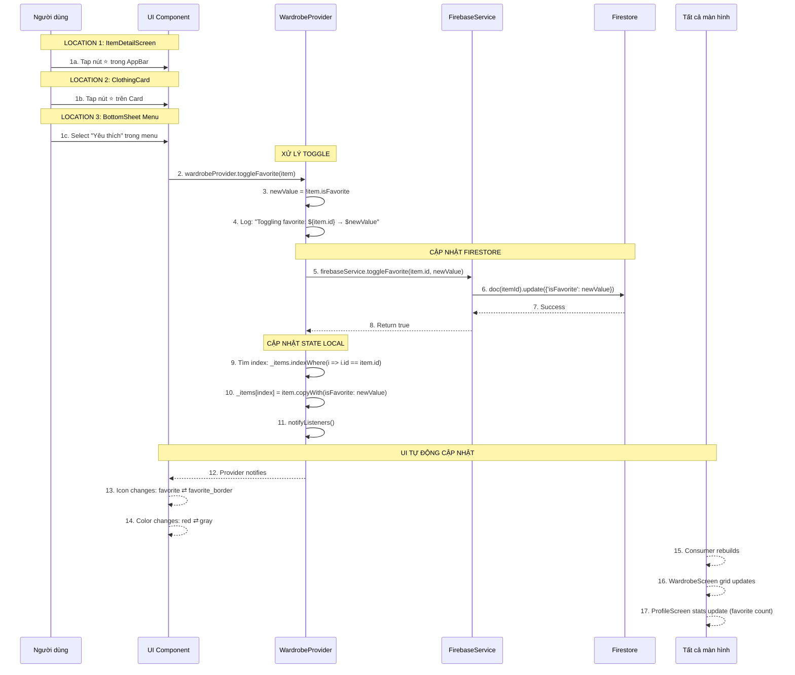

# ⭐ Luồng Toggle Favorite (Đánh dấu Yêu thích) - Chi tiết

> **Dựa trên tài liệu**: [ALL_Flow.md](file:///d:/FlutterProjects/ai_personal_stylist/ALL_Flow.md#11-toggle-favorite)

---

## 📊 Sơ đồ Tổng quan



**Sơ đồ Sequence của luồng Toggle Favorite**

---

## 🔍 Chi Tiết Từng Bước

### **VỊ TRÍ 1: ItemDetailScreen - Nút trong AppBar**

#### File: [item_detail_screen.dart](file:///d:/FlutterProjects/ai_personal_stylist/lib/screens/item_detail_screen.dart#L40-L60)

```dart
// Trong AppBar actions
Consumer<WardrobeProvider>(
  builder: (context, wardrobe, _) {
    // Lấy phiên bản mới nhất của item
    final currentItem = wardrobe.allItems.firstWhere(
      (i) => i.id == item.id,
      orElse: () => item,
    );
    
    return IconButton(
      onPressed: () => wardrobe.toggleFavorite(currentItem),
      icon: Container(
        padding: const EdgeInsets.all(8),
        decoration: BoxDecoration(
          color: Colors.white.withValues(alpha: 0.9),
          shape: BoxShape.circle,
        ),
        child: Icon(
          currentItem.isFavorite 
              ? Icons.favorite 
              : Icons.favorite_border,
          color: currentItem.isFavorite 
              ? AppTheme.secondaryColor  // Màu đỏ khi yêu thích
              : AppTheme.textPrimary,    // Màu xám khi chưa
        ),
      ),
    );
  },
)
```

**Giải thích:**

- **Consumer**: Lắng nghe thay đổi từ WardrobeProvider
- **firstWhere**: Lấy item mới nhất từ provider (không dùng `widget.item` vì có thể cũ)
- **Icon động**: `favorite` (đặc) khi true, `favorite_border` (rỗng) khi false
- **Màu động**: Đỏ khi yêu thích, xám khi chưa
- **Container trắng**: Nền trắng mờ để icon nổi bật trên ảnh

---

### **VỊ TRÍ 2: ClothingCard - Nút trên Card**

#### File: [clothing_card.dart](file:///d:/FlutterProjects/ai_personal_stylist/lib/widgets/clothing_card.dart#L150-L190)

```dart
// Trong Stack của ClothingCard
Stack(
  children: [
    // Image full card
    Positioned.fill(
      child: ClothingImage(item: item),
    ),
    
    // Gradient overlay (để icon nổi bật)
    Positioned.fill(
      child: Container(
        decoration: BoxDecoration(
          gradient: LinearGradient(
            begin: Alignment.topRight,
            end: Alignment.bottomLeft,
            colors: [
              Colors.black.withValues(alpha: 0.3),
              Colors.transparent,
            ],
          ),
        ),
      ),
    ),
    
    // Favorite button (góc trên phải)
    if (showFavorite)
      Positioned(
        top: 8,
        right: 8,
        child: GestureDetector(
          onTap: onFavorite,
          child: Container(
            padding: const EdgeInsets.all(6),
            decoration: BoxDecoration(
              color: Colors.white.withValues(alpha: 0.9),
              shape: BoxShape.circle,
              boxShadow: [
                BoxShadow(
                  color: Colors.black.withValues(alpha: 0.1),
                  blurRadius: 4,
                ),
              ],
            ),
            child: Icon(
              item.isFavorite ? Icons.favorite : Icons.favorite_border,
              size: 20,
              color: item.isFavorite 
                  ? AppTheme.secondaryColor 
                  : Colors.grey.shade600,
            ),
          ),
        ),
      ),
  ],
)
```

**Giải thích:**

- **Positioned**: Đặt nút ở góc trên phải của card
- **GestureDetector**: Bắt sự kiện tap riêng cho nút favorite
- **showFavorite param**: Cho phép ẩn nút khi không cần
- **Gradient overlay**: Làm tối góc trên để icon dễ nhìn
- **BoxShadow**: Đổ bóng nhẹ cho nút

**Cách sử dụng:**

```dart
// In WardrobeScreen
ClothingCard(
  item: item,
  onTap: () => Navigator.push(...),  // Tap vào card → xem chi tiết
  onFavorite: () => wardrobe.toggleFavorite(item),  // Tap vào ⭐ → toggle
)
```

---

### **VỊ TRÍ 3: BottomSheet Menu**

#### File: [wardrobe_screen.dart](file:///d:/FlutterProjects/ai_personal_stylist/lib/screens/wardrobe_screen.dart#L365-L380)

```dart
void _showItemOptions(ClothingItem item) {
  showModalBottomSheet(
    context: context,
    shape: const RoundedRectangleBorder(
      borderRadius: BorderRadius.vertical(top: Radius.circular(20)),
    ),
    builder: (context) => Container(
      padding: const EdgeInsets.all(20),
      child: Column(
        mainAxisSize: MainAxisSize.min,
        children: [
          // Xem chi tiết
          ListTile(
            leading: const Icon(Icons.visibility),
            title: const Text('Xem chi tiết'),
            onTap: () {
              Navigator.pop(context);
              _navigateToDetail(item);
            },
          ),
          
          // Toggle Favorite (icon và text động)
          ListTile(
            leading: Icon(
              item.isFavorite ? Icons.favorite : Icons.favorite_border,
            ),
            title: Text(
              item.isFavorite ? 'Bỏ yêu thích' : 'Yêu thích',
            ),
            onTap: () {
              context.read<WardrobeProvider>().toggleFavorite(item);
              Navigator.pop(context);
            },
          ),
          
          // Đánh dấu đã mặc
          ListTile(
            leading: const Icon(Icons.checkroom),
            title: const Text('Đánh dấu đã mặc'),
            onTap: () {
              context.read<WardrobeProvider>().markAsWorn(item);
              Navigator.pop(context);
              ScaffoldMessenger.of(context).showSnackBar(
                const SnackBar(content: Text('Đã cập nhật!')),
              );
            },
          ),
          
          // Xóa
          ListTile(
            leading: const Icon(Icons.delete, color: Colors.red),
            title: const Text('Xóa', style: TextStyle(color: Colors.red)),
            onTap: () {
              Navigator.pop(context);
              _confirmDelete(item);
            },
          ),
        ],
      ),
    ),
  );
}
```

**Giải thích:**

- **Icon động**: Hiển thị `favorite` nếu đã thích, `favorite_border` nếu chưa
- **Text động**: "Bỏ yêu thích" vs "Yêu thích"
- **Navigator.pop()**: Đóng BottomSheet sau khi toggle
- **Không có SnackBar**: Vì thay đổi đã thấy rõ qua icon (không cần thông báo)

---

### **BƯỚC 2-4: Xử lý Toggle trong Provider**

#### File: [wardrobe_provider.dart](file:///d:/FlutterProjects/ai_personal_stylist/lib/providers/wardrobe_provider.dart#L230-L243)

```dart
/// Toggle favorite status
Future<void> toggleFavorite(ClothingItem item) async {
  // Đảo ngược giá trị hiện tại
  final newValue = !item.isFavorite;
  
  print('🔄 Toggling favorite: ${item.id}');
  print('   Current: ${item.isFavorite} → New: $newValue');
  
  // Gọi Firebase service để update Firestore
  final success = await _firebaseService.toggleFavorite(item.id, newValue);
  
  if (success) {
    // Tìm item trong list local
    final index = _items.indexWhere((i) => i.id == item.id);
    
    if (index != -1) {
      // Cập nhật item với giá trị mới (sử dụng copyWith)
      _items[index] = item.copyWith(isFavorite: newValue);
      
      print('✅ Local state updated');
      
      // Notify để UI rebuild
      notifyListeners();
    }
  } else {
    print('❌ Failed to toggle favorite');
  }
}
```

**Giải thích từng bước:**

1. **`newValue = !item.isFavorite`**: Đảo ngược boolean
   - `true` → `false` (Bỏ yêu thích)
   - `false` → `true` (Thêm yêu thích)

2. **`await _firebaseService.toggleFavorite()`**: Gọi service (async)

3. **`if (success)`**: Chỉ update local state nếu Firestore thành công

4. **`indexWhere`**: Tìm vị trí item trong `_items` list

5. **`copyWith(isFavorite: newValue)`**: Tạo item mới với favorite đã thay đổi
   - Immutable pattern: Không modify trực tiếp object

6. **`notifyListeners()`**: Báo cho tất cả Consumer rebuild

---

### **BƯỚC 5-8: Cập nhật Firestore**

#### File: [firebase_service.dart](file:///d:/FlutterProjects/ai_personal_stylist/lib/services/firebase_service.dart#L224-L233)

```dart
/// Toggle favorite status
Future<bool> toggleFavorite(String itemId, bool isFavorite) async {
  try {
    // Update chỉ 1 field trong document
    await _itemsRef.doc(itemId).update({'isFavorite': isFavorite});
    
    print('✅ Firestore updated: $itemId → isFavorite: $isFavorite');
    return true;
  } catch (e) {
    print('❌ Toggle Favorite Error: $e');
    return false;
  }
}
```

**Firestore Operation:**

```
Before:
{
  "id": "abc123",
  "userId": "user456",
  "imageBase64": "...",
  "type": "top",
  "color": "blue",
  "isFavorite": false,  ← CŨ
  "wearCount": 5,
  ...
}

After update({'isFavorite': true}):
{
  "id": "abc123",
  "userId": "user456",
  "imageBase64": "...",
  "type": "top",
  "color": "blue",
  "isFavorite": true,   ← MỚI (chỉ field này thay đổi)
  "wearCount": 5,
  ...
}
```

**Lợi ích của `update()` thay vì `set()`:**

- ✅ **Chỉ ghi 1 field**: Nhanh hơn, rẻ hơn
- ✅ **Không làm mất dữ liệu khác**: Các field khác giữ nguyên
- ✅ **Atomic operation**: Thành công hoặc thất bại hoàn toàn

---

### **BƯỚC 9-11: Cập nhật State Local**

```dart
// Trước khi toggle
_items = [
  ClothingItem(id: 'abc123', color: 'blue', isFavorite: false),  ← Item này
  ClothingItem(id: 'def456', color: 'red', isFavorite: true),
  ClothingItem(id: 'ghi789', color: 'green', isFavorite: false),
]

// Tìm index
final index = _items.indexWhere((i) => i.id == 'abc123');  // → index = 0

// Cập nhật với copyWith
_items[0] = _items[0].copyWith(isFavorite: true);

// Sau khi toggle
_items = [
  ClothingItem(id: 'abc123', color: 'blue', isFavorite: true),   ← ĐÃ THAY ĐỔI
  ClothingItem(id: 'def456', color: 'red', isFavorite: true),
  ClothingItem(id: 'ghi789', color: 'green', isFavorite: false),
]

// notifyListeners() → Tất cả Consumer rebuild
```

**Tại sao dùng `copyWith`?**

```dart
// ❌ SAI: Modify trực tiếp (mutable)
_items[index].isFavorite = newValue;  // Không trigger rebuild đúng

// ✅ ĐÚNG: Tạo object mới (immutable)
_items[index] = item.copyWith(isFavorite: newValue);  // Provider phát hiện thay đổi
```

---

### **BƯỚC 12-17: UI Tự động Cập nhật**

#### 1. ItemDetailScreen Icon Update

```dart
Consumer<WardrobeProvider>(
  builder: (context, wardrobe, _) {
    final currentItem = wardrobe.allItems.firstWhere(...);
    
    // Provider gọi notifyListeners()
    //   ↓
    // Consumer rebuild
    //   ↓
    // Icon thay đổi tự động
    return Icon(
      currentItem.isFavorite ? Icons.favorite : Icons.favorite_border,
      color: currentItem.isFavorite ? Colors.red : Colors.grey,
    );
  },
)
```

**Kết quả:**
- `isFavorite = false` → `favorite_border` (⭐ rỗng, xám)
- `isFavorite = true` → `favorite` (⭐ đặc, đỏ)

---

#### 2. ClothingCard Icon Update

```dart
// WardrobeScreen grid
GridView.builder(
  itemBuilder: (context, index) {
    final item = items[index];  // items từ Consumer<WardrobeProvider>
    
    return ClothingCard(
      item: item,  // item.isFavorite đã thay đổi
      onFavorite: () => wardrobe.toggleFavorite(item),
    );
  },
)

// Trong ClothingCard widget
Icon(
  item.isFavorite ? Icons.favorite : Icons.favorite_border,
  color: item.isFavorite ? AppTheme.secondaryColor : Colors.grey.shade600,
)
```

**Flow:**
```
notifyListeners()
    ↓
Consumer rebuilds
    ↓
GridView.builder rebuilds
    ↓
ClothingCard nhận item mới
    ↓
Icon tự động thay đổi
```

---

#### 3. ProfileScreen Stats Update

#### File: [profile_screen.dart](file:///d:/FlutterProjects/ai_personal_stylist/lib/screens/profile_screen.dart#L490-L555)

```dart
Consumer<WardrobeProvider>(
  builder: (context, wardrobe, _) {
    final items = wardrobe.items;
    
    // Đếm số items yêu thích
    final favoriteCount = items.where((i) => i.isFavorite).length;
    
    return Row(
      children: [
        // Stat card
        Expanded(
          child: Container(
            padding: const EdgeInsets.all(16),
            decoration: BoxDecoration(
              color: Colors.white,
              borderRadius: BorderRadius.circular(12),
              boxShadow: [
                BoxShadow(
                  color: Colors.black.withValues(alpha: 0.05),
                  blurRadius: 8,
                ),
              ],
            ),
            child: Column(
              children: [
                Icon(
                  Icons.favorite,
                  color: AppTheme.secondaryColor,
                  size: 32,
                ),
                const SizedBox(height: 8),
                Text(
                  favoriteCount.toString(),
                  style: const TextStyle(
                    fontSize: 24,
                    fontWeight: FontWeight.bold,
                  ),
                ),
                const SizedBox(height: 4),
                Text(
                  'Yêu thích',
                  style: TextStyle(
                    fontSize: 14,
                    color: Colors.grey.shade600,
                  ),
                ),
              ],
            ),
          ),
        ),
        // Other stats...
      ],
    );
  },
)
```

**Cập nhật tự động:**

```
Toggle favorite trên WardrobeScreen
    ↓
notifyListeners()
    ↓
ProfileScreen.Consumer rebuilds
    ↓
favoriteCount = items.where((i) => i.isFavorite).length
    ↓
Số đếm thay đổi: 5 → 6 (hoặc ngược lại)
```

---

## ⚡ Performance Analysis

### **Thời gian thực thi:**

1. **User tap icon**: ~0ms
2. **toggleFavorite() called**: ~1ms
3. **Firestore update**: ~200-500ms (network)
4. **Local state update**: ~1ms
5. **notifyListeners()**: ~10ms
6. **UI rebuild**: ~50-100ms

**Tổng: ~300-600ms** (chủ yếu Firestore)

---

### **Số lượng rebuilds:**

```
Một lần toggle favorite → Bao nhiêu widget rebuild?

1. ItemDetailScreen favorite icon (nếu đang mở)
2. ClothingCard trong WardrobeScreen grid (card đó)
3. ProfileScreen favorite count stat
4. (Các Consumer khác nếu có)

Tối ưu: Chỉ Consumer ĐÚNG widget rebuild, không phải toàn bộ app
```

---

### **Firestore Cost:**

- **1 Toggle**: 1 write operation
- **Giá**: ~$0.18 / 100,000 writes
- **100 toggles/ngày**: Gần như miễn phí
- **Free tier**: 20,000 writes/ngày → Đủ cho 20,000 toggles

---

## 🐛 Error Handling

### **1. Item Not Found (Race Condition)**

```dart
Future<void> toggleFavorite(ClothingItem item) async {
  final newValue = !item.isFavorite;
  final success = await _firebaseService.toggleFavorite(item.id, newValue);
  
  if (success) {
    final index = _items.indexWhere((i) => i.id == item.id);
    
    // Kiểm tra nếu item bị xóa trong lúc chờ Firestore
    if (index == -1) {
      print('⚠️ Item not found in local state (possibly deleted)');
      return;
    }
    
    _items[index] = item.copyWith(isFavorite: newValue);
    notifyListeners();
  }
}
```

**Tình huống:**
1. User tap favorite
2. Đang chờ Firestore update (500ms)
3. User xóa item (hoặc màn hình khác xóa)
4. Firestore update thành công
5. Cố update local state → item không còn

**Giải pháp:** Kiểm tra `index != -1` trước khi update

---

### **2. Firestore Update Failed**

```dart
Future<bool> toggleFavorite(String itemId, bool isFavorite) async {
  try {
    await _itemsRef.doc(itemId).update({'isFavorite': isFavorite});
    return true;
  } on FirebaseException catch (e) {
    if (e.code == 'not-found') {
      print('❌ Document not found: Item đã bị xóa');
    } else if (e.code == 'permission-denied') {
      print('❌ Permission denied: User không có quyền');
    } else if (e.code == 'unavailable') {
      print('❌ Firestore unavailable: Mất kết nối');
    } else {
      print('❌ Unknown error: ${e.code} - ${e.message}');
    }
    return false;
  } catch (e) {
    print('❌ Toggle Favorite Error: $e');
    return false;
  }
}
```

**Xử lý khi thất bại:**

```dart
Future<void> toggleFavorite(ClothingItem item) async {
  final newValue = !item.isFavorite;
  final success = await _firebaseService.toggleFavorite(item.id, newValue);
  
  if (!success) {
    // Hiển thị lỗi cho user
    _errorMessage = 'Không thể cập nhật. Vui lòng thử lại.';
    notifyListeners();  // Để UI hiển thị error
  }
}
```

---

### **3. Optimistic Update (Cập nhật lạc quan)**

**Ý tưởng:** Update UI ngay, chờ Firestore sau

```dart
Future<void> toggleFavorite(ClothingItem item) async {
  final newValue = !item.isFavorite;
  
  // [1] Update UI NGAY (optimistic)
  final index = _items.indexWhere((i) => i.id == item.id);
  if (index != -1) {
    _items[index] = item.copyWith(isFavorite: newValue);
    notifyListeners();  // Icon đổi ngay lập tức
  }
  
  // [2] Update Firestore (background)
  final success = await _firebaseService.toggleFavorite(item.id, newValue);
  
  if (!success) {
    // [3] Nếu thất bại → rollback
    if (index != -1) {
      _items[index] = item.copyWith(isFavorite: !newValue);  // Đảo lại
      notifyListeners();
      
      _errorMessage = 'Không thể cập nhật';
      notifyListeners();
    }
  }
}
```

**Ưu điểm:**
- ✅ UI phản hồi tức thì (không chờ 500ms)
- ✅ Trải nghiệm mượt mà hơn

**Nhược điểm:**
- ⚠️ Nếu Firestore fail, user thấy icon đổi rồi đổi lại (confusing)
- ⚠️ Phức tạp hơn để xử lý rollback

**Khuyến nghị:** Dùng optimistic update cho toggle favorite (thường thành công cao)

---

### **4. Network Timeout**

```dart
Future<bool> toggleFavorite(String itemId, bool isFavorite) async {
  try {
    await _itemsRef
        .doc(itemId)
        .update({'isFavorite': isFavorite})
        .timeout(const Duration(seconds: 5));
    
    return true;
  } on TimeoutException {
    print('❌ Timeout: Kiểm tra kết nối mạng');
    return false;
  } catch (e) {
    print('❌ Error: $e');
    return false;
  }
}
```

---

## 🎨 UX Enhancements

### **1. Animation Khi Toggle**

```dart
class AnimatedFavoriteIcon extends StatefulWidget {
  final ClothingItem item;
  final VoidCallback onToggle;
  
  const AnimatedFavoriteIcon({
    super.key,
    required this.item,
    required this.onToggle,
  });
  
  @override
  State<AnimatedFavoriteIcon> createState() => _AnimatedFavoriteIconState();
}

class _AnimatedFavoriteIconState extends State<AnimatedFavoriteIcon>
    with SingleTickerProviderStateMixin {
  late AnimationController _controller;
  late Animation<double> _scaleAnimation;
  
  @override
  void initState() {
    super.initState();
    _controller = AnimationController(
      duration: const Duration(milliseconds: 300),
      vsync: this,
    );
    
    _scaleAnimation = TweenSequence<double>([
      TweenSequenceItem(
        tween: Tween(begin: 1.0, end: 1.3),
        weight: 50,
      ),
      TweenSequenceItem(
        tween: Tween(begin: 1.3, end: 1.0),
        weight: 50,
      ),
    ]).animate(CurvedAnimation(
      parent: _controller,
      curve: Curves.easeInOut,
    ));
  }
  
  @override
  void dispose() {
    _controller.dispose();
    super.dispose();
  }
  
  void _handleToggle() {
    // Chạy animation
    _controller.forward(from: 0.0);
    
    // Toggle favorite
    widget.onToggle();
  }
  
  @override
  Widget build(BuildContext context) {
    return GestureDetector(
      onTap: _handleToggle,
      child: ScaleTransition(
        scale: _scaleAnimation,
        child: Icon(
          widget.item.isFavorite ? Icons.favorite : Icons.favorite_border,
          color: widget.item.isFavorite 
              ? AppTheme.secondaryColor 
              : Colors.grey.shade600,
          size: 24,
        ),
      ),
    );
  }
}
```

**Hiệu ứng:**
```
Tap icon
    ↓
Scale 1.0 → 1.3 (phóng to)
    ↓
Scale 1.3 → 1.0 (thu nhỏ)
    ↓
Icon đổi màu/hình dạng
```

---

### **2. Haptic Feedback (Rung nhẹ)**

```dart
import 'package:flutter/services.dart';

void _handleToggle() {
  // Rung nhẹ khi toggle
  HapticFeedback.lightImpact();
  
  wardrobe.toggleFavorite(item);
}
```

---

### **3. Snackbar Notification (Tùy chọn)**

```dart
Future<void> toggleFavorite(ClothingItem item) async {
  final newValue = !item.isFavorite;
  final success = await _firebaseService.toggleFavorite(item.id, newValue);
  
  if (success) {
    final index = _items.indexWhere((i) => i.id == item.id);
    if (index != -1) {
      _items[index] = item.copyWith(isFavorite: newValue);
      notifyListeners();
      
      // Lưu message để UI hiển thị
      _lastActionMessage = newValue 
          ? 'Đã thêm vào yêu thích' 
          : 'Đã bỏ khỏi yêu thích';
    }
  }
}

// Trong UI
if (wardrobe.lastActionMessage != null) {
  WidgetsBinding.instance.addPostFrameCallback((_) {
    ScaffoldMessenger.of(context).showSnackBar(
      SnackBar(
        content: Text(wardrobe.lastActionMessage!),
        duration: const Duration(seconds: 1),
      ),
    );
  });
}
```

**Lưu ý:** Có thể không cần SnackBar vì icon đã thay đổi rõ ràng

---

### **4. Badge Hiển thị Số Lượng Favorite**

```dart
// Trong ProfileScreen hoặc AppBar
Consumer<WardrobeProvider>(
  builder: (context, wardrobe, _) {
    final favoriteCount = wardrobe.items
        .where((i) => i.isFavorite)
        .length;
    
    return Badge(
      label: Text(favoriteCount.toString()),
      isLabelVisible: favoriteCount > 0,
      child: IconButton(
        icon: const Icon(Icons.favorite),
        onPressed: () {
          // Navigate to favorites screen
        },
      ),
    );
  },
)
```

---

## 📊 So sánh Toggle vs Update

| Tính năng | Toggle Favorite | Update Item |
|-----------|-----------------|-------------|
| **Số fields thay đổi** | 1 (isFavorite) | Nhiều (type, color, etc.) |
| **Firestore operation** | `update()` 1 field | `update()` nhiều fields |
| **UI feedback** | Icon đổi ngay | Navigate to edit screen |
| **Tần suất sử dụng** | Cao | Thấp |
| **Thời gian xử lý** | ~300ms | ~500-1000ms |
| **Rollback** | Dễ (chỉ 1 boolean) | Khó (nhiều fields) |
| **Optimistic update** | Phù hợp | Không nên |

---

## 🔄 Các Use Cases Liên quan

### **1. Filter Chỉ Items Yêu thích**

```dart
// Trong WardrobeProvider
List<ClothingItem> get favoriteItems {
  return _items.where((item) => item.isFavorite).toList();
}

// Trong UI
Consumer<WardrobeProvider>(
  builder: (context, wardrobe, _) {
    final favorites = wardrobe.favoriteItems;
    
    if (favorites.isEmpty) {
      return Center(
        child: Text('Chưa có món đồ yêu thích'),
      );
    }
    
    return GridView.builder(
      itemCount: favorites.length,
      itemBuilder: (context, index) {
        return ClothingCard(item: favorites[index]);
      },
    );
  },
)
```

---

### **2. Sort Theo Favorite (Favorite lên đầu)**

```dart
List<ClothingItem> get sortedItems {
  final sorted = List<ClothingItem>.from(_items);
  
  // Sort: Favorite trước, non-favorite sau
  sorted.sort((a, b) {
    if (a.isFavorite && !b.isFavorite) return -1;  // a lên trước
    if (!a.isFavorite && b.isFavorite) return 1;   // b lên trước
    return 0;  // Giữ nguyên thứ tự
  });
  
  return sorted;
}
```

---

### **3. AI Gợi ý Ưu tiên Items Favorite**

```dart
Future<Outfit?> suggestOutfit(String occasion) async {
  // Ưu tiên items yêu thích trong outfit suggestions
  final favoriteItems = _items.where((i) => i.isFavorite).toList();
  final otherItems = _items.where((i) => !i.isFavorite).toList();
  
  // Truyền cho AI với priority
  final prompt = '''
Gợi ý outfit cho dịp: $occasion

Items ưu tiên (yêu thích):
${favoriteItems.map((i) => i.toAIDescription()).join('\n')}

Items khác:
${otherItems.map((i) => i.toAIDescription()).join('\n')}

Hãy ưu tiên sử dụng items yêu thích nếu phù hợp.
''';
  
  // Call Gemini AI...
}
```

---

### **4. Analytics Favorite Behavior**

```dart
class FavoriteAnalytics {
  static void trackToggleFavorite(ClothingItem item, bool newValue) {
    // Log to Firebase Analytics
    FirebaseAnalytics.instance.logEvent(
      name: 'toggle_favorite',
      parameters: {
        'item_id': item.id,
        'item_type': item.type.name,
        'item_color': item.color,
        'new_value': newValue,
        'timestamp': DateTime.now().toIso8601String(),
      },
    );
  }
  
  static Future<Map<String, int>> getFavoriteStats() async {
    // Query Firestore để phân tích
    final snapshot = await FirebaseFirestore.instance
        .collection('items')
        .where('isFavorite', isEqualTo: true)
        .get();
    
    final stats = <String, int>{};
    
    for (final doc in snapshot.docs) {
      final type = doc.data()['type'] as String;
      stats[type] = (stats[type] ?? 0) + 1;
    }
    
    return stats;
    // Kết quả: {'top': 5, 'bottom': 3, 'outerwear': 2}
  }
}
```

---

## 🔗 Files Liên quan

### **Core Files:**

1. [lib/providers/wardrobe_provider.dart](file:///d:/FlutterProjects/ai_personal_stylist/lib/providers/wardrobe_provider.dart#L230-L243) - `toggleFavorite()` method (399 dòng)
2. [lib/services/firebase_service.dart](file:///d:/FlutterProjects/ai_personal_stylist/lib/services/firebase_service.dart#L224-L233) - `toggleFavorite()` Firestore update (235 dòng)
3. [lib/models/clothing_item.dart](file:///d:/FlutterProjects/ai_personal_stylist/lib/models/clothing_item.dart) - `isFavorite` field và `copyWith()` (283 dòng)

### **UI Components:**

4. [lib/screens/item_detail_screen.dart](file:///d:/FlutterProjects/ai_personal_stylist/lib/screens/item_detail_screen.dart#L40-L60) - AppBar favorite button (414 dòng)
5. [lib/widgets/clothing_card.dart](file:///d:/FlutterProjects/ai_personal_stylist/lib/widgets/clothing_card.dart#L150-L190) - Card favorite button (268 dòng)
6. [lib/screens/wardrobe_screen.dart](file:///d:/FlutterProjects/ai_personal_stylist/lib/screens/wardrobe_screen.dart#L365-L380) - BottomSheet menu (462 dòng)
7. [lib/screens/profile_screen.dart](file:///d:/FlutterProjects/ai_personal_stylist/lib/screens/profile_screen.dart#L490-L555) - Favorite count stats

### **Theme:**

8. [lib/utils/theme.dart](file:///d:/FlutterProjects/ai_personal_stylist/lib/utils/theme.dart) - `AppTheme.secondaryColor` (màu đỏ cho favorite)

---

## 🔄 Luồng Liên quan

### **Trước khi toggle:**

- [Flow 8: Xem Chi Tiết Item](file:///d:/FlutterProjects/ai_personal_stylist/flow_view_item_detail.md) - View item để quyết định yêu thích
- [Flow 5: Load Tủ Đồ](file:///d:/FlutterProjects/ai_personal_stylist/ALL_Flow.md#5-load-tủ-đồ-ban-đầu) - Load items với isFavorite status

### **Sau khi toggle:**

- [Flow 14: Gợi Ý Outfit](file:///d:/FlutterProjects/ai_personal_stylist/ALL_Flow.md#14-gợi-ý-outfit) - AI ưu tiên items yêu thích
- [Flow 21: Load Profile Info](file:///d:/FlutterProjects/ai_personal_stylist/ALL_Flow.md#21-load-profile-info) - Stats cập nhật số lượng favorite

### **Flows tương tự:**

- [Flow 12: Mark as Worn](file:///d:/FlutterProjects/ai_personal_stylist/ALL_Flow.md) - Cũng update 1 field đơn giản
- [Flow 9: Cập Nhật Item](file:///d:/FlutterProjects/ai_personal_stylist/flow_update_item.md) - Update nhiều fields phức tạp hơn

---

## ✅ Tóm Tắt

### **Điểm chính của Toggle Favorite flow:**

1. ✅ **3 Vị trí toggle**: ItemDetailScreen, ClothingCard, BottomSheet menu
2. ✅ **Update đơn giản**: Chỉ 1 boolean field (`isFavorite`)
3. ✅ **UI phản hồi tức thì**: Icon đổi ngay sau notifyListeners()
4. ✅ **Cascade updates**: Tất cả màn hình tự động sync
5. ✅ **Firestore hiệu quả**: Chỉ update 1 field với `update()`
6. ✅ **Immutable pattern**: Dùng `copyWith()` để tạo item mới
7. ✅ **Optimistic update**: Có thể update UI trước, Firestore sau

### **Các lựa chọn triển khai chính:**

| Lựa chọn | Lý do |
|--------|-----------|
| **Boolean toggle** | Đơn giản, rõ ràng |
| **copyWith pattern** | Immutable, type-safe |
| **update() 1 field** | Nhanh, rẻ |
| **Consumer pattern** | Auto UI sync |
| **3 toggle locations** | Tiện lợi, linh hoạt |

### **Hiệu suất:**
- **Thời gian toggle**: ~300-600ms (Firestore latency)
- **Số rebuilds**: Chỉ Consumer widgets cần thiết
- **Chi phí**: 1 write unit/toggle (tối thiểu)

### **Bảo mật:**
- ✅ Firestore rules kiểm tra userId
- ✅ Chỉ user sở hữu item mới toggle được
- ✅ Không thể toggle item của người khác

---

**📌 Các bước tiếp theo:**
- [Flow 12: Filter Items](file:///d:/FlutterProjects/ai_personal_stylist/ALL_Flow.md#12-filter-items-theo-typecategory)
- [Flow 14: Gợi Ý Outfit](file:///d:/FlutterProjects/ai_personal_stylist/ALL_Flow.md#14-gợi-ý-outfit)
- [Flow 21: Load Profile Info](file:///d:/FlutterProjects/ai_personal_stylist/ALL_Flow.md#21-load-profile-info)
