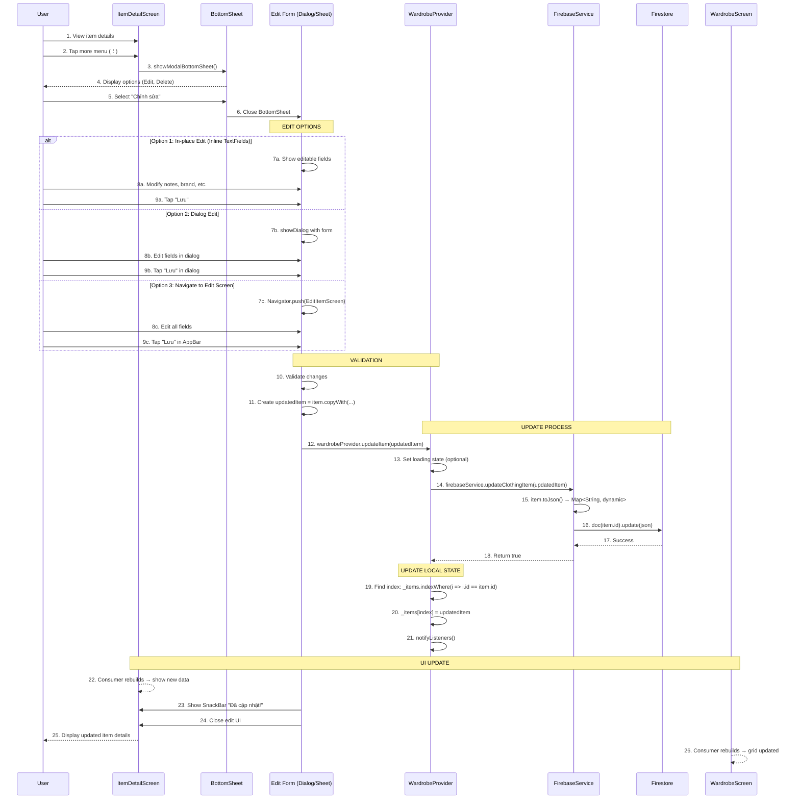

# ✏️ Luồng Cập Nhật Item - Chi tiết

> **Dựa trên tài liệu**: [ALL_Flow.md](file:///d:/FlutterProjects/ai_personal_stylist/ALL_Flow.md#9-cập-nhật-item)

---

## 📊 Sơ đồ Tổng quan



**Sơ đồ Sequence của luồng Cập Nhật Item**

---

## 🔍 Chi Tiết Từng Bước

### **BƯỚC 1-4: Show Options Menu**

#### File: [item_detail_screen.dart](file:///d:/FlutterProjects/ai_personal_stylist/lib/screens/item_detail_screen.dart#L340-L380)

```dart
// In AppBar actions
IconButton(
  onPressed: () => _showOptions(context),
  icon: Container(
    padding: const EdgeInsets.all(8),
    decoration: BoxDecoration(
      color: Colors.white.withValues(alpha: 0.9),
      shape: BoxShape.circle,
    ),
    child: const Icon(Icons.more_vert, color: AppTheme.textPrimary),
  ),
),
```

**Method hiển thị BottomSheet:**

```dart
void _showOptions(BuildContext context) {
  showModalBottomSheet(
    context: context,
    shape: const RoundedRectangleBorder(
      borderRadius: BorderRadius.vertical(top: Radius.circular(20)),
    ),
    builder: (context) => Container(
      padding: const EdgeInsets.all(20),
      child: Column(
        mainAxisSize: MainAxisSize.min,
        children: [
          ListTile(
            leading: const Icon(Icons.edit),
            title: const Text('Chỉnh sửa'),
            onTap: () {
              Navigator.pop(context);  // Close bottom sheet
              _showEditDialog(context);  // Show edit interface
            },
          ),
          ListTile(
            leading: const Icon(Icons.delete_outline, color: AppTheme.errorColor),
            title: const Text('Xóa', style: TextStyle(color: AppTheme.errorColor)),
            onTap: () {
              Navigator.pop(context);
              _confirmDelete(context);
            },
          ),
        ],
      ),
    ),
  );
}
```

**Giải thích:**
- **ModalBottomSheet**: Slide up từ dưới lên với rounded corners
- **2 Options**: "Chỉnh sửa" và "Xóa"
- **Navigator.pop()**: Close BottomSheet trước khi mở edit UI

---

### **OPTION 1: In-place Edit (Inline TextFields)**

#### Implementation Example:

```dart
class _ItemDetailScreenState extends State<ItemDetailScreen> {
  bool _isEditing = false;
  late TextEditingController _notesController;
  late TextEditingController _brandController;
  
  @override
  void initState() {
    super.initState();
    _notesController = TextEditingController(text: widget.item.notes);
    _brandController = TextEditingController(text: widget.item.brand);
  }
  
  @override
  void dispose() {
    _notesController.dispose();
    _brandController.dispose();
    super.dispose();
  }
  
  void _showEditDialog(BuildContext context) {
    setState(() => _isEditing = true);
  }
  
  Widget _buildNotesSection() {
    if (_isEditing) {
      return TextField(
        controller: _notesController,
        decoration: const InputDecoration(
          labelText: 'Ghi chú',
          border: OutlineInputBorder(),
        ),
        maxLines: 3,
      );
    } else {
      return Text(widget.item.notes ?? 'Chưa có ghi chú');
    }
  }
  
  Widget _buildEditActions() {
    if (!_isEditing) return SizedBox.shrink();
    
    return Row(
      children: [
        Expanded(
          child: OutlinedButton(
            onPressed: () {
              setState(() {
                _isEditing = false;
                // Reset controllers
                _notesController.text = widget.item.notes ?? '';
                _brandController.text = widget.item.brand ?? '';
              });
            },
            child: const Text('Hủy'),
          ),
        ),
        const SizedBox(width: 12),
        Expanded(
          child: ElevatedButton(
            onPressed: _saveChanges,
            child: const Text('Lưu'),
          ),
        ),
      ],
    );
  }
  
  Future<void> _saveChanges() async {
    final updatedItem = widget.item.copyWith(
      notes: _notesController.text.trim().isEmpty 
          ? null 
          : _notesController.text.trim(),
      brand: _brandController.text.trim().isEmpty 
          ? null 
          : _brandController.text.trim(),
    );
    
    final success = await context
        .read<WardrobeProvider>()
        .updateItem(updatedItem);
    
    if (success && mounted) {
      setState(() => _isEditing = false);
      ScaffoldMessenger.of(context).showSnackBar(
        const SnackBar(content: Text('Đã cập nhật!')),
      );
    }
  }
}
```

**Ưu điểm:**
- ✅ Không cần navigate
- ✅ Quick edit cho simple fields
- ✅ Instant feedback

**Nhược điểm:**
- ⚠️ Không phù hợp cho nhiều fields
- ⚠️ UI có thể cluttered

---

### **OPTION 2: Dialog Edit**

#### Implementation Example:

```dart
void _showEditDialog(BuildContext context) {
  final notesController = TextEditingController(text: item.notes);
  final brandController = TextEditingController(text: item.brand);
  
  showDialog(
    context: context,
    builder: (ctx) => AlertDialog(
      title: const Text('Chỉnh sửa thông tin'),
      content: SingleChildScrollView(
        child: Column(
          mainAxisSize: MainAxisSize.min,
          children: [
            // Brand field
            TextField(
              controller: brandController,
              decoration: const InputDecoration(
                labelText: 'Thương hiệu',
                prefixIcon: Icon(Icons.store),
                border: OutlineInputBorder(),
              ),
            ),
            const SizedBox(height: 16),
            
            // Notes field
            TextField(
              controller: notesController,
              decoration: const InputDecoration(
                labelText: 'Ghi chú',
                prefixIcon: Icon(Icons.note),
                border: OutlineInputBorder(),
              ),
              maxLines: 3,
            ),
          ],
        ),
      ),
      actions: [
        TextButton(
          onPressed: () {
            notesController.dispose();
            brandController.dispose();
            Navigator.pop(ctx);
          },
          child: const Text('Hủy'),
        ),
        ElevatedButton(
          onPressed: () async {
            final updatedItem = item.copyWith(
              notes: notesController.text.trim().isEmpty 
                  ? null 
                  : notesController.text.trim(),
              brand: brandController.text.trim().isEmpty 
                  ? null 
                  : brandController.text.trim(),
            );
            
            // Close dialog first
            Navigator.pop(ctx);
            
            // Update item
            final success = await context
                .read<WardrobeProvider>()
                .updateItem(updatedItem);
            
            if (success && context.mounted) {
              ScaffoldMessenger.of(context).showSnackBar(
                const SnackBar(
                  content: Text('Đã cập nhật!'),
                  backgroundColor: AppTheme.successColor,
                ),
              );
            }
            
            // Dispose controllers
            notesController.dispose();
            brandController.dispose();
          },
          child: const Text('Lưu'),
        ),
      ],
    ),
  );
}
```

**Ưu điểm:**
- ✅ Clean separation
- ✅ Focused editing experience
- ✅ Easy to add validation

**Nhược điểm:**
- ⚠️ Limited space cho nhiều fields
- ⚠️ Scrolling trong dialog không tốt

---

### **OPTION 3: Navigate to Full Edit Screen (Recommended)**

#### File: EditItemScreen (Concept - chưa implement)

```dart
class EditItemScreen extends StatefulWidget {
  final ClothingItem item;
  
  const EditItemScreen({super.key, required this.item});
  
  @override
  State<EditItemScreen> createState() => _EditItemScreenState();
}

class _EditItemScreenState extends State<EditItemScreen> {
  final _formKey = GlobalKey<FormState>();
  
  // Controllers
  late TextEditingController _notesController;
  late TextEditingController _brandController;
  late TextEditingController _materialController;
  late TextEditingController _colorController;
  
  // Selected values
  late ClothingType _selectedType;
  late List<ClothingStyle> _selectedStyles;
  late List<Season> _selectedSeasons;
  
  @override
  void initState() {
    super.initState();
    
    // Initialize controllers with current values
    _notesController = TextEditingController(text: widget.item.notes);
    _brandController = TextEditingController(text: widget.item.brand);
    _materialController = TextEditingController(text: widget.item.material);
    _colorController = TextEditingController(text: widget.item.color);
    
    // Initialize selections
    _selectedType = widget.item.type;
    _selectedStyles = List.from(widget.item.styles);
    _selectedSeasons = List.from(widget.item.seasons);
  }
  
  @override
  void dispose() {
    _notesController.dispose();
    _brandController.dispose();
    _materialController.dispose();
    _colorController.dispose();
    super.dispose();
  }
  
  @override
  Widget build(BuildContext context) {
    return Scaffold(
      backgroundColor: AppTheme.backgroundColor,
      appBar: AppBar(
        title: const Text('Chỉnh sửa'),
        actions: [
          TextButton(
            onPressed: _saveChanges,
            child: const Text(
              'Lưu',
              style: TextStyle(
                color: AppTheme.primaryColor,
                fontSize: 16,
                fontWeight: FontWeight.w600,
              ),
            ),
          ),
        ],
      ),
      body: Form(
        key: _formKey,
        child: ListView(
          padding: const EdgeInsets.all(20),
          children: [
            // Image (read-only, show current)
            _buildImageSection(),
            const SizedBox(height: 24),
            
            // Type dropdown
            _buildTypeDropdown(),
            const SizedBox(height: 20),
            
            // Color field
            _buildColorField(),
            const SizedBox(height: 20),
            
            // Material field
            _buildMaterialField(),
            const SizedBox(height: 20),
            
            // Styles multi-select
            _buildStylesSection(),
            const SizedBox(height: 20),
            
            // Seasons multi-select
            _buildSeasonsSection(),
            const SizedBox(height: 20),
            
            // Brand field
            _buildBrandField(),
            const SizedBox(height: 20),
            
            // Notes field
            _buildNotesField(),
          ],
        ),
      ),
    );
  }
  
  Widget _buildImageSection() {
    return Container(
      height: 200,
      decoration: BoxDecoration(
        borderRadius: BorderRadius.circular(16),
        border: Border.all(color: Colors.grey.shade300),
      ),
      child: ClipRRect(
        borderRadius: BorderRadius.circular(16),
        child: ClothingImage(
          item: widget.item,
          fit: BoxFit.cover,
        ),
      ),
    );
  }
  
  Widget _buildTypeDropdown() {
    return DropdownButtonFormField<ClothingType>(
      value: _selectedType,
      decoration: const InputDecoration(
        labelText: 'Loại quần áo',
        prefixIcon: Icon(Icons.category),
        border: OutlineInputBorder(),
      ),
      items: ClothingType.values.map((type) {
        return DropdownMenuItem(
          value: type,
          child: Text(type.displayName),
        );
      }).toList(),
      onChanged: (value) {
        setState(() => _selectedType = value!);
      },
    );
  }
  
  Widget _buildColorField() {
    return TextFormField(
      controller: _colorController,
      decoration: const InputDecoration(
        labelText: 'Màu sắc',
        prefixIcon: Icon(Icons.palette),
        border: OutlineInputBorder(),
        hintText: 'VD: blue, red, black',
      ),
      validator: (value) {
        if (value == null || value.trim().isEmpty) {
          return 'Vui lòng nhập màu';
        }
        return null;
      },
    );
  }
  
  Widget _buildMaterialField() {
    return TextFormField(
      controller: _materialController,
      decoration: const InputDecoration(
        labelText: 'Chất liệu (tùy chọn)',
        prefixIcon: Icon(Icons.texture),
        border: OutlineInputBorder(),
        hintText: 'VD: cotton, jean, silk',
      ),
    );
  }
  
  Widget _buildStylesSection() {
    return Column(
      crossAxisAlignment: CrossAxisAlignment.start,
      children: [
        const Text(
          'Phong cách',
          style: TextStyle(
            fontSize: 16,
            fontWeight: FontWeight.w600,
          ),
        ),
        const SizedBox(height: 12),
        Wrap(
          spacing: 8,
          runSpacing: 8,
          children: ClothingStyle.values.map((style) {
            final isSelected = _selectedStyles.contains(style);
            return FilterChip(
              label: Text(style.displayName),
              selected: isSelected,
              onSelected: (selected) {
                setState(() {
                  if (selected) {
                    _selectedStyles.add(style);
                  } else {
                    _selectedStyles.remove(style);
                  }
                });
              },
              selectedColor: AppTheme.primaryColor.withValues(alpha: 0.2),
              checkmarkColor: AppTheme.primaryColor,
            );
          }).toList(),
        ),
      ],
    );
  }
  
  Widget _buildSeasonsSection() {
    return Column(
      crossAxisAlignment: CrossAxisAlignment.start,
      children: [
        const Text(
          'Mùa phù hợp',
          style: TextStyle(
            fontSize: 16,
            fontWeight: FontWeight.w600,
          ),
        ),
        const SizedBox(height: 12),
        Wrap(
          spacing: 8,
          runSpacing: 8,
          children: Season.values.map((season) {
            final isSelected = _selectedSeasons.contains(season);
            return FilterChip(
              label: Text(season.displayName),
              selected: isSelected,
              onSelected: (selected) {
                setState(() {
                  if (selected) {
                    _selectedSeasons.add(season);
                  } else {
                    _selectedSeasons.remove(season);
                  }
                });
              },
              selectedColor: AppTheme.accentColor.withValues(alpha: 0.2),
              checkmarkColor: AppTheme.accentColor,
            );
          }).toList(),
        ),
      ],
    );
  }
  
  Widget _buildBrandField() {
    return TextFormField(
      controller: _brandController,
      decoration: const InputDecoration(
        labelText: 'Thương hiệu (tùy chọn)',
        prefixIcon: Icon(Icons.store),
        border: OutlineInputBorder(),
        hintText: 'VD: Nike, Zara, Uniqlo',
      ),
    );
  }
  
  Widget _buildNotesField() {
    return TextFormField(
      controller: _notesController,
      decoration: const InputDecoration(
        labelText: 'Ghi chú (tùy chọn)',
        prefixIcon: Icon(Icons.note),
        border: OutlineInputBorder(),
        hintText: 'Thêm ghi chú về món đồ này',
      ),
      maxLines: 3,
    );
  }
  
  Future<void> _saveChanges() async {
    if (!_formKey.currentState!.validate()) return;
    
    // Validate at least 1 style and 1 season
    if (_selectedStyles.isEmpty) {
      ScaffoldMessenger.of(context).showSnackBar(
        const SnackBar(content: Text('Vui lòng chọn ít nhất 1 phong cách')),
      );
      return;
    }
    
    if (_selectedSeasons.isEmpty) {
      ScaffoldMessenger.of(context).showSnackBar(
        const SnackBar(content: Text('Vui lòng chọn ít nhất 1 mùa')),
      );
      return;
    }
    
    // Create updated item
    final updatedItem = widget.item.copyWith(
      type: _selectedType,
      color: _colorController.text.trim(),
      material: _materialController.text.trim().isEmpty 
          ? null 
          : _materialController.text.trim(),
      styles: _selectedStyles,
      seasons: _selectedSeasons,
      brand: _brandController.text.trim().isEmpty 
          ? null 
          : _brandController.text.trim(),
      notes: _notesController.text.trim().isEmpty 
          ? null 
          : _notesController.text.trim(),
    );
    
    // Update via provider
    final success = await context
        .read<WardrobeProvider>()
        .updateItem(updatedItem);
    
    if (success && mounted) {
      Navigator.pop(context);  // Back to ItemDetailScreen
      ScaffoldMessenger.of(context).showSnackBar(
        const SnackBar(
          content: Text('Đã cập nhật!'),
          backgroundColor: AppTheme.successColor,
        ),
      );
    } else if (mounted) {
      ScaffoldMessenger.of(context).showSnackBar(
        const SnackBar(
          content: Text('Lỗi khi cập nhật. Vui lòng thử lại.'),
          backgroundColor: AppTheme.errorColor,
        ),
      );
    }
  }
}
```

**Navigate từ ItemDetailScreen:**

```dart
void _showEditDialog(BuildContext context) {
  Navigator.push(
    context,
    MaterialPageRoute(
      builder: (_) => EditItemScreen(item: item),
    ),
  );
}
```

**Ưu điểm:**
- ✅ Full control over all fields
- ✅ Better UX cho complex edits
- ✅ Clear separation of concerns
- ✅ Easy validation
- ✅ Familiar pattern (giống AddItemScreen)

**Nhược điểm:**
- ⚠️ Thêm 1 screen mới (complexity tăng)
- ⚠️ Navigation stack deeper

---

### **BƯỚC 10-11: Validation và Create Updated Item**

#### File: [clothing_item.dart](file:///d:/FlutterProjects/ai_personal_stylist/lib/models/clothing_item.dart#L215-L250)

```dart
/// CopyWith method cho immutable updates
ClothingItem copyWith({
  String? id,
  String? userId,
  String? imageBase64,
  ClothingType? type,
  String? color,
  String? material,
  List<ClothingStyle>? styles,
  List<Season>? seasons,
  String? brand,
  String? notes,
  DateTime? createdAt,
  DateTime? lastWorn,
  int? wearCount,
  bool? isFavorite,
}) {
  return ClothingItem(
    id: id ?? this.id,
    userId: userId ?? this.userId,
    imageBase64: imageBase64 ?? this.imageBase64,
    type: type ?? this.type,
    color: color ?? this.color,
    material: material ?? this.material,
    styles: styles ?? this.styles,
    seasons: seasons ?? this.seasons,
    brand: brand ?? this.brand,
    notes: notes ?? this.notes,
    createdAt: createdAt ?? this.createdAt,
    lastWorn: lastWorn ?? this.lastWorn,
    wearCount: wearCount ?? this.wearCount,
    isFavorite: isFavorite ?? this.isFavorite,
  );
}
```

**Usage Example:**

```dart
// Chỉ update notes và brand, giữ nguyên các field khác
final updatedItem = originalItem.copyWith(
  notes: 'Mua từ Uniqlo sale 50%',
  brand: 'Uniqlo',
);
```

**Giải thích:**
- **copyWith**: Pattern cho immutable objects
- **Null-aware**: Chỉ update fields được pass, còn lại giữ nguyên
- **Type-safe**: Compile-time check

---

### **BƯỚC 12-18: Update Firestore**

#### File: [wardrobe_provider.dart](file:///d:/FlutterProjects/ai_personal_stylist/lib/providers/wardrobe_provider.dart#L213-L230)

```dart
Future<bool> updateItem(ClothingItem item) async {
  try {
    // Call Firebase service
    final success = await _firebaseService.updateClothingItem(item);
    
    if (success) {
      // Update local state
      final index = _items.indexWhere((i) => i.id == item.id);
      if (index != -1) {
        _items[index] = item;
        notifyListeners();
      }
    }
    
    return success;
  } catch (e) {
    _errorMessage = e.toString();
    notifyListeners();
    return false;
  }
}
```

#### File: [firebase_service.dart](file:///d:/FlutterProjects/ai_personal_stylist/lib/services/firebase_service.dart#L165-L175)

```dart
/// Update clothing item
Future<bool> updateClothingItem(ClothingItem item) async {
  try {
    await _itemsRef.doc(item.id).update(item.toJson());
    
    print('✅ Item updated: ${item.id}');
    return true;
  } catch (e) {
    print('❌ Update Item Error: $e');
    return false;
  }
}
```

#### File: [clothing_item.dart](file:///d:/FlutterProjects/ai_personal_stylist/lib/models/clothing_item.dart#L220-L245)

```dart
/// Convert to JSON for Firestore
Map<String, dynamic> toJson() {
  return {
    'userId': userId,
    'imageBase64': imageBase64,
    'type': type.name,  // Enum → String
    'color': color,
    'material': material,
    'styles': styles.map((s) => s.name).toList(),  // List<Enum> → List<String>
    'seasons': seasons.map((s) => s.name).toList(),
    'brand': brand,
    'notes': notes,
    'createdAt': Timestamp.fromDate(createdAt),
    'lastWorn': lastWorn != null ? Timestamp.fromDate(lastWorn!) : null,
    'wearCount': wearCount,
    'isFavorite': isFavorite,
  };
}
```

**Giải thích:**

**Firestore Update Operation:**
```
doc(item.id).update({
  'userId': 'user123',
  'type': 'top',
  'color': 'blue',
  'material': 'cotton',
  'styles': ['casual', 'sporty'],
  'seasons': ['summer', 'spring'],
  'brand': 'Nike',
  'notes': 'Mua từ sale',
  ...
})
```

**Key Points:**
1. **update() vs set()**: 
   - `update()`: Chỉ update fields được specify, giữ nguyên fields khác
   - `set()`: Replace toàn bộ document
2. **Enum Serialization**: Convert enum → string trước khi save
3. **Timestamp**: Convert DateTime → Firestore Timestamp
4. **Null Safety**: Chỉ include fields non-null

---

### **BƯỚC 19-21: Update Local State**

#### File: [wardrobe_provider.dart](file:///d:/FlutterProjects/ai_personal_stylist/lib/providers/wardrobe_provider.dart#L217-L222)

```dart
if (success) {
  // Find item index in local list
  final index = _items.indexWhere((i) => i.id == item.id);
  
  if (index != -1) {
    // Replace with updated item
    _items[index] = item;
    
    // Trigger UI rebuild
    notifyListeners();
  }
}
```

**Giải thích:**

**State Update Flow:**
```
Before:
_items = [
  ClothingItem(id: '1', notes: 'Old notes'),
  ClothingItem(id: '2', notes: 'Item 2'),
  ClothingItem(id: '3', notes: 'Item 3'),
]

After update item '1':
_items = [
  ClothingItem(id: '1', notes: 'New notes'),  // ← Updated
  ClothingItem(id: '2', notes: 'Item 2'),
  ClothingItem(id: '3', notes: 'Item 3'),
]
```

**Why indexWhere:**
- **Efficient**: O(n) search
- **Safe**: Returns -1 nếu không tìm thấy
- **Immutable pattern**: Replace entire object, không modify in-place

---

### **BƯỚC 22-26: UI Rebuild Cascade**

#### Consumer Pattern trong ItemDetailScreen:

```dart
// In item_detail_screen.dart
Consumer<WardrobeProvider>(
  builder: (context, wardrobe, _) {
    // Get latest version of item from provider
    final currentItem = wardrobe.allItems.firstWhere(
      (i) => i.id == widget.item.id,
      orElse: () => widget.item,  // Fallback to original
    );
    
    return Column(
      children: [
        // Display updated notes
        Text(currentItem.notes ?? 'Chưa có ghi chú'),
        
        // Display updated brand
        Text(currentItem.brand ?? 'Chưa có thương hiệu'),
        
        // ... other fields
      ],
    );
  },
)
```

#### Consumer Pattern trong WardrobeScreen:

```dart
// In wardrobe_screen.dart
Consumer<WardrobeProvider>(
  builder: (context, wardrobe, _) {
    final items = wardrobe.filteredItems;
    
    return GridView.builder(
      itemCount: items.length,
      itemBuilder: (context, index) {
        final item = items[index];
        return ClothingCard(
          item: item,  // Auto shows updated data
          onTap: () => Navigator.push(...),
        );
      },
    );
  },
)
```

**Cascade Effect:**
```
Provider.notifyListeners()
    ↓
ItemDetailScreen.Consumer rebuilds
    → Display new notes/brand
    ↓
WardrobeScreen.Consumer rebuilds
    → Grid shows updated item
    ↓
OutfitSuggestScreen.Consumer rebuilds
    → Outfit suggestions với updated data
```

---

## 📊 So Sánh 3 Edit Options

| Feature | In-place | Dialog | Full Screen |
|---------|----------|--------|-------------|
| **Navigation** | None | None | Push route |
| **Space** | Limited | Medium | Full |
| **Fields editable** | 1-2 | 2-5 | All |
| **Validation** | Basic | Good | Best |
| **UX** | Quick | Focused | Complete |
| **Code complexity** | Low | Medium | High |
| **Recommended for** | Notes only | 2-3 fields | All fields |

---

## ⏱️ Performance Analysis

### **Thời gian thực thi:**

1. **Show BottomSheet**: ~100ms
2. **Show Edit UI**: ~100-300ms (tùy option)
3. **User edit**: Variable (user input)
4. **Validation**: ~10ms
5. **Create copyWith**: ~1ms
6. **Firestore update**: ~500-1000ms
7. **Local state update**: ~10ms
8. **notifyListeners**: ~50ms
9. **UI rebuild**: ~100-200ms

**Total: ~1-2 giây** (chủ yếu Firestore)

### **What gets updated:**

**Firestore:**
```json
{
  "notes": "Old" → "New",
  "brand": null → "Nike",
  "updatedAt": old → new timestamp
}
```

**Only changed fields** (không update toàn bộ document)

---

## 🐛 Error Handling

### **1. Validation Errors**

```dart
if (!_formKey.currentState!.validate()) {
  ScaffoldMessenger.of(context).showSnackBar(
    const SnackBar(content: Text('Vui lòng kiểm tra thông tin')),
  );
  return;
}

if (_selectedStyles.isEmpty) {
  ScaffoldMessenger.of(context).showSnackBar(
    const SnackBar(content: Text('Chọn ít nhất 1 phong cách')),
  );
  return;
}
```

---

### **2. Firestore Update Errors**

```dart
try {
  await _itemsRef.doc(item.id).update(item.toJson());
  return true;
} on FirebaseException catch (e) {
  if (e.code == 'not-found') {
    print('❌ Item not found in Firestore');
  } else if (e.code == 'permission-denied') {
    print('❌ Permission denied');
  } else {
    print('❌ Unknown error: ${e.code}');
  }
  return false;
} catch (e) {
  print('❌ Update failed: $e');
  return false;
}
```

---

### **3. Network Errors**

```dart
Future<bool> updateItem(ClothingItem item) async {
  try {
    final success = await _firebaseService
        .updateClothingItem(item)
        .timeout(const Duration(seconds: 10));
    
    return success;
  } on TimeoutException {
    _errorMessage = 'Timeout: Kiểm tra kết nối mạng';
    notifyListeners();
    return false;
  } catch (e) {
    _errorMessage = 'Lỗi: $e';
    notifyListeners();
    return false;
  }
}
```

---

### **4. Context Mounted Check**

```dart
final success = await context
    .read<WardrobeProvider>()
    .updateItem(updatedItem);

if (success && mounted) {  // Check widget not disposed
  Navigator.pop(context);
  ScaffoldMessenger.of(context).showSnackBar(...);
}
```

---

## 🔄 State Synchronization

### **Problem: Stale Item Reference**

```dart
// ❌ BAD: Using widget.item directly
Text(widget.item.notes ?? 'Chưa có')  // Stale data!

// ✅ GOOD: Get fresh item from provider
Consumer<WardrobeProvider>(
  builder: (context, wardrobe, _) {
    final currentItem = wardrobe.allItems.firstWhere(
      (i) => i.id == widget.item.id,
      orElse: () => widget.item,
    );
    return Text(currentItem.notes ?? 'Chưa có');
  },
)
```

---

### **Race Condition Prevention**

```dart
// ❌ BAD: Multiple concurrent updates
await updateItem(item1);
await updateItem(item2);  // Might conflict

// ✅ GOOD: Sequential updates
await updateItem(item1);
await updateItem(item2);

// OR: Lock mechanism
bool _isUpdating = false;

Future<bool> updateItem(ClothingItem item) async {
  if (_isUpdating) {
    print('⚠️ Update already in progress');
    return false;
  }
  
  _isUpdating = true;
  try {
    final success = await _firebaseService.updateClothingItem(item);
    return success;
  } finally {
    _isUpdating = false;
  }
}
```

---

## 🎨 UX Enhancements

### **1. Loading Indicator**

```dart
bool _isSaving = false;

Future<void> _saveChanges() async {
  setState(() => _isSaving = true);
  
  final success = await updateItem(updatedItem);
  
  setState(() => _isSaving = false);
  
  if (success) {
    // Show success
  }
}

// In UI
ElevatedButton(
  onPressed: _isSaving ? null : _saveChanges,
  child: _isSaving
      ? const SizedBox(
          width: 20,
          height: 20,
          child: CircularProgressIndicator(strokeWidth: 2),
        )
      : const Text('Lưu'),
)
```

---

### **2. Unsaved Changes Warning**

```dart
bool _hasUnsavedChanges = false;

void _onFieldChanged() {
  setState(() => _hasUnsavedChanges = true);
}

Future<bool> _onWillPop() async {
  if (!_hasUnsavedChanges) return true;
  
  final result = await showDialog<bool>(
    context: context,
    builder: (ctx) => AlertDialog(
      title: const Text('Bỏ thay đổi?'),
      content: const Text('Các thay đổi chưa lưu sẽ bị mất.'),
      actions: [
        TextButton(
          onPressed: () => Navigator.pop(ctx, false),
          child: const Text('Hủy'),
        ),
        ElevatedButton(
          onPressed: () => Navigator.pop(ctx, true),
          child: const Text('Bỏ'),
        ),
      ],
    ),
  );
  
  return result ?? false;
}

// In Scaffold
WillPopScope(
  onWillPop: _onWillPop,
  child: Scaffold(...),
)
```

---

### **3. Auto-save Draft**

```dart
Timer? _debounceTimer;

void _onFieldChanged(String value) {
  _debounceTimer?.cancel();
  
  _debounceTimer = Timer(const Duration(seconds: 2), () {
    _saveDraft();
  });
}

Future<void> _saveDraft() async {
  final draft = {
    'notes': _notesController.text,
    'brand': _brandController.text,
    'timestamp': DateTime.now().toIso8601String(),
  };
  
  // Save to SharedPreferences
  final prefs = await SharedPreferences.getInstance();
  await prefs.setString('draft_${widget.item.id}', jsonEncode(draft));
  
  print('💾 Draft saved');
}
```

---

## 📱 Responsive Considerations

### **Tablet/Desktop:**
- Show edit form in sidebar (split view)
- More fields visible at once
- Larger text inputs

### **Mobile:**
- Full screen edit
- Scrollable form
- Compact inputs

```dart
Widget build(BuildContext context) {
  final isTablet = MediaQuery.of(context).size.width > 600;
  
  if (isTablet) {
    return Row(
      children: [
        Expanded(flex: 1, child: _buildImagePreview()),
        Expanded(flex: 2, child: _buildEditForm()),
      ],
    );
  } else {
    return Column(
      children: [
        _buildImagePreview(),
        Expanded(child: _buildEditForm()),
      ],
    );
  }
}
```

---

## 🔗 Files Liên Quan

### **Core Files:**

1. [lib/screens/item_detail_screen.dart](file:///d:/FlutterProjects/ai_personal_stylist/lib/screens/item_detail_screen.dart) - Parent screen (414 lines)
2. [lib/providers/wardrobe_provider.dart](file:///d:/FlutterProjects/ai_personal_stylist/lib/providers/wardrobe_provider.dart) - `updateItem()` method (399 lines)
3. [lib/services/firebase_service.dart](file:///d:/FlutterProjects/ai_personal_stylist/lib/services/firebase_service.dart) - `updateClothingItem()` method (235 lines)

### **Model Files:**

4. [lib/models/clothing_item.dart](file:///d:/FlutterProjects/ai_personal_stylist/lib/models/clothing_item.dart) - `copyWith()` and `toJson()` (283 lines)

### **Related Screens:**

5. **EditItemScreen** - Full edit screen (concept - chưa implement)
6. [lib/screens/add_item_screen.dart](file:///d:/FlutterProjects/ai_personal_stylist/lib/screens/add_item_screen.dart) - Similar form structure (755 lines)

---

## 🔄 Luồng Liên Quan

### **Trước khi update:**

- [Flow 8: Xem Chi Tiết Item](file:///d:/FlutterProjects/ai_personal_stylist/flow_view_item_detail.md) - View current data
- [Flow 5: Load Tủ Đồ](file:///d:/FlutterProjects/ai_personal_stylist/ALL_Flow.md#5-load-tủ-đồ-ban-đầu) - Load items list

### **Sau khi update:**

- [Flow 11: Toggle Favorite](file:///d:/FlutterProjects/ai_personal_stylist/ALL_Flow.md#11-toggle-favorite) - Another update operation
- [Flow 10: Xóa Item](file:///d:/FlutterProjects/ai_personal_stylist/ALL_Flow.md#10-xóa-item) - Delete if needed

### **Related patterns:**

- [Flow 6: Thêm Item - Web](file:///d:/FlutterProjects/ai_personal_stylist/flow_add_item_web.md) - Similar form structure
- [Flow 14: Gợi Ý Outfit](file:///d:/FlutterProjects/ai_personal_stylist/ALL_Flow.md#14-gợi-ý-outfit) - Uses updated data

---

## ✅ Tóm Tắt

### **Điểm chính của Update Item flow:**

1. ✅ **3 Edit Options**: In-place, Dialog, Full Screen (recommend Full Screen)
2. ✅ **copyWith Pattern**: Immutable updates
3. ✅ **Firestore update()**: Chỉ update changed fields
4. ✅ **State Sync**: Provider pattern → all screens auto update
5. ✅ **Validation**: Form validation + business rules
6. ✅ **Error Handling**: Network, Firestore, validation errors
7. ✅ **UX Features**: Loading, unsaved changes warning, auto-save

### **Key Implementation Choices:**

| Choice | Rationale |
|--------|-----------|
| **copyWith** | Immutable pattern, type-safe |
| **update() not set()** | Preserve unchanged fields |
| **Consumer pattern** | Auto UI sync across screens |
| **Full Screen Edit** | Best UX for all fields |
| **Form validation** | Prevent invalid data |

### **Performance:**
- **Update Time**: ~1-2 giây (Firestore latency)
- **Fields Updated**: Chỉ changed fields
- **UI Rebuild**: Chỉ Consumer widgets

---

**📌 Next Steps:**
- [Flow 10: Xóa Item](file:///d:/FlutterProjects/ai_personal_stylist/ALL_Flow.md#10-xóa-item)
- [Flow 11: Toggle Favorite](file:///d:/FlutterProjects/ai_personal_stylist/ALL_Flow.md#11-toggle-favorite)
- [Flow 12: Filter Items](file:///d:/FlutterProjects/ai_personal_stylist/ALL_Flow.md#12-filter-items-theo-typecategory)
