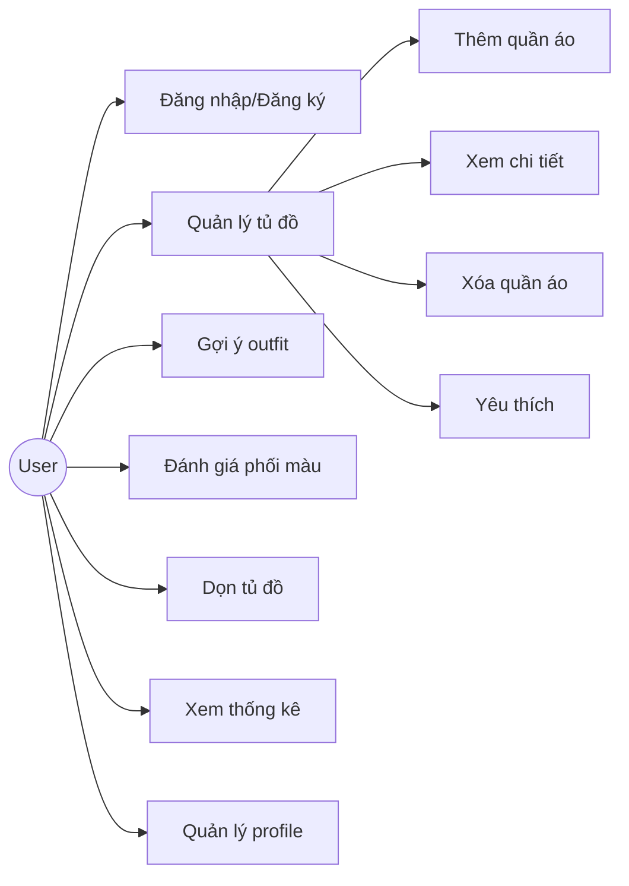
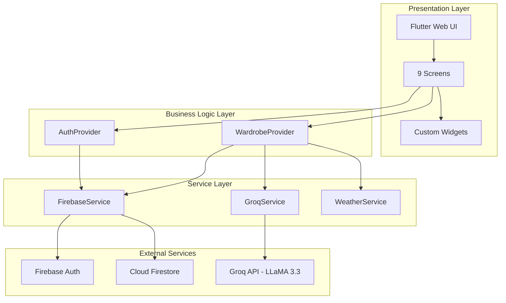
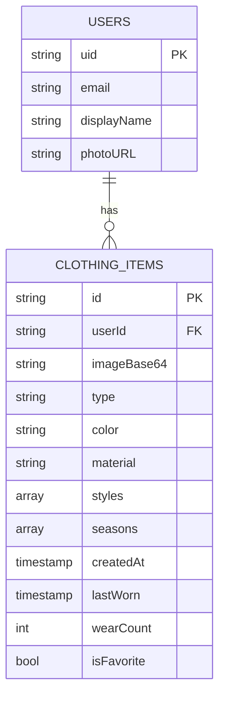
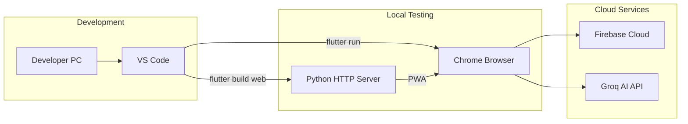

# SLIDE BÁO CÁO ĐỒ ÁN
## AI Personal Stylist - Ứng dụng quản lý tủ đồ thông minh

---

# SLIDE 1: TIÊU ĐỀ

**TRƯỜNG ĐẠI HỌC [TÊN TRƯỜNG]**  
**KHOA CÔNG NGHỆ THÔNG TIN**

---

### ĐỒ ÁN MÔN HỌC: MỘT SỐ VẤN ĐỀ HIỆN ĐẠI CNPM

**Đề tài:** AI Personal Stylist - Ứng dụng quản lý tủ đồ thông minh

**Sinh viên thực hiện:**
- [Họ tên] - [MSSV]
- Lớp: [Lớp] | Khóa: [Khóa]

**Giảng viên hướng dẫn:** [Tên GV]

**Thời gian:** Tháng 01/2026

---

# SLIDE 2: NỘI DUNG (AGENDA)

1. Giới thiệu đề tài
2. Yêu cầu hệ thống  
3. Kiến trúc hệ thống
4. Thiết kế cơ sở dữ liệu
5. Xây dựng & Triển khai
6. Kiểm thử
7. Hình ảnh sản phẩm
8. Kết luận

---

# SLIDE 3: ĐẶT VẤN ĐỀ

## Thực trạng hiện nay

- 👔 Nhiều người có **tủ đồ lớn** nhưng vẫn "không có gì để mặc"
- 🤔 Mất thời gian mỗi sáng để **chọn outfit phù hợp**
- 🌧️ Không biết mặc gì phù hợp với **thời tiết/dịp**
- 🎨 Khó phối đồ **hợp màu sắc**
- 🗑️ Quần áo **ít dùng** tích tụ trong tủ

## Giải pháp

→ Xây dựng ứng dụng **AI Personal Stylist** giúp quản lý tủ đồ và gợi ý outfit thông minh!

*[Chèn hình minh họa: tủ đồ bừa bộn vs tủ đồ gọn gàng]*

---

# SLIDE 4: MỤC TIÊU & PHẠM VI

## Mục tiêu

✅ Quản lý tủ đồ cá nhân với **AI tự động phân tích**  
✅ Gợi ý outfit thông minh theo **dịp, thời tiết, sở thích**  
✅ Đánh giá **phối màu** giữa các món đồ  
✅ Gợi ý **dọn dẹp tủ đồ**  
✅ Thống kê và theo dõi **thói quen mặc đồ**

## Giới hạn đề tài

❌ Không hỗ trợ mua sắm/thương mại điện tử  
❌ Không tích hợp mạng xã hội

---

# SLIDE 5: SƠ LƯỢC VỀ QUẢN LÝ TỦ ĐỒ

## Các hoạt động chính

| Hoạt động | Mô tả |
|-----------|-------|
| **Thêm quần áo** | Chụp ảnh → AI phân tích → Lưu vào tủ |
| **Phối outfit** | Chọn dịp → AI gợi ý bộ đồ phù hợp |
| **Đánh giá phối màu** | Chọn 2 món → AI chấm điểm |
| **Dọn tủ đồ** | AI gợi ý đồ nên bỏ/donate |
| **Thống kê** | Xem đồ mặc nhiều/ít |

## Đối tượng người dùng

- Người quan tâm thời trang
- Người bận rộn, muốn tiết kiệm thời gian
- Người muốn quản lý tủ đồ hiệu quả

---

# SLIDE 6: ỨNG DỤNG TƯƠNG TỰ

| Ứng dụng | Mô tả |
|----------|-------|
| **Cladwell** | Gợi ý outfit hàng ngày |
| **Stylebook** | Quản lý tủ đồ (iOS) |
| **Acloset** | Tủ đồ ảo (Android) |
| **Smart Closet** | Phối đồ đơn giản |

**Điểm khác biệt của AI Personal Stylist:**
- ✨ Sử dụng **AI LLaMA 3.3 70B** phân tích nâng cao
- 🎨 Đánh giá **phối màu** với lý do chi tiết
- 🧹 Tính năng **dọn tủ đồ thông minh**
- 🇻🇳 Giao diện hoàn toàn **tiếng Việt**

*[Chèn logo các ứng dụng tương tự]*

---

# SLIDE 7: CÔNG NGHỆ SỬ DỤNG

## Front-end
| Công nghệ | Mô tả |
|-----------|-------|
| **Flutter 3.32+** | Framework UI đa nền tảng (Web + Mobile) |
| **Dart** | Ngôn ngữ lập trình |
| **Provider** | State management |

## Back-end & Cloud
| Công nghệ | Mô tả |
|-----------|-------|
| **Firebase Auth** | Xác thực người dùng |
| **Cloud Firestore** | NoSQL database |
| **Groq API** | AI inference (LLaMA 3.3 70B) |

## Thư viện chính
`provider`, `firebase_core`, `firebase_auth`, `cloud_firestore`, `http`, `image_picker`, `flutter_image_compress`

*[Chèn logo Flutter, Firebase, Groq]*

---

# SLIDE 8: YÊU CẦU HỆ THỐNG - USE CASE

## Người dùng (User)



*[Vẽ Use Case Diagram từ mermaid này]*

---

# SLIDE 9: DANH SÁCH CHỨC NĂNG

| STT | Chức năng | Mô tả |
|-----|-----------|-------|
| 1 | Đăng nhập | Google, Email/Password, Anonymous |
| 2 | Thêm quần áo | Chụp ảnh → AI phân tích (type, color, style, season) |
| 3 | Xem tủ đồ | Grid/List view, filter theo loại, yêu thích |
| 4 | Chi tiết item | Xem thông tin, cập nhật wearCount |
| 5 | Gợi ý outfit | Chọn dịp → AI gợi ý bộ đồ |
| 6 | Đánh giá phối màu | Chọn 2 món → AI chấm điểm (0-100) |
| 7 | Dọn tủ đồ | AI gợi ý đồ trùng, không phù hợp |
| 8 | Thống kê tủ đồ | Số lượng, đồ mặc nhiều/ít |
| 9 | Chọn style preference | Loose/Regular/Fitted |

**Tổng: 9 chức năng chính** (16 loại quần áo, 8 styles, 4 mùa)

---

# SLIDE 10: KIẾN TRÚC HỆ THỐNG



*[Vẽ Architecture Diagram từ mermaid này]*

---

# SLIDE 11: KIẾN TRÚC CHI TIẾT

## Cấu trúc thư mục

```
lib/
├── main.dart              # Entry point
├── firebase_options.dart  # Firebase config
├── models/               # 3 models
│   ├── clothing_item.dart
│   ├── outfit.dart
│   └── weather.dart
├── providers/            # 2 providers
│   ├── auth_provider.dart
│   └── wardrobe_provider.dart
├── screens/              # 9 screens
├── services/             # 3 services
├── utils/                # Theme, Constants
└── widgets/              # 4 custom widgets
```

**Tổng: 2 files config + 3 models + 2 providers + 9 screens + 3 services + 4 widgets = 23 files**

---

# SLIDE 12: THIẾT KẾ CSDL - ER DIAGRAM



*[Vẽ ER Diagram từ mermaid này]*

---

# SLIDE 13: CHI TIẾT BẢNG DỮ LIỆU

## Collection: `clothing_items`

| Field | Type | Mô tả |
|-------|------|-------|
| `id` | String | ID tự động (UUID) |
| `userId` | String | ID người dùng (FK) |
| `imageBase64` | String | Ảnh dạng Base64 |
| `type` | String | Loại đồ (16 loại) |
| `color` | String | Màu sắc |
| `material` | String? | Chất liệu (optional) |
| `styles` | Array | Danh sách styles (8 loại) |
| `seasons` | Array | Danh sách mùa (4 mùa) |
| `createdAt` | Timestamp | Ngày tạo |
| `lastWorn` | Timestamp? | Ngày mặc gần nhất |
| `wearCount` | Int | Số lần mặc |
| `isFavorite` | Bool | Yêu thích |

**Tổng: 1 collection, 12 fields**

---

# SLIDE 14: XÂY DỰNG HỆ THỐNG

## Môi trường phát triển

| Thành phần | Phiên bản |
|------------|-----------|
| Flutter | 3.32+ |
| Dart SDK | 3.9.2 |
| IDE | VS Code |
| OS | Windows 10/11 |

## Các màn hình đã xây dựng

1. `LoginScreen` - Đăng nhập
2. `HomeScreen` - Trang chủ + gợi ý outfit
3. `WardrobeScreen` - Danh sách tủ đồ
4. `AddItemScreen` - Thêm quần áo
5. `ItemDetailScreen` - Chi tiết item
6. `OutfitSuggestScreen` - Gợi ý outfit
7. `ColorHarmonyScreen` - Đánh giá phối màu
8. `ProfileScreen` - Hồ sơ + thống kê
9. `WardrobeCleanupScreen` - Dọn tủ đồ

---

# SLIDE 15: TRIỂN KHAI HỆ THỐNG



## Các môi trường triển khai

| Môi trường | Lệnh/Cách thức |
|------------|----------------|
| Debug | `flutter run -d chrome` |
| Release | `flutter run -d chrome --release` |
| Local Server | `python -m http.server 8080` |
| Firebase Hosting | `firebase deploy` (sẵn sàng) |

**PWA:** Ứng dụng hoạt động offline sau lần load đầu tiên

*[Vẽ Deployment Diagram từ mermaid này]*

---

# SLIDE 16: KIỂM THỬ HỆ THỐNG

## Phương pháp kiểm thử

| Loại | Mô tả |
|------|-------|
| **Unit Testing** | Test Models (pure functions) |
| **Black Box Testing** | Kiểm thử chức năng từ góc nhìn người dùng |
| **Manual Testing** | Thực hiện thủ công trên browser |

## Kết quả Unit Tests

| Loại | Số lượng | Pass Rate |
|------|----------|-----------|
| **Unit Tests** | 43 tests | ✅ **100%** |
| **Models tested** | 7 models | ✅ Full coverage |

## Các chức năng đã test (Functional)

| Chức năng | Kết quả |
|-----------|---------|
| Đăng nhập Google | ✅ Pass |
| Thêm quần áo + AI | ✅ Pass |
| Gợi ý outfit | ✅ Pass |
| Đánh giá phối màu | ✅ Pass |
| Dọn tủ đồ | ✅ Pass |
| Xóa item | ✅ Pass |
| Xóa tất cả | ✅ Pass |
| Filter yêu thích | ✅ Pass |

*[Chèn ảnh `flutter test` output]*

---

# SLIDE 17: HÌNH ẢNH SẢN PHẨM - ĐĂNG NHẬP

*[Chèn screenshot màn hình Login]*

**Màn hình đăng nhập:**
- Google Sign-In (OAuth 2.0)
- Email/Password
- Đăng nhập ẩn danh (test)
- UI gradient đẹp mắt

---

# SLIDE 18: HÌNH ẢNH SẢN PHẨM - TRANG CHỦ

*[Chèn screenshot màn hình Home]*

**Màn hình trang chủ:**
- Header với avatar user
- Widget thời tiết
- Outfit gợi ý hôm nay
- Nút tìm outfit theo dịp
- Bottom Navigation (4 tabs)

---

# SLIDE 19: HÌNH ẢNH SẢN PHẨM - TỦ ĐỒ

*[Chèn screenshot màn hình Wardrobe]*

**Màn hình tủ đồ:**
- GridView các item
- Filter theo loại (Chip)
- Nút yêu thích
- FAB thêm mới
- Hero animation khi mở detail

---

# SLIDE 20: HÌNH ẢNH SẢN PHẨM - GỢI Ý OUTFIT

*[Chèn screenshot màn hình Outfit Suggest]*

**Màn hình gợi ý outfit:**
- Chọn dịp (8 dịp + custom)
- AI phân tích và gợi ý
- Hiển thị bộ đồ: Top + Bottom + Shoes
- Lý do gợi ý
- Nút "Mặc hôm nay" (cập nhật wearCount)

---

# SLIDE 21: HÌNH ẢNH SẢN PHẨM - PHỐI MÀU

*[Chèn screenshot màn hình Color Harmony]*

**Màn hình đánh giá phối màu:**
- Chọn 2 món đồ
- AI chấm điểm (0-100)
- Vibe: "Casual & Balanced"
- Tips phối đồ
- Progress indicator

---

# SLIDE 22: KẾT QUẢ ĐẠT ĐƯỢC

## Đã hoàn thành

✅ Áp dụng quy trình phát triển phần mềm  
✅ Xây dựng ứng dụng Flutter Web hoàn chỉnh  
✅ Tích hợp AI (Groq/LLaMA 3.3 70B) thành công  
✅ **9 chức năng chính** hoạt động ổn định  
✅ **4 tính năng AI:** phân tích, gợi ý, phối màu, dọn tủ  
✅ UI/UX đẹp, responsive, tiếng Việt  
✅ Triển khai thử nghiệm thành công (PWA)

## Số liệu

- 9 screens
- 3 models, 2 providers, 3 services
- ~200KB dung lượng code
- ~5000 dòng Dart code

---

# SLIDE 23: HẠN CHẾ & ĐỊNH HƯỚNG

## Hạn chế

⚠️ Phụ thuộc vào Groq API (có giới hạn request)  
⚠️ Ảnh lưu Base64 (tốn dung lượng Firestore)

## Định hướng phát triển

🚀 Sử dụng Firebase Storage cho ảnh  
🚀 Thêm tính năng chia sẻ outfit lên mạng xã hội  
🚀 Tích hợp mua sắm (Shopee, Lazada...)  
🚀 Thêm AI phân tích xu hướng thời trang  
🚀 Publish lên App Store / Play Store

---

# SLIDE 24: CẢM ƠN

## Xin chân thành cảm ơn!

- Hội đồng đánh giá
- Giảng viên hướng dẫn: **[Tên GV]**
- Quý Thầy/Cô và các bạn đã lắng nghe

---

**Q&A - Sẵn sàng trả lời câu hỏi!**

---

# PHỤ LỤC: MERMAID CODE (để vẽ sơ đồ)

## Use Case Diagram


## Architecture Diagram


## ER Diagram


## Deployment Diagram

